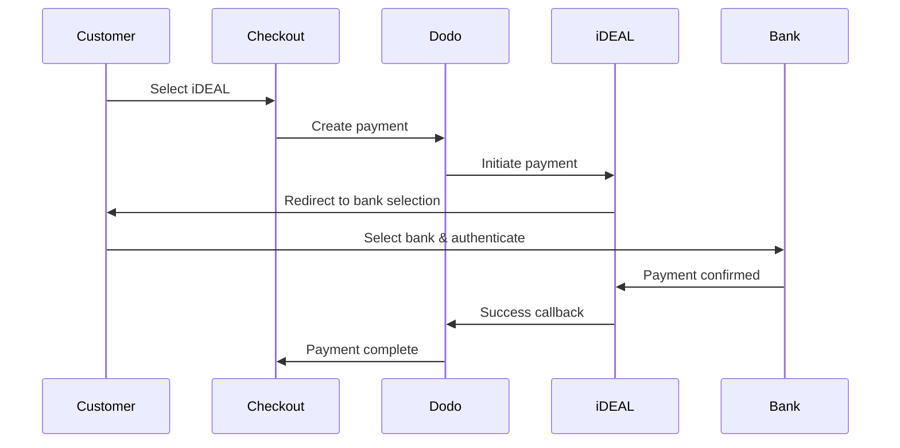

ヨーロッパの顧客は、銀行システムと統合されたローカルな支払い方法を強く好みます。これらの方法を提供することで、ターゲット市場でのコンバージョン率が20〜40％向上します。

## なぜローカルなヨーロッパの支払い方法が必要なのか？

<CardGroup cols={3}>
<Card title="コンバージョン率向上" icon="chart-line">
iDEALはオランダのオンライン支払いの約60％をキャッチします。これを提供しないと顧客を失います。
</Card>

<Card title="詐欺のリスク低減" icon="shield-check">
銀行認証された支払いは、ほぼゼロの詐欺率とチャージバックがありません。
</Card>

<Card title="リアルタイム決済" icon="bolt">
ほとんどのヨーロッパの方法は即時の支払い確認を提供します。
</Card>
</CardGroup>

## 対応方法

| 方法 | 国 | 市場シェア | 通貨 | サブスクリプション |
| :----- | :------ | :----------- | :------- | :-----------: |
| **iDEAL** | オランダ | ~60% | EUR | いいえ |
| **Bancontact** | ベルギー | ~50% | EUR | いいえ |
| **EPS** | オーストリア | ~30% | EUR | いいえ |
| **Multibanco** | ポルトガル | ~40% | EUR | いいえ |

## iDEAL（オランダ）

iDEALはオランダにおける主要なオンライン支払い方法であり、すべての主要なオランダの銀行に直接接続しています。

### 仕組み



### 対応銀行

すべての主要なオランダの銀行がサポートされています：
- ABN AMRO
- ASN Bank
- Bunq
- ING
- Knab
- Rabobank
- RegioBank
- Revolut
- SNS
- Triodos Bank
- Van Lanschot

### 設定

```javascript
const session = await client.checkoutSessions.create({
  product_cart: [{ product_id: 'prod_123', quantity: 1 }],
  allowed_payment_method_types: ['ideal', 'credit', 'debit'],
  billing_currency: 'EUR',
  billing_address: {
    country: 'NL',
    zipcode: '1012JS'
  },
  return_url: 'https://example.com/success'
});
```

## Bancontact（ベルギー）

Bancontactはベルギーの全国的な支払いスキームであり、ほぼすべてのベルギーの銀行がオンライン支払いに利用しています。

### 特徴
- 既存のベルギーのデビットカードと連携
- モバイルアプリのサポート（Payconiq by Bancontact）
- 即時の支払い確認
- 顧客の追加登録不要

### 設定

```javascript
const session = await client.checkoutSessions.create({
  product_cart: [{ product_id: 'prod_123', quantity: 1 }],
  allowed_payment_method_types: ['bancontact_card', 'credit', 'debit'],
  billing_currency: 'EUR',
  billing_address: {
    country: 'BE',
    zipcode: '1000'
  },
  return_url: 'https://example.com/success'
});
```

## EPS（オーストリア）

EPS（電子決済標準）は、オーストリアの顧客のための直接オンライン銀行振込を可能にします。

### 特徴
- オーストリアの銀行との直接統合
- リアルタイムの支払い確認
- オーストリアの消費者の間で高い信頼性
- チャージバックなし

### 対応銀行

主要なオーストリアの銀行には：
- Erste Bank
- Bank Austria
- Raiffeisen
- BAWAG
- Volksbank

### 設定

```javascript
const session = await client.checkoutSessions.create({
  product_cart: [{ product_id: 'prod_123', quantity: 1 }],
  allowed_payment_method_types: ['eps', 'credit', 'debit'],
  billing_currency: 'EUR',
  billing_address: {
    country: 'AT',
    zipcode: '1010'
  },
  return_url: 'https://example.com/success'
});
```

## Multibanco（ポルトガル）

Multibancoはポルトガルのインターバンクネットワークであり、オンライン支払いとATMベースの支払いの両方を提供しています。

### 支払いオプション

1. **オンラインバンキング** — インターネットバンキングを介した直接銀行振込
2. **ATM支払い** — 顧客は、任意のMultibancoATMで支払うためのリファレンスを受け取ります
3. **モバイルバンキング** — 銀行モバイルアプリを通じた支払い

### ATM支払いの仕組み

ATM支払いの場合、顧客は支払いリファレンスを受け取ります：

```
Entity: 12345
Reference: 123 456 789
Amount: €50.00
Expiry: 24 hours
```

顧客はこのリファレンスを使って、任意のポルトガルのATMまたはオンラインバンキングで支払うことができます。

### 設定

```javascript
const session = await client.checkoutSessions.create({
  product_cart: [{ product_id: 'prod_123', quantity: 1 }],
  allowed_payment_method_types: ['multibanco', 'credit', 'debit'],
  billing_currency: 'EUR',
  billing_address: {
    country: 'PT',
    zipcode: '1000-001'
  },
  return_url: 'https://example.com/success'
});
```

<Note>
MultibancoのATM支払いには、チェックアウトから実際の支払いまでに遅延が生じる場合があります。支払い確認のためにウェブフックを監視してください。
</Note>

## APIメソッドの種類

| タイプ | 方法 | 国 |
| :--- | :----- | :------ |
| `ideal` | iDEAL | オランダ |
| `bancontact_card` | Bancontact | ベルギー |
| `eps` | EPS | オーストリア |
| `multibanco` | Multibanco | ポルトガル |

## マルチカントリーのヨーロッパチェックアウト

複数のヨーロッパの国にサービスを提供するビジネスには、すべての地域の方法を含めてください：

```javascript
const session = await client.checkoutSessions.create({
  product_cart: [{ product_id: 'prod_123', quantity: 1 }],
  allowed_payment_method_types: [
    'ideal',           // Netherlands
    'bancontact_card', // Belgium
    'eps',             // Austria
    'multibanco',      // Portugal
    'credit',          // Fallback
    'debit'            // Fallback
  ],
  billing_currency: 'EUR',
  return_url: 'https://example.com/success'
});
```

Dodoは顧客の位置情報に基づいて、関連する方法のみを自動的に表示します。オランダの顧客はiDEALを、ベルギーの顧客はBancontactを表示します。

## テスト

ヨーロッパの支払い方法は、サンドボックスモードでテストできます。テストフローは銀行認証プロセスをシミュレートします。

<Steps>
<Step title="テストモードを有効にする">
Dodo PaymentsのテストAPIキーを使用します。
</Step>

<Step title="適切な請求先住所を設定する">
支払い方法にマッチする請求先住所の国を設定します：
- `NL` iDEALの場合
- `BE` Bancontactの場合
- `AT` EPSの場合
- `PT` Multibancoの場合
</Step>

<Step title="テストフローを完了する">
テスト環境でシミュレートされた銀行認証フローに従います。
</Step>
</Steps>

## ベストプラクティス

<AccordionGroup>
<Accordion title="ターゲット市場の地域方法を常に含める">
オランダの顧客に販売する場合は、iDEALを含めてください。これを行わないことは、米国でVisaを受け取らないことと同じです — 大幅な売上を失います。
</Accordion>

<Accordion title="地域に通貨を一致させる">
ヨーロッパの支払い方法にはEURが必要です。価格設定がユーロ取引をサポートしていることを確認してください。
</Accordion>

<Accordion title="リダイレクトを適切に処理する">
すべてのヨーロッパの方法は、銀行サイトへのリダイレクトを伴います。リターンURLの処理が堅牢で、中断するユーザーを考慮していることを確認してください。
</Accordion>

<Accordion title="カードの代替手段を提供する">
すべてのヨーロッパの顧客がこれらの地域方法にアクセスできるわけではありません（観光客、移住者など）。常に`credit`と`debit`を代替手段として含めてください。
</Accordion>

<Accordion title="Multibancoのタイミングを考慮する">
MultibancoのATM支払いは数時間かかる場合があります。即時支払いで処理をブロックしないでください — 非同期確認のためにウェブフックを使用してください。
</Accordion>
</AccordionGroup>

## トラブルシューティング

<AccordionGroup>
<Accordion title="ヨーロッパの方法が表示されない">
**確認事項:**
1. 顧客の請求先国が方法の国と一致していますか？
2. 通貨がEURに設定されていますか？
3. 方法が`allowed_payment_method_types`に含まれていますか？

**解決策:** ヨーロッパの方法は地域的に厳格です。請求先国が`DE`（ドイツ）の顧客は、オランダ専用のiDEALを表示することはありません。
</Accordion>

<Accordion title="銀行認証が失敗しました">
**原因:**
- 顧客が銀行認証中にキャンセルした
- 銀行の認証システムが一時的に利用できない
- 顧客が誤った資格情報を入力した

**解決策:** 顧客は再試行する必要があります。もし持続的であれば、別の支払い方法を試すように提案してください。
</Accordion>

<Accordion title="リダイレクトが完了しない">
**原因:**
- 顧客が銀行のリダイレクト中にブラウザを閉じた
- 認証中のネットワークの問題
- リターンURLが誤って設定されている

**解決策:** リターンURLが正しく、アクセス可能であることを確認します。成功状態と失敗状態の両方を処理できることを確認してください。
</Accordion>

<Accordion title="Multibancoの支払いが保留中">
**原因:** 顧客は支払いリファレンスを受け取りましたが、まだ支払っていません。

**解決策:** これはATMベースの支払いでは予想されることです。ウェブフック確認を待ちます。リファレンスは通常24〜72時間で期限切れになります。
</Accordion>
</AccordionGroup>

## PSD2コンプライアンス

すべてのヨーロッパの支払い方法は、PSD2（Payment Services Directive 2）規制に準拠しています：

- **強力な顧客認証（SCA）** — 銀行認証フローに組み込まれています
- **安全な通信** — すべてのデータは安全なチャンネルを介して送信されます
- **消費者保護** — EUの消費者権利に完全に準拠

## 関連ページ

<CardGroup cols={2}>
<Card title="支払い方法の概要" icon="credit-card" href="/features/payment-methods">
すべての対応支払い方法を確認してください。
</Card>

<Card title="適応通貨" icon="globe" href="/features/adaptive-currency">
通貨サポートと自動変換。
</Card>

<Card title="チェックアウトガイド" icon="book" href="/developer-resources/checkout-session">
完全なチェックアウト実装ガイド。
</Card>

<Card title="ウェブフック" icon="webhook" href="/developer-resources/webhooks">
支払い確認を非同期で処理します。
</Card>
</CardGroup>