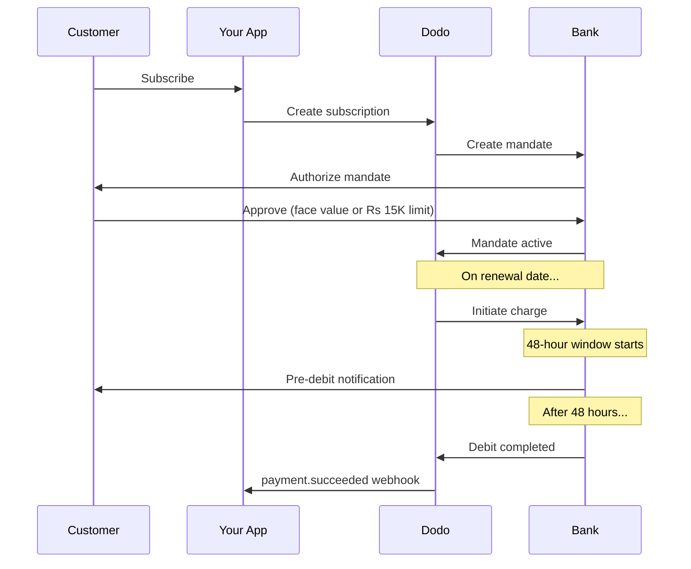

インドはUPI（デジタル取引の60%以上）とRupayカードが支配する独自の決済インフラを持っています。Dodo Paymentsは、サブスクリプションマンダテに対して完全なRBI準拠で両方をサポートしています。

## なぜインドの支払い方法が重要なのか

<CardGroup cols={3}>
<Card title="UPI Dominance" icon="mobile">
UPIは月間100億件以上の取引を処理します。多くのインドの顧客は国際カードを持っていません。
</Card>

<Card title="Low Transaction Costs" icon="indian-rupee-sign">
UPIはほぼゼロの取引手数料です。大量かつ低額の取引に最適です。
</Card>

<Card title="Subscription Support" icon="repeat">
他の多くの代替決済手段と異なり、UPIとRupayはRBIマンダテを通じて定期支払いをサポートします。
</Card>
</CardGroup>

## 対応方法

| 方法 | 種類 | サブスクリプション | 最小金額 |
| :----- | :--- | :-----------: | :--------- |
| **UPI Collect** | QRコード / VPA | はい* | ₹1 |
| **Rupay Credit** | カード | はい* | ₹1 |
| **Rupay Debit** | カード | はい* | ₹1 |

*サブスクリプションには特別な処理ルールを伴うRBI準拠のマンダテが必要です。

## 設定

### API方式

| 種類 | 説明 |
| :--- | :---------- |
| `upi_collect` | QRコードやVPA入力によるUPI |
| `credit` | Rupayを含むクレジットカード |
| `debit` | Rupayを含むデビットカード |

### 例：インド向けチェックアウト

```javascript
const session = await client.checkoutSessions.create({
  product_cart: [{ product_id: 'prod_123', quantity: 1 }],
  allowed_payment_method_types: [
    'upi_collect',
    'credit',
    'debit'
  ],
  billing_currency: 'INR',
  customer: {
    email: 'customer@example.in',
    name: 'Priya Sharma',
    phone_number: '+919876543210'
  },
  billing_address: {
    country: 'IN',
    zipcode: '560001'
  },
  return_url: 'https://example.com/success'
});
```

### UPIの要件

チェックアウトでUPIを表示するには:
1. **請求先国** はインドであること (`IN`)
2. **通貨** はINR
3. インド国外の加盟店の場合：**Adaptive Currency** を有効にする

<Warning>
インド国外の加盟店でAdaptive Currencyが有効でない場合、UPIは顧客に表示されません。
</Warning>

## RBIマンダテによるサブスクリプション

インドの決済方法によるサブスクリプションは、独自の要件を持つRBI（インド準備銀行）規制の下で運用されます。

### RBIマンダテの仕組み



### マンダテの種類

| サブスクリプション金額 | マンダテの種類 | 上限 |
| :------------------ | :----------- | :---- |
| **Rs 15,000未満** | オンデマンドマンダテ | Rs 15,000 |
| **Rs 15,000以上** | 固定金額マンダテ | サブスクリプションの正確な金額 |

**プラン変更時の重要事項：** アップグレードによって既存のマンダテ上限を超える請求が発生した場合、請求は失敗し、顧客は再認可する必要があります。

### 48時間の処理遅延

これは国際カード決済との差で最も重要な違いです：

<Steps>
<Step title="Charge Initiated (Day 0)">
予定された更新日に、Dodoが銀行に対して請求を開始します。
</Step>

<Step title="Pre-Debit Notification">
顧客は銀行から差し引き予定に関する通知を受け取ります。
</Step>

<Step title="48-Hour Window">
顧客はこの期間中に銀行アプリを通じてマンダテをキャンセルできます。
</Step>

<Step title="Debit Completed (~48-51 hours)">
48時間後（銀行処理に最大3時間の追加）に資金が引き落とされます。
</Step>

<Step title="Webhook Sent">
実際の引き落とし後、`payment.succeeded` webhookが送信されます。開始時ではありません。
</Step>
</Steps>

<Warning>
**開始時に特典を付与しないでください。** 予定された請求日の約48〜51時間後に届く`payment.succeeded` webhookを待ってください。
</Warning>

### 48時間ウィンドウの対応

```javascript
// DON'T do this:
async function handleSubscriptionRenewal(subscription) {
  // ❌ Bad: Granting access immediately when charge is initiated
  grantPremiumAccess(subscription.customer_id);
}

// DO this:
async function handlePaymentWebhook(event) {
  if (event.type === 'payment.succeeded') {
    // ✅ Good: Only grant access after payment is confirmed
    grantPremiumAccess(event.data.customer_id);
  }
  
  if (event.type === 'payment.failed') {
    // Handle failed payment (mandate cancelled, insufficient funds)
    revokePremiumAccess(event.data.customer_id);
  }
}
```

### インド向けサブスクリプションのWebhookイベント

| イベント | タイミング | アクション |
| :---- | :--- | :----- |
| `subscription.active` | 委任が承認された | サブスクリプションの開始を記録 |
| `payment.succeeded` | 請求日から約48時間後 | アクセスを付与/継続 |
| `payment.failed` | 引き落とし失敗 | 顧客に通知し、アクセスを一時停止 |
| `subscription.on_hold` | 支払い失敗 | 支払い方法の更新を促す |
| `subscription.active` | 支払い後に再アクティベート | アクセスを復元 |

## テスト

### UPIテストID

| ステータス | UPI ID |
| :----- | :----- |
| 成功 | `success@upi` |
| 失敗 | `failure@upi` |

### インドカードのテスト番号

| ブランド | シナリオ | カード番号 | 有効期限 | CVV |
| :---- | :------- | :---------- | :----- | :-- |
| Visa | 成功 | `4576238912771450` | 06/32 | 123 |
| Visa | 拒否 | `4706131211212123` | 06/32 | 123 |
| Mastercard | 成功 | `5409162669381034` | 06/32 | 123 |
| Mastercard | 拒否 | `5105105105105100` | 06/32 | 123 |

## ベストプラクティス

<AccordionGroup>
<Accordion title="Plan for the 48-hour delay">
請求開始と実際の支払いの間のギャップに対応できるようアプリを構築してください。次を検討してください：
- サブスクリプションアクセスの猶予期間
- 処理時間について顧客に明確に伝える
- 日付駆動ではなくWebhook駆動の実行
</Accordion>

<Accordion title="Handle mandate cancellations">
顧客は銀行アプリを通じていつでもマンダテをキャンセルできます。`subscription.on_hold` webhookを監視し、再購読や支払い方法の更新を促してください。
</Accordion>

<Accordion title="Set appropriate mandate amounts">
変動価格（例：使用量ベース）の場合、Rs 15,000のオンデマンドマンダテで十分か検討してください。請求がこれを超える可能性がある場合、顧客は再認可が必要になります。
</Accordion>

<Accordion title="Offer UPI prominently">
インドの顧客にはUPIを主要な決済手段とするべきです。多くのユーザーはカードよりも馴染みがあり、手間が少ないと感じています。
</Accordion>
</AccordionGroup>

## トラブルシューティング

<AccordionGroup>
<Accordion title="UPI not appearing at checkout">
**確認:**
1. 請求先国が`IN`に設定されていますか？
2. 通貨が`INR`に設定されていますか？
3. インド国外の加盟店の場合：Adaptive Currencyは有効ですか？
4. `upi_collect`は`allowed_payment_method_types`に含まれていますか？

**解決策：** 請求先住所が`country: "IN"`および`billing_currency: "INR"`を含んでいることを確認してください。
</Accordion>

<Accordion title="Subscription charge failed after upgrade">
**原因：** 新しい請求金額が既存のマンダテ上限（Rs 15,000の閾値）を超えています。

**解決策：** 顧客は支払い方法を更新し、正しい上限で新しいマンダテを設定する必要があります。
</Accordion>

<Accordion title="Subscription on hold but customer claims they didn't cancel">
**原因：** 顧客が48時間のウィンドウ中にマンダテをキャンセルしたか、銀行が引き落としを拒否しました。

**解決策：** 顧客はマンダテを再認可するか、支払い方法を更新する必要があります。
</Accordion>

<Accordion title="Payment deduction delayed beyond 48 hours">
**原因：** 銀行APIの遅延により処理がさらに2〜3時間延びることがあります。

**解決策：** これは想定内です。合計で約51時間までの可変遅延に対応できるようにシステムを構築してください。
</Accordion>

<Accordion title="Mandate cancelled but subscription still active">
**原因：** RBI規制のエッジケース -- 処理ウィンドウ中のマンダテキャンセルはサブスクリプションを即座にキャンセルしません。

**解決策：** 次の請求が失敗し、サブスクリプションは`on_hold`に移行します。`payment.failed` webhookを監視してください。
</Accordion>
</AccordionGroup>

## 関連ページ

<CardGroup cols={2}>
<Card title="Payment Methods Overview" icon="credit-card" href="/features/payment-methods">
すべての対応決済方法をご覧ください。
</Card>

<Card title="Subscriptions" icon="repeat" href="/features/subscription">
RBIマンダテを含むサブスクリプションの完全なドキュメント。
</Card>

<Card title="Webhooks" icon="webhook" href="/developer-resources/webhooks">
支払いイベントのWebhook処理。
</Card>

<Card title="Testing Process" icon="flask" href="/miscellaneous/testing-process">
UPI IDやインドカードを含むすべてのテストデータ。
</Card>
</CardGroup>