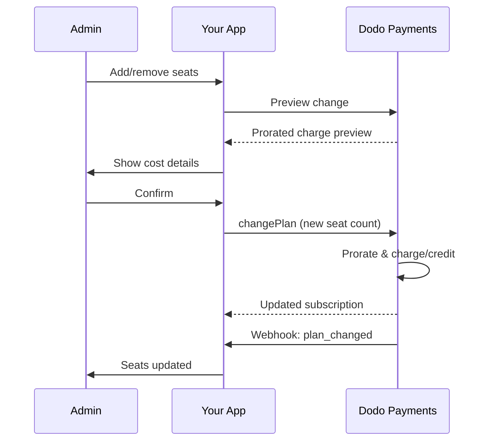

<Info>
席数ベースの課金では、顧客が必要とするユーザー数・チームメンバー数・ライセンス数に応じて課金できます。チームコラボレーションツール、エンタープライズソフトウェア、B2B SaaS製品では標準的な価格モデルです。
</Info>

<CardGroup cols={2}>
<Card title="Implementation Tutorial" icon="code" href="/developer-resources/seat-based-pricing">
  コード例付きのステップバイステップガイド。
</Card>

<Card title="Add-ons Documentation" icon="puzzle" href="/features/addons">
  席数ベースの課金を支えるアドオンシステムについて学ぶ。
</Card>

<Card title="Subscription Management" icon="repeat" href="/features/subscription">
  席数ベースのサブスクリプションとプラン変更を管理する。
</Card>

<Card title="Webhooks" icon="bell" href="/developer-resources/webhooks/intents/subscription">
  サブスクリプションのWebhooksで席数の変更を追跡する。
</Card>
</CardGroup>

---

## シートベースの請求とは？

シートベースの請求（ユーザーごとまたはシートごとの価格設定とも呼ばれる）は、製品にアクセスするユーザーの数に基づいて顧客に料金を請求します。定額料金の代わりに、価格はチームのサイズに応じてスケールします。

### 一般的な使用例

| 業界 | 例 | 価格モデル |
|----------|---------|---------------|
| チームコラボレーション | Slack, Notion, Asana | アクティブユーザー/月ごと |
| 開発者ツール | GitHub, GitLab, Jira | シート/月ごと |
| CRMソフトウェア | Salesforce, HubSpot | ユーザーライセンスごと |
| デザインツール | Figma, Canva | エディターシートごと |
| セキュリティソフトウェア | 1Password, Okta | ユーザー/月ごと |
| ビデオ会議 | Zoom, Teams | ホストライセンスごと |

### シートベースの価格設定の利点

**あなたのビジネスにとって:**
- 顧客が成長するにつれて収益が自然にスケール
- 顧客が予算を立てやすい予測可能な価格設定
- 個人からチーム、エンタープライズへの明確なアップグレードパス
- チームが拡大するにつれて高いライフタイムバリュー

**顧客にとって:**
- 使用した分だけ支払う
- コストを理解しやすく予測しやすい
- 必要に応じてユーザーを追加/削除する柔軟性
- チームのサイズに合った公正な価格設定

---

## Dodo Paymentsにおけるシートベースの請求の仕組み

Dodo Paymentsは、**アドオン**システムを使用してシートベースの請求を実装しています。以下がその仕組みです：

### アーキテクチャの概要

Team Proサブスクリプションは月額99ドルで5席が含まれています。5名を超えるユーザーがいる場合、追加の席1つにつき月額15ドルが加算されます。

例えばチームが15席必要な場合：
- ベースプラン：月額99ドル（5席を含む）
- アドオン：追加10席×月額15ドル＝月額150ドル
- 合計月額費用：99ドル＋150ドル＝15席で249ドル

### 主要コンポーネント

| コンポーネント | 目的 | 例 |
|-----------|---------|---------|
| 基本製品 | 含まれるシートのコアサブスクリプション | "チームプラン - 月額\$99（5シート含む）" |
| シートアドオン | 追加ユーザーのためのシートごとの料金 | "追加シート - 各月額\$15" |
| 数量 | 購入した追加シートの数 | 10シート |

---

## 価格設定戦略

ビジネスに合ったシートベースの価格設定戦略を選択してください：

### 戦略1: 基本 + シートごとのアドオン

基本プランに設定された数のシートを含め、追加シートに対して料金を請求します。

**例:**

```
Starter Plan: $49/month
├── Includes: 3 seats
├── Extra seats: $10/month each
└── 8 total seats = $49 + (5 × $10) = $99/month
```

**最適:** 小規模チームが基本提供で機能できる製品。

### 戦略2: 純粋なシートごとの価格設定

基本料金なしでシートごとに定額料金を請求します。

**例:**

```
Per User: $12/month
├── 5 users = $60/month
├── 20 users = $240/month
└── 100 users = $1,200/month
```

**実装:** 基本プランの価格を\$0に設定し、シートアドオンのみを使用します。

**最適:** シンプルで透明な価格設定; 使用ベースのモデル。

### 戦略3: 階層型シート価格設定

異なる基本プランに異なるシートごとの料金。

**例:**

```
Starter: $0/month base + $15/seat
├── Lower features, higher per-seat cost

Professional: $99/month base + $10/seat
├── More features, lower per-seat cost

Enterprise: $499/month base + $7/seat
└── All features, volume discount on seats
```

**実装:** 各階層のために異なるアドオン価格で別々の製品を作成します。

**最適:** 高い階層へのアップグレードを促進する; エンタープライズ販売。

### 戦略4: シートバンドル

シートを個別ではなくパックで販売します。

**例:**

```
5-Seat Pack: $50/month ($10/seat)
10-Seat Pack: $80/month ($8/seat)
25-Seat Pack: $175/month ($7/seat)
```

**実装:** 異なるパックサイズのために複数のアドオンを作成します。

**最適:** 購入決定を簡素化する; 大きなコミットメントを促進する。

---

## シートベースの請求の設定

### ステップ1: 価格設定を計画する

実装前に、価格構造を定義します：

<Steps>
<Step title="Define Base Plan">
どの内容をベースサブスクリプションに含めるかを決定する：
- ベース価格（純粋な席単価プランでは0ドルも可）
- 含まれる席数
- このティアで利用可能な機能
</Step>

<Step title="Set Seat Pricing">
席数アドオンの単価を決定する：
- 追加席1つあたりの価格
- ボリュームディスカウント（複数アドオンで実現）
- 最大許容席数（該当する場合）
</Step>

<Step title="Consider Billing Frequency">
課金サイクルと席単価を整合させる：
- 毎月のサブスクリプション → 毎月の席課金
- 年額サブスクリプション → 年額席課金（多くは割引あり）
</Step>
</Steps>

### ステップ2: シートアドオンを作成する

Dodo Paymentsダッシュボードで：

1. **製品** → **アドオン**に移動します
2. **アドオンを作成**をクリックします
3. アドオンを設定します：

| フィールド | 値 | メモ |
|-------|-------|-------|
| 名前 | "追加シート"または"チームメンバー" | 明確でユーザーフレンドリーな名前 |
| 説明 | "ワークスペースに別のチームメンバーを追加" | 顧客が得られるものを説明 |
| 価格 | あなたのシートごとの価格 | 例: \$10.00 |
| 通貨 | 基本製品と一致させる | 同じ通貨でなければなりません |
| 税カテゴリ | 基本製品と同じ | 一貫した税処理を確保 |

<Tip>
請求書で意味が通る説明的なアドオン名を作る。「Additional Team Seat」は「Seat Add-on」より請求書確認時に顧客にとって明確です。
</Tip>

### ステップ3: 基本サブスクリプションを作成する

サブスクリプション製品を作成します：

1. **製品** → **製品を作成**に移動します
2. **サブスクリプション**を選択します
3. 価格と詳細を設定します
4. **アドオン**セクションで、シートアドオンを添付します

### ステップ4: 製品にアドオンを添付する

シートアドオンをサブスクリプションにリンクします：

1. サブスクリプション製品を編集します
2. **アドオン**セクションまでスクロールします
3. **アドオンを追加**をクリックします
4. シートアドオンを選択します
5. 変更を保存します

<Check>
サブスクリプション商品は席数ベースの価格設定をサポートします。顧客はチェックアウト時に任意の追加席数を購入できます。
</Check>

---

## シートの管理

### 新しいサブスクリプションへのシートの追加

チェックアウトセッションを作成する際に、シートの数量を指定します：

```typescript
const session = await client.checkoutSessions.create({
  product_cart: [{
    product_id: 'prod_team_plan',
    quantity: 1,
    addons: [{
      addon_id: 'addon_seat',
      quantity: 10  // 10 additional seats
    }]
  }],
  customer: { email: 'admin@company.com' },
  return_url: 'https://yourapp.com/success'
});
```

### 既存のサブスクリプションのシート数の変更

シートを調整するためにChange Plan APIを使用します：

```typescript
// Add 5 more seats to existing subscription
await client.subscriptions.changePlan('sub_123', {
  product_id: 'prod_team_plan',
  quantity: 1,
  proration_billing_mode: 'prorated_immediately',
  addons: [{
    addon_id: 'addon_seat',
    quantity: 15  // New total: 15 additional seats
  }]
});
```

### シートの削除

シート数を減らすには、より少ない数量を指定します：

```typescript
// Reduce from 15 to 8 additional seats
await client.subscriptions.changePlan('sub_123', {
  product_id: 'prod_team_plan',
  quantity: 1,
  proration_billing_mode: 'difference_immediately',
  addons: [{
    addon_id: 'addon_seat',
    quantity: 8  // Reduced to 8 additional seats
  }]
});
```

### すべての追加シートの削除

すべてのアドオンを削除するには、空のアドオン配列を渡します：

```typescript
// Remove all additional seats, keep only base plan seats
await client.subscriptions.changePlan('sub_123', {
  product_id: 'prod_team_plan',
  quantity: 1,
  proration_billing_mode: 'difference_immediately',
  addons: []  // Removes all add-ons
});
```

---

## シート変更の按分

顧客がシートを追加または削除する際、按分が請求方法を決定します。



### Proration Modes

| Mode | Adding Seats | Removing Seats |
|------|-------------|----------------|
| `prorated_immediately` | Charge for remaining days in cycle | Credit for unused days |
| `difference_immediately` | Charge full seat price | Credit applied to future renewals |
| `full_immediately` | Charge full seat price, reset billing cycle | No credit |

### Proration Examples

**Scenario: 15-day billing cycle remaining, adding 5 seats at $10/seat**

<Tabs>
<Tab title="prorated_immediately">

```
Prorated charge = ($10 × 5 seats) × (15 days / 30 days)
                = $50 × 0.5
                = $25 immediate charge
```

顧客は今すぐ25ドルを支払い、更新時には月額50ドルを支払います。
</Tab>

<Tab title="difference_immediately">

```
Immediate charge = $10 × 5 seats = $50
```

顧客はサイクルの位置に関係なく、今すぐ50ドル全額を支払います。
</Tab>

<Tab title="full_immediately">

```
Immediate charge = Full subscription + add-ons
Billing cycle resets to today
```

顧客は全額を支払い、新しい課金サイクルが開始します。
</Tab>
</Tabs>

**Scenario: Removing 3 seats mid-cycle with prorated_immediately**

```
Current: Team Plan ($99/month) + 10 extra seats × $10/seat = $199/month
Change: Remove 3 seats (10 → 7 extra seats) on day 20 of 30-day cycle
Remaining: 10 days

Credit for removed seats:
  = ($10 × 3 seats) × (10 days / 30 days)
  = $30 × 0.333
  = $10.00 credit

→ $10.00 credit added to subscription
→ Next renewal: $99 + (7 × $10) = $169.00/month
→ Credit auto-applies: $169.00 − $10.00 = $159.00 on next invoice
```

<Tip>
**Choosing a proration mode for seat changes**: Use `prorated_immediately` for fair day-based billing when teams frequently adjust seats. Use `difference_immediately` for simpler math that charges or credits the full seat price. See the [Proration Guide](/developer-resources/subscription-upgrade-downgrade#proration-modes) for detailed comparisons.
</Tip>

### Preview Before Changing

変更前には常にプラレーションをプレビューする：

```typescript
const preview = await client.subscriptions.previewChangePlan('sub_123', {
  product_id: 'prod_team_plan',
  quantity: 1,
  proration_billing_mode: 'prorated_immediately',
  addons: [{ addon_id: 'addon_seat', quantity: 20 }]
});

console.log('Immediate charge:', preview.immediate_charge.summary);
// Show customer: "Adding 5 seats will cost $25 today"
```

---

## Tracking Seats with Webhooks

サブスクリプションWebhooksを監視して席数の変更を追跡する：

### Relevant Events

| Event | When Triggered | Use Case |
|-------|----------------|----------|
| `subscription.active` | New subscription activated | Provision initial seats |
| `subscription.plan_changed` | Seats added/removed | Update seat count in your app |
| `subscription.renewed` | Subscription renewed | Confirm seat count unchanged |
| `subscription.cancelled` | Subscription cancelled | Deprovision all seats |

### Webhook Handler Example

```typescript
app.post('/webhooks/dodo', async (req, res) => {
  const event = req.body;

  switch (event.type) {
    case 'subscription.active':
      // New subscription - provision seats
      const seats = calculateTotalSeats(event.data);
      await provisionSeats(event.data.customer_id, seats);
      break;

    case 'subscription.plan_changed':
      // Seats changed - update access
      const newSeats = calculateTotalSeats(event.data);
      await updateSeatCount(event.data.subscription_id, newSeats);
      break;

    case 'subscription.cancelled':
      // Subscription cancelled - deprovision
      await deprovisionAllSeats(event.data.subscription_id);
      break;
  }

  res.json({ received: true });
});

function calculateTotalSeats(subscriptionData) {
  const baseSeats = 5;  // Included in plan
  const addonSeats = subscriptionData.addons?.reduce(
    (total, addon) => total + addon.quantity, 0
  ) || 0;
  return baseSeats + addonSeats;
}
```

---

## Enforcing Seat Limits

お客様のアプリケーションは席数制限を強制する必要があります。Dodo Paymentsが課金を追跡しますが、アクセス制御はあなたが管理します。

### Enforcement Strategies

<Tabs>
<Tab title="Hard Limit">
席数を超えるユーザーの追加を厳密に防止します。

```typescript
async function inviteUser(teamId: string, email: string) {
  const team = await getTeam(teamId);
  const subscription = await getSubscription(team.subscriptionId);
  const totalSeats = calculateTotalSeats(subscription);
  const usedSeats = await countTeamMembers(teamId);

  if (usedSeats >= totalSeats) {
    throw new Error('No seats available. Please upgrade your plan.');
  }

  await sendInvitation(teamId, email);
}
```

</Tab>

<Tab title="Soft Limit with Warning">
警告と猶予期間を設けて超過を許可する。

```typescript
async function inviteUser(teamId: string, email: string) {
  const team = await getTeam(teamId);
  const { totalSeats, usedSeats } = await getSeatInfo(team);

  if (usedSeats >= totalSeats) {
    // Allow but flag for billing
    await flagOverage(teamId, usedSeats - totalSeats + 1);
    await notifyAdmin(team.adminEmail, 'You have exceeded your seat limit');
  }

  await sendInvitation(teamId, email);
}
```

</Tab>

<Tab title="Auto-Upgrade">
制限に達した場合に自動的に席を追加する。

```typescript
async function inviteUser(teamId: string, email: string) {
  const team = await getTeam(teamId);
  const { totalSeats, usedSeats, subscriptionId } = await getSeatInfo(team);

  if (usedSeats >= totalSeats) {
    // Automatically add a seat
    await client.subscriptions.changePlan(subscriptionId, {
      product_id: team.productId,
      quantity: 1,
      proration_billing_mode: 'prorated_immediately',
      addons: [{ addon_id: 'addon_seat', quantity: totalSeats - baseSeats + 1 }]
    });

    await notifyAdmin(team.adminEmail, 'A new seat was added to your plan');
  }

  await sendInvitation(teamId, email);
}
```

</Tab>
</Tabs>

---

## Advanced Patterns

### Different Seat Types

価格が異なる複数の席タイプを提供する：

```
Full Seats: $20/month - Full access to all features
View-Only Seats: $5/month - Read-only access
Guest Seats: $0/month - Limited external collaborator access
```

**Implementation:** 各席タイプごとに別々のアドオンを作成する。

```typescript
const session = await client.checkoutSessions.create({
  product_cart: [{
    product_id: 'prod_team_plan',
    quantity: 1,
    addons: [
      { addon_id: 'addon_full_seat', quantity: 10 },
      { addon_id: 'addon_viewer_seat', quantity: 25 },
      { addon_id: 'addon_guest_seat', quantity: 50 }
    ]
  }]
});
```

### Annual Seat Discounts

割引された年額席価格を提供する：

```
Monthly: $15/seat/month
Annual: $12/seat/month (20% savings)
```

**Implementation:** 月額プランと年額プランで別々の製品を作成し、アドオン価格を区別する。

### Minimum Seat Requirements

特定プランに対して最低席数を必須とする：

```typescript
async function validateSeatCount(planId: string, seatCount: number) {
  const minimums = {
    'prod_starter': 1,
    'prod_team': 5,
    'prod_enterprise': 25
  };

  if (seatCount < minimums[planId]) {
    throw new Error(`${planId} requires at least ${minimums[planId]} seats`);
  }
}
```

---

## Best Practices

### Pricing Best Practices

- **Clear Communication**: 価格ページで席単価を目立つように表示する
- **Included Seats**: ベース価格にいくつかの席を含めて摩擦を減らすことを検討する
- **Volume Discounts**: 大規模チーム向けに席単価を下げてエンタープライズ契約を獲得する
- **Annual Incentives**: キャッシュフローと維持率を改善するために年額プランを割引する

### Technical Best Practices

- **Cache Seat Counts**: リクエストごとにAPIコールを避けるためにサブスクリプションの席数をローカルにキャッシュする
- **Sync Regularly**: 定期的にDodo PaymentsのAPIを使ってローカルの席数と同期する
- **Handle Failures**: 席の変更に失敗した場合は明確なエラーメッセージと再試行オプションを表示する
- **Audit Trail**: 請求に関する紛争やコンプライアンスのためにすべての席変更を記録する

### User Experience Best Practices

- **Real-Time Feedback**: 席を調整した際のコストへの影響を即座に表示する
- **Confirmation Steps**: 課金変更前に確認ステップを設ける
- **Proration Transparency**: プラレーション料金を適用する前に明確に説明する
- **Easy Downgrades**: 席数を減らすのを難しくしないこと（信頼を築く）

---

## Troubleshooting

<AccordionGroup>
<Accordion title="Seat count mismatch between app and billing">
**症状**: アプリがサブスクリプションと異なる席数を表示する。

**原因**:
- Webhookが受信または処理されていない
- 席の変更時に競合状態が発生している
- キャッシュされたデータが更新されていない

**解決策**:
1. `subscription.plan_changed`のWebhookハンドラーを実装する
2. 現在のサブスクリプションを取得する「請求と同期」ボタンを追加する
3. 定期的に更新されるようにキャッシュのTTLを設定する
</Accordion>

<Accordion title="Proration charges unexpected">
**症状**: 顧客がサイクル途中の請求額に戸惑っている。

**原因**:
- プラレーションモードが明確に伝えられていない
- 顧客が確認前にプレビューを見ていない

**解決策**:
1. 変更前に常に`previewChangePlan`を使用する
2. 「X席追加＝今日Yドル（Z日分を按分）」の明確な内訳を表示する
3. プラレーションポリシーをヘルプセンターに文書化する
</Accordion>

<Accordion title="Add-on not appearing in checkout">
**症状**: チェックアウト時に席アドオンが利用できない。

**原因**:
- アドオンが商品に紐づいていない
- アドオンがアーカイブまたは削除されている
- 商品とアドオンの通貨が一致していない

**解決策**:
1. 商品設定でアドオンが紐づいているか確認する
2. アドオンのステータスをアドオンダッシュボードで確認する
3. 通貨が正確に一致していることを確認する
</Accordion>

<Accordion title="Cannot reduce seats below current usage">
**症状**: 顧客がユーザーを割り当てたまま席数を減らしたい。

**解決策**:
1. 席を減らす前に削除が必要なユーザーを表示する
2. ワークフローを実装する：ユーザーを削除 → 席を削減
3. 席減少を強制する前に猶予期間を検討する
</Accordion>
</AccordionGroup>

---

## Related Documentation

<CardGroup cols={2}>
<Card title="Seat-Based Pricing Tutorial" icon="code" href="/developer-resources/seat-based-pricing">
  コード付きの完全な実装ガイド。
</Card>

<Card title="Add-ons" icon="puzzle" href="/features/addons">
  アドオンシステムを深く理解する。
</Card>

<Card title="Plan Changes & Proration" icon="arrows-rotate" href="/developer-resources/subscription-upgrade-downgrade">
  サブスクリプション変更を扱う。
</Card>

<Card title="Subscription Webhooks" icon="bell" href="/developer-resources/webhooks/intents/subscription">
  サブスクリプションイベントを追跡する。
</Card>
</CardGroup>
