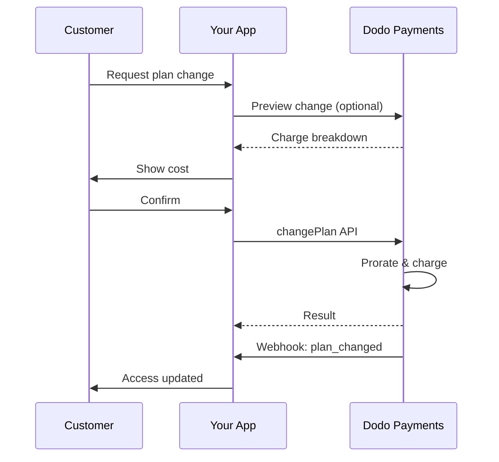
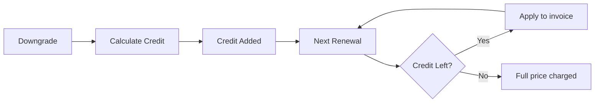

<Info>
サブスクリプションでは、継続的なアクセスを自動更新つきで販売できます。柔軟な請求サイクル、無料トライアル、プラン変更、アドオンを活用して、顧客ごとに価格設定を調整してください。
</Info>

<CardGroup cols={2}>
prorationと数量の更新でプラン変更を制御します。
</Card>

{/* LOCKED_PATTERN_318ae84db3b63552ee4c3b3e5131957c */}
今すぐマンダートを承認し、カスタム金額で後から請求できます。
</Card>

{/* LOCKED_PATTERN_97c52f9aea0902ad308a569911ddfd12 */}
顧客がプラン、請求、キャンセルを管理できるようにします。
</Card>

{/* LOCKED_PATTERN_1cd9a7ac4415843b5e77e9a9493bae92 */}
作成・更新・キャンセルなどのライフサイクルイベントに対応します。
</Card>
</CardGroup>

## サブスクリプションとは？

サブスクリプションは、顧客がスケジュールに従って購入する定期的な製品です。以下に最適です：

- **SaaSライセンス**: アプリ、API、またはプラットフォームアクセス
- **メンバーシップ**: コミュニティ、プログラム、またはクラブ
- **デジタルコンテンツ**: コース、メディア、またはプレミアムコンテンツ
- **サポートプラン**: SLA、成功パッケージ、またはメンテナンス

## 主な利点

- **予測可能な収益**: 自動更新による定期請求
- **柔軟なサイクル**: 月次、年次、カスタム間隔、トライアル
- **プランの柔軟性**: アップグレードとダウングレードのための按分
- **アドオンと席数**: オプションの数量化可能なアップグレードを添付
- **シームレスなチェックアウト**: ホストされたチェックアウトと顧客ポータル
- **開発者ファースト**: 作成、変更、使用状況追跡のための明確なAPI

## サブスクリプションの作成

Dodo Paymentsダッシュボードでサブスクリプション製品を作成し、チェックアウトまたはAPIを通じて販売します。製品をアクティブなサブスクリプションから分離することで、価格設定のバージョン管理、アドオンの添付、パフォーマンスの独立した追跡が可能になります。

### サブスクリプション製品の作成

ダッシュボードでフィールドを設定して、サブスクリプションの販売、更新、請求の方法を定義します。以下のセクションは、作成フォームで見る内容に直接対応しています。

#### 製品の詳細

- **製品名** (必須): チェックアウト、顧客ポータル、請求書に表示される名前。
- **製品説明** (必須): チェックアウトと請求書に表示される明確な価値声明。
- **製品画像** (必須): PNG/JPG/WebP 最大3MB。チェックアウトと請求書で使用されます。
- **ブランド**: 特定のブランドに製品を関連付けてテーマやメールに使用します。
- **税カテゴリ** (必須): 税ルールを決定するためにカテゴリ（例: SaaS）を選択します。

<Tip>
地域ごとに正確な税額を徴収するため、最も適切な税区分を選択してください。
</Tip>

#### 価格設定

- **料金タイプ**: <b>サブスクリプション</b>（このガイド）を選択します。代替として、単一支払いと使用量ベースの請求があります。
- **価格**（必須）: 通貨付きの基本的な定期価格。
- **適用可能な割引 (%)**: 基本価格に適用されるオプションのパーセンテージ割引; チェックアウトおよび請求書に反映されます。
- **毎回の支払い**（必須）: 更新の間隔、例: 1ヶ月ごと。カデンツ（ヶ月または年）と数量を選択します。
- **サブスクリプション期間**（必須）: サブスクリプションがアクティブな総期間（例: 10年）。この期間が終了すると、延長されない限り更新は停止します。
- **トライアル期間日数**（必須）: トライアルの長さを日数で設定します。トライアルを無効にするには0を使用します。トライアルが終了すると、自動的に最初の請求が発生します。
- **アドオンを選択**: 顧客が基本プランと一緒に購入できる最大10個のアドオンを添付します。

<Warning>
稼働中のプロダクトの価格を変更すると新規購入に影響します。既存のサブスクリプションは、設定したプラン変更とprorationの設定に従います。
</Warning>

<Info>
アドオンは、席数やストレージなど数量化できる追加要素に最適です。顧客が変更する際に許容される数量やprorationの動作を制御できます。
</Info>

#### 高度な設定

- **税金を含む価格設定**: 適用される税金を含む価格を表示します。最終的な税金計算は顧客の所在地によって異なります。
- **ライセンスキーを生成**: 購入後に各顧客にユニークなキーを発行します。<a href="/features/license-keys">ライセンスキー</a>ガイドを参照してください。
- **デジタル製品の配信**: 購入後にファイルやコンテンツを自動的に配信します。<a href="/features/digital-product-delivery">デジタル製品の配信</a>で詳細を学びます。
- **メタデータ**: 内部タグ付けやクライアント統合のためにカスタムキー–バリューのペアを添付します。<a href="/api-reference/metadata">メタデータ</a>を参照してください。

<Tip>
メタデータを使用して自社システムの識別子（例：accountId）を保存し、後でイベントや請求書を照合できるようにします。
</Tip>

## サブスクリプショントライアル

トライアルを使用すると、顧客は即時の支払いなしでサブスクリプションにアクセスできます。最初の請求はトライアルが終了すると自動的に発生します。

### トライアルの設定

製品価格設定セクションで**トライアル期間（日数）**を設定します（無効にするには`0`を使用）。サブスクリプション作成時にこれを上書きできます：

```typescript
// Via subscription creation
const subscription = await client.subscriptions.create({
  customer_id: 'cus_123',
  product_id: 'prod_monthly',
  trial_period_days: 14  // Overrides product's trial period
});

// Via checkout session
const session = await client.checkoutSessions.create({
  product_cart: [{ product_id: 'prod_monthly', quantity: 1 }],
  subscription_data: { trial_period_days: 14 }
});
```

<Warning>
`trial_period_days`の値は0～10,000日でなければなりません。
</Warning>

### トライアルステータスの検出

<Warning>
現時点ではトライアルステータスを検出する直接のフィールドはありません。以下の回避策では支払いを照会する必要があり、効率的ではありません。より効率的なソリューションに取り組んでいます。
</Warning>

サブスクリプションがトライアル中かどうかを判断するには、サブスクリプションの支払いリストを取得します。金額が0の支払いが正確に1件ある場合、サブスクリプションはトライアル期間中です：

```typescript
const subscription = await client.subscriptions.retrieve('sub_123');
const payments = await client.payments.list({
  subscription_id: subscription.subscription_id
});

// Check if subscription is in trial
const isInTrial = payments.items.length === 1 && 
                  payments.items[0].total_amount === 0;
```

### トライアル期間の更新

トライアルは`next_billing_date`を更新して延長できます：

```typescript
await client.subscriptions.update('sub_123', {
  next_billing_date: '2025-02-15T00:00:00Z'  // New trial end date
});
```

<Warning>
`next_billing_date`を過去の日時に設定することはできません。日付は未来でなければなりません。
</Warning>

## サブスクリプションプランの変更

プラン変更により、サブスクリプションをアップグレードまたはダウングレードしたり、数量を調整したり、異なる製品に移行したりできます。各変更は、選択した按分モードに基づいて即時の請求をトリガーします。

<Tip>
Dodo Paymentsダッシュボードから直接サブスクリプションプランを変更し、次の請求日を更新できます。これにより、APIコールなしでカスタマーサポートの要求、プロモーションアップグレード、プラン移行に迅速に対応できます。
</Tip>

<Tip>
**セルフサービスのプラン変更を有効にする:** カスタマーポータル経由で顧客が自分でサブスクリプションをアップグレードまたはダウングレードできるようにしますか？サブスクリプション商品をProduct Collectionに追加し、Subscription Settingsで「Allow Subscription Updates」を有効にします。
</Tip>



{/* LOCKED_PATTERN_cbe0de1faffb3a1f552c6ce10c001527 */}
  関連する商品をコレクションにまとめて、カスタマーポータルでシームレスなアップグレード／ダウングレード経路を可能にします。
</Card>

### プロレーションモード

プラン変更時の請求方法を選択します：

【※日本語訳】

| | `prorated_immediately` | `difference_immediately` | `full_immediately` |
|---|---|---|---|
| **アップグレード** | 残りの日数の部分に対して日割り請求 | 価格差全額を請求 | 新プランの全額を請求 |
| **ダウングレード** | 残りの日数に対する日割りクレジット | 価格差全額をクレジットとして適用 | クレジットなしで全額請求 |
| **請求サイクル** | 変わりません | 変わりません | 今日にリセットされます |
| **最適な用途** | 未使用時間を考慮した公平な請求 | シンプルな階層変更 | 請求サイクルをリセット |
</Info>

#### `prorated_immediately`
現在の請求周期の残日時数に基づいて日割り請求を行います。未使用時間を考慮した公平な請求に最適です。

```typescript
await client.subscriptions.changePlan('sub_123', {
  product_id: 'prod_pro',
  quantity: 1,
  proration_billing_mode: 'prorated_immediately'
});
```

#### `difference_immediately`
アップグレードでは価格差を即時請求し、ダウングレードでは将来の更新に向けてクレジットを付与します。シンプルなアップグレード／ダウングレードシナリオに最適です。

```typescript
// Upgrade: charges $50 (difference between $30 and $80)
// Downgrade: credits remaining value, auto-applied to renewals
await client.subscriptions.changePlan('sub_123', {
  product_id: 'prod_pro',
  quantity: 1,
  proration_billing_mode: 'difference_immediately'
});
```

<Info>
`difference_immediately`でダウングレードした際のクレジットはサブスクリプション単位で管理され、将来の更新に自動的に適用されます。これは<a href="/features/customer-credit">Customer Credits</a>とは別物です。
</Info>

顧客が`difference_immediately`でダウングレードすると、未使用分がサブスクリプション単位のクレジットとなり、今後の更新に自動的に充当されます：



#### `full_immediately`
残り時間を無視して新プランの全額を即時請求します。請求サイクルをリセットするのに最適です。

```typescript
await client.subscriptions.changePlan('sub_123', {
  product_id: 'prod_monthly',
  quantity: 1,
  proration_billing_mode: 'full_immediately'
});
```

<AccordionGroup>
{/* LOCKED_PATTERN_77fa8030551e310988f32a1810cb0d32 */}

**シナリオ**: Basic（$30/月）を利用する顧客が30日サイクルの16日に`prorated_immediately`を使用してPro（$80/月）にアップグレードします。

```
Unused credit from Basic = $30 × (15 remaining / 30 total) = $15.00
Prorated cost of Pro     = $80 × (15 remaining / 30 total) = $40.00
────────────────────────────────────────────────────────────────────
Immediate charge         = $40.00 − $15.00 = $25.00
```

次回更新は元の請求日に：**$80.00/月**。

<Tip>
詳細な計算例やエッジケースについては、[アップグレード＆ダウングレードガイド](/developer-resources/subscription-upgrade-downgrade)をご覧ください。
</Tip>

</Accordion>
{/* LOCKED_PATTERN_6272a737f845c6ce57dfe1823485561c */}

**シナリオ**: Pro（$80/月）の顧客が`difference_immediately`を使用してStarter（$20/月）にダウングレードします。

```
Credit = Old plan − New plan = $80 − $20 = $60.00
```

$60のクレジットが今後の更新に自動適用されます：
- Renewal 1: $20 − $20（クレジット）＝**$0.00**（$40のクレジットが残る）
- Renewal 2: $20 − $20（クレジット）＝**$0.00**（$20のクレジットが残る）  
- Renewal 3: $20 − $20（クレジット）＝**$0.00**（クレジットが尽きる）
- Renewal 4: **$20.00**（全額請求）

<Info>
クレジットの管理方法については[アップグレード＆ダウングレードガイド](/developer-resources/subscription-upgrade-downgrade)をご確認ください。
</Info>

</Accordion>
</AccordionGroup>

### アドオン付きプラン変更

プラン変更時にアドオンを変更できます。アドオンはprorationの計算に含まれます：

```typescript
await client.subscriptions.changePlan('sub_123', {
  product_id: 'prod_pro',
  quantity: 1,
  proration_billing_mode: 'difference_immediately',
  addons: [{ addon_id: 'addon_extra_seats', quantity: 2 }]  // Add add-ons
  // addons: []  // Empty array removes all existing add-ons
});
```

<Info>
プラン変更は即時請求をトリガーします。請求に失敗するとサブスクリプションが`on_hold`状態になることがあります。`subscription.plan_changed`ウェブフックイベントで変更を追跡します。
</Info>

### プラン変更のプレビュー

プラン変更を確定する前に、正確な請求額と結果となるサブスクリプションをプレビューします：

```typescript
const preview = await client.subscriptions.previewChangePlan('sub_123', {
  product_id: 'prod_pro',
  quantity: 1,
  proration_billing_mode: 'prorated_immediately'
});

// Show customer the charge before confirming
console.log('You will be charged:', preview.immediate_charge.summary);
```

{/* LOCKED_PATTERN_4cf51d80aab5581e90ca5178574dd95f */}
  プラン変更を確定する前にプレビューします。
</Card>

## サブスクリプションの状態

サブスクリプションはライフサイクルの間にさまざまな状態になります：

- **`active`**: サブスクリプションはアクティブで自動的に更新されます
- **`on_hold`**: 支払い失敗により一時停止されています。再活性化には支払い方法の更新が必要です
- **`cancelled`**: サブスクリプションはキャンセルされ、更新されません
- **`expired`**: サブスクリプションが終了日に達しました
- **`pending`**: サブスクリプションが作成中または処理中です

### 保留状態

サブスクリプションが`on_hold`状態になるのは以下の場合です：

- 更新請求が失敗したとき（残高不足、期限切れカードなど）
- プラン変更請求が失敗したとき
- 支払い方法の承認が失敗したとき

<Warning>
サブスクリプションが`on_hold`状態にある間、自動的には更新されません。サブスクリプションを再活性化するには支払い方法を更新する必要があります。
</Warning>

### 保留状態からの再活性化

保留状態のサブスクリプションを再活性化するには、支払い方法を更新します。これにより次の処理が自動で行われます：

1. 未収分の請求を作成する
2. 請求書を生成する
3. 新しい支払い方法で決済を処理する
4. 支払い成功後にサブスクリプションを`active`状態に再活性化する

```typescript
// Reactivate subscription from on_hold
const response = await client.subscriptions.updatePaymentMethod('sub_123', {
  type: 'new',
  return_url: 'https://example.com/return'
});

// For on_hold subscriptions, a charge is automatically created
if (response.payment_id) {
  console.log('Charge created:', response.payment_id);
  // Redirect customer to response.payment_link to complete payment
  // Monitor webhooks for payment.succeeded and subscription.active
}
```

<Info>
`on_hold`状態のサブスクリプションで支払い方法を正常に更新すると、`payment.succeeded`に続いて`subscription.active`のウェブフックイベントを受信します。
</Info>

## API管理

<AccordionGroup>
{/* LOCKED_PATTERN_90c830137a1db85369b1d7f3d01ae82f */}
`POST /subscriptions`を使用して、プロダクトからサブスクリプションをプログラム的に作成し、任意のトライアルやアドオンを追加できます。
{/* LOCKED_PATTERN_80e2d112f65019b30c4a8db2b540611a */}
サブスクリプション作成APIを確認します。
</Card>
</Accordion>

### プロレーション付きプラン変更
サブスクリプションをアップグレードまたはダウングレードし、プロレーションの動作を制御します：

{/* LOCKED_PATTERN_7db9c1f9990c40bba57aa6671f00c67e */}
`PATCH /subscriptions/{id}`を使用して数量を更新したり、次回請求日にキャンセルしたり、メタデータを変更したりできます。
{/* LOCKED_PATTERN_adf0aff0c53ede544a3b9267991da09d */}
サブスクリプション詳細の更新方法を学びます。
</Card>
</Accordion>

### 期間終了時のキャンセル
アクセスの即時終了なしにキャンセルをスケジュールします：

{/* LOCKED_PATTERN_c014ed82995c82db7ff5269f5df46531 */}
アクティブなプロダクトと数量をprorationコントロール付きで変更します。
{/* LOCKED_PATTERN_afa3d1700c97ae5510a3b95972626011 */}
プラン変更オプションを確認します。
</Card>
</Accordion>

### オンデマンドサブスクリプション
オンデマンドサブスクリプションを作成し、必要に応じて後で請求します：

{/* LOCKED_PATTERN_e4be3d5898d68fb2f2f5f0e8fdf83e30 */}
オンデマンドサブスクリプションでは、必要に応じて特定の金額を請求します。
{/* LOCKED_PATTERN_6a5c708696bc00ef7568a4d6821875e9 */}
オンデマンドサブスクリプションを請求します。
</Card>
</Accordion>

### アクティブなサブスクリプションの支払い方法を更新
アクティブなサブスクリプションの支払い方法を更新します：

{/* LOCKED_PATTERN_ea724d9cdc0d6cfdcd00675dcff1781c */}
`GET /subscriptions`を使用してすべてのサブスクリプションを一覧し、`GET /subscriptions/{id}`で1件を取得します。
{/* LOCKED_PATTERN_4728f8e0407f9ffad5b85b7c77f6a7a1 */}
一覧取得APIを参照します。
</Card>
</Accordion>

### 保留からのサブスクリプションの再活性化
支払い失敗により保留になったサブスクリプションを再活性化します：

{/* LOCKED_PATTERN_7f09c790a6d7f4120accee35e87f16ba */}
計量またはハイブリッド課金モデルの記録された使用量を取得します。
{/* LOCKED_PATTERN_f3047e02844ecc96a820a081613f8e53 */}
使用履歴APIを参照します。
</Card>
</Accordion>

## RBI 準拠のmandateを持つサブスクリプション

{/* LOCKED_PATTERN_ccdbd0043049c6f6310fb5a44a412ebf */}
サブスクリプションの支払い方法を更新します。アクティブなサブスクリプションでは今後の更新に向けて支払い方法が更新されます。`on_hold`状態のサブスクリプションでは未収分の請求を作成して再活性化します。
{/* LOCKED_PATTERN_d8ea2b81f4bc1c8e6e864e29c8b258c6 */}
支払い方法の更新とサブスクリプション再活性化の方法を学びます。
</Card>
</Accordion>
</AccordionGroup>

### Mandate制限

## よくあるユースケース

- **SaaSとAPI**: 席数や利用量に応じたアドオン付きの段階的アクセス
- **コンテンツとメディア**: 入門トライアル付きの月額アクセス
- **B2Bサポートプラン**: プレミアムサポートアドオン付きの年契約
- **ツールとプラグイン**: ライセンスキーとバージョン管理されたリリース

## 統合例

### Checkout Sessions (subscriptions)
Checkout Sessionsを作成する際に、サブスクリプション商品と任意のアドオンを含めます：

```typescript
const session = await client.checkoutSessions.create({
  product_cart: [
    {
      product_id: 'prod_subscription',
      quantity: 1
    }
  ]
});
```

### プロレーション付きプラン変更
サブスクリプションをアップグレードまたはダウングレードし、プロレーションの動作を制御します：

```typescript
await client.subscriptions.changePlan('sub_123', {
  product_id: 'prod_new',
  quantity: 1,
  proration_billing_mode: 'difference_immediately'
});
```

### 次回請求日にキャンセル
現在の請求期間終了時に有効となるキャンセルをスケジュールします：

```typescript
await client.subscriptions.update('sub_123', {
  cancel_at_next_billing_date: true
});
```

### オンデマンドサブスクリプション
オンデマンドサブスクリプションを作成し、必要に応じて後から請求します：

```typescript
const onDemand = await client.subscriptions.create({
  customer_id: 'cus_123',
  product_id: 'prod_on_demand',
  on_demand: true
});

await client.subscriptions.createCharge(onDemand.id, {
  amount: 4900,
  currency: 'USD',
  description: 'Extra usage for September'
});
```

### アクティブなサブスクリプションの支払い方法を更新
アクティブなサブスクリプションの支払い方法を更新します：

```typescript
// Update with new payment method
const response = await client.subscriptions.updatePaymentMethod('sub_123', {
  type: 'new',
  return_url: 'https://example.com/return'
});

// Or use existing payment method
await client.subscriptions.updatePaymentMethod('sub_123', {
  type: 'existing',
  payment_method_id: 'pm_abc123'
});
```

### on_holdからのサブスクリプション再活性化
支払い失敗で保留になったサブスクリプションを再活性化します：

```typescript
// Update payment method - automatically creates charge for remaining dues
const response = await client.subscriptions.updatePaymentMethod('sub_123', {
  type: 'new',
  return_url: 'https://example.com/return'
});

if (response.payment_id) {
  // Charge created for remaining dues
  // Redirect customer to response.payment_link
  // Monitor webhooks: payment.succeeded → subscription.active
}
```

## RBI準拠のマンダートを伴うサブスクリプション

  UPIおよびインドのカードサブスクリプションは、特定のマンダート要件を持つRBI（インド準備銀行）規制の下で運用されます：

  ### マンダートの限度

  マンダートの種類と金額は、サブスクリプションの定期請求額によって決まります：

  - **Rs 15,000未満の請求:** Rs 15,000のオンデマンドマンダートを作成します。サブスクリプション額は、マンダート上限までサブスクリプションの頻度に応じて定期的に請求されます。
  - **Rs 15,000以上の請求:** 正確なサブスクリプション金額に対してサブスクリプションマンダート（またはオンデマンドマンダート）を作成します。

インドの支払い方法に関するRBI準拠のマンダートの詳細は、<a href="/features/payment-methods/india">India Payment Methods</a>ページをご覧ください。

  ### アップグレードおよびダウングレード時の考慮事項

  **重要:** サブスクリプションをアップグレードまたはダウングレードする際は、マンダート限度を慎重に考慮してください：

  - アップグレード/ダウングレードがRs 15,000を超える請求額となり、既存のオンデマンド支払い限度を超える場合、取引請求が失敗する可能性があります。
  - このような場合、顧客は支払い方法を更新するか、正しい限度の新しいマンダートを確立するためにサブスクリプションを再度変更する必要があります。

  ### 高額請求の承認

  Rs 15,000以上のサブスクリプション請求について：

  - 顧客の銀行から取引の承認を求められます。
  - 顧客が取引を承認しなかった場合、取引は失敗し、サブスクリプションは保留になります。

  ### 48時間の処理遅延

  **処理スケジュール:** インドのカードおよびUPIのサブスクリプションの定期請求は、独自の処理パターンに従います：

  - 請求はサブスクリプションの頻度に従って予定日に**開始**されます。
  - 顧客の口座からの実際の**引き落とし**は、支払い開始から48時間後にのみ発生します。
  - この48時間の猶予期間は、銀行APIの応答状況によりさらに2〜3時間延びる可能性があります。

  ### マンダートキャンセルの猶予期間

  48時間の処理猶予期間中：

  - 顧客は銀行アプリからマンダートをキャンセルできます。
  - この期間中に顧客がマンダートをキャンセルした場合、サブスクリプションは**アクティブ**なままになります（インドのカードおよびUPI AutoPayサブスクリプションに特有のエッジケースです）。
  - ただし、実際の引き落としが失敗する可能性があり、その場合はサブスクリプションを**保留**にします。

  **エッジケースへの対応:** 料金開始時に顧客に特典、クレジット、サブスクリプション利用を即時提供する場合は、アプリケーション内でこの48時間の猶予を適切に処理する必要があります。次の点を検討してください：

  - 支払い確認まで特典の有効化を遅延させる
  - 猶予期間や一時的アクセスを実装する
  - マンダートのキャンセルに備えてサブスクリプション状況を監視する
  - アプリケーションロジックで保留状態のサブスクリプションを処理する

  <Tip>
  サブスクリプションのウェブフックを監視して、支払い状況の変更を追跡し、48時間の猶予中にマンダートがキャンセルされたようなエッジケースに対応します。
  </Tip>

## ベストプラクティス

- **明確な階層から開始**: 違いが明白な2〜3つのプラン
- **価格を明示**: 合計、proration、次回更新日を表示
- **トライアルを慎重に活用**: 単なる時間ではなくオンボーディングとともに転換する
- **アドオンを活用**: ベースプランはシンプルに保ち、追加要素でアップセルする
- **変更をテスト**: テストモードでプラン変更とprorationを検証する

<Info>
サブスクリプションは再発収益の柔軟な基盤です。シンプルに始め、徹底的にテストし、採用率、解約率、拡張指標に基づいて反復してください。
</Info>