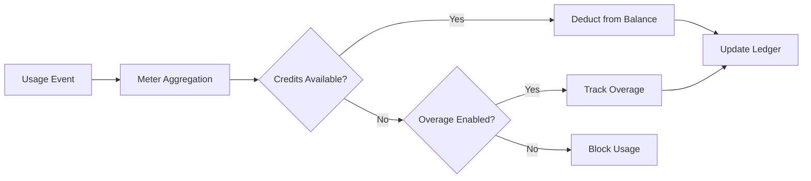

<Info>
メーターは生イベントを課金対象の数量に変換します。イベントをフィルタリングし、集計関数（Count、Sum、Max、Last）を適用して顧客ごとの使用量を算出します。
</Info>

<Frame>

</Frame>

## APIリソース

<AccordionGroup>
<Accordion title="View Meter API References">
<CardGroup cols={2}>
<Card title="Create Meter" icon="plus" href="/api-reference/meters/create-meter">
API 経由でメーターをプログラム的に作成します。
</Card>

<Card title="List Meters" icon="list" href="/api-reference/meters/get-meters">
アカウント内のすべてのメーターを取得します。
</Card>

<Card title="Get Meter" icon="eye" href="/api-reference/meters/retrieve-meter">
ID で特定のメーターの詳細を取得します。
</Card>

<Card title="Archive Meter" icon="arrow-rotate-right" href="/api-reference/meters/archive-meter">
使用量の追跡を停止するためにメーターをアーカイブします。
</Card>

<Card title="Unarchive Meter" icon="arrow-rotate-left" href="/api-reference/meters/unarchive-meter">
アーカイブされたメーターを復元して追跡を再開します。
</Card>
</CardGroup>
</Accordion>
</AccordionGroup>

## メーターの作成

<Steps>
<Step title="Basic Information">
<ParamField path="Meter Name" type="string" required>
説明的な名前（例: «API Requests», «Token Usage»）
</ParamField>

<ParamField path="Event Name" type="string" required>
一致させる正確なイベント名（大文字小文字を区別）。例: `api.call`、`image.generated`
</ParamField>
</Step>

<Step title="Aggregation">
<ParamField path="Aggregation Type" type="string" required>
イベントの集計方法を選択:

- **Count**: イベントの総数（API 呼び出し、アップロードなど）
- **Sum**: 数値を合計（トークン、バイトなど）
- **Max**: 期間内の最大値（ピークユーザー数など）
- **Last**: 最新の値
</ParamField>

<ParamField path="Over Property" type="string">
Count を除くすべてのタイプで必須となる集計対象のメタデータキー。例: `tokens`、`bytes`、`duration_ms`
</ParamField>

<ParamField path="Measurement Unit" type="string" required>
請求書上の単位ラベル。例: `calls`、`tokens`、`GB`、`hours`
</ParamField>
</Step>

<Step title="Filtering (Optional)">
<Frame>

</Frame>

カウントされるイベントをフィルタリングする条件を追加します：
- **ANDロジック**：すべての条件が一致する必要があります
- **ORロジック**：任意の条件が一致する可能性があります

**比較演算子**：等しい、等しくない、大きい、小さい、含む

フィルタリングを有効にし、ロジックを選択し、プロパティキー、比較演算子、値を使って条件を追加します。
</Step>

<Step title="Create">
設定を確認し、**Create Meter** をクリックします。
</Step>
</Steps>

## 分析の表示

<Frame>

</Frame>

メーターダッシュボードには次の情報が表示されます：
- **概要**：総使用量と使用量チャート
- **イベント**：受信した個々のイベント
- **顧客**：顧客ごとの使用量と料金

## 通貨ではなくクレジットでの請求

デフォルトでは、メーターはドル（または構成された通貨）で単価請求します。代わりに、メーターを**クレジット残高を差し引く**よう構成することができます。これにより、使用量が金銭的請求を発生させるのではなくクレジットを消費します。

<Info>
クレジットベースの差し引きには、同じ製品に紐づいた[クレジット権利](/features/credit-based-billing)が必要です。先にクレジットを作成し、その後メーターとリンクさせてください。
</Info>

### クレジットベースの差し引きを使用すべきタイミング

| シナリオ | 通常（通貨） | クレジットベース |
|----------|-------------------|--------------|
| 単純な単価課金（$0.01/コール） | ✅ 最適 | 不要なオーバーヘッド |
| 前払いのクレジットパック（10Kトークンを購入し、時間をかけて利用） | ❌ 表現不可 | ✅ 最適 |
| サブスクリプションに含まれたバンドル利用（Proプランに100Kコール含む） | 無料しきい値で対応可能 | ✅ より良い - クレジットは繰越され、有効期限があり、ポータルに表示 |
| 複数メーター製品でクレジットプールを共有 | ❌ 各メーターが別請求 | ✅ すべてのメーターが単一残高から差し引き |

### クレジットを差し引くようメーターを構成する

<Steps>
<Step title="Create a Credit Entitlement">
まず、**製品 → クレジット**でクレジットを作成します。単位（例：「API Calls」、「Tokens」）、精度、ライフサイクル設定（有効期限、繰越、超過）を定義してください。

詳細な手順は[クレジットベースの請求ガイド](/features/credit-based-billing)を参照してください。
</Step>

<Step title="Create or Edit a Usage-Based Product">
使用量ベースの製品に移動し、**メーター**構成セクションを開きます。
</Step>

<Step title="Add a Meter">
**+**ボタンをクリックしてメーターを追加します。イベント名、集計タイプ、測定単位を通常通り設定します。
</Step>

<Step title="Enable 'Bill Usage in Credits'">
メーター構成で**クレジットで使用量を請求**をオンにします。これによりクレジット設定が表示されます：

<Frame caption="Toggle 'Bill usage in Credits' to switch from currency-based to credit-based deduction.">

</Frame>

<ParamField path="Credit Entitlement" type="string" required>
このメーターが差し引く対象のクレジット権利を選択します。
</ParamField>

<ParamField path="Meter units per credit" type="number" required>
1クレジットを差し引くために必要な使用単位数。例えば：
- `1` = 各メーターイベントで1クレジット差し引き
- `100` = 100イベントで1クレジット差し引き
- `1000` = 1,000 APIコールで1クレジット消費
</ParamField>
</Step>

<Step title="Set the Free Threshold">
**無料しきい値**は引き続き適用されます - このしきい値未満のイベントはクレジットを差し引きません。

**例**：無料しきい値1,000、メーター単位あたりクレジット1の場合：
- 顧客が2,500 APIコールを使用
- 最初の1,000は無料
- 残り1,500は残高から1,500クレジット差し引き
</Step>
</Steps>

### クレジット差し引きの仕組み

一度構成されると、差し引きパイプラインは自動で実行されます：

1. **イベントが到着** - アプリケーションが[イベント取り込みAPI](/features/usage-based-billing/event-ingestion)経由で使用イベントを送信
2. **メーターが集計** - イベントはメーター構成（Count、Sum、Max、Last）に従って集計されます
3. **バックグラウンドワーカーが処理** - 毎分、ワーカーが最後のチェックポイント以降の新しいイベントを取得
4. **クレジットが差し引かれる** - 集計された使用量は`meter_units_per_credit`レートでクレジットに変換され、**FIFO順**（最も古いクレジットから消費）で差し引かれます
5. **超過が記録** - 残高がゼロになり超過が有効化されている場合、使用は継続され設定された動作（リセットで免除、次回請求で課金、赤字として繰越）に従って処理されます

<Warning>
クレジット差し引きは非同期で実行されます（約1分ごと）。イベント取り込みと残高差し引きの間に短い遅延が生じる可能性があります。この遅延に対応するようアプリケーションを設計し、個々のリクエストのアクセス制御でリアルタイムの残高チェックに頼らないでください。
</Warning>

### 複数メーター、1つのクレジットプール

同一製品に複数のメーターを同じ**クレジット権利**にリンクできます。すべてのメーターが共有残高から差し引きます。

**例**：2つのメーターを持つAIプラットフォーム：
- `text.generation` - 1,000トークンあたり1クレジット
- `image.generation` - 画像1枚あたり10クレジット

どちらも「AI Credits」プールから差し引かれます。顧客はポータルで単一の統合残高を確認できます。

<Tip>
異なる`meter_units_per_credit`レートをメーター間で使用して、相対的なコストを表現できます。高価な操作（画像生成）は安価な操作（テキスト補完）よりも少ないメーター単位でクレジットが消費されます。
</Tip>

<CardGroup cols={2}>
<Card title="List Customer Ledger" icon="scroll" href="/api-reference/credit-entitlements/list-customer-ledger">
顧客のクレジット差し引き履歴全体を確認します。
</Card>
<Card title="Get Customer Balance" icon="wallet" href="/api-reference/credit-entitlements/get-customer-balance">
API経由で顧客の現在のクレジット残高を確認します。
</Card>
</CardGroup>

## トラブルシューティング

<AccordionGroup>
<Accordion title="Events not appearing">
- イベント名は完全一致（大文字小文字を区別）であること
- メーターのフィルターがイベントを除外していないか確認
- 顧客IDが存在するか検証
- テストのために一時的にフィルターを無効化
</Accordion>

<Accordion title="Aggregation not working">
- Over Propertyがメタデータキーと完全一致しているか確認
- 文字列ではなく数値を使用：`tokens: 150`（文字列ではない）
- 必須プロパティがすべてのイベントに含まれていること
</Accordion>

<Accordion title="Filters not working">
- 大文字小文字を区別して一致
- データ型に合った演算子を使用
- フィルター対象プロパティがイベントに含まれていることを確認
</Accordion>

<Accordion title="Wrong usage totals">
- 実際に受信したイベント数をEventsタブで確認
- 集計タイプ（Count vs Sum）を検証
- Sum/Maxでは値が数値であることを確認
</Accordion>
</AccordionGroup>

## 次のステップ

<CardGroup cols={2}>

<Card title="Send Events" icon="bolt" href="/features/usage-based-billing/event-ingestion">
アプリケーションからメーターへ使用イベントの送信を開始します。
</Card>

<Card title="View Blueprints" icon="copy" href="/features/usage-based-billing/ingestion-blueprints">
一般的なユースケース向けの既存のメーター構成を使用します。
</Card>
</CardGroup>
