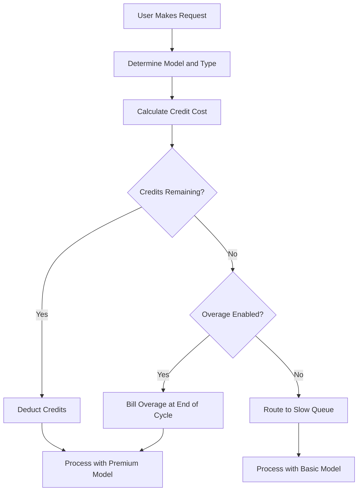

## Cursor의 청구 방식

Cursor는 월 구독과 소진 가능한 크레딧 풀을 결합한 하이브리드 모델을 사용합니다. 이 접근법은 다양한 AI 모델의 가변 비용을 관리하면서 사용자에게 예측 가능한 가격을 제공합니다.

**요금제 등급**: Cursor는 Hobby부터 Ultra까지 여러 등급을 제공하여 다양한 워크플로에 맞게 프리미엄 및 표준 액세스를 균형 있게 제공합니다.

| Plan | Price | Premium Requests | Slow Requests |
| :--- | :--- | :--- | :--- |
| Hobby | Free | 50/month | Unlimited |
| Pro | $20/month | 500/month | Unlimited |
| Pro+ | $60/month | Unlimited premium | - |
| Ultra | $200/month | Unlimited premium | - |

**모델 가중 소진**: 요청 유형에 따라 기반 모델의 비용에 비례해 다른 양의 크레딧을 소비합니다. 이를 통해 Cursor는 여러 공급자를 포함하는 단일 구독을 제공하면서도 비용이 많이 드는 작업을 정확히 반영할 수 있습니다.

| Request Type | Model | Credit Cost |
| :--- | :--- | :--- |
| Tab Completion | Default | 0 |
| Chat | GPT-4o Mini | 1 |
| Chat | Claude 3.5 Sonnet | 1 |
| Composer | GPT-4o | 5 |
| Agent | Claude 3.5 Sonnet | 10 |
| Agent | o1-preview | 25 |

**크레딧 소진 및 과금**: 크레딧이 바닥나면 사용자는 차단되지 않고 저렴한 모델을 사용하는 "Slow" 대기열로 이동합니다. 또는 사용 기반 오버리지(overages)를 활성화하여 고정 요청당 비용으로 프리미엄 액세스를 유지할 수도 있습니다.



4. **Enterprise 및 Business**: 팀은 조직 전체가 하나의 크레딧 버킷을 공유하는 풀된 사용량을 사용합니다. 이는 관리를 단순화하고 일부 중간 사용자가 제한에 도달해도 다른 사람들이 여분의 용량을 가지도록 보장합니다.

## 특별한 점

Cursor의 모델은 기존 SaaS 청구 모델이 어려움을 겪는 문제들을 해결하면서 사용자 경험과 인프라 비용을 조화시킵니다.
- **공급자 추상화**: 하나의 구독이 OpenAI, Anthropic과 같은 여러 LLM 공급자를 감싸며 복잡한 가격 책정과 API 키를 내부에서 처리합니다.
- **가중 소진**: 강력한 모델에 더 많은 비용을 청구하므로 모든 사용자가 가격을 공정하고 투명하게 느낄 수 있습니다.
- **점진적 퇴화**: "Slow" 대기열은 갑작스러운 서비스 중단을 방지해 사용자를 제품에 붙잡아 두고 업그레이드를 자연스럽게 유도합니다.
- **공유 크레딧**: 팀 단위 버킷은 조직 전체에서 효율적으로 리소스를 공유해 엔터프라이즈 고객의 마찰을 줄입니다.

## Dodo Payments로 구현하기

Dodo Payments의 크레딧 권한 및 사용 기반 청구를 사용하여 이 모델을 정확히 복제할 수 있습니다. 다음 단계가 구현을 안내합니다.

<Steps>
  <Step title="Create a Custom Unit Credit Entitlement">
    먼저 Dodo 대시보드에서 크레딧 시스템을 정의하세요. 이 권한은 사용자가 구독으로 받는 "Premium Requests"를 나타냅니다.

    *   **Credit Type:** Custom Unit
    *   **Unit Name:** "Premium Requests"
    *   **Precision:** 0 (요청의 절반을 사용할 수 없기 때문입니다)
    *   **Credit Expiry:** 30 days (각 청구 주기마다 크레딧이 초기화되도록 합니다)
    *   **Rollover:** Disabled (사용하지 않은 요청은 다음 달로 이월되지 않습니다)
    *   **Overage:** Enabled
    *   **Price Per Unit:** $0.04 (초기 풀 소진 후 요청당 비용)
    *   **Overage Behavior:** Bill overage at billing (다음 청구서에 과금 비용을 추가합니다)

    이 구성은 사용자가 매달 고정된 요청 풀을 갖고 필요할 경우 추가 비용을 지불할 수 있도록 합니다. 하이브리드 청구 모델의 기반입니다.
  </Step>

  <Step title="Create Subscription Products">
    각 등급별로 별도의 제품을 만드세요. 동일한 크레딧 권한을 각 제품에 연결하되 양은 다르게 설정하세요. 이렇게 하면 단일 크레딧 시스템으로 모든 등급을 관리할 수 있으므로 업그레이드나 다운그레이드가 쉬워집니다.

    *   **Hobby:** $0/month, 50 credits/cycle
    *   **Pro:** $20/month, 500 credits/cycle
    *   **Pro+:** $60/month, 5000 credits/cycle (대부분에 사실상 무제한)
    *   **Ultra:** $200/month, 50000 credits/cycle (사실상 무제한)

    사용자가 이러한 제품 중 하나를 구독하면 Dodo가 해당 수만큼의 크레딧을 계정에 자동으로 할당합니다. 이 과정은 즉시 이루어져 원활한 온보딩을 제공합니다.
  </Step>

  <Step title="Create a Usage Meter Linked to Credits">
    `ai.request`이라는 이름의 미터를 생성하고 `credit_cost` 속성에 대해 **Sum** 집계를 사용하세요. "Bill usage in Credits" 토글을 활성화하여 이 미터를 크레딧 권한에 연결하세요. 크레딧당 미터 단위는 1로 설정하세요.

    모델 가중 소진을 처리하려면 애플리케이션 수준에서 크레딧 비용을 관리하세요. 사용자가 요청할 때 모델 또는 작업 유형에 따라 비용을 결정합니다.

    ```typescript
    import DodoPayments from 'dodopayments';
    
    /**
     * Determines the credit cost for a given request type and model.
     * This logic lives in your application and can be updated without
     * changing your billing configuration.
     */
    function getCreditCost(requestType: string, model: string): number {
      const costs: Record<string, Record<string, number>> = {
        'tab_completion': { 'default': 0 },
        'chat': { 'gpt-4o-mini': 1, 'gpt-4o': 1, 'claude-sonnet': 1 },
        'composer': { 'gpt-4o-mini': 2, 'gpt-4o': 5, 'claude-sonnet': 5 },
        'agent': { 'gpt-4o': 10, 'claude-sonnet': 10, 'o1': 25 }
      };
      
      // Default to 1 credit if the combination isn't found
      return costs[requestType]?.[model] ?? 1;
    }
    
    /**
     * Ingests usage events into Dodo Payments.
     * For weighted requests, we send multiple events or use a sum aggregation.
     */
    async function trackRequest(customerId: string, requestType: string, model: string) {
      const creditCost = getCreditCost(requestType, model);
      
      // Tab completions are free, so we don't need to track them for billing
      if (creditCost === 0) return;
      
      const client = new DodoPayments({
        bearerToken: process.env.DODO_PAYMENTS_API_KEY,
      });
      
      await client.usageEvents.ingest({
        events: [{
          event_id: `req_${Date.now()}_${Math.random().toString(36).slice(2)}`,
          customer_id: customerId,
          event_name: 'ai.request',
          timestamp: new Date().toISOString(),
          metadata: {
            request_type: requestType,
            model: model,
            credit_cost: creditCost
          }
        }]
      });
    }
    ```

    <Tip>
      가중 요청에 단일 이벤트를 사용하려면 미터 집계를 **Sum**으로 설정하고 `credit_cost`와 같은 속성을 합산할 값을 사용하세요. 이는 대량 수집에 더 효율적이며 애플리케이션 로직을 단순화합니다.
    </Tip>
  </Step>

  <Step title="Handle Credit Exhaustion (Slow Queue)">
    Dodo의 `credit.balance_low` 웹훅을 수신하세요. 사용자의 크레딧이 거의 소진되면 애플리케이션에서 느린 대기열로 전환할 수 있습니다. 여기서 "점진적 퇴화" 로직을 구현합니다.

    ```typescript
    import DodoPayments from 'dodopayments';
    import express from 'express';
    
    const app = express();
    app.use(express.raw({ type: 'application/json' }));
    
    const client = new DodoPayments({
      bearerToken: process.env.DODO_PAYMENTS_API_KEY,
      webhookKey: process.env.DODO_PAYMENTS_WEBHOOK_KEY,
    });
    
    app.post('/webhooks/dodo', async (req, res) => {
      try {
        const event = client.webhooks.unwrap(req.body.toString(), {
          headers: {
            'webhook-id': req.headers['webhook-id'] as string,
            'webhook-signature': req.headers['webhook-signature'] as string,
            'webhook-timestamp': req.headers['webhook-timestamp'] as string,
          },
        });
        
        if (event.type === 'credit.balance_low') {
          const customerId = event.data.customer_id;
          await updateUserTier(customerId, 'slow');
          await notifyUser(customerId, 'You have used most of your premium requests. Switching to standard models.');
        }
        
        res.json({ received: true });
      } catch (error) {
        res.status(401).json({ error: 'Invalid signature' });
      }
    });
    
    /**
     * Routes a request based on the user's current tier.
     * This function is called before every AI request to determine the model and queue.
     */
    async function routeRequest(customerId: string, requestType: string) {
      const tier = await getUserTier(customerId);
      
      if (tier === 'slow') {
        // Route to a cheaper model and a lower priority queue
        // This saves costs while keeping the user active in the product
        return { model: 'gpt-4o-mini', queue: 'standard' };
      }
      
      // Premium routing for users with remaining credits
      // This provides the best possible performance and model quality
      return { model: 'claude-sonnet', queue: 'priority' };
    }
    ```

  </Step>

  <Step title="Create Checkout">
    마지막으로 사용자가 요금제를 구독할 수 있도록 체크아웃 세션을 생성하세요. Dodo가 결제 처리, 세금 준수, 크레딧 할당을 자동으로 처리합니다.

    ```typescript
    import DodoPayments from 'dodopayments';
    
    const client = new DodoPayments({
      bearerToken: process.env.DODO_PAYMENTS_API_KEY,
    });
    
    /**
     * Creates a checkout session for a new subscription.
     * This is typically called when a user clicks an "Upgrade" button.
     */
    const session = await client.checkoutSessions.create({
      product_cart: [
        { product_id: 'prod_cursor_pro', quantity: 1 }
      ],
      customer: { email: 'developer@example.com' },
      return_url: 'https://yourapp.com/dashboard'
    });
    ```

  </Step>
</Steps>

## LLM Ingestion Blueprint로 가속화하기

위의 크레딧 가중 청구는 핵심 수익화를 처리합니다. 공급자 전반의 실제 토큰 소비에 대한 심층 분석은 [LLM Ingestion Blueprint](/developer-resources/ingestion-blueprints/llm)를 크레딧 시스템과 함께 실행할 수 있습니다.

```bash
npm install @dodopayments/ingestion-blueprints
```

```typescript
import { createLLMTracker } from '@dodopayments/ingestion-blueprints';
import OpenAI from 'openai';
import Anthropic from '@anthropic-ai/sdk';

// Track raw token usage for analytics alongside credit-weighted billing
const openaiTracker = createLLMTracker({
  apiKey: process.env.DODO_PAYMENTS_API_KEY,
  environment: 'live_mode',
  eventName: 'analytics.openai_tokens',
});

const anthropicTracker = createLLMTracker({
  apiKey: process.env.DODO_PAYMENTS_API_KEY,
  environment: 'live_mode',
  eventName: 'analytics.anthropic_tokens',
});

const openai = new OpenAI({ apiKey: process.env.OPENAI_API_KEY });
const anthropic = new Anthropic({ apiKey: process.env.ANTHROPIC_API_KEY });

// Wrap each provider separately
const trackedOpenAI = openaiTracker.wrap({ client: openai, customerId: 'customer_123' });
const trackedAnthropic = anthropicTracker.wrap({ client: anthropic, customerId: 'customer_123' });

// Token tracking is automatic, credit deduction still uses your weighted system
const response = await trackedOpenAI.chat.completions.create({
  model: 'gpt-4o',
  messages: [{ role: 'user', content: 'Hello!' }],
});
```

이는 수익화를 위한 크레딧 가중 청구와 비용 분석 및 마진 추적을 위한 원시 토큰 카운트라는 두 개의 데이터 계층을 제공합니다.

<Tip>
LLM Blueprint는 OpenAI, Anthropic, Groq, Google Gemini 등을 지원합니다. [전체 블루프린트 문서](/developer-resources/ingestion-blueprints/llm)에서 모든 지원 공급자를 확인하세요.
</Tip>

## 풀된 팀 크레딧(기업용)

Cursor의 Business 및 Enterprise 요금제는 팀 전반의 크레딧을 풀링합니다. Dodo에서는 개별 사용자가 아닌 조직 전체에 대한 단일 구독을 만들어 이 기능을 구현할 수 있습니다. 이를 통해 팀의 사용량을 하나의 엔터티로 통합 및 관리할 수 있으며, 대형 고객에게 중요한 요구 사항입니다.

### 구현 전략

1.  **조직 수준 고객:** 조직 전체를 위한 `customer_id`을 Dodo에 생성하세요. 이 고객은 팀의 청구 엔터티를 나타내며 공유 크레딧 풀을 보유합니다. 모든 청구서와 크레딧 할당은 이 ID에 연결됩니다.
2.  **좌석 기반 과금:** Dodo의 애드온을 사용해 사용자당 플랫폼 요금을 부과하세요. 팀에 새 구성원이 추가되면 "Seat" 애드온의 수량을 업데이트합니다. 이렇게 하면 크레딧 풀을 별도로 유지하면서 사용자 수에 따라 수익이 늘어납니다. 다차원 청구를 처리하는 깔끔한 방법입니다.
3.  **공유 사용량 추적:** 모든 팀 구성원의 요청을 조직의 `customer_id`으로 수집하세요. 이렇게 하면 어떤 팀원이 요청하든 중앙 크레딧 풀이 동일하게 소진됩니다. 내부 보고 및 분석을 위해 이벤트 메타데이터에 `user_id`를 포함해 개별 사용자 사용량을 계속 추적할 수 있습니다.

이 접근법은 사용자당 예측 가능한 요금과 비용이 많이 드는 AI 리소스를 위한 공유 크레딧 풀을 동시에 제공합니다. 또한 팀 구성원이 개별 제한을 관리할 필요가 없어 사용자 경험도 단순해집니다.

## 기존 SaaS 청구와 비교

기존 SaaS 청구는 보통 고정 요금제(예: 100단위에 월 $10)를 사용합니다. 사용자가 101단위를 필요로 하면 종종 월 $50 요금제로 옮겨야 합니다. 이는 "절벽" 효과를 만들며 사용자를 짜증나게 하고 이탈로 이어질 수 있습니다. 또한 AI 분야에서 중요한 다양한 사용 유형의 가변 비용을 반영하지 못합니다.

Dodo로 구동되는 Cursor의 모델은 훨씬 더 유연하고 공정합니다:

*   **"절벽" 효과 없음:** 한도를 넘겼다고 무조건 업그레이드할 필요가 없습니다. 오버리지 비용을 지불하거나 성능 저하를 허용할 수 있습니다. 이는 사용자를 제품에 붙잡아 두고 마찰을 줄여 고객 만족도를 높이며 이탈을 줄입니다.
*   **비용 정렬:** 수익이 인프라 비용과 직접적으로 연동됩니다. 사용자가 고비용 모델을 사용하면 크레딧이나 오버리지를 통해 더 많이 지불합니다. 이는 마진을 보호하고 비즈니스 모델을 위험에 빠뜨리지 않고 고비용 기능을 지속 가능하게 제공합니다.
*   **더 나은 유지:** 사용자를 차단하지 않으면 한도에 도달해도 제품에 계속 참여하게 됩니다. 이로 인해 장기 충성도와 고객 평생 가치가 증가합니다. 사용자와 공급자 모두에게 윈윈입니다.

## 모델 업데이트 및 진화 처리

AI 청구의 과제 중 하나는 모델이 지속적으로 업데이트되거나 교체된다는 점입니다. 새로운 모델은 다른 비용 구조나 성능 특성을 가질 수 있습니다. Dodo의 크레딧 시스템을 사용하면 청구 데이터를 마이그레이션할 필요 없이 애플리케이션 수준에서 이를 우아하게 처리할 수 있습니다.

새롭고 고비용인 모델을 도입하면 `getCreditCost` 함수를 수정해 더 높은 비용을 할당하세요. 청구 구성을 변경하거나 기존 구독을 업데이트할 필요가 없습니다. 청구와 애플리케이션 로직을 분리하면 AI 속도에 맞춰 제품을 반복하면서 청구 시스템에 구속받지 않는 큰 이점이 있습니다.

## 사용자 알림 및 투명성

훌륭한 사용자 경험을 제공하려면 크레딧 사용량에 대해 사용자를 계속 알리는 것이 중요합니다. 투명성은 신뢰를 구축하고 사용자가 비용을 효과적으로 관리하도록 돕습니다. Dodo의 웹훅을 사용해 다양한 임계값(예: 50%, 80%, 100% 사용 시)에 알림을 트리거할 수 있습니다.

이러한 알림은 이메일, 앱 내 알림 또는 Slack 메시지로 전송할 수 있습니다. 사용량에 대한 실시간 피드백을 제공함으로써 사용자는 "slow queue"에 도달하기 전에 소비를 관리하거나 요금제를 업그레이드하도록 유도됩니다. 이러한 선제적 접근은 지원 티켓을 줄이고 전반적인 사용자 경험을 개선하여 제품을 보다 전문적이고 사용자 중심적으로 느끼게 합니다.

## 보안 및 사기 방지

크레딧 기반 시스템을 구현할 때 보안 및 사기 방지를 고려하는 것이 중요합니다. 크레딧은 직접적인 금전적 가치를 가지므로 남용의 대상이 될 수 있습니다.

*   **멱등성(Idempotency):** 사용량 이벤트를 수집할 때 항상 고유한 `event_id`를 사용해 중복 집계를 방지하세요. Dodo의 수집 API는 고유 ID를 제공하면 자동으로 멱등성을 관리해 네트워크 재시도가 사용자를 두 번 과금하지 않도록 합니다.
*   **비율 제한:** 애플리케이션 수준에서 비율 제한을 구현해 단일 사용자가 크레딧(또는 API 예산)을 너무 빠르게 소진하지 못하도록 하세요. 이는 인프라와 사용자의 지갑을 보호합니다.
*   **모니터링:** 계정 공유나 자동화된 남용을 나타낼 수 있는 이상 사용 패턴을 모니터링하세요. Dodo의 분석 도구가 이러한 패턴을 식별하는 데 도움이 되어 문제가 심각해지기 전에 조치를 취할 수 있습니다.

## 크레딧 시스템을 위한 모범 사례

크레딧 기반 청구 시스템을 구축할 때 다음 모범 사례를 염두에 두세요:

1.  **단순함 유지:** 크레딧 시스템을 너무 복잡하게 만들지 마세요. 사용자는 요청 비용과 남은 크레딧을 쉽게 이해할 수 있어야 합니다.
2.  **가치 제공:** 크레딧이 사용자에게 실제 가치를 제공하는지 확인하세요. 요청 비용이 너무 높으면 사용자는 자신이 속임당하고 있다고 느낄 수 있습니다.
3.  **투명성 유지:** 항상 사용자의 현재 크레딧 잔액과 사용 이력을 보여주세요. 이는 신뢰를 쌓고 혼란을 줄입니다.
4.  **자동화:** 가능하면 Dodo의 웹훅과 API를 사용해 청구 프로세스를 최대한 자동화하세요. 이는 수작업을 줄이고 청구 정확성을 유지합니다.

## 사용된 주요 Dodo 기능

<CardGroup cols={2}>
  <Card title="Credit-Based Billing" icon="coins" href="/features/credit-based-billing">
    사용자 정의 단위로 소진되는 크레딧 풀과 오버리지를 관리하세요.
  </Card>
  <Card title="Subscriptions" icon="calendar" href="/features/subscription">
    통합된 크레딧과 함께 다양한 등급의 반복 청구를 설정하세요.
  </Card>
  <Card title="Usage-Based Billing" icon="chart-line" href="/features/usage-based-billing/introduction">
    소비 기반으로 실시간 이벤트를 추적하고 청구하세요.
  </Card>
  <Card title="Event Ingestion" icon="bolt" href="/features/usage-based-billing/event-ingestion">
    대용량 사용 데이터를 지연 없이 Dodo에 전송하세요.
  </Card>
  <Card title="Webhooks" icon="webhook" href="/developer-resources/webhooks/intents/credit">
    크레딧 잔액 변화를 기반으로 반응하고 사용자 등급을 자동화하세요.
  </Card>
  <Card title="LLM Ingestion Blueprint" icon="brain-circuit" href="/developer-resources/ingestion-blueprints/llm">
    여러 LLM 공급자에 대한 자동 토큰 추적.
  </Card>
</CardGroup>
