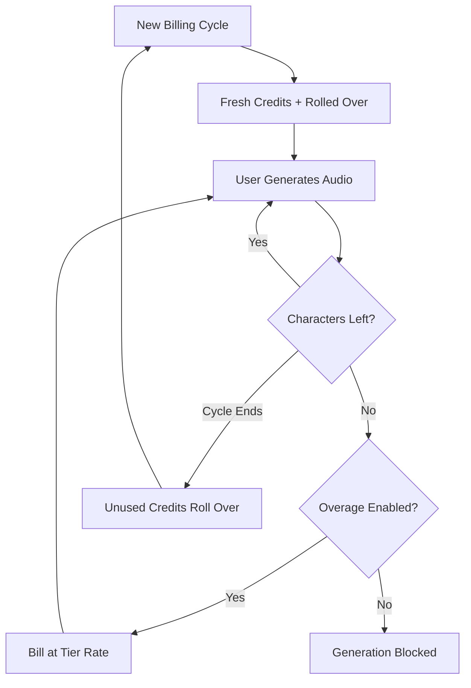

ElevenLabs는 음성 합성만큼이나 유연한 요금제를 제공하며 AI 음성 분야에서 우위를 점했습니다. 그들의 모델은 한 가지 가치 단위인 문자에 중심을 둡니다. 텍스트-투-스피치 생성, 음성 클로닝, 비디오 더빙을 하든 하나의 통합 문자 크레딧 풀에서 소비됩니다.

## ElevenLabs의 청구 방식

ElevenLabs의 가격 구조는 구독 계층에 연결된 고정 월별 할당량을 사용합니다. 사용자가 더 높은 계층으로 이동할수록 더 많은 문자와 전문가용 음성 클로닝 또는 상업적 사용 권한과 같은 고급 기능에 액세스할 수 있습니다.

| 요금제 | 가격 | 문자/월 | 초과 요금 |
| :--- | :--- | :--- | :--- |
| 무료 | \$0 | 10,000 | 제공 안 함 |
| 스타터 | 월 \$5 | 30,000 | 약 \$0.30/1K 문자 |
| 크리에이터 | 월 \$22 | 100,000 | 약 \$0.24/1K 문자 |
| 프로 | 월 \$99 | 500,000 | 약 \$0.15/1K 문자 |
| 스케일 | 월 \$330 | 2,000,000 | 약 \$0.10/1K 문자 |

1. **문자 기반 요금제**: 문자는 플랫폼 전반에서 공통된 통화입니다. 텍스트-투-스피치, 더빙, 음성 클로닝은 모두 동일한 잔액에서 소모되며 사용량 추적을 단순화합니다.
2. **롤오버 메커니즘**: 사용하지 않은 문자는 소멸하지 않고 다음 청구 주기로 이월됩니다. ElevenLabs는 무한 누적을 방지하기 위해 상한을 적용하여 사용자가 구독에서 가치를 계속 유지하도록 합니다.
3. **계층별 초과 요금**: 초과 요금은 구독 계층을 기준으로 처리합니다. 낮은 요금제는 기본적으로 초과 요금이 비활성화되어 안전을 확보하며, 높은 계층은 선택적 청구를 허용하여 서비스 연속성을 유지합니다.

## 독창적인 전략

여러 전략적 선택 덕분에 ElevenLabs 청구 모델은 사용자를 유지하고 업그레이드를 유도하는 데 특히 효과적입니다.

- **문자 롤오버**: 롤오버 크레딧은 “사용하지 않으면 사라진다”는 불안을 줄여주며, 사용하지 않은 투자를 다음으로 이월합니다. 이는 활동이 줄어든 기간에도 구독 가치를 유지합니다.
- **계층별 초과 요금**: 요금제 규모가 커질수록 초과 요금이 낮아져 업그레이드 유인이 커집니다. 사용자는 추가 사용 비용이 낮아진 높은 계층을 더 매력적으로 느낍니다.
- **통합 소비**: 모든 서비스에 단일 문자 풀을 사용하면 별도 할당량을 관리하는 인지적 부담이 사라집니다. 사용자는 남은 용량을 이해하기 위해 하나의 숫자만 확인하면 됩니다.
- **선택형 초과 요금**: 전문가용 사용자는 연속성을 위해 초과 요금을 켤 수 있으며, 일반 사용자는 하드 캡의 안전 혜택을 누립니다.



## Dodo Payments로 구축하기

Dodo Payments의 크레딧 기반 청구 및 사용량 측정을 활용하여 이 정교한 모델을 복제할 수 있습니다.

<Steps>
<Step title="Create a Custom Unit Credit Entitlement">
먼저, 플랫폼의 통화 역할을 할 "Characters" 단위를 정의하세요.

1. Dodo 대시보드에서 **Entitlements**로 이동합니다.
2. 새로운 **Credit Entitlement**을 생성합니다.
3. **Credit Type**을 **Custom Unit**으로 설정합니다.
4. 단위 이름을 "Characters"로 지정합니다.
5. 문자 단위는 항상 정수이므로 **Precision**을 0으로 설정합니다.
6. 월별 청구 주기에 맞춰 **Credit Expiry**를 30일로 설정합니다.
7. 다음 설정으로 **Rollover**를 활성화합니다:
    - **Max Rollover Percentage**: 100% (사용하지 않은 모든 문자를 이월 허용).
    - **Rollover Timeframe**: 1 Month.
    - **Max Rollover Count**: 1 (크레딧은 한 번만 이월되고 이후 만료됨).
</Step>

<Step title="Create Tiered Subscription Products">
다섯 개의 구독 상품을 만듭니다. 동일한 "Characters" 권한을 각 상품에 연결하되, 각 계층에 따라 구성은 다르게 설정합니다.

| 상품 | 가격 | 크레딧/주기 | 초과 요금 활성화 | 초과 요금 가격 (1K 문자당) |
| :--- | :--- | :--- | :--- | :--- |
| 무료 | 월 \$0 | 10,000 | 아니요 | - |
| 스타터 | 월 \$5 | 30,000 | 예 (선택적) | \$0.30 |
| 크리에이터 | 월 \$22 | 100,000 | 예 | \$0.24 |
| 프로 | 월 \$99 | 500,000 | 예 | \$0.15 |
| 스케일 | 월 \$330 | 2,000,000 | 예 | \$0.10 |

각 상품에 크레딧 권한을 연결할 때 **Import Default Credit Settings** 옵션의 선택을 해제하세요. 이렇게 하면 해당 계층에 대해 특정 **Price Per Unit**을 설정할 수 있습니다. **Overage Behavior**를 **Bill overage at billing**으로 설정하고 해당 계층 쿼터의 10%에서 **Low Balance Threshold**를 구성합니다.
</Step>

<Step title="Create a Usage Meter">
사용량 계량기는 애플리케이션 활동을 크레딧 시스템에 연결합니다.

1. `tts.characters`라는 이름의 새 계량기를 만듭니다.
2. **Aggregation**을 **Sum**으로 설정합니다. 이렇게 하면 전송하는 모든 이벤트에서 `characters` 속성이 합산됩니다.
3. 이 계량기를 "Characters" 크레딧 권한에 연결합니다.
4. **Meter units per credit**를 1로 설정합니다. 이는 앱에서 한 문자를 사용하면 잔액에서 한 크레딧이 차감되도록 합니다.
</Step>

<Step title="Send Usage Events">
사용량 추적을 애플리케이션 코드에 통합하세요. 사용자가 오디오를 생성할 때마다 Dodo로 이벤트를 전송합니다.

```typescript
import DodoPayments from 'dodopayments';

async function trackGeneration(
  customerId: string,
  text: string, 
  service: 'tts' | 'dubbing' | 'cloning'
) {
  const characterCount = text.length;

  const client = new DodoPayments({
    bearerToken: process.env.DODO_PAYMENTS_API_KEY,
  });

  await client.usageEvents.ingest({
    events: [{
      event_id: `gen_${Date.now()}_${Math.random().toString(36).slice(2)}`,
      customer_id: customerId,
      event_name: 'tts.characters',
      timestamp: new Date().toISOString(),
      metadata: {
        characters: characterCount,
        service: service,
        voice_id: 'voice_abc123'
      }
    }]
  });
}
```

</Step>

<Step title="Handle Low Balance and Overage">
웹훅을 사용하여 사용자에게 문자 사용량을 알립니다.

```typescript
import DodoPayments from 'dodopayments';
import express from 'express';

const app = express();
app.use(express.raw({ type: 'application/json' }));

const client = new DodoPayments({
  bearerToken: process.env.DODO_PAYMENTS_API_KEY,
  webhookKey: process.env.DODO_PAYMENTS_WEBHOOK_KEY,
});

app.post('/webhooks/dodo', async (req, res) => {
  try {
    const event = client.webhooks.unwrap(req.body.toString(), {
      headers: {
        'webhook-id': req.headers['webhook-id'] as string,
        'webhook-signature': req.headers['webhook-signature'] as string,
        'webhook-timestamp': req.headers['webhook-timestamp'] as string,
      },
    });

    switch (event.type) {
      case 'credit.balance_low':
        await notifyUser(event.data.customer_id, 
          'You are running low on characters. Consider upgrading your plan for more characters and lower overage rates.'
        );
        break;
      case 'credit.deducted':
        await logUsage(event.data);
        break;
      case 'credit.overage_charged':
        await notifyUser(event.data.customer_id,
          'You have exceeded your character quota. Overage charges will appear on your next invoice.'
        );
        break;
    }

    res.json({ received: true });
  } catch (error) {
    res.status(401).json({ error: 'Invalid signature' });
  }
});
```

</Step>

<Step title="Create Checkout">
사용자가 구독할 준비가 되면 선택한 계층에 대해 체크아웃 세션을 생성합니다.

```typescript
const session = await client.checkoutSessions.create({
  product_cart: [
    { product_id: 'prod_elevenlabs_pro', quantity: 1 }
  ],
  customer: { email: 'creator@example.com' },
  return_url: 'https://yourapp.com/dashboard'
});
```

</Step>
</Steps>

## Stream Ingestion Blueprint로 가속화

문자 기반 청구와 함께 오디오 출력도 추적하려면 [Stream Ingestion Blueprint](/developer-resources/ingestion-blueprints/stream)가 대역폭 소비량을 계량할 수 있는 간소화된 방법을 제공합니다.

```bash
npm install @dodopayments/ingestion-blueprints
```

```typescript
import { Ingestion, trackStreamBytes } from '@dodopayments/ingestion-blueprints';

const ingestion = new Ingestion({
  apiKey: process.env.DODO_PAYMENTS_API_KEY,
  environment: 'live_mode',
  eventName: 'tts.audio_bytes',
});

// After generating audio, track the output size
const audioBuffer = await generateSpeech(text, voiceId);

await trackStreamBytes(ingestion, {
  customerId: customerId,
  bytes: audioBuffer.byteLength,
  metadata: {
    voice_id: voiceId,
    service: 'tts',
    format: 'mp3',
  },
});
```

Stream Blueprint를 사용하면 문자 기반 크레딧 시스템과 함께 오디오 대역폭을 추적할 수 있어 생성당 실제 인프라 비용을 파악할 수 있습니다.

<Tip>
Stream Blueprint는 또한 대량 처리 시나리오를 위한 배칭을 지원합니다. 고급 사용 패턴에 대해서는 [전체 블루프린트 문서](/developer-resources/ingestion-blueprints/stream)를 참조하세요.
</Tip>

## 업그레이드 유도: 계층별 초과 요금

ElevenLabs 모델의 가장 훌륭한 부분은 초과 요금 비율을 활용해 업그레이드를 유도하는 방식입니다. 높은 계층에서 문자당 비용을 낮추면 대화가 “얼마나 필요하지?”에서 “얼마나 절약할 수 있지?”로 바뀝니다.

| 계층 | 포함 문자 | 초과 요금 (1K당) | 50만 문자 기준 실효 비용 |
| :--- | :--- | :--- | :--- |
| 크리에이터 | 100,000 | \$0.24 | \$22 + (400 * \$0.24) = \$118 |
| 프로 | 500,000 | \$0.15 | \$99 (초과 없음) |

크리에이터 요금제에서 정기적으로 50만 문자를 사용하는 사용자는 구독료와 초과 요금을 합쳐 월 \$118을 지불합니다. 프로 요금제로 업그레이드하면 동일한 사용량을 \$99에 커버할 수 있어 월 \$19을 절약합니다. 높은 계층에서 낮은 초과 요금률은 사용량이 증가할수록 업그레이드가 명백한 재정적 선택이 되게 합니다.

Dodo Payments에서는 구독 상품에 크레딧을 연결할 때 **Import Default Credit Settings** 박스의 선택을 해제하세요. 이렇게 하면 각 계층에 대해 개별 **Price Per Unit**을 완벽하게 제어할 수 있어 가장 높은 지급 고객에게 최고의 요율을 제공할 수 있습니다.

## 핵심 Dodo 기능

<CardGroup cols={2}>
  <Card title="Credit-Based Billing" icon="coins" href="/features/credit-based-billing">
    문자 할당량, 롤오버, 만료를 관리합니다.
  </Card>
  <Card title="Subscriptions" icon="calendar" href="/features/subscription">
    월별 문자 할당량을 제공하는 반복 요금제를 설정합니다.
  </Card>
  <Card title="Usage-Based Billing" icon="chart-line" href="/features/usage-based-billing/introduction">
    서비스 전반에서 실시간 문자 소비를 추적합니다.
  </Card>
  <Card title="Event Ingestion" icon="bolt" href="/features/usage-based-billing/event-ingestion">
    최소한의 지연으로 고용량 사용 데이터를 Dodo에 전송합니다.
  </Card>
  <Card title="Webhooks" icon="webhook" href="/developer-resources/webhooks/intents/credit">
    실시간으로 잔액 부족 및 초과 이벤트에 대응합니다.
  </Card>
  <Card title="Stream Ingestion Blueprint" icon="tower-broadcast" href="/developer-resources/ingestion-blueprints/stream">
    사용량 기반 청구를 위해 오디오 스트리밍 대역폭을 추적합니다.
  </Card>
</CardGroup>
