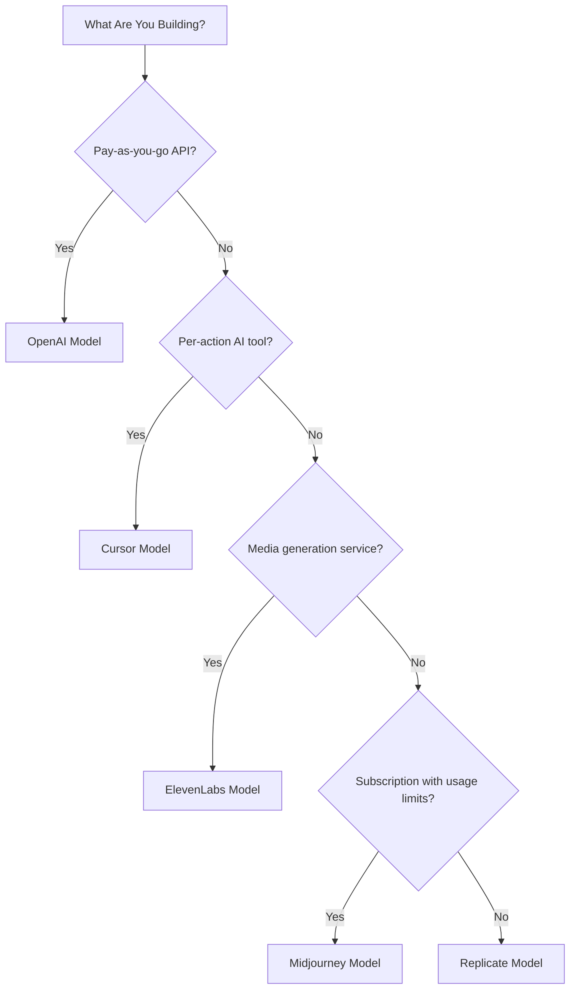

## 다섯 가지 모델

| 앱 | 주요 지표 | 고유 혁신 | Dodo 기능 |
| :--- | :--- | :--- | :--- |
| OpenAI | 토큰 (법정화폐 기준) | 만기 없는 잔액을 갖는 선불 법정화폐 크레딧 | 신용 기반 청구 (법정화폐 크레딧) |
| Cursor | 프리미엄 요청 | 모델 가중치별 크레딧 감소 (모델마다 비용 상이) | 신용 기반 청구 (맞춤 단위) |
| ElevenLabs | 문자 | 이월되는 문자 할당량 + 단계별 초과 요금 | 신용 기반 청구 (이월 + 초과 요금) |
| Midjourney | GPU 시간 | 할당량 이후에 "릴랙스 모드" 무제한 대체 | 구독 + 사용량 미터 |
| Replicate | 실행 초 | 하드웨어 별 초 단위 순수 계량 | 순수 사용량 기반 청구 |

## 크레딧 패턴 이해하기

| 패턴 | 예시 | Dodo 기능 | 단위 유형 |
| :--- | :--- | :--- | :--- |
| 선불 법정화폐 기준 크레딧 | OpenAI API (US$5 크레딧 충전, 출금 불가) | 신용 기반 청구 (법정화폐 크레딧) | 달러 기준 가상 단위 |
| 가상 사용 크레딧 | Cursor 프리미엄 요청, ElevenLabs 문자 | 신용 기반 청구 (맞춤 단위) | 임의 단위 (요청, 문자) |
| 순수 소비 계량 | Replicate 초 단위 청구 | 사용량 기반 청구 (미터) | 직접 측정 (초, 바이트) |
| 구독 + 계량 초과 요금 | Midjourney Fast Hours 후 릴랙스 대체 | 구독 + 사용량 미터 | 자유 thresholds 기반 시간 |

<Info>
Dodo의 신용 기반 청구에서 법정화폐 크레딧은 플랫폼 기준 달러 가치를 나타내며 생태계 외부에서는 금전적 가치가 없습니다. 고객은 이를 현금으로 출금할 수 없습니다.
</Info>

## 어떤 모델을 사용해야 할까?

- 종량제 API 플랫폼 구축: OpenAI 모델 (법정화폐 크레딧)
- 행동당 과금 AI 툴 구축: Cursor 모델 (맞춤 단위 크레딧)
- 미디어 생성 서비스 구축: ElevenLabs 모델 (이월 크레딧)
- 사용량 제한 구독 서비스 구축: Midjourney 모델 (구독 + 사용량 미터)
- 인프라/컴퓨트 플랫폼 구축: Replicate 모델 (순수 계량)

<CardGroup cols={2}>
  <Card title="OpenAI" icon="/images/logos/openai.svg" href="/developer-resources/billing-deconstructions/openai">
    토큰 기반 선불 크레딧 모델을 복제하세요.
  </Card>
  <Card title="Cursor" icon="/images/logos/cursor.svg" href="/developer-resources/billing-deconstructions/cursor">
    모델 가중 사용 한도를 구축하세요.
  </Card>
  <Card title="ElevenLabs" icon="/images/logos/elevenlabs.svg" href="/developer-resources/billing-deconstructions/elevenlabs">
    이월 및 초과 요금이 있는 문자 할당량을 구현하세요.
  </Card>
  <Card title="Midjourney" icon="/images/logos/midjourney.svg" href="/developer-resources/billing-deconstructions/midjourney">
    구독과 사용량 기반 대체를 결합하세요.
  </Card>
  <Card title="Replicate" icon="/images/logos/replicate.svg" href="/developer-resources/billing-deconstructions/replicate">
    초 단위 순수 소비 계량을 설정하세요.
  </Card>
</CardGroup>

## Dodo 기능

<CardGroup cols={2}>
  <Card title="Credit-Based Billing" href="/features/credit-based-billing">
    선불 크레딧과 가상 단위를 관리하세요.
  </Card>
  <Card title="Usage-Based Billing" href="/features/usage-based-billing/introduction">
    실시간으로 소비량을 계량하세요.
  </Card>
  <Card title="Subscriptions" href="/features/subscription">
    반복 청구 및 요금제 관리를 처리하세요.
  </Card>
  <Card title="Hybrid Billing" href="/features/hybrid-billing">
    최대 유연성을 위해 여러 청구 모델을 결합하세요.
  </Card>
</CardGroup>

## 수집 설계도

각 해체에는 사용량 이벤트 추적을 자동으로 처리하는 Dodo의 [수집 설계도](/features/usage-based-billing/ingestion-blueprints)와의 통합이 포함되어 있습니다. 사용량 이벤트를 수동으로 구성하는 대신, 설계도를 사용해 몇 분 만에 프로덕션 준비가 된 계량을 구현하세요.

<CardGroup cols={3}>
  <Card title="LLM Blueprint" icon="brain-circuit" href="/developer-resources/ingestion-blueprints/llm">
    OpenAI, Anthropic, Groq 등 자동 토큰 추적.
  </Card>
  <Card title="Stream Blueprint" icon="tower-broadcast" href="/developer-resources/ingestion-blueprints/stream">
    오디오 및 비디오 스트리밍 대역폭 추적.
  </Card>
  <Card title="Time Range Blueprint" icon="clock" href="/developer-resources/ingestion-blueprints/time-range">
    밀리초 단위까지 컴퓨트 지속 시간을 기준으로 청구.
  </Card>
</CardGroup>
