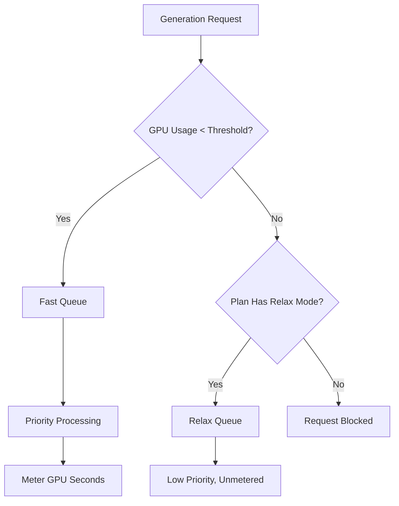

Midjourney는 생성 AI 플랫폼으로 GPU 시간을 기반으로 하는 독특한 청구 모델을 사용하며 단순한 이미지 수 대신 복잡한 고해상도 렌더링에 더 많은 비용이 부과되도록 합니다.

## Midjourney 청구 방식

Midjourney의 구독 플랜은 사용자에게 매월 일정량의 "Fast GPU Hours"를 제공합니다. 이 시간은 생성에 실제로 소모된 계산 시간을 나타냅니다.

| 플랜 | 가격 | Fast GPU 시간 | Relax 모드 | Stealth 모드 |
| :--- | :--- | :--- | :--- | :--- |
| Basic | \$10/month | ~3.3 hrs | 아니오 | 아니오 |
| Standard | \$30/month | 15 hrs | 무제한 | 아니오 |
| Pro | \$60/month | 30 hrs | 무제한 | 예 |
| Mega | \$120/month | 60 hrs | 무제한 | 예 |

1. **가격 책정 등급**: Midjourney는 월 \$10에서 \$120까지 네 가지 구독 등급을 제공하며 각각 Fast GPU 시간을 일정량 제공합니다.
2. **Relax 모드**: Standard 이상 플랜은 Fast 시간이 소진된 후 낮은 우선순위 큐를 통해 무제한 생성을 지원하여 사용자가 단단한 사용 한계에 도달하지 않도록 합니다.
3. **추가 GPU 시간**: 필요시 월별 할당량을 모두 사용한 후 약 \$4/시간에 Fast GPU 시간을 추가 구매할 수 있어 즉시 결과를 받을 수 있습니다.
4. **GPU 초 단위 계량**: 사용량은 생성에 실제로 소요된 계산 시간으로 추적되므로 복잡한 렌더링은 단순 초안보다 비용이 더 높습니다.
5. **커뮤니티 루프**: 활발히 참여하는 사용자는 갤러리에서 이미지를 평가하여 보너스 GPU 시간을 얻을 수 있으며, 이는 모델 학습에 기여하면서 커뮤니티에 보상을 제공합니다.
## 차별점

Midjourney 모델은 비용을 가치 및 리소스 사용량과 정렬하여 효과적입니다.

* **GPU 시간 청구**는 비용을 리소스 사용량과 정렬하여 복잡한 렌더링이 단순 초안보다 공정한 가격을 받도록 합니다.
* **Relax 모드**는 월별 한도를 초과한 후에도 접근성을 유지해 이탈률을 줄이는 무제한 대체 경로를 제공합니다.
* **Fast와 Relax 분리**는 속도와 즉시 결과를 중시하는 사용자가 우선 순위 처리를 위해 업그레이드하도록 유도합니다.
* **추가 GPU 시간**은 파워 유저가 월 중간에 고우선순위 용량을 유연하게 추가할 수 있는 옵션을 제공합니다.

## Dodo Payments로 이 모델 구성하기

Dodo Payments를 사용하여 구독, 사용량 계량기, 애플리케이션 수준 로직을 결합해 이 모델을 재현할 수 있습니다.

<Steps>

<Step title="Create a Usage Meter">

먼저, 각 고객이 사용한 GPU 초를 추적하기 위한 미터를 생성합니다.

* **Meter name**: `gpu.fast_seconds`
* **Aggregation**: **Sum** (Sum the `gpu_seconds` property from each event)

청구 목적상 생성 모드가 "fast"인 이벤트만 추적합니다. Relax 모드 생성은 청구 대상이 아닙니다.

</Step>

<Step title="Create Subscription Products with Usage Pricing">

구독 상품을 만든 다음 무료 한도가 있는 사용량 미터를 연결합니다.

| 제품 | 기본 가격 | 무료 한도 (초) | 초과 요금 |
| :--- | :--- | :--- | :--- |
| Basic | \$10/month | 12,000 (3.3 hrs) | 해당 없음 (하드 캡) |
| Standard | \$30/month | 54,000 (15 hrs) | \$0.00 (Relax 모드) |
| Pro | \$60/month | 108,000 (30 hrs) | \$0.00 (Relax 모드) |
| Mega | \$120/month | 216,000 (60 hrs) | \$0.00 (Relax 모드) |

Basic 플랜은 초과 요금을 비활성화하여 하드 캡을 적용합니다. 다른 플랜에서는 미터가 한도를 초과했을 때 애플리케이션 로직에서 "Relax 모드"로 처리합니다.

</Step>

<Step title="Implement Application-Level Relax Mode">

핵심 인사이트는 Relax 모드가 청구 기능이 아니라는 점입니다. Dodo 사용량 미터가 한도에 도달했음을 알려줄 때 애플리케이션에서 느린 큐로 요청을 라우팅하는 것입니다.

```typescript
async function handleGenerationRequest(customerId: string, prompt: string) {
  const usage = await getCustomerUsage(customerId, 'gpu.fast_seconds');
  const subscription = await getSubscription(customerId);
  const threshold = getThresholdForPlan(subscription.product_id);
  
  if (usage.current >= threshold) {
    if (subscription.product_id === 'prod_basic') {
      throw new Error('Fast GPU hours exhausted. Upgrade to Standard for Relax Mode.');
    }
    
    // Relax Mode. Route to low-priority queue
    return await queueGeneration(customerId, prompt, {
      priority: 'low',
      mode: 'relax',
      model: 'standard'
    });
  }
  
  // Fast Mode. Priority processing
  return await queueGeneration(customerId, prompt, {
    priority: 'high',
    mode: 'fast',
    model: 'premium'
  });
}
```

</Step>

<Step title="Send Usage Events (Fast Mode Only)">

Fast 모드에서 생성이 수행될 때만 Dodo로 사용량 이벤트를 전송하세요.

```typescript
import DodoPayments from 'dodopayments';

async function trackFastGeneration(customerId: string, gpuSeconds: number, jobId: string) {
  // Only track Fast mode generations. Relax mode is free and unlimited
  const client = new DodoPayments({
    bearerToken: process.env.DODO_PAYMENTS_API_KEY,
  });

  await client.usageEvents.ingest({
    events: [{
      event_id: `gen_${jobId}`,
      customer_id: customerId,
      event_name: 'gpu.fast_seconds',
      timestamp: new Date().toISOString(),
      metadata: {
        gpu_seconds: gpuSeconds,
        resolution: '1024x1024',
        mode: 'fast'
      }
    }]
  });
}
```

</Step>

<Step title="Sell Extra Fast Hours (One-Time Top-Up)">

"추가 Fast GPU 시간"을 \$4에 일회성 결제로 판매하는 상품을 생성하세요. 고객이 구매하면 애플리케이션에서 추가 한도나 크레딧을 부여할 수 있습니다.

```typescript
// After customer purchases extra hours
const session = await client.checkoutSessions.create({
  product_cart: [
    { product_id: 'prod_extra_gpu_hour', quantity: 5 }
  ],
  customer: { customer_id: customerId },
  return_url: 'https://yourapp.com/dashboard'
});
```

</Step>

<Step title="Create Checkout for Subscription">

마지막으로 구독 플랜에 대한 결제 세션을 생성하세요.

```typescript
const session = await client.checkoutSessions.create({
  product_cart: [
    { product_id: 'prod_mj_standard', quantity: 1 }
  ],
  customer: { email: 'artist@example.com' },
  return_url: 'https://yourapp.com/studio'
});
```

</Step>

</Steps>

## Time Range Ingestion Blueprint로 가속화하기

[Time Range Ingestion Blueprint](/developer-resources/ingestion-blueprints/time-range)는 기간 기반 청구를 위한 전용 도우미를 제공하여 GPU 시간 추적을 단순화합니다.

```bash
npm install @dodopayments/ingestion-blueprints
```

```typescript
import { Ingestion, trackTimeRange } from '@dodopayments/ingestion-blueprints';

const ingestion = new Ingestion({
  apiKey: process.env.DODO_PAYMENTS_API_KEY,
  environment: 'live_mode',
  eventName: 'gpu.fast_seconds',
});

// Track generation time after a Fast mode job completes
const startTime = Date.now();
const result = await runGeneration(prompt, settings);
const durationMs = Date.now() - startTime;

await trackTimeRange(ingestion, {
  customerId: customerId,
  durationMs: durationMs,
  metadata: {
    mode: 'fast',
    resolution: '1024x1024',
  },
});
```

이 블루프린트는 기간 변환과 이벤트 형식을 처리합니다. 고객 ID와 경과 시간을 제공하기만 하면 됩니다.

<Tip>
Time Range Blueprint는 밀리초, 초, 분을 지원합니다. 모든 기간 옵션과 모범 사례는 [전체 블루프린트 문서](/developer-resources/ingestion-blueprints/time-range)를 참고하세요.
</Tip>

## Fast 대 Relax 아키텍처

이중 큐 시스템은 현재 사용 상태를 기반으로 요청을 라우팅합니다.



1. 모든 요청은 애플리케이션을 통과합니다.
2. 애플리케이션은 Dodo 사용량 미터를 플랜의 무료 한도와 비교합니다.
3. 사용량이 한도 미만이면 요청은 Fast 큐로 전송되어 계량됩니다.
4. 사용량이 한도를 초과하면 요청은 우선순위가 낮고 비계량인 Relax 큐로 전송됩니다.
5. Basic 플랜에는 Relax 폴백이 없으므로 한도에 도달하면 요청이 차단됩니다.

<Info>
Relax 모드는 Dodo 청구 기능이 아니라 애플리케이션 수준 패턴입니다. Dodo는 Fast GPU 사용량을 추적하고 한도가 초과되었을 때 알려줍니다. 사용자를 차단할지 느린 큐로 라우팅할지는 애플리케이션이 결정합니다.
</Info>

## 사용된 주요 Dodo 기능

<CardGroup cols={2}>
  <Card title="Subscriptions" icon="calendar" href="/features/subscription">
    정기 결제 및 플랜 등급을 관리합니다.
  </Card>
  <Card title="Usage-Based Billing" icon="bolt" href="/features/usage-based-billing/introduction">
    실제 리소스 소비를 기준으로 추적하고 청구합니다.
  </Card>
  <Card title="Event Ingestion" icon="input-pipe" href="/features/usage-based-billing/event-ingestion">
    높은 볼륨의 사용량 이벤트를 Dodo API로 전송합니다.
  </Card>
  <Card title="Meters" icon="gauge" href="/features/usage-based-billing/meters">
    사용 이벤트의 집계 및 청구 방식을 정의합니다.
  </Card>
  <Card title="One-Time Payments" icon="credit-card" href="/features/one-time-payment-products">
    추가 시간이나 토핑업을 일회성 구매로 판매합니다.
  </Card>
  <Card title="Time Range Blueprint" icon="clock" href="/developer-resources/ingestion-blueprints/time-range">
    기간 기반 도우미로 간소화된 GPU 시간 추적.
  </Card>
</CardGroup>
