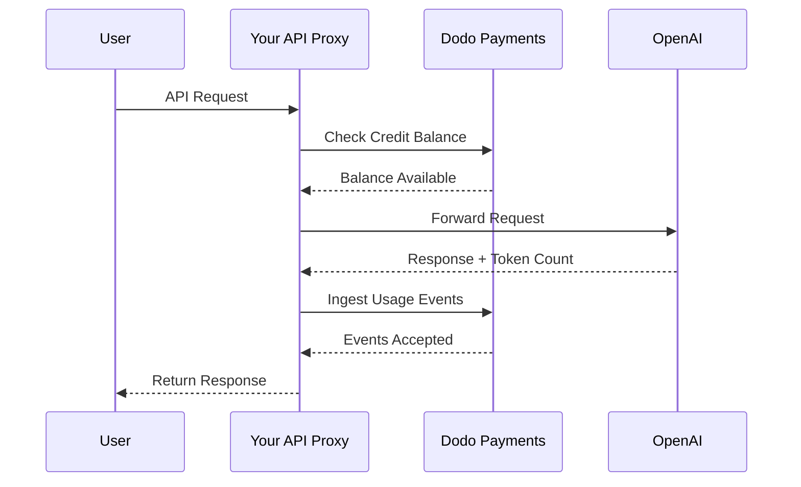
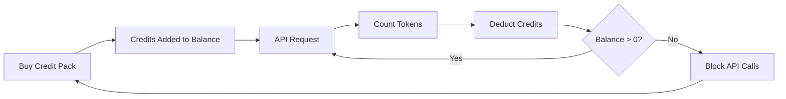

OpenAI의 청구 모델은 AI 기업의 금본위 모델입니다. API 사용을 위한 선불 법정화폐 크레딧과 소비자 제품용 정액제 구독을 결합합니다. 이 하이브리드 접근 방식은 예측 가능한 수익을 보장하면서 개발자가 마찰 없이 사용량을 확장할 수 있게 합니다.

## OpenAI 모델이 표준인 이유

AI 산업은 기존 SaaS 청구에서 항상 해결하지 못하는 고유한 과제에 직면해 있습니다. OpenAI의 모델은 이러한 문제를 여러 개 동시에 해결합니다.

1. **예측 가능한 수익과 낮은 위험**: API 사용을 위해 선불 크레딧을 요구함으로써 OpenAI는 사용자가 감당할 수 없는 거대한 청구서를 만드는 위험을 제거합니다. 수익은 선불로 확보하고 사용자는 사용하면서 서비스를 받습니다.
2. **개발자를 위한 확장성**: 5달러 충전은 진입 장벽이 낮습니다. 애플리케이션이 성장하면 개발자는 충전을 자동화하거나 더 큰 팩을 구입할 수 있습니다. 시작할 때 마찰은 거의 없지만 성장의 상한선은 없습니다.
3. **사용자 심리**: 크레딧을 추상적인 "토큰"이나 "포인트" 대신 법정화폐(USD)로 명기하면 가치를 명확하게 알 수 있습니다. 이는 AI 서비스의 은행 계좌처럼 느껴져 신뢰를 쌓고 기업의 예산 수립을 수월하게 합니다.

## OpenAI는 어떻게 청구하는가

OpenAI는 서로 다른 사용자 요구를 충족하는 두 가지 청구 모델을 운영합니다.

1. **API (Pay-as-you-go)**: API는 선불 법정화폐 크레딧을 사용합니다. 사용자는 \$5, \$10, \$50 등으로 계정을 충전합니다. 이 크레딧은 달러 가치를 표시하지만 OpenAI 외부에서는 금전적 가치가 없습니다. OpenAI는 입력 토큰과 출력 토큰에 대해 서로 다른 요율로 토큰당 청구합니다. 크레딧은 만료하지 않으며, 사용자의 잔액이 \$0가 되면 API 호출은 즉시 실패합니다.
2. **ChatGPT Plus, Team, and Enterprise**: 이들은 정액제 구독입니다. ChatGPT Plus는 월 \$20이며, Team 플랜은 사용자당 월 \$25입니다. 이 플랜에는 사용자가 차단되는 대신 더 작은 모델로 강등되는 소프트 사용 한도가 있습니다.
3. **지출 기반 요금 계층(Spend-based rate tiers)**: 시간이 지날수록 총 지출이 늘어나면 더 높은 API 속도 제한이 해제됩니다. 이는 청구 내역에 직접 연결된 신뢰 기반 접근 확장 시스템입니다.

| 모델 | 가격 | 입력 토큰 | 출력 토큰 |
| :--- | :--- | :--- | :--- |
| GPT-4o | Usage-based | \$2.50 / 1M | \$10.00 / 1M |
| GPT-4o-mini | Usage-based | \$0.15 / 1M | \$0.60 / 1M |
| o1 | Usage-based | \$15.00 / 1M | \$60.00 / 1M |

| 요금제 | 가격 | 유형 |
| :--- | :--- | :--- |
| Free | \$0 | 제한된 액세스 |
| Plus | \$20 / mo | 소프트 캡이 있는 구독 |
| Team | \$25 / user / mo | 사용자당 구독 |
| Enterprise | Custom | 청구서 발행 청구 |
## 차별점

OpenAI의 청구 전략은 AI 서비스를 효과적으로 만드는 몇 가지 핵심 특성을 갖추고 있습니다.

- **법정화폐로 명기된 크레딧**: 크레딧이 USD로 명기되어 있기 때문에 돈처럼 느껴집니다. 이는 개발자에게 가격을 투명하고 이해하기 쉽게 만듭니다.
- **만료 없음**: 절약하면 사용하지 못하는 압박이 줄어듭니다. 사용자는 가치가 사라지지 않는다는 것을 알고 더 큰 금액으로 충전하는 데 편안함을 느낍니다.
- **다차원 미터링**: 입력 토큰과 출력 토큰은 별도로 추적되지만 동일한 크레딧 잔액에서 차감됩니다. 이를 통해 OpenAI는 출력 토큰처럼 비용이 높은 항목을 더 비싸게 가격 책정할 수 있습니다.
- **신뢰 계층**: 총 지출과 속도 제한을 연결하면 사용자가 플랫폼에 머무르도록 유도하고 장기 고객에게 더 나은 성능을 보상합니다.

이 모델은 강력한 플라이휠을 만듭니다. 낮은 진입 비용은 개발자를 끌어들입니다. 선불 크레딧은 즉각적인 현금 흐름을 제공합니다. 사용량 기반 확장은 개발자가 성공할수록 OpenAI도 성공하게 합니다. 구독 측면은 개발자가 아닌 사용자의 예측 가능한 안정적인 수익 기반을 제공합니다.

## Dodo Payments로 구축하기

Dodo Payments를 사용하여 OpenAI의 청구 모델을 복제할 수 있습니다. API에는 크레딧 기반 청구를 사용하고, ChatGPT Plus 측에는 표준 구독을 사용합니다.

<Steps>
  <Step title="Create a Fiat Credit Entitlement">
    Dodo Payments 대시보드에서 크레딧 권한 부여를 생성하면서 시작하세요. 이것은 사용자들의 중앙 잔액 역할을 합니다.

    * **크레딧 유형:** 법정화폐 크레딧(USD)
    * **크레딧 만료:** 없음
    * **이월:** 필요 없음(만료되지 않으므로)
    * **초과 사용:** 비활성화됨

    초과 사용을 비활성화하면 잔액이 \$0가 되었을 때 API 호출이 실패하도록 하여 OpenAI와 동일한 동작이 됩니다.
  </Step>

  <Step title="Create Top-Up Products">
    다양한 크레딧 팩에 대해 일회성 결제 상품을 만드세요. \$5, \$10, \$50, \$100 옵션을 제공할 수 있습니다. 각 상품에 법정화폐 크레딧 권한을 연결하세요.

    상품당 발급되는 크레딧은 센트 단위로 설정하세요. 예를 들어 \$50 팩은 5000 크레딧을 발급합니다.

    ```typescript
    import DodoPayments from 'dodopayments';

    const client = new DodoPayments({
      bearerToken: process.env.DODO_PAYMENTS_API_KEY,
    });

    const session = await client.checkoutSessions.create({
      product_cart: [
        { product_id: 'prod_credit_pack_50', quantity: 1 }
      ],
      customer: { email: 'developer@example.com' },
      return_url: 'https://yourapp.com/dashboard'
    });
    ```

  </Step>

  <Step title="Create Usage Meters">
    토큰 사용량을 추적하기 위해 두 개의 별도 미터를 만드세요.

    * `llm.input_tokens`: `tokens` 속성에 대한 합계 집계.
    * `llm.output_tokens`: `tokens` 속성에 대한 합계 집계.

    두 미터를 모두 법정화폐 크레딧 권한에 연결하세요. 각각에 대해 "크레딧당 미터 단위"를 구성해야 합니다.

    ### 크레딧당 미터 단위 계산

    OpenAI의 GPT-4o 가격(입력 토큰 1M당 \$2.50)에 맞추려면 1달러(100센트)가 몇 개의 토큰과 동일한지 계산해야 합니다.

    * **입력 토큰:** 1,000,000 tokens / \$2.50 = 400,000 tokens per \$1.
    * **출력 토큰:** 1,000,000 tokens / \$10.00 = 100,000 tokens per \$1.

    Dodo 대시보드에서 입력에 대해 "크레딧당 미터 단위"를 400,000으로, 출력에 대해서는 100,000으로 설정합니다.
  </Step>

  <Step title="Send Usage Events">
    각 LLM 요청 후에 사용량 데이터를 Dodo Payments로 전송하세요. 하나의 요청에서 입력과 출력 이벤트를 모두 보낼 수 있습니다.

    ```typescript
    await client.usageEvents.ingest({
      events: [{
        event_id: `req_${requestId}`,
        customer_id: customerId,
        event_name: 'llm.input_tokens',
        timestamp: new Date().toISOString(),
        metadata: {
          model: 'gpt-4o',
          tokens: 1500
        }
      }, {
        event_id: `req_${requestId}_out`,
        customer_id: customerId,
        event_name: 'llm.output_tokens',
        timestamp: new Date().toISOString(),
        metadata: {
          model: 'gpt-4o',
          tokens: 800
        }
      }]
    });
    ```

  </Step>

  <Step title="Handle Balance Depletion">
    API 요청을 처리하기 전에 사용자의 잔액을 확인해야 합니다. 잔액이 0이거나 음수이면 402 오류를 반환하세요.

    ```typescript
    async function checkCreditsBeforeRequest(customerId: string) {
      const balance = await client.creditEntitlements.balances.retrieve(customerId, {
        credit_entitlement_id: 'credit_entitlement_id',
      });

      if (balance.available <= 0) {
        throw new Error('Insufficient credits. Please top up your account.');
      }
    }
    ```

    ### 낮은 잔액 웹훅 처리

    사용자가 \$0에 도달할 때까지 기다리지 마세요. 잔액이 특정 임계값 아래로 떨어졌을 때 이메일이나 앱 내 알림을 트리거하는 웹훅을 사용하세요.

    ```typescript
    import DodoPayments from 'dodopayments';
    import express from 'express';

    const app = express();
    app.use(express.raw({ type: 'application/json' }));

    const client = new DodoPayments({
      bearerToken: process.env.DODO_PAYMENTS_API_KEY,
      webhookKey: process.env.DODO_PAYMENTS_WEBHOOK_KEY,
    });

    app.post('/webhooks/dodo', async (req, res) => {
      try {
        const event = client.webhooks.unwrap(req.body.toString(), {
          headers: {
            'webhook-id': req.headers['webhook-id'] as string,
            'webhook-signature': req.headers['webhook-signature'] as string,
            'webhook-timestamp': req.headers['webhook-timestamp'] as string,
          },
        });

        if (event.type === 'credit.balance_low') {
          const { customer_id, available_balance } = event.data;
          await sendLowBalanceEmail(customer_id, available_balance);
        }

        res.json({ received: true });
      } catch (error) {
        res.status(401).json({ error: 'Invalid signature' });
      }
    });
    ```

    <Tip>
      OpenAI는 사용자의 잔액이 거의 바닥날 때 이러한 이메일을 보내 서비스 중단 없이 충전할 시간을 확보해 줍니다.
    </Tip>
  </Step>

  <Step title="Build the ChatGPT Subscription Side (Optional)">
    ChatGPT Plus와 같은 구독 플랜을 제공하려면 Dodo Payments에서 별도의 구독 상품을 생성하세요. 이러한 상품에는 크레딧 권한이 필요 없습니다.

    Team 플랜의 경우 각 추가 사용자에 대해 애드온을 추가하여 좌석 기반 요금제를 사용하세요.

    ```typescript
    const session = await client.checkoutSessions.create({
      product_cart: [
        { product_id: 'prod_plus_subscription', quantity: 1 }
      ],
      customer: { email: 'user@example.com' },
      return_url: 'https://yourapp.com/billing'
    });
    ```

    ### 소프트 캡 구현

    OpenAI의 소프트 캡을 복제하려면 동일한 미터로 구독 사용자의 사용량을 추적하되 크레딧 권한에는 연결하지 마세요. 애플리케이션 로직에서 현재 청구 기간의 사용량을 확인하세요.

    ```typescript
    async function checkSubscriptionUsage(customerId: string) {
      const usage = await getUsageForCurrentPeriod(customerId);
      
      if (usage > SOFT_CAP_THRESHOLD) {
        // Route to a smaller model instead of blocking
        return 'gpt-4o-mini';
      }
      
      return 'gpt-4o';
    }
    ```

  </Step>
</Steps>

## LLM Ingestion Blueprint로 가속화

위 단계는 사용량 이벤트를 수동으로 구성하고 전송하는 방법을 보여줍니다. 프로덕션 배포를 위해 [LLM Ingestion Blueprint](/developer-resources/ingestion-blueprints/llm)는 OpenAI 클라이언트를 직접 감싸 자동 토큰 추적을 제공합니다.

```bash
npm install @dodopayments/ingestion-blueprints
```

```typescript
import { createLLMTracker } from '@dodopayments/ingestion-blueprints';
import OpenAI from 'openai';

const openai = new OpenAI({ apiKey: process.env.OPENAI_API_KEY });

const tracker = createLLMTracker({
  apiKey: process.env.DODO_PAYMENTS_API_KEY,
  environment: 'live_mode',
  eventName: 'llm.chat_completion',
});

const trackedClient = tracker.wrap({
  client: openai,
  customerId: customerId,
});

// Every API call now automatically tracks token usage
const response = await trackedClient.chat.completions.create({
  model: 'gpt-4o',
  messages: [{ role: 'user', content: prompt }],
});

// inputTokens, outputTokens, and totalTokens are sent automatically
console.log('Tokens used:', response.usage);
```

이 블루프린트는 모든 API 응답에서 `inputTokens`, `outputTokens`, `totalTokens`를 캡처하여 이벤트 메타데이터로 전송합니다. 적절한 토큰 속성에 대해 집계하도록 미터를 구성하세요.

<Tip>
LLM Blueprint는 OpenAI, Anthropic, Groq, Google Gemini, OpenRouter 및 Vercel AI SDK를 지원합니다. 공급자별 예시와 고급 구성을 보려면 [전체 블루프린트 문서](/developer-resources/ingestion-blueprints/llm)를 참고하세요.
</Tip>

## 지출 기반 요금 계층 구현

OpenAI의 요금 계층은 용량을 관리하는 강력한 수단입니다. 고객의 전체 누적 지출을 추적하면 이를 구현할 수 있습니다.

1. **누적 지출 추적:** `payment.succeeded` 웹훅을 수신하고 해당 고객의 데이터베이스에서 `total_spend` 필드를 업데이트하세요.
2. **계층 정의:** 지출 금액을 속도 제한에 매핑하세요.
   * 티어 1: \$0 - \$50 지출 -> 3 RPM
   * 티어 2: \$50 - \$250 지출 -> 10 RPM
   * 티어 3: \$250+ 지출 -> 50 RPM
3. **제한 적용:** API 미들웨어에서 고객의 티어를 확인하고 해당 속도 제한을 적용하세요.

```typescript
async function getRateLimitForCustomer(customerId: string) {
  const customer = await db.customers.findUnique({ where: { id: customerId } });
  const totalSpend = customer.total_spend;

  if (totalSpend >= 25000) return TIER_3_LIMITS; // $250.00
  if (totalSpend >= 5000) return TIER_2_LIMITS;  // $50.00
  return TIER_1_LIMITS;
}
```

## 전체 구현 예: API 프록시

실제 시나리오에서는 사용자와 LLM 제공자 사이에 API 프록시가 있을 가능성이 높습니다. 이 프록시는 인증, 크레딧 확인, 사용량 보고를 처리합니다.



```typescript
import DodoPayments from 'dodopayments';
import OpenAI from 'openai';

const client = new DodoPayments({
  bearerToken: process.env.DODO_PAYMENTS_API_KEY,
});
const openai = new OpenAI({ apiKey: process.env.OPENAI_API_KEY });

export async function handleApiRequest(req, res) {
  const { customerId, prompt, model } = req.body;

  try {
    // 1. Check credit balance
    const balance = await client.creditEntitlements.balances.retrieve(customerId, {
      credit_entitlement_id: 'credit_entitlement_id',
    });

    if (balance.available <= 0) {
      return res.status(402).json({ error: 'Insufficient credits. Please top up.' });
    }

    // 2. Call OpenAI
    const completion = await openai.chat.completions.create({
      model: model,
      messages: [{ role: 'user', content: prompt }],
    });

    const { prompt_tokens, completion_tokens } = completion.usage;

    // 3. Ingest usage events to Dodo
    await client.usageEvents.ingest({
      events: [
        {
          event_id: `req_${completion.id}_in`,
          customer_id: customerId,
          event_name: 'llm.input_tokens',
          timestamp: new Date().toISOString(),
          metadata: { model, tokens: prompt_tokens }
        },
        {
          event_id: `req_${completion.id}_out`,
          customer_id: customerId,
          event_name: 'llm.output_tokens',
          timestamp: new Date().toISOString(),
          metadata: { model, tokens: completion_tokens }
        }
      ]
    });

    // 4. Return response to user
    res.json(completion);

  } catch (error) {
    console.error('API Error:', error);
    res.status(500).json({ error: 'Internal server error' });
  }
}
```

## 엣지 케이스 처리

OpenAI만큼 복잡한 청구 시스템을 구축할 때는 신중하게 다뤄야 하는 여러 엣지 케이스가 등장합니다.

### 경쟁 상태

사용자의 잔액이 매우 낮고 동시에 여러 요청을 보내면 첫 번째 이벤트가 처리되기 전에 크레딧 한도를 초과할 수 있습니다. 이를 방지하려면 요청 중에 고객 잔액에 대해 작은 "버퍼"를 구현하거나 분산 잠금을 사용할 수 있습니다.

### 이벤트 수집 지연

Dodo Payments는 이벤트를 비동기적으로 처리합니다. 따라서 API 호출과 크레딧 차감 사이에 약간의 지연이 있을 수 있습니다. 대부분의 사용 사례에서는 이것이 허용됩니다. 실시간 강제 적용이 필요하다면 사용자의 잔액을 로컬 캐시에 보관하고 낙관적으로 업데이트할 수 있습니다.

### 환불 처리

크레딧 팩 구매를 환불하면 구성되어 있는 경우 Dodo Payments가 자동으로 크레딧 권한을 처리합니다. 그러나 애플리케이션 로직이 즉시 이 변경 사항을 반영하여 사용자가 더 이상 없는 크레딧을 사용하는 일이 없도록 해야 합니다.

### 다중 모델 지원

여러 가지 가격을 가진 모델을 지원하는 경우 두 가지 옵션이 있습니다:
1. **별도 미터:** 각 모델마다 별도 미터를 만듭니다(예: `gpt-4o.input_tokens`, `gpt-4o-mini.input_tokens`).
2. **가중 이벤트:** 하나의 미터를 사용하되 `tokens` 값을 Dodo로 보내기 전에 가중치로 곱합니다. 예를 들어 GPT-4o가 GPT-4o-mini보다 10배 비싸다면 GPT-4o 요청에 대해 토큰을 10배로 보내면 됩니다.

OpenAI는 모델별 사용 내역을 명확하게 기록하기 위해 내부적으로 별도 미터 방식을 사용합니다.

## 아키텍처 개요



미터는 토큰을 추적하고 구성한 요율에 따라 사용자 크레딧 잔액에서 해당 값을 차감합니다.

## 결론

Dodo Payments로 OpenAI의 청구 모델을 복제하면 사용량 기반 청구의 유연성과 선불 크레딧의 예측 가능성이라는 두 가지 장점을 모두 갖추게 됩니다. 이 가이드를 따르면 사용자가 성장할 때 함께 확장되면서 마진을 보호하는 청구 시스템을 구축할 수 있습니다.

다음 큰 LLM을 구축하든 틈새 AI 도구를 만들든 이러한 패턴은 전문적이고 개발자 친화적인 경험을 만드는 데 도움이 됩니다. 이 접근 방식은 청구 인프라가 제공하는 AI 모델만큼 확장 가능하고 안정적으로 유지되도록 합니다.

## 사용된 주요 Dodo 기능

이 구현을 가능하게 하는 기능을 살펴보세요.

<CardGroup cols={2}>
  <Card title="Credit-Based Billing" icon="coins" href="/features/credit-based-billing">
    사용자에게 선불 법정화폐 크레딧과 권한을 관리하세요.
  </Card>
  <Card title="Usage-Based Billing" icon="chart-line" href="/features/usage-based-billing/introduction">
    토큰과 같은 세부 사용량을 추적하고 실시간으로 청구하세요.
  </Card>
  <Card title="One-Time Payments" icon="credit-card" href="/features/one-time-payment-products">
    간단한 결제 흐름으로 크레딧 팩과 충전 상품을 판매하세요.
  </Card>
  <Card title="Event Ingestion" icon="bolt" href="/features/usage-based-billing/event-ingestion">
    많은 양의 사용량 데이터를 Dodo Payments로 손쉽게 전송하세요.
  </Card>
  <Card title="Webhooks" icon="webhook" href="/developer-resources/webhooks/intents/credit">
    크레딧 잔액 변경 및 낮은 잔액 알림을 계속 확인하세요.
  </Card>
  <Card title="LLM Ingestion Blueprint" icon="brain-circuit" href="/developer-resources/ingestion-blueprints/llm">
    OpenAI 및 기타 LLM 제공자를 위한 자동 토큰 추적.
  </Card>
</CardGroup>
