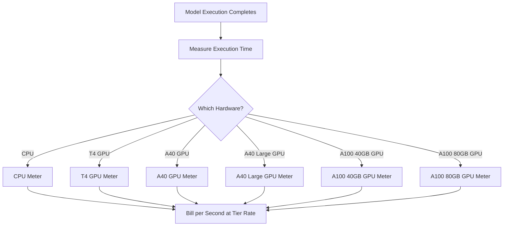

Replicate은 클라우드에서 오픈 소스 머신러닝 모델을 실행하기 위한 플랫폼입니다. 그들의 청구 모델은 AI 업계에서 사용량 기반 가격 책정의 가장 순수한 사례 중 하나입니다. 월간 구독료나 모델 실행당 정액 요금이 존재하지 않습니다. 대신, 정확한 계산 시간(초 단위)을 기반으로 청구하며, 기본 하드웨어에 따라 요율이 달라집니다.

이 접근 방식은 실행 시간이 예측 불가능한 AI 워크로드에 적합합니다. 단일 사용자는 몇 초 동안 가벼운 모델을 실행할 수도 있고 몇 분 동안 거대한 생성 모델을 실행할 수도 있습니다. 비용을 모델 자체가 아닌 컴퓨팅 리소스에 묶음으로써 Replicate은 가격을 투명하고 확장 가능하게 유지합니다.

## Replicate의 청구 방식

Replicate의 가격 책정은 실행 중인 특정 모델과 분리되어 있습니다. SDXL로 이미지를 생성하든 Llama 3를 실행하든 청구는 하드웨어 계층과 실행 시간에 따라 결정됩니다. 이를 통해 각 모델마다 별도의 요금제를 만들 필요 없이 수천 개의 오픈 소스 모델을 호스팅할 수 있습니다.

| Hardware | Price per Second | Price per Hour |
| :--- | :--- | :--- |
| NVIDIA CPU | \$0.000100 | \$0.36 |
| NVIDIA T4 GPU | \$0.000225 | \$0.81 |
| NVIDIA A40 GPU | \$0.000575 | \$2.07 |
| NVIDIA A40 (Large) GPU | \$0.000725 | \$2.61 |
| NVIDIA A100 (40GB) GPU | \$0.001150 | \$4.14 |
| NVIDIA A100 (80GB) GPU | \$0.001400 | \$5.04 |



1. **하드웨어별 요율:** 초당 비용은 필요한 컴퓨트 리소스에 따라 달라집니다. 각 하드웨어 계층마다 가격대가 다릅니다.
2. **순수 사용량 기반 모델:** 월간 요금이나 초과 요금, 제한이 없습니다. 사용자는 세대당이 아니라 "A100에서 12.4초"처럼 정확한 컴퓨트 시간에 대해 청구됩니다.
3. **초 단위 세분화:** 전통적인 클라우드 공급자는 시간이나 분 단위로 청구하여 짧은 작업에서 낭비가 발생합니다. 초 단위 청구는 소규모 실험과 대규모 프로덕션 워크로드 모두에 대해 이 비효율을 없애줍니다.

<Info>
콜드 스타트도 청구 대상입니다. 모델에 대한 첫 요청은 모델을 메모리에 로드하는 데 10~30초가 걸리며, 이 로딩 시간은 실행 시간과 동일한 요율로 청구됩니다.
</Info>
## 무엇이 독특한가

* **하드웨어별 측정:** 동일한 모델이라도 더 나은 하드웨어에서는 비용이 더 높습니다. 사용자는 속도와 비용 중 원하는 것을 선택합니다. T4 GPU는 시간에 민감하지 않은 작업에 적합하고, A100은 실시간 애플리케이션을 처리합니다.
* **초 단위 세분화:** 청구는 초 단위로 계산되므로 짧은 작업에 대해 과금되지 않습니다.
* **구독 없음:** 시작에 대한 약정이 없습니다. 사용량에 따라 무한히 확장되어 스타트업과 다양한 모델을 실험 중인 개발자에게 이상적입니다.
* **모델에 무관:** 청구 로직은 작업 유형(이미지 생성, 텍스트 처리, 오디오 전사, 비디오 합성)에 관계없이 동일합니다. 이를 통해 복잡한 가격표 없이 방대한 모델 생태계를 지원할 수 있습니다.

## Dodo Payments로 구축하기

Dodo Payments의 사용량 기반 청구 기능을 사용하면 이 청구 모델을 복제할 수 있습니다. 핵심은 여러 메터를 사용하여 하드웨어 계층별로 추적하고 단일 제품에 연결하는 것입니다.

<Steps>
  <Step title="Create Usage Meters (One Per Hardware Class)">
    각 하드웨어 계층에 대해 별도의 메터를 만드십시오. 하드웨어 유형마다 초당 비용이 다르기 때문에 독립적인 측정은 Dodo가 각 계층을 개별 가격으로 책정하고 세분화된 청구서를 제공할 수 있게 합니다.

    | Meter Name | Event Name | Aggregation | Property |
    | :--- | :--- | :--- | :--- |
    | CPU Compute | `compute.cpu` | Sum | `execution_seconds` |
    | GPU T4 Compute | `compute.gpu_t4` | Sum | `execution_seconds` |
    | GPU A40 Compute | `compute.gpu_a40` | Sum | `execution_seconds` |
    | GPU A40 Large Compute | `compute.gpu_a40_large` | Sum | `execution_seconds` |
    | GPU A100 40GB Compute | `compute.gpu_a100_40` | Sum | `execution_seconds` |
    | GPU A100 80GB Compute | `compute.gpu_a100_80` | Sum | `execution_seconds` |

    `Sum` 집계는 `execution_seconds` 속성에 대해 청구 기간 동안 하드웨어 계층별 총 컴퓨트 시간을 계산합니다.
  </Step>

  <Step title="Create a Usage-Based Product">
    Dodo Payments 대시보드에서 새 제품을 만드십시오:

    * **가격 유형:** 사용량 기반 청구
    * **기본 가격:** \$0/월 (구독료 없음)
    * **청구 주기:** 월간

    모든 메터를 단위당 가격과 함께 연동하십시오:

    | Meter | Price Per Unit (per second) |
    | :--- | :--- |
    | compute.cpu | \$0.000100 |
    | compute.gpu_t4 | \$0.000225 |
    | compute.gpu_a40 | \$0.000575 |
    | compute.gpu_a40_large | \$0.000725 |
    | compute.gpu_a100_40 | \$0.001150 |
    | compute.gpu_a100_80 | \$0.001400 |

    모든 메터에 대해 **무료 기준**을 0으로 설정하십시오. 실행한 초 단위가 모두 청구 대상입니다.
  </Step>

  <Step title="Send Usage Events">
    모델 실행이 완료될 때마다 Dodo에 사용량 이벤트를 전송하십시오. 각 예측에 대해 고유한 `event_id`를 포함하여 멱등성을 확보하십시오.

    ```typescript
    import DodoPayments from 'dodopayments';

    type HardwareTier = 'cpu' | 'gpu_t4' | 'gpu_a40' | 'gpu_a40_large' | 'gpu_a100_40' | 'gpu_a100_80';

    const client = new DodoPayments({
      bearerToken: process.env.DODO_PAYMENTS_API_KEY,
    });

    async function trackModelExecution(
      customerId: string,
      modelId: string,
      hardware: HardwareTier,
      executionSeconds: number,
      predictionId: string
    ) {
      const eventName = `compute.${hardware}`;

      await client.usageEvents.ingest({
        events: [{
          event_id: `pred_${predictionId}`,
          customer_id: customerId,
          event_name: eventName,
          timestamp: new Date().toISOString(),
          metadata: {
            execution_seconds: executionSeconds,
            model_id: modelId,
            hardware: hardware
          }
        }]
      });
    }

    // Example: SDXL image generation on A100
    await trackModelExecution(
      'cus_abc123',
      'stability-ai/sdxl',
      'gpu_a100_80',
      8.3,  // 8.3 seconds of A100 time
      'pred_xyz789'
    );
    ```

  </Step>

  <Step title="Measure Execution Time Precisely">
    `performance.now()`을 사용해 모델 실행 시간을 정확히 측정하십시오. 청구를 위해 소수점 첫째 자리까지 반올림하십시오.

    ```typescript
    async function runModelWithMetering(
      customerId: string,
      modelId: string,
      hardware: HardwareTier,
      input: Record<string, unknown>
    ) {
      const predictionId = `pred_${Date.now()}`;
      const startTime = performance.now();

      try {
        const result = await executeModel(modelId, input, hardware);
        const executionSeconds = (performance.now() - startTime) / 1000;
        const billedSeconds = Math.round(executionSeconds * 10) / 10;

        await trackModelExecution(
          customerId,
          modelId,
          hardware,
          billedSeconds,
          predictionId
        );

        return result;
      } catch (error) {
        // Still bill for compute time even on failure
        const executionSeconds = (performance.now() - startTime) / 1000;
        if (executionSeconds > 1) {
          await trackModelExecution(
            customerId,
            modelId,
            hardware,
            Math.round(executionSeconds * 10) / 10,
            predictionId
          );
        }
        throw error;
      }
    }
    ```

  </Step>

  <Step title="Create Checkout">
    사용자가 가입할 때, 사용량 기반 제품에 대한 체크아웃 세션을 생성하십시오. Dodo가 정기 청구와 송장을 자동으로 처리합니다.

    ```typescript
    const session = await client.checkoutSessions.create({
      product_cart: [
        { product_id: 'prod_compute_payg', quantity: 1 }
      ],
      customer: { email: 'ml-engineer@company.com' },
      return_url: 'https://yourplatform.com/dashboard'
    });
    ```

  </Step>
</Steps>

## 시간 범위 인게스천 블루프린트로 가속화

[Time Range Ingestion Blueprint](/developer-resources/ingestion-blueprints/time-range)는 초 단위 컴퓨트 추적을 간소화합니다. 하드웨어 계층마다 하나의 인게스천 인스턴스를 만들고, `trackTimeRange`를 사용하여 이벤트 제출을 깔끔하게 처리하십시오.

```bash
npm install @dodopayments/ingestion-blueprints
```

```typescript
import { Ingestion, trackTimeRange } from '@dodopayments/ingestion-blueprints';

// Create one ingestion instance per hardware tier
function createHardwareIngestion(hardware: string) {
  return new Ingestion({
    apiKey: process.env.DODO_PAYMENTS_API_KEY,
    environment: 'live_mode',
    eventName: `compute.${hardware}`,
  });
}

const ingestions: Record<string, Ingestion> = {
  cpu: createHardwareIngestion('cpu'),
  gpu_t4: createHardwareIngestion('gpu_t4'),
  gpu_a40: createHardwareIngestion('gpu_a40'),
  gpu_a40_large: createHardwareIngestion('gpu_a40_large'),
  gpu_a100_40: createHardwareIngestion('gpu_a100_40'),
  gpu_a100_80: createHardwareIngestion('gpu_a100_80'),
};

// Track execution after a model run completes
const startTime = performance.now();
const result = await executeModel(modelId, input, hardware);
const durationMs = performance.now() - startTime;

await trackTimeRange(ingestions[hardware], {
  customerId: customerId,
  durationMs: durationMs,
  metadata: {
    model_id: modelId,
    hardware: hardware,
  },
});
```

이 블루프린트는 기간 형식 지정과 이벤트 구성 작업을 처리합니다. 하드웨어별 인게스천 인스턴스와 결합하면 이 패턴은 Replicate의 다계층 측정 구조를 깔끔하게 매핑합니다.

<Tip>
장시간 실행 작업의 경우, 시간 범위 블루프린트를 간격 기반 하트비트 추적과 결합하십시오. 고급 패턴은 [전체 블루프린트 문서](/developer-resources/ingestion-blueprints/time-range)를 참조하십시오.
</Tip>
## 사용자 비용 추정

사용량 기반 청구는 예측이 어려우므로 사용자가 모델을 실행하기 전에 비용을 추정해주는 것이 좋습니다. 이는 예상치 못한 청구를 줄이고 신뢰를 쌓습니다.

### 예시 비용 계산

| Model | Hardware | Avg Time | Cost Per Run |
| :--- | :--- | :--- | :--- |
| SDXL (image) | A100 80GB | ~8 sec | ~\$0.0112 |
| Llama 3 (text) | A100 40GB | ~3 sec | ~\$0.0035 |
| Whisper (audio) | GPU T4 | ~15 sec | ~\$0.0034 |

### 비용 계산기 구축

```typescript
function estimateCost(hardware: HardwareTier, estimatedSeconds: number): number {
  const rates: Record<HardwareTier, number> = {
    'cpu': 0.000100,
    'gpu_t4': 0.000225,
    'gpu_a40': 0.000575,
    'gpu_a40_large': 0.000725,
    'gpu_a100_40': 0.001150,
    'gpu_a100_80': 0.001400
  };

  return Number((rates[hardware] * estimatedSeconds).toFixed(4));
}

// Show the user before running: "This will cost approximately $0.0098"
const estimate = estimateCost('gpu_a100_80', 8.5);
```

## 엔터프라이즈: 예약 용량

예약된 가용성과 콜드 스타트 방지가 필요한 엔터프라이즈 고객을 위해 Replicate은 고정 시간당 요금의 "Private Instances"를 제공합니다.

Dodo Payments에서는 이를 구독 제품으로 모델링할 수 있습니다:

* **제품 유형:** 구독
* **가격:** 고정 월간 가격(예: "예약 A100 인스턴스 - \$500/월")
* **청구 주기:** 월간

분석 및 모니터링을 위해 계속해서 사용량 이벤트를 전송할 수 있지만, 구독이 비용을 커버합니다. 사용량이 증가함에 따라 종량제에서 예약 용량으로 전환하는 것이 더 비용 효율적일 수 있습니다.

## 고급: 하트비트 측정

수 분 또는 수 시간이 걸리는 작업의 경우 종료 시점에 단일 이벤트를 보내는 것은 위험할 수 있습니다. 프로세스가 실패하면 사용량 데이터가 손실됩니다. 더 나은 접근 방식은 실행 중에 30~60초마다 사용량 이벤트를 보내는 것입니다.

```typescript
async function runLongTaskWithHeartbeat(
  customerId: string,
  modelId: string,
  hardware: HardwareTier
) {
  const predictionId = `pred_${Date.now()}`;
  let totalSeconds = 0;

  const heartbeatInterval = setInterval(async () => {
    try {
      await trackModelExecution(
        customerId,
        modelId,
        hardware,
        30,
        `${predictionId}_${totalSeconds}`
      );
      totalSeconds += 30;
    } catch (error) {
      console.error('Heartbeat tracking failed:', error, { predictionId, totalSeconds });
    }
  }, 30000);

  try {
    await executeLongTask();
  } finally {
    clearInterval(heartbeatInterval);
  }
}
```

## 사용된 주요 Dodo 기능

<CardGroup cols={2}>
  <Card title="Usage-Based Billing" icon="chart-line" href="/features/usage-based-billing/introduction">
    소비 기반 청구 제품을 설정합니다.
  </Card>
  <Card title="Meters" icon="gauge" href="/features/usage-based-billing/meters">
    추적하고 청구하려는 메트릭을 정의합니다.
  </Card>
  <Card title="Event Ingestion" icon="bolt" href="/features/usage-based-billing/event-ingestion">
    실시간으로 Dodo에 사용량 데이터를 전송합니다.
  </Card>
  <Card title="Subscriptions" icon="calendar" href="/features/subscription">
    예약 용량 및 엔터프라이즈 플랜의 정기 청구를 관리합니다.
  </Card>
  <Card title="Time Range Blueprint" icon="clock" href="/developer-resources/ingestion-blueprints/time-range">
    기간 도우미와 함께 초 단위 컴퓨트 추적.
  </Card>
</CardGroup>

<CardGroup cols={2}>
  <Card title="Usage-Based Billing" icon="chart-line" href="/features/usage-based-billing/introduction">
    Set up products that bill based on consumption.
  </Card>
  <Card title="Meters" icon="gauge" href="/features/usage-based-billing/meters">
    Define the metrics you want to track and bill for.
  </Card>
  <Card title="Event Ingestion" icon="bolt" href="/features/usage-based-billing/event-ingestion">
    Send usage data to Dodo in real-time.
  </Card>
  <Card title="Subscriptions" icon="calendar" href="/features/subscription">
    Manage recurring billing for reserved capacity and enterprise plans.
  </Card>
  <Card title="Time Range Blueprint" icon="clock" href="/developer-resources/ingestion-blueprints/time-range">
    Per-second compute tracking with duration helpers.
  </Card>
</CardGroup>
