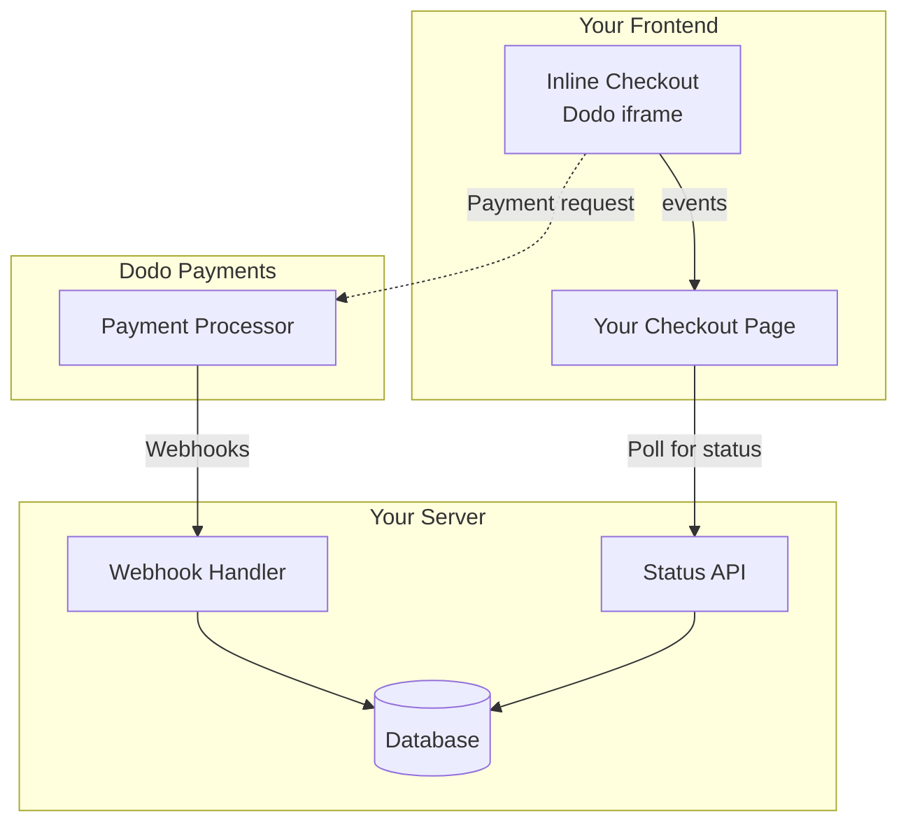

## 개요

인라인 체크아웃을 사용하면 웹사이트나 애플리케이션과 원활하게 통합된 체크아웃 경험을 생성할 수 있습니다. 페이지 위에 모달로 열리는 [오버레이 체크아웃](/developer-resources/overlay-checkout)과 달리, 인라인 체크아웃은 결제 양식을 페이지 레이아웃에 직접 임베드합니다.

인라인 체크아웃을 사용하면 다음을 수행할 수 있습니다:

- 앱이나 웹사이트와 완전히 통합된 체크아웃 경험 생성
- Dodo Payments가 고객 및 결제 정보를 안전하게 캡처하도록 최적화된 체크아웃 프레임 사용
- 페이지에 Dodo Payments의 항목, 총액 및 기타 정보 표시
- SDK 메서드 및 이벤트를 사용하여 고급 체크아웃 경험 구축

<Frame>
    
</Frame>

## 작동 방식

인라인 체크아웃은 웹사이트나 앱에 안전한 Dodo Payments 프레임을 임베드하여 작동합니다.

체크아웃 프레임은 고객 정보를 수집하고 결제 세부 정보를 캡처하는 역할을 합니다. 페이지는 항목 목록, 총액 및 체크아웃에서 변경할 수 있는 옵션을 표시합니다. SDK를 사용하면 페이지와 체크아웃 프레임이 상호작용할 수 있습니다.

Dodo Payments는 체크아웃이 완료되면 자동으로 구독을 생성하여 프로비저닝할 준비를 합니다.

<Note>
인라인 체크아웃 프레임은 모든 민감한 결제 정보를 안전하게 처리하여 귀하의 추가 인증 없이 PCI 준수를 보장합니다.
</Note>

## 좋은 인라인 체크아웃의 조건

고객이 누구에게서 구매하고 있는지, 무엇을 구매하고 있는지, 얼마를 지불하고 있는지 아는 것이 중요합니다.

준수 및 전환 최적화를 위한 인라인 체크아웃을 구축하려면 구현에 다음이 포함되어야 합니다:

<Frame caption="필수 요소가 표시된 인라인 체크아웃 레이아웃 예시">
    
</Frame>

1. **정기 정보**: 정기적인 경우, 얼마나 자주 반복되는지 및 갱신 시 지불할 총액. 체험판인 경우, 체험판 기간.
2. **항목 설명**: 구매하는 항목에 대한 설명.
3. **거래 총액**: 거래 총액, 포함된 소계, 총 세금 및 총합. 통화도 포함해야 합니다.
4. **Dodo Payments 바닥글**: Dodo Payments에 대한 정보, 판매 조건 및 개인정보 보호정책이 포함된 전체 인라인 체크아웃 프레임.
5. **환불 정책**: Dodo Payments의 표준 환불 정책과 다를 경우 환불 정책에 대한 링크.

<Warning>
법적 정보를 제거하거나 숨기는 것은 준수 요구 사항을 위반하므로 항상 전체 인라인 체크아웃 프레임을 표시해야 합니다.
</Warning>

## 고객 여정

체크아웃 흐름은 체크아웃 세션 구성에 따라 결정됩니다. 체크아웃 세션을 구성하는 방식에 따라 고객은 모든 정보를 단일 페이지에서 또는 여러 단계에 걸쳐 제공받는 체크아웃을 경험하게 됩니다.

<Steps>
<Step title="고객이 체크아웃을 엽니다">

아이템이나 기존 거래를 전달하여 인라인 체크아웃을 열 수 있습니다. SDK를 사용하여 페이지 정보를 표시하고 업데이트하며, 고객 상호작용에 따라 아이템을 업데이트하는 SDK 메서드를 사용하세요.
    

</Step>

<Step title="고객이 세부 정보를 입력합니다">

인라인 체크아웃은 먼저 고객에게 이메일 주소를 입력하고, 국가를 선택하며, (필요한 경우) 우편번호를 입력하도록 요청합니다. 이 단계에서는 세금 및 사용 가능한 결제 옵션을 결정하는 데 필요한 모든 정보를 수집합니다.

고객 세부 정보를 미리 채우고 저장된 주소를 제시하여 경험을 간소화할 수 있습니다.

</Step>

<Step title="고객이 결제 방법을 선택합니다">

세부 정보를 입력한 후 고객은 사용 가능한 결제 방법과 결제 양식을 제시받습니다. 옵션에는 신용 카드, 직불 카드, PayPal, Apple Pay, Google Pay 및 고객의 위치에 따라 다른 지역 결제 방법이 포함될 수 있습니다.

가능한 경우 저장된 결제 방법을 표시하여 체크아웃 속도를 높입니다.


</Step>

<Step title="체크아웃 완료">

Dodo Payments는 모든 결제를 해당 판매에 가장 적합한 인수자에게 라우팅하여 성공 가능성을 극대화합니다. 고객은 귀하가 구축할 수 있는 성공 워크플로우로 들어갑니다.


</Step>

<Step title="Dodo Payments가 구독을 생성합니다">

Dodo Payments는 고객을 위해 자동으로 구독을 생성하여 귀하가 프로비저닝할 준비를 합니다. 고객이 사용한 결제 방법은 갱신 또는 구독 변경을 위해 파일에 보관됩니다.


</Step>
</Steps>

## 빠른 시작

몇 줄의 코드로 Dodo Payments 인라인 체크아웃을 시작하세요:

```typescript
import { DodoPayments } from "dodopayments-checkout";

// Initialize the SDK for inline mode
DodoPayments.Initialize({
  mode: "test",
  displayType: "inline",
  onEvent: (event) => {
    console.log("Checkout event:", event);
  },
});

// Open checkout in a specific container
DodoPayments.Checkout.open({
  checkoutUrl: "https://test.dodopayments.com/session/cks_123",
  elementId: "dodo-inline-checkout" // ID of the container element
});
```

<Tip>
페이지에 해당 `id`가 있는 컨테이너 요소가 있는지 확인하세요: `<div id="dodo-inline-checkout"></div>`.
</Tip>

## 단계별 통합 가이드

<Steps>
<Step title="SDK 설치">

Dodo Payments Checkout SDK를 설치하세요:

<CodeGroup>

```bash npm
npm install dodopayments-checkout
```

```bash yarn
yarn add dodopayments-checkout
```

```bash pnpm
pnpm add dodopayments-checkout
```

</CodeGroup>

</Step>

<Step title="인라인 표시를 위한 SDK 초기화">

SDK를 초기화하고 `displayType: 'inline'`를 지정하세요. 또한, UI를 실시간 세금 및 총 계산으로 업데이트하기 위해 `checkout.breakdown` 이벤트를 수신해야 합니다.

```typescript
import { DodoPayments } from "dodopayments-checkout";

DodoPayments.Initialize({
  mode: "test",
  displayType: "inline",
  onEvent: (event) => {
    if (event.event_type === "checkout.breakdown") {
      const breakdown = event.data?.message;
      // Update your UI with breakdown.subTotal, breakdown.tax, breakdown.total, etc.
    }
  },
});
```

</Step>

<Step title="컨테이너 요소 만들기">

체크아웃 프레임이 삽입될 HTML 요소를 추가하세요:

```html
<div id="dodo-inline-checkout"></div>
```

</Step>

<Step title="체크아웃 열기">

`DodoPayments.Checkout.open()`를 호출하고, 컨테이너의 `checkoutUrl`와 `elementId`를 전달하세요:

```typescript
DodoPayments.Checkout.open({
  checkoutUrl: "https://test.dodopayments.com/session/cks_123",
  elementId: "dodo-inline-checkout"
});
```

</Step>

<Step title="통합 테스트">

1. 개발 서버를 시작하세요:

```bash
npm run dev
```

2. 체크아웃 흐름을 테스트하세요:
   - 인라인 프레임에 이메일 및 주소 세부 정보를 입력하세요.
   - 사용자 정의 주문 요약이 실시간으로 업데이트되는지 확인하세요.
   - 테스트 자격 증명을 사용하여 결제 흐름을 테스트하세요.
   - 리디렉션이 올바르게 작동하는지 확인하세요.

<Check>
콘솔 로그를 `onEvent` 콜백에 추가했다면, 브라우저 콘솔에 `checkout.breakdown` 이벤트가 기록되는 것을 볼 수 있어야 합니다.
</Check>

</Step>

<Step title="라이브로 전환">

프로덕션 준비가 되었을 때:

1. 모드를 `'live'`로 변경하세요:

```typescript
DodoPayments.Initialize({
  mode: "live",
  displayType: "inline",
  onEvent: (event) => {
    // Handle events
  }
});
```

2. 체크아웃 URL을 백엔드에서 라이브 체크아웃 세션을 사용하도록 업데이트하세요.
3. 프로덕션에서 전체 흐름을 테스트하세요.

</Step>
</Steps>

## 완전한 React 예제

이 예제는 인라인 체크아웃과 함께 사용자 정의 주문 요약을 구현하는 방법을 보여주며, `checkout.breakdown` 이벤트를 사용하여 동기화합니다.

```tsx
"use client";

import { useEffect, useState } from 'react';
import { DodoPayments, CheckoutBreakdownData } from 'dodopayments-checkout';

export default function CheckoutPage() {
  const [breakdown, setBreakdown] = useState<Partial<CheckoutBreakdownData>>({});

  useEffect(() => {
    // 1. Initialize the SDK
    DodoPayments.Initialize({
      mode: 'test',
      displayType: 'inline',
      onEvent: (event) => {
        // 2. Listen for the 'checkout.breakdown' event
        if (event.event_type === "checkout.breakdown") {
          const message = event.data?.message as CheckoutBreakdownData;
          if (message) setBreakdown(message);
        }
      }
    });

    // 3. Open the checkout in the specified container
    DodoPayments.Checkout.open({
      checkoutUrl: 'https://test.dodopayments.com/session/cks_123',
      elementId: 'dodo-inline-checkout'
    });

    return () => DodoPayments.Checkout.close();
  }, []);

  const format = (amt: number | null | undefined, curr: string | null | undefined) => 
    amt != null && curr ? `${curr} ${(amt/100).toFixed(2)}` : '0.00';

  const currency = breakdown.currency ?? breakdown.finalTotalCurrency ?? '';

  return (
    <div className="flex flex-col md:flex-row min-h-screen">
      {/* Left Side - Checkout Form */}
      <div className="w-full md:w-1/2 flex items-center">
        <div id="dodo-inline-checkout" className='w-full' />
      </div>

      {/* Right Side - Custom Order Summary */}
      <div className="w-full md:w-1/2 p-8 bg-gray-50">
        <h2 className="text-2xl font-bold mb-4">Order Summary</h2>
        <div className="space-y-2">
          {breakdown.subTotal && (
            <div className="flex justify-between">
              <span>Subtotal</span>
              <span>{format(breakdown.subTotal, currency)}</span>
            </div>
          )}
          {breakdown.discount && (
            <div className="flex justify-between">
              <span>Discount</span>
              <span>{format(breakdown.discount, currency)}</span>
            </div>
          )}
          {breakdown.tax != null && (
            <div className="flex justify-between">
              <span>Tax</span>
              <span>{format(breakdown.tax, currency)}</span>
            </div>
          )}
          <hr />
          {(breakdown.finalTotal ?? breakdown.total) && (
            <div className="flex justify-between font-bold text-xl">
              <span>Total</span>
              <span>{format(breakdown.finalTotal ?? breakdown.total, breakdown.finalTotalCurrency ?? currency)}</span>
            </div>
          )}
        </div>
      </div>
    </div>
  );
}

```

## API 참조

### 구성

#### 초기화 옵션

```typescript
interface InitializeOptions {
  mode: "test" | "live";
  displayType: "inline"; // Required for inline checkout
  onEvent: (event: CheckoutEvent) => void;
}
```

| 옵션 | 유형 | 필수 | 설명 |
|--------|------|----------|-------------|
| `mode` | `"test" \| "live"` | 예 | 환경 모드. |
| `displayType` | `"inline" \| "overlay"` | 예 | 체크아웃을 포함하기 위해 `"inline"`로 설정해야 합니다. |
| `onEvent` | `function` | 예 | 체크아웃 이벤트를 처리하기 위한 콜백 함수. |

#### 체크아웃 옵션

```typescript
export type FontSize = "xs" | "sm" | "md" | "lg" | "xl" | "2xl";
export type FontWeight = "normal" | "medium" | "bold" | "extraBold";

interface CheckoutOptions {
  checkoutUrl: string;
  elementId: string; // Required for inline checkout
  options?: {
    showTimer?: boolean;
    showSecurityBadge?: boolean;
    manualRedirect?: boolean;
    themeConfig?: ThemeConfig;
    payButtonText?: string;
    fontSize?: FontSize;
    fontWeight?: FontWeight;
  };
}
```

| 옵션 | 유형 | 필수 | 설명 |
|--------|------|----------|-------------|
| `checkoutUrl` | `string` | 예 | 체크아웃 세션 URL. |
| `elementId` | `string` | 예 | 체크아웃이 렌더링되어야 하는 DOM 요소의 `id`. |
| `options.showTimer` | `boolean` | 아니요 | 체크아웃 타이머를 표시하거나 숨깁니다. 기본값은 `true`입니다. 비활성화하면 세션이 만료될 때 `checkout.link_expired` 이벤트를 받게 됩니다. |
| `options.showSecurityBadge` | `boolean` | 아니요 | 보안 배지를 표시하거나 숨깁니다. 기본값은 `true`입니다. |
| `options.manualRedirect` | `boolean` | 아니요 | 활성화되면 체크아웃이 완료 후 자동으로 리디렉션되지 않습니다. 대신, 리디렉션을 직접 처리하기 위해 `checkout.status` 및 `checkout.redirect_requested` 이벤트를 받게 됩니다. |
| `options.themeConfig` | `ThemeConfig` | 아니요 | 사용자 정의 테마 구성. |
| `options.payButtonText` | `string` | 아니요 | 결제 버튼에 표시할 사용자 정의 텍스트. |
| `options.fontSize` | `FontSize` | 아니요 | 체크아웃의 전역 글꼴 크기. |
| `options.fontWeight` | `FontWeight` | 아니요 | 체크아웃의 전역 글꼴 두께. |

### 메서드

#### 체크아웃 열기

지정된 컨테이너에서 체크아웃 프레임을 엽니다.

```typescript
DodoPayments.Checkout.open({
  checkoutUrl: "https://test.dodopayments.com/session/cks_123",
  elementId: "dodo-inline-checkout"
});
```

체크아웃 동작을 사용자 정의하기 위해 추가 옵션을 전달할 수도 있습니다:

```typescript
DodoPayments.Checkout.open({
  checkoutUrl: "https://test.dodopayments.com/session/cks_123",
  elementId: "dodo-inline-checkout",
  options: {
    showTimer: false,
    showSecurityBadge: false,
    manualRedirect: true,
    payButtonText: "Pay Now",
  },
});
```

`manualRedirect`을 사용할 때, 체크아웃 완료를 `onEvent` 콜백에서 처리하세요:

```typescript
DodoPayments.Initialize({
  mode: "test",
  displayType: "inline",
  onEvent: (event) => {
    if (event.event_type === "checkout.status") {
      const status = event.data?.message?.status;
      // Handle status: "succeeded", "failed", or "processing"
    }
    if (event.event_type === "checkout.redirect_requested") {
      const redirectUrl = event.data?.message?.redirect_to;
      // Redirect the customer manually
      window.location.href = redirectUrl;
    }
    if (event.event_type === "checkout.link_expired") {
      // Handle expired checkout session
    }
  },
});
```

#### 체크아웃 닫기

프로그래밍적으로 체크아웃 프레임을 제거하고 이벤트 리스너를 정리합니다.

```typescript
DodoPayments.Checkout.close();
```

#### 상태 확인

현재 체크아웃 프레임이 주입되었는지 여부를 반환합니다.

```typescript
const isOpen = DodoPayments.Checkout.isOpen();
// Returns: boolean
```

### 이벤트

SDK는 `onEvent` 콜백을 통해 실시간 이벤트를 제공합니다. 인라인 체크아웃의 경우, `checkout.breakdown`가 UI 동기화에 특히 유용합니다.

| 이벤트 유형 | 설명 |
|------------|-------------|
| `checkout.opened` | 체크아웃 프레임이 로드되었습니다. |
| `checkout.breakdown` | 가격, 세금 또는 할인 업데이트 시 발생합니다. |
| `checkout.customer_details_submitted` | 고객 세부정보가 제출되었습니다. |
| `checkout.pay_button_clicked` | 고객이 결제 버튼을 클릭할 때 발생합니다. 분석 및 전환 퍼널 추적에 유용합니다. |
| `checkout.redirect` | 체크아웃이 리디렉션을 수행합니다(예: 은행 페이지로). |
| `checkout.error` | 체크아웃 중 오류가 발생했습니다. |
| `checkout.link_expired` | 체크아웃 세션이 만료될 때 발생합니다. `showTimer`가 `false`로 설정된 경우에만 수신됩니다. |
| `checkout.status` | `manualRedirect`가 활성화되었을 때 발생합니다. 체크아웃 상태(`succeeded`, `failed` 또는 `processing`)를 포함합니다. |
| `checkout.redirect_requested` | `manualRedirect`가 활성화되었을 때 발생합니다. 고객을 리디렉션할 URL을 포함합니다. |

#### 체크아웃 세부정보 데이터

`checkout.breakdown` 이벤트는 다음 데이터를 제공합니다:

```typescript
interface CheckoutBreakdownData {
  subTotal?: number;          // Amount in cents
  discount?: number;         // Amount in cents
  tax?: number;              // Amount in cents
  total?: number;            // Amount in cents
  currency?: string;         // e.g., "USD"
  finalTotal?: number;       // Final amount including adjustments
  finalTotalCurrency?: string; // Currency for the final total
}
```

#### 체크아웃 상태 이벤트 데이터

`manualRedirect`가 활성화되면, 다음 데이터를 포함한 `checkout.status` 이벤트를 수신합니다:

```typescript
interface CheckoutStatusEventData {
  message: {
    status?: "succeeded" | "failed" | "processing";
  };
}
```

#### 체크아웃 리디렉션 요청 이벤트 데이터

`manualRedirect`가 활성화되면, 다음 데이터를 포함한 `checkout.redirect_requested` 이벤트를 수신합니다:

```typescript
interface CheckoutRedirectRequestedEventData {
  message: {
    redirect_to?: string;
  };
}
```

#### 이벤트 이해하기

`checkout.breakdown` 이벤트는 애플리케이션의 UI를 Dodo Payments 체크아웃 상태와 동기화하는 주요 방법입니다.

**발생 시점:**
- **초기화 시**: 체크아웃 프레임이 로드되고 준비된 직후.
- **주소 변경 시**: 고객이 세금 재계산을 초래하는 국가를 선택하거나 우편번호를 입력할 때마다.

**필드 세부정보:**

| 필드 | 설명 |
|-------|-------------|
| `subTotal` | 할인이나 세금이 적용되기 전 세션의 모든 항목의 합계. |
| `discount` | 적용된 모든 할인 총액. |
| `tax` | 계산된 세금 금액. `inline` 모드에서는 사용자가 주소 필드와 상호작용할 때 동적으로 업데이트됩니다. |
| `total` | 세션의 기본 통화로 `subTotal - discount + tax`의 수학적 결과. |
| `currency` | 표준 소계, 할인 및 세금 값에 대한 ISO 통화 코드(예: `"USD"`). |
| `finalTotal` | 고객이 실제로 청구되는 금액. 이는 기본 가격 분해의 일부가 아닌 추가 외환 조정 또는 현지 결제 방법 수수료를 포함할 수 있습니다. |
| `finalTotalCurrency` | 고객이 실제로 지불하는 통화. 이는 구매력 평형 또는 현지 통화 변환이 활성화된 경우 `currency`와 다를 수 있습니다. |

**주요 통합 팁:**

1.  **통화 형식**: 가격은 항상 가장 작은 통화 단위(예: USD의 센트, JPY의 엔)로 정수로 반환됩니다. 표시하려면 100(또는 적절한 10의 거듭제곱)으로 나누거나 `Intl.NumberFormat`와 같은 형식 라이브러리를 사용하세요.
2.  **초기 상태 처리**: 체크아웃이 처음 로드될 때, `tax` 및 `discount`는 사용자가 청구 정보를 제공하거나 코드를 적용할 때까지 `0` 또는 `null`일 수 있습니다. UI는 이러한 상태를 우아하게 처리해야 합니다(예: 대시 `—`를 표시하거나 행을 숨김).
3.  **"최종 총액" 대 "총액"**: `total`는 표준 가격 계산을 제공하지만, `finalTotal`는 거래의 진실한 출처입니다. `finalTotal`가 존재하면, 고객의 카드에 청구될 금액을 정확히 반영하며, 동적 조정이 포함됩니다.
4.  **실시간 피드백**: `tax` 필드를 사용하여 세금이 실시간으로 계산되고 있음을 사용자에게 보여줍니다. 이는 체크아웃 페이지에 "실시간" 느낌을 제공하고 주소 입력 단계에서 마찰을 줄입니다.

## 구현 옵션

### 패키지 관리자 설치

npm, yarn 또는 pnpm을 통해 [단계별 통합 가이드](#step-by-step-integration-guide)와 같이 설치합니다.

### CDN 구현

빌드 단계 없이 빠른 통합을 위해 CDN을 사용할 수 있습니다:

```html
<!DOCTYPE html>
<html lang="en">
<head>
    <meta charset="UTF-8">
    <meta name="viewport" content="width=device-width, initial-scale=1.0">
    <title>Dodo Payments Inline Checkout</title>
    
    <!-- Load DodoPayments -->
    <script src="https://cdn.jsdelivr.net/npm/dodopayments-checkout@latest/dist/index.js"></script>
    <script>
        // Initialize the SDK
        DodoPaymentsCheckout.DodoPayments.Initialize({
            mode: "test",
            displayType: "inline",
            onEvent: (event) => {
                console.log('Checkout event:', event);
            }
        });
    </script>
</head>
<body>
    <div id="dodo-inline-checkout"></div>

    <script>
        // Open the checkout
        DodoPaymentsCheckout.DodoPayments.Checkout.open({
            checkoutUrl: "https://test.dodopayments.com/session/cks_123",
            elementId: "dodo-inline-checkout"
        });
    </script>
</body>
</html>
```

### 테마 사용자 정의

체크아웃 모양을 사용자 정의하려면, 체크아웃을 열 때 `options` 매개변수에 `themeConfig` 객체를 전달하세요. 테마 구성은 밝은 모드와 어두운 모드를 모두 지원하여 색상, 테두리, 텍스트, 버튼 및 테두리 반경을 사용자 정의할 수 있습니다.

#### 기본 테마 구성

```typescript
DodoPayments.Checkout.open({
  checkoutUrl: "https://checkout.dodopayments.com/session/cks_123",
  options: {
    themeConfig: {
      light: {
        bgPrimary: "#FFFFFF",
        textPrimary: "#344054",
        buttonPrimary: "#A6E500",
      },
      dark: {
        bgPrimary: "#0D0D0D",
        textPrimary: "#FFFFFF",
        buttonPrimary: "#A6E500",
      },
      radius: "8px",
    },
  },
});
```

#### 전체 테마 구성

사용 가능한 모든 테마 속성:

```typescript
DodoPayments.Checkout.open({
  checkoutUrl: "https://checkout.dodopayments.com/session/cks_123",
  options: {
    themeConfig: {
      light: {
        // Background colors
        bgPrimary: "#FFFFFF",        // Primary background color
        bgSecondary: "#F9FAFB",      // Secondary background color (e.g., tabs)
        
        // Border colors
        borderPrimary: "#D0D5DD",     // Primary border color
        borderSecondary: "#6B7280",  // Secondary border color
        inputFocusBorder: "#D0D5DD", // Input focus border color
        
        // Text colors
        textPrimary: "#344054",       // Primary text color
        textSecondary: "#6B7280",    // Secondary text color
        textPlaceholder: "#667085",  // Placeholder text color
        textError: "#D92D20",        // Error text color
        textSuccess: "#10B981",      // Success text color
        
        // Button colors
        buttonPrimary: "#A6E500",           // Primary button background
        buttonPrimaryHover: "#8CC500",      // Primary button hover state
        buttonTextPrimary: "#0D0D0D",       // Primary button text color
        buttonSecondary: "#F3F4F6",         // Secondary button background
        buttonSecondaryHover: "#E5E7EB",     // Secondary button hover state
        buttonTextSecondary: "#344054",     // Secondary button text color
      },
      dark: {
        // Background colors
        bgPrimary: "#0D0D0D",
        bgSecondary: "#1A1A1A",
        
        // Border colors
        borderPrimary: "#323232",
        borderSecondary: "#D1D5DB",
        inputFocusBorder: "#323232",
        
        // Text colors
        textPrimary: "#FFFFFF",
        textSecondary: "#909090",
        textPlaceholder: "#9CA3AF",
        textError: "#F97066",
        textSuccess: "#34D399",
        
        // Button colors
        buttonPrimary: "#A6E500",
        buttonPrimaryHover: "#8CC500",
        buttonTextPrimary: "#0D0D0D",
        buttonSecondary: "#2A2A2A",
        buttonSecondaryHover: "#3A3A3A",
        buttonTextSecondary: "#FFFFFF",
      },
      radius: "8px", // Border radius for inputs, buttons, and tabs
    },
  },
});
```

#### 밝은 모드 전용

밝은 테마만 사용자 정의하려면:

```typescript
DodoPayments.Checkout.open({
  checkoutUrl: "https://checkout.dodopayments.com/session/cks_123",
  options: {
    themeConfig: {
      light: {
        bgPrimary: "#FFFFFF",
        textPrimary: "#000000",
        buttonPrimary: "#0070F3",
      },
      radius: "12px",
    },
  },
});
```

#### 어두운 모드 전용

어두운 테마만 사용자 정의하려면:

```typescript
DodoPayments.Checkout.open({
  checkoutUrl: "https://checkout.dodopayments.com/session/cks_123",
  options: {
    themeConfig: {
      dark: {
        bgPrimary: "#000000",
        textPrimary: "#FFFFFF",
        buttonPrimary: "#0070F3",
      },
      radius: "12px",
    },
  },
});
```

#### 부분 테마 재정의

특정 속성만 재정의할 수 있습니다. 체크아웃은 지정하지 않은 속성에 대해 기본값을 사용합니다:

```typescript
DodoPayments.Checkout.open({
  checkoutUrl: "https://checkout.dodopayments.com/session/cks_123",
  options: {
    themeConfig: {
      light: {
        buttonPrimary: "#FF6B6B", // Only override primary button color
      },
      radius: "16px", // Override border radius
    },
  },
});
```

#### 다른 옵션과 함께하는 테마 구성

테마 구성을 다른 체크아웃 옵션과 결합할 수 있습니다:

```typescript
DodoPayments.Checkout.open({
  checkoutUrl: "https://checkout.dodopayments.com/session/cks_123",
  options: {
    showTimer: true,
    showSecurityBadge: true,
    manualRedirect: false,
    themeConfig: {
      light: {
        bgPrimary: "#FFFFFF",
        buttonPrimary: "#A6E500",
      },
      dark: {
        bgPrimary: "#0D0D0D",
        buttonPrimary: "#A6E500",
      },
      radius: "8px",
    },
  },
});
```

#### TypeScript 타입

TypeScript 사용자를 위해 모든 테마 구성 타입이 내보내집니다:

```typescript
import { ThemeConfig, ThemeModeConfig } from "dodopayments-checkout";

const themeConfig: ThemeConfig = {
  light: {
    bgPrimary: "#FFFFFF",
    // ... other properties
  },
  dark: {
    bgPrimary: "#0D0D0D",
    // ... other properties
  },
  radius: "8px",
};
```

## 오류 처리

SDK는 이벤트 시스템을 통해 자세한 오류 정보를 제공합니다. 항상 `onEvent` 콜백에서 적절한 오류 처리를 구현하세요:

```typescript
DodoPayments.Initialize({
  mode: "test",
  displayType: "inline",
  onEvent: (event: CheckoutEvent) => {
    if (event.event_type === "checkout.error") {
      console.error("Checkout error:", event.data?.message);
      // Handle error appropriately
    }
  }
});
```

<Warning>
문제가 발생할 때 좋은 사용자 경험을 제공하기 위해 항상 `checkout.error` 이벤트를 처리하세요.
</Warning>

## 모범 사례

1. **반응형 디자인**: 컨테이너 요소에 충분한 너비와 높이가 있는지 확인하세요. iframe은 일반적으로 컨테이너를 채우도록 확장됩니다.
2. **동기화**: `checkout.breakdown` 이벤트를 사용하여 사용자 정의 주문 요약 또는 가격표를 체크아웃 프레임에서 사용자가 보는 것과 동기화하세요.
3. **스켈레톤 상태**: `checkout.opened` 이벤트가 발생할 때까지 컨테이너에 로딩 표시기를 표시하세요.
4. **정리**: 구성 요소가 언마운트될 때 `DodoPayments.Checkout.close()`를 호출하여 iframe 및 이벤트 리스너를 정리하세요.

<Info>
어두운 모드 구현의 경우, 인라인 체크아웃 프레임과 최적의 시각적 통합을 위해 배경 색상으로 `#0d0d0d`를 사용하는 것이 좋습니다.
</Info>

## 결제 상태 검증

<Warning>
결제 성공 또는 실패를 결정하기 위해 인라인 체크아웃 이벤트에만 의존하지 마세요. 항상 웹훅 및/또는 폴링을 사용하여 서버 측 검증을 구현하세요.
</Warning>

### 서버 측 검증이 필수적인 이유

인라인 체크아웃 이벤트인 `checkout.status`는 실시간 피드백을 제공하지만, 결제 상태에 대한 유일한 진실의 출처가 되어서는 안 됩니다. 네트워크 문제, 브라우저 충돌 또는 사용자가 페이지를 닫는 경우 이벤트가 누락될 수 있습니다. 신뢰할 수 있는 결제 검증을 보장하기 위해:

1. **서버가 웹훅 이벤트를 수신해야 합니다** - Dodo Payments는 결제 상태 변경에 대한 웹훅을 보냅니다.
2. **폴링 메커니즘을 구현하세요** - 프론트엔드는 결제 상태 업데이트를 위해 서버를 폴링해야 합니다.
3. **두 가지 접근 방식을 결합하세요** - 웹훅을 기본 출처로 사용하고 폴링을 백업으로 사용하세요.

### 권장 아키텍처



### 구현 단계

**1. 체크아웃 이벤트 수신** - 사용자가 결제 버튼을 클릭할 때 상태를 확인할 준비를 시작하세요:

```typescript
onEvent: (event) => {
  if (event.event_type === 'checkout.status') {
    // Start polling your server for confirmed status
    startPolling();
  }
}
```

**2. 서버 폴링** - 결제 상태를 확인하기 위해 데이터베이스를 확인하는 엔드포인트를 생성하세요(웹훅에 의해 업데이트됨):

```typescript
// Poll every 2 seconds until status is confirmed
const interval = setInterval(async () => {
  const { status } = await fetch(`/api/payments/${paymentId}/status`).then(r => r.json());
  if (status === 'succeeded' || status === 'failed') {
    clearInterval(interval);
    handlePaymentResult(status);
  }
}, 2000);
```

**3. 서버 측 웹훅 처리** - Dodo가 `payment.succeeded` 또는 `payment.failed` 웹훅을 보낼 때 데이터베이스를 업데이트하세요. 자세한 내용은 [웹훅 문서](/developer-resources/webhooks)를 참조하세요.

### 리디렉션 처리 (3DS, Google Pay, UPI)

`manualRedirect: true`를 사용할 때, 특정 결제 방법은 인증을 위해 사용자를 페이지에서 리디렉션해야 합니다:

- **3D 보안 (3DS)** - 카드 인증
- **Google Pay** - 일부 흐름에서 지갑 인증
- **UPI** - 인도 결제 방법 리디렉션

리디렉션이 필요한 경우, `checkout.redirect_requested` 이벤트를 수신합니다. 제공된 URL로 사용자를 리디렉션하세요:

```typescript
if (event.event_type === 'checkout.redirect_requested') {
  const redirectUrl = event.data?.message?.redirect_to;
  // Save payment ID before redirect, then redirect
  sessionStorage.setItem('pendingPaymentId', paymentId);
  window.location.href = redirectUrl;
}
```

인증이 완료되면(성공 또는 실패), 사용자는 페이지로 돌아옵니다. **사용자가 돌아왔다고 해서 성공이라고 가정하지 마세요.** 대신:

1. 사용자가 리디렉션에서 돌아오는지 확인하세요(예: `sessionStorage`를 통해)
2. 확인된 결제 상태를 위해 서버를 폴링하기 시작하세요
3. 폴링하는 동안 "결제 확인 중..." 상태를 표시하세요
4. 서버에서 확인된 상태에 따라 성공/실패 UI를 표시하세요

<Tip>
리디렉션 후 결제 상태를 항상 서버 측에서 확인하세요. 사용자가 페이지로 돌아오는 것은 인증이 완료되었음을 의미할 뿐, 결제가 성공했는지 실패했는지를 나타내지 않습니다.
</Tip>

## 문제 해결

<AccordionGroup>
<Accordion title="체크아웃 프레임이 나타나지 않음">
- `elementId`가 실제로 DOM에 존재하는 `id`와 일치하는지 확인하세요.
- `displayType: 'inline'`가 `Initialize`에 전달되었는지 확인하세요.
- `checkoutUrl`가 유효한지 확인하세요.
</Accordion>

<Accordion title="세금이 내 UI에서 업데이트되지 않음">
- `checkout.breakdown` 이벤트를 수신하고 있는지 확인하세요.
- 세금은 사용자가 체크아웃 프레임에 유효한 국가 및 우편번호를 입력한 후에만 계산됩니다.
</Accordion>
</AccordionGroup>

## Apple Pay 활성화

Apple Pay는 고객이 저장된 결제 방법을 사용하여 빠르고 안전하게 결제를 완료할 수 있도록 합니다. 활성화되면 고객은 지원되는 장치에서 체크아웃 오버레이에서 직접 Apple Pay 모달을 시작할 수 있습니다.

<Info>
Apple Pay는 iOS 17+, iPadOS 17+ 및 macOS의 Safari 17+에서 지원됩니다.
</Info>

생산 환경에서 도메인에 대해 Apple Pay를 활성화하려면 다음 단계를 따르세요:

<Steps>
<Step title="Apple Pay 도메인 연결 파일 다운로드 및 업로드">

[Apple Pay 도메인 연결 파일](http://checkout.dodopayments.com/.well-known/apple-developer-merchantid-domain-association)을 다운로드하세요.

파일을 `/.well-known/apple-developer-merchantid-domain-association`에 있는 웹 서버에 업로드하세요. 예를 들어, 웹사이트가 `example.com`인 경우, 파일을 `https://example.com/well-known/apple-developer-merchantid-domain-association`에서 사용할 수 있도록 하세요.

</Step>

<Step title="Apple Pay 활성화 요청">

**support@dodopayments.com**에 다음 정보를 포함하여 이메일을 보내세요:

- 귀하의 생산 도메인 URL(예: `https://example.com`)
- 귀하의 도메인에 대해 Apple Pay를 활성화해 달라는 요청

<Check>
Apple Pay가 귀하의 도메인에 대해 활성화되면 1-2 영업일 이내에 확인을 받게 됩니다.
</Check>

</Step>

<Step title="Apple Pay 가용성 확인">

확인을 받은 후 체크아웃에서 Apple Pay를 테스트하세요:

1. 지원되는 장치(iOS 17+, iPadOS 17+ 또는 macOS의 Safari 17+)에서 체크아웃을 엽니다.
2. Apple Pay 버튼이 결제 옵션으로 나타나는지 확인하세요.
3. 결제 흐름을 완전히 테스트하세요.

</Step>
</Steps>

<Warning>
Apple Pay는 생산 환경에서 결제 옵션으로 나타나기 전에 귀하의 도메인에 대해 활성화되어야 합니다. Apple Pay를 제공할 계획이라면 라이브로 전환하기 전에 지원팀에 문의하세요.
</Warning>

## 브라우저 지원

Dodo Payments Checkout SDK는 다음 브라우저를 지원합니다:
