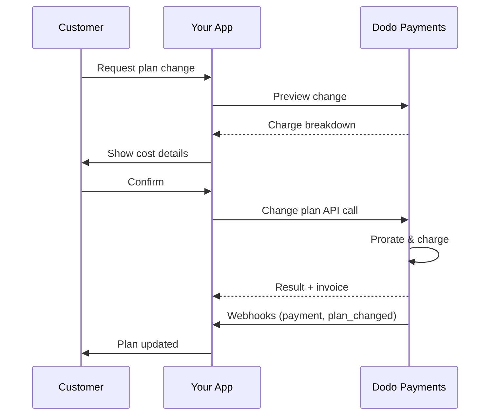
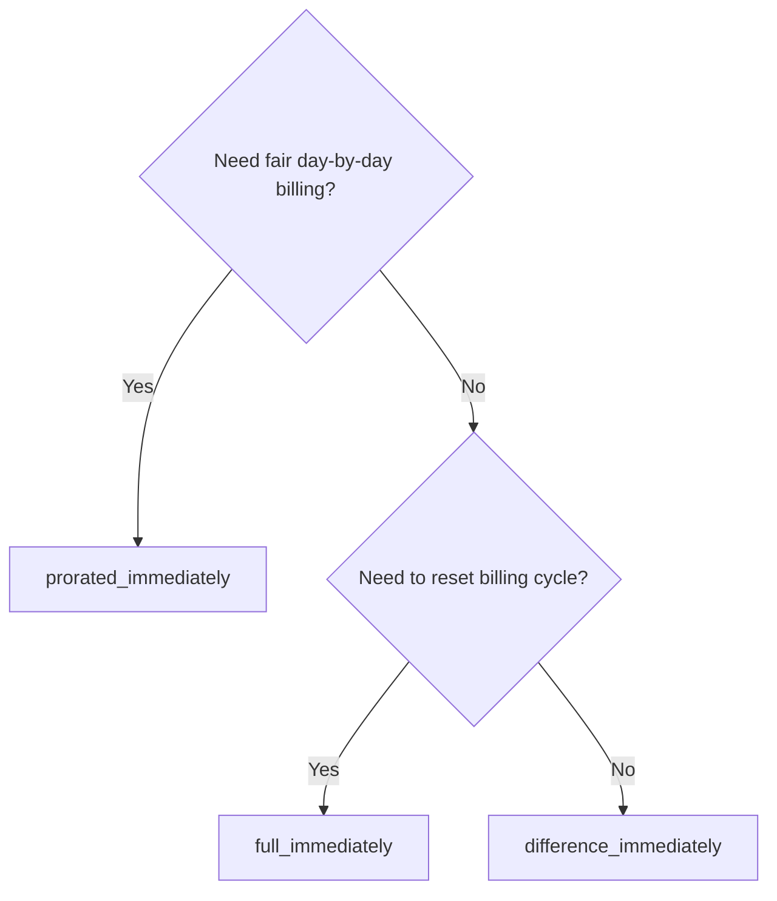
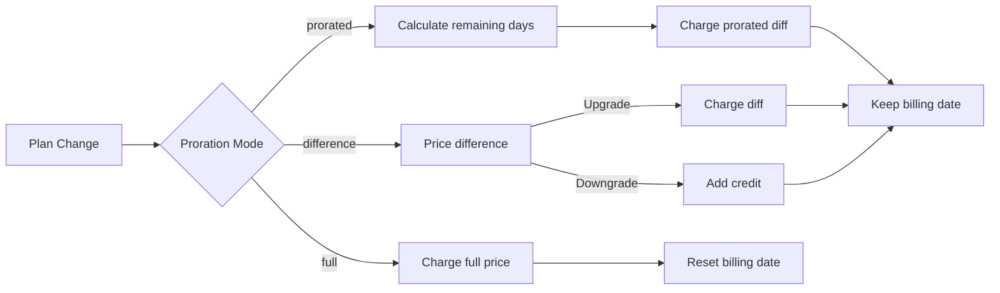

{/* LOCKED_PATTERN_6d744560e4135463c359b094ae69cd5f */}
{/* LOCKED_PATTERN_e019618386b2aca726eb1801e3e74076 */}
  구독 업데이트를 위한 전체 API 문서입니다.
</Card>
{/* LOCKED_PATTERN_1e8b2499d330dcc44e5e284a3600fd11 */}
  요금제 변경 전에 청구 금액을 확인하세요.
</Card>
{/* LOCKED_PATTERN_782a37ccd4cc5a4159c5497e7f1d4c54 */}
  단계별 구독 설정.
</Card>
</CardGroup>

## 구독 업그레이드 또는 다운그레이드란?

요금제를 변경하면 고객을 구독 등급이나 수량 사이에서 이동시킬 수 있습니다. 다음을 위해 사용하세요:
- 사용량 또는 기능에 맞게 가격을 조정
- 월간에서 연간으로 전환(또는 그 반대)
- 좌석 기반 제품의 수량을 조정

<Info>
요금제 변경은 선택한 비례 계산 방식에 따라 즉시 청구를 발생시킬 수 있습니다.
</Info>

## 요금제 변경을 사용해야 할 때

- 고객이 더 많은 기능, 사용량 또는 좌석이 필요할 때 업그레이드
- 사용량이 감소하면 다운그레이드
- 구독을 취소하지 않고 사용자를 새 제품이나 가격으로 이전

## 요금제 변경 흐름



## 전제 조건

구독 계획 변경을 구현하기 전에 다음을 확인하세요:

- 활성 구독 제품이 있는 Dodo Payments 상인 계정
- 대시보드에서 API 자격 증명 (API 키 및 웹훅 비밀 키)
- 수정할 기존 활성 구독
- 구독 이벤트를 처리할 웹훅 엔드포인트 구성

<Info>
자세한 설정 지침은 [Integration Guide](/developer-resources/integration-guide#dashboard-setup)를 참조하세요.
</Info>

## 단계별 구현 가이드

애플리케이션에서 구독 계획 변경을 구현하기 위한 포괄적인 가이드를 따르세요:

<Steps>
{/* LOCKED_PATTERN_b0d6d45bb453480975a9fb2d18d04caf */}
구현하기 전에 다음을 결정하세요:
- 어떤 구독 상품을 어떤 상품으로 변경할 수 있는지
- 비즈니스 모델에 적합한 비례 계산 방식
- 요금제 변경 실패를 어떻게 우아하게 처리할지
- 상태 관리를 위해 추적해야 할 웹훅 이벤트

<Tip>
프로덕션에 적용하기 전에 테스트 모드에서 요금제 변경을 철저히 테스트하세요.
</Tip>
</Step>

{/* LOCKED_PATTERN_44f780199a4b76d6c063b33d8f599e9a */}
비즈니스 요구에 맞는 청구 방식을 선택하세요:

<Tabs>
<Tab title="prorated_immediately">
최적: 사용되지 않은 시간에 대해 공정하게 청구하려는 SaaS 애플리케이션
- 남은 청구 주기 시간을 기준으로 정확한 비례 금액을 계산합니다
- 사이클에 남은 사용되지 않은 시간에 따라 비례 금액을 청구합니다
- 고객에게 투명한 청구를 제공합니다
</Tab>

<Tab title="difference_immediately">
최적: 명확한 업그레이드/다운그레이드 시나리오
- 업그레이드: 즉시 차액 청구(예: $30→$80 = $50 청구)
- 다운그레이드: 남은 가치를 미래 갱신에 크레딧으로 적립
- 청구 로직과 고객 커뮤니케이션을 단순화
</Tab>

<Tab title="full_immediately">
최적: 청구 주기를 재설정하려는 경우
- 새 요금제를 즉시 전액 청구
- 이전 요금제의 남은 시간을 무시
- 연간에서 월간 전환에 유용
</Tab>
</Tabs>
</Step>

{/* LOCKED_PATTERN_62685552c5becb87cfeddbb400a3e69b */}
Change Plan API를 사용하여 구독 세부 정보를 수정하세요:

<ParamField path="subscription_id" type="string" required>
수정할 활성 구독의 ID입니다.
</ParamField>

<ParamField path="product_id" type="string" required>
구독을 변경할 새 제품 ID입니다.
</ParamField>

<ParamField path="quantity" type="integer" default="1">
새 요금제의 단위 수(좌석 기반 제품의 경우)입니다.
</ParamField>

<ParamField path="proration_billing_mode" type="string" required>
즉시 청구를 다음 중 하나로 처리: `prorated_immediately`, `full_immediately` 또는 `difference_immediately`.
</ParamField>

<ParamField path="addons" type="array">
새 요금제의 선택적 애드온입니다. 비워두면 기존 애드온이 제거됩니다.
</ParamField>

{/* LOCKED_PATTERN_dbe6ce0c854d65ccfe8e10a6cd58e3a8 */}
요금제 변경 결제 실패 시 동작을 제어합니다:
- `prevent_change`: 결제가 성공할 때까지 구독을 현재 요금제에 유지
- `apply_change` (기본값): 결제 결과와 관계없이 요금제 변경을 즉시 적용

지정하지 않으면 비즈니스 수준 기본 설정을 사용합니다.
</ParamField>
</Step>

{/* LOCKED_PATTERN_5c8c73c93c2f49c93ec60fbfa164dd3a */}
요금제 변경 결과를 추적하려면 웹훅 처리를 설정하세요:

- `subscription.active`: 요금제 변경 성공, 구독 업데이트됨
- `subscription.plan_changed`: 구독 요금제가 변경됨(업그레이드/다운그레이드/애드온 업데이트)
- `subscription.on_hold`: 요금제 변경 청구 실패, 구독 일시 중지됨
- `payment.succeeded`: 요금제 변경에 대한 즉시 청구 성공
- `payment.failed`: 즉시 청구 실패

<Warning>
항상 웹훅 서명을 확인하고 멱등 이벤트 처리를 구현하세요.
</Warning>
</Step>

{/* LOCKED_PATTERN_df7c84793753eaba82a0d637e200faa6 */}
웹훅 이벤트를 기반으로 애플리케이션을 업데이트하세요:
- 새로운 요금제에 따라 기능을 부여하거나 회수
- 고객 대시보드에 새로운 요금제 세부 정보를 반영
- 요금제 변경에 대한 확인 이메일 발송
- 감사 목적의 청구 변경 기록 유지
</Step>

{/* LOCKED_PATTERN_bee75f9c04c9720f2dc211cbed62a7c6 */}
구현을 철저히 테스트하세요:
- 다양한 시나리오에서 모든 비례 계산 모드 테스트
- 웹훅 처리가 올바르게 작동하는지 검증
- 요금제 변경 성공률 모니터링
- 실패한 요금제 변경에 대한 경고 설정

<Check>
구독 요금제 변경 구현이 이제 프로덕션 사용 준비가 완료되었습니다.
</Check>
</Step>
</Steps>

## 요금제 변경 미리보기

요금제 변경을 확정하기 전에 Preview API를 사용하여 고객에게 청구될 금액을 정확히 보여주세요:

<Tabs>
<Tab title="Node.js SDK">

```javascript
const preview = await client.subscriptions.previewChangePlan('sub_123', {
  product_id: 'prod_pro',
  quantity: 1,
  proration_billing_mode: 'prorated_immediately'
});

// Show customer the charge before confirming
console.log('Immediate charge:', preview.immediate_charge.summary);
console.log('New plan details:', preview.new_plan);
```

</Tab>

<Tab title="Python SDK">

```python
preview = client.subscriptions.preview_change_plan(
    subscription_id="sub_123",
    product_id="prod_pro",
    quantity=1,
    proration_billing_mode="prorated_immediately"
)

# Show customer the charge before confirming
print("Immediate charge:", preview.immediate_charge.summary)
print("New plan details:", preview.new_plan)
```

</Tab>
</Tabs>

<Tip>
Preview API를 사용하여 요금제 변경을 확정하기 전에 고객에게 청구될 정확한 금액을 보여주는 확인 대화 상자를 만드세요.
</Tip>

## Change Plan API

Change Plan API를 사용하여 활성 구독의 제품, 수량 및 비례 계산 동작을 수정하세요.

### 빠른 시작 예제

<Tabs>
  <Tab title="Node.js SDK">

    ```javascript
    import DodoPayments from 'dodopayments';

    const client = new DodoPayments({
      bearerToken: process.env.DODO_PAYMENTS_API_KEY,
      environment: 'test_mode', // defaults to 'live_mode'
    });

    async function changePlan() {
      const result = await client.subscriptions.changePlan('sub_123', {
        product_id: 'prod_new',
        quantity: 3,
        proration_billing_mode: 'prorated_immediately',
        on_payment_failure: 'prevent_change', // Optional: control behavior on payment failure
      });
      console.log(result.status, result.invoice_id, result.payment_id);
    }

    changePlan();
    ```

  </Tab>
  <Tab title="Python SDK">

    ```python
    import os
    from dodopayments import DodoPayments

    client = DodoPayments(
        bearer_token=os.environ.get("DODO_PAYMENTS_API_KEY"),
        environment="test_mode",  # defaults to "live_mode"
    )

    result = client.subscriptions.change_plan(
        subscription_id="sub_123",
        product_id="prod_new",
        quantity=3,
        proration_billing_mode="prorated_immediately",
        on_payment_failure="prevent_change",  # Optional: control behavior on payment failure
    )
    print(result.status, result.get("invoice_id"), result.get("payment_id"))
    ```

  </Tab>
  <Tab title="Go SDK">

    ```go
    package main

    import (
      "context"
      "fmt"
      "github.com/dodopayments/dodopayments-go"
      "github.com/dodopayments/dodopayments-go/option"
    )

    func main() {
      client := dodopayments.NewClient(option.WithBearerToken("YOUR_TOKEN"))
      res, err := client.Subscriptions.ChangePlan(context.TODO(), dodopayments.SubscriptionChangePlanParams{
        SubscriptionID: dodopayments.F("sub_123"),
        ProductID:             dodopayments.F("prod_new"),
        Quantity:              dodopayments.F(int64(3)),
        ProrationBillingMode:  dodopayments.F(dodopayments.SubscriptionChangePlanParamsProrationBillingModeProratedImmediately),
        OnPaymentFailure:      dodopayments.F(dodopayments.OnPaymentFailurePreventChange), // Optional
      })
      if err != nil { panic(err) }
      fmt.Println(res.Status, res.InvoiceID, res.PaymentID)
    }
    ```

  </Tab>
  <Tab title="HTTP">

    ```bash
    curl -X POST "$DODO_API_BASE/subscriptions/sub_123/change-plan" \
      -H "Authorization: Bearer $DODO_PAYMENTS_API_KEY" \
      -H "Content-Type: application/json" \
      -d '{
        "product_id": "prod_new",
        "quantity": 3,
        "proration_billing_mode": "prorated_immediately",
        "on_payment_failure": "prevent_change"
      }'
    ```

  </Tab>
</Tabs>

```json Success
{
  "status": "processing",
  "subscription_id": "sub_123",
  "invoice_id": "inv_789",
  "payment_id": "pay_456",
  "proration_billing_mode": "prorated_immediately"
}
```

<Note>
<code>invoice_id</code> 및 <code>payment_id</code>와 같은 필드는 요금제 변경 중 즉시 청구 및/또는 인보이스가 생성될 때만 반환됩니다. 결과를 확인하려면 항상 웹훅 이벤트(예: <code>payment.succeeded</code>, <code>subscription.plan_changed</code>)에 의존하세요.
</Note>

<Warning>
즉시 청구가 실패하면 구독은 결제가 완료될 때까지 `subscription.on_hold` 상태로 전환될 수 있습니다.
</Warning>

## 애드온 관리

구독 요금제를 변경할 때 애드온도 수정할 수 있습니다:

```javascript
// Add addons to the new plan
await client.subscriptions.changePlan('sub_123', {
  product_id: 'prod_new',
  quantity: 1,
  proration_billing_mode: 'difference_immediately',
  addons: [
    { addon_id: 'addon_123', quantity: 2 }
  ]
});

// Remove all existing addons
await client.subscriptions.changePlan('sub_123', {
  product_id: 'prod_new',
  quantity: 1,
  proration_billing_mode: 'difference_immediately',
  addons: [] // Empty array removes all existing addons
});
```

<Info>
애드온은 비례 계산에 포함되며 선택한 모드에 따라 청구됩니다.
</Info>

## 비례 계산 모드

요금제 변경 시 고객에게 청구하는 방법을 선택하세요:

#### `prorated_immediately`
- 현재 사이클의 부분 차액을 청구합니다
- 체험 중이면 즉시 청구하고 지금 새 요금제로 전환합니다
- 다운그레이드: 향후 갱신에 적용되는 비례 크레딧이 생성될 수 있습니다

#### `full_immediately`
- 새 요금제의 전액을 즉시 청구합니다
- 이전 요금제의 남은 시간을 무시합니다

<Info>
difference_immediately를 사용하는 다운그레이드로 생성된 크레딧은 <a href="/features/customer-credit">Customer Credits</a>와 구분됩니다. 동일 구독의 향후 갱신에 자동으로 적용되며 구독 간 이전할 수 없습니다.
</Info>

#### `difference_immediately`
- 업그레이드: 이전 요금제와 새 요금제 간 가격 차이를 즉시 청구
- 다운그레이드: 남은 가치를 내부 크레딧으로 구독에 추가하고 갱신 시 자동 적용

| 기능 | `prorated_immediately` | `difference_immediately` | `full_immediately` |
|---------|----------------------|------------------------|-------------------|
| **업그레이드 청구** | 남은 일수에 대한 비례 차액 | 요금제 간 전체 차액 | 새 요금제의 전체 가격 |
| **다운그레이드 크레딧** | 남은 일수에 대한 비례 크레딧 | 전체 차액을 크레딧으로 | 크레딧 없음 |
| **청구 주기** | 변경 없음 | 변경 없음 | 오늘로 재설정 |
| **체험 행동** | 체험 종료 후 즉시 청구 | 체험 종료 후 즉시 청구 | 체험 종료 후 전액 청구 |
| **적합한 경우** | 공정한 시간 기반 청구 | 단순한 업그레이드/다운그레이드 계산 | 청구 주기 재설정 |
| **복잡도** | 중간(일 계산) | 낮음(단순 뺄셈) | 낮음(전액 청구) |



### 예시 시나리오

다음 기본 숫자를 일관되게 사용하세요:
- 현재 요금제: **Basic**, **$30/월**
- 업그레이드 대상: **Pro**, **$80/월**
- 다운그레이드 대상(프로에서): **Starter**, **$20/월**
- 청구 주기: **30일**, **1월 1일** 시작
- 요금제 변경: **1월 16일** (15일 남음, 15일 사용)

<AccordionGroup>
  {/* LOCKED_PATTERN_1a58b4dbcc060de029ff28c82c80a6fe */}

    ```
    Step 1: Calculate unused credit from current plan
      Unused days = 15 out of 30 days
      Credit = $30 × (15/30) = $15.00

    Step 2: Calculate prorated cost of new plan
      Remaining days = 15 out of 30 days
      New plan cost = $80 × (15/30) = $40.00

    Step 3: Calculate immediate charge
      Charge = New plan cost − Credit
      Charge = $40.00 − $15.00 = $25.00

    → Customer pays $25.00 now
    → Next renewal (Feb 1): $80.00/month
    ```

    ```javascript
    await client.subscriptions.changePlan('sub_123', {
      product_id: 'prod_pro',
      quantity: 1,
      proration_billing_mode: 'prorated_immediately'
    })
    ```

  </Accordion>

  {/* LOCKED_PATTERN_807a82fa1b52ee9a606ce1f9c1d8b613 */}

    ```
    Step 1: Calculate unused credit from current plan
      Unused days = 15 out of 30 days
      Credit = $80 × (15/30) = $40.00

    Step 2: Calculate prorated cost of new plan
      Remaining days = 15 out of 30 days
      New plan cost = $20 × (15/30) = $10.00

    Step 3: Calculate credit balance
      Credit = $40.00 − $10.00 = $30.00

    → No charge — $30.00 credit added to subscription
    → Credit auto-applies to future renewals
    → Next renewal (Feb 1): $20.00 − $30.00 credit = $0.00
    → Following renewal (Mar 1): $20.00 − $10.00 remaining credit = $10.00
    ```

    ```javascript
    await client.subscriptions.changePlan('sub_123', {
      product_id: 'prod_starter',
      quantity: 1,
      proration_billing_mode: 'prorated_immediately'
    })
    ```

  </Accordion>

  {/* LOCKED_PATTERN_67905dd0e892a1412bd0f1a567dd0a62 */}

    ```
    Immediate charge = New plan price − Old plan price
                     = $80 − $30
                     = $50.00

    → Customer pays $50.00 now (regardless of cycle position)
    → Next renewal (Feb 1): $80.00/month
    ```

    ```javascript
    await client.subscriptions.changePlan('sub_123', {
      product_id: 'prod_pro',
      quantity: 1,
      proration_billing_mode: 'difference_immediately'
    })
    ```

  </Accordion>

  {/* LOCKED_PATTERN_b17ed67d3062fadb798904adf781b844 */}

    ```
    Credit = Old plan price − New plan price
           = $80 − $20
           = $60.00

    → No charge — $60.00 credit added to subscription
    → Credit auto-applies to future renewals
    → Next renewal: $20.00 − $20.00 (from credit) = $0.00
    → Following renewal: $20.00 − $20.00 (from credit) = $0.00
    → Third renewal: $20.00 − $20.00 (from remaining credit) = $0.00
    ```

    ```javascript
    await client.subscriptions.changePlan('sub_123', {
      product_id: 'prod_starter',
      quantity: 1,
      proration_billing_mode: 'difference_immediately'
    })
    ```

  </Accordion>

  {/* LOCKED_PATTERN_0cb1a5657302a3970059ca925841dcd5 */}

    ```
    Immediate charge = Full new plan price = $80.00

    → Customer pays $80.00 now
    → No credit for unused time on old plan
    → Billing cycle resets to today (January 16)
    → Next renewal: February 16 at $80.00/month
    ```

    ```javascript
    await client.subscriptions.changePlan('sub_123', {
      product_id: 'prod_pro',
      quantity: 1,
      proration_billing_mode: 'full_immediately'
    })
    ```

  </Accordion>

  {/* LOCKED_PATTERN_6edab7762bdaeaf6cef5f85bafdb8832 */}

    ```
    Current: Basic plan ($30/month), no add-ons
    New: Pro plan ($80/month) + Extra Seats add-on ($10/seat × 3 seats = $30/month)
    Change on day 16 of 30 (15 days remaining)

    Step 1: Credit from current plan
      Credit = $30 × (15/30) = $15.00

    Step 2: Prorated cost of new plan + add-ons
      New plan = $80 × (15/30) = $40.00
      Add-ons = $30 × (15/30) = $15.00
      Total new = $55.00

    Step 3: Immediate charge
      Charge = $55.00 − $15.00 = $40.00

    → Customer pays $40.00 now
    → Next renewal: $80.00 + $30.00 = $110.00/month
    ```

    ```javascript
    await client.subscriptions.changePlan('sub_123', {
      product_id: 'prod_pro',
      quantity: 1,
      proration_billing_mode: 'prorated_immediately',
      addons: [
        { addon_id: 'addon_seats', quantity: 3 }
      ]
    })
    ```

  </Accordion>
</AccordionGroup>

### 각 모드의 청구 처리 방식



<Tip>
공정한 시간 기반 회계를 위해 `prorated_immediately`을 선택하고, 청구를 재시작하려면 `full_immediately`을 선택하며, 간단한 업그레이드 및 다운그레이드에 자동 크레딧을 원하면 `difference_immediately`을 사용하세요.
</Tip>

## 결제 실패 처리

요금제 변경 결제 실패 시 동작은 `on_payment_failure` 매개변수를 사용하여 제어하세요.

### 결제 실패 모드

<Tabs>
{/* LOCKED_PATTERN_9a289e347ae0d2762cd8b5bae425d96d */}
**동작**: 결제가 완료될 때까지 구독을 현재 요금제에 유지합니다.

- 요금제 변경이 "보류"로 표시됩니다
- 고객은 현재 요금제에 대한 접근을 유지합니다
- 결제가 성공한 후에만 구독이 `active` 상태로 전환됩니다
- 업그레이드된 기능을 제공하기 전에 결제를 보장하려는 경우 유용합니다

```javascript
await client.subscriptions.changePlan('sub_123', {
  product_id: 'prod_pro',
  quantity: 1,
  proration_billing_mode: 'prorated_immediately',
  on_payment_failure: 'prevent_change'
});
```

</Tab>

{/* LOCKED_PATTERN_389bf4efb62466ceba65070629169973 */}
**동작**: 결제 결과와 관계없이 요금제 변경을 즉시 적용합니다.

- 결제 실패 여부와 상관없이 요금제 변경이 적용됩니다
- 고객은 새 요금제에 즉시 접근할 수 있습니다
- 결제가 실패하면 구독이 `on_hold` 상태로 이동할 수 있습니다
- 비핵심 업그레이드나 고객을 신뢰할 때 적합합니다

```javascript
await client.subscriptions.changePlan('sub_123', {
  product_id: 'prod_pro',
  quantity: 1,
  proration_billing_mode: 'prorated_immediately',
  on_payment_failure: 'apply_change' // This is the default
});
```

</Tab>
</Tabs>

<Info>
지정하지 않으면 `on_payment_failure` 매개변수는 대시보드에서 구성된 비즈니스 수준 기본 설정을 사용합니다.
</Info>

### 각 모드를 사용해야 할 때

| 시나리오 | 추천 모드 | 이유 |
|----------|------------------|--------|
| 프리미엄 기능으로 업그레이드 | `prevent_change` | 액세스 제공 전에 결제를 보장 |
| 수량 증가(좌석 추가) | `prevent_change` | 결제 없이 사용되지 않도록 방지 |
| 요금제 다운그레이드 | `apply_change` | 고객이 지출을 줄임 |
| 신뢰하는 엔터프라이즈 고객 | `apply_change` | 결제 실패 위험이 낮음 |
| 체험에서 유료로 전환 | `prevent_change` | 중요한 결제 시점 |

## 웹훅 처리

웹훅을 통해 구독 상태를 추적하여 요금제 변경 및 결제를 확인하세요.

### 처리할 이벤트 유형
- `subscription.active`: 구독이 활성화됨
- `subscription.plan_changed`: 구독 요금제가 변경됨(업그레이드/다운그레이드/애드온 변경)
- `subscription.on_hold`: 청구 실패, 구독 일시 중지됨
- `subscription.renewed`: 갱신 성공
- `payment.succeeded`: 요금제 변경 또는 갱신 결제 성공
- `payment.failed`: 결제 실패

<Info>
구독 이벤트를 기반으로 비즈니스 로직을 실행하고 결제 이벤트를 확인 및 조정에 활용하는 것이 좋습니다.
</Info>

### 서명 검증 및 인텐트 처리

<Tabs>
  {/* LOCKED_PATTERN_ad56e9578b99d8d029bf3ec794be6fc4 */}

    ```javascript
    import { NextRequest, NextResponse } from 'next/server';
    
    export async function POST(req) {
      const webhookId = req.headers.get('webhook-id');
      const webhookSignature = req.headers.get('webhook-signature');
      const webhookTimestamp = req.headers.get('webhook-timestamp');
      const secret = process.env.DODO_WEBHOOK_SECRET;
    
      const payload = await req.text();
      // verifySignature is a placeholder – in production, use a Standard Webhooks library
      const { valid, event } = await verifySignature(
        payload,
        { id: webhookId, signature: webhookSignature, timestamp: webhookTimestamp },
        secret
      );
      if (!valid) return NextResponse.json({ error: 'Invalid signature' }, { status: 400 });
    
      switch (event.type) {
        case 'subscription.active':
          // mark subscription active in your DB
          break;
        case 'subscription.plan_changed':
          // refresh entitlements and reflect the new plan in your UI
          break;
        case 'subscription.on_hold':
          // notify user to update payment method
          break;
        case 'subscription.renewed':
          // extend access window
          break;
        case 'payment.succeeded':
          // reconcile payment for plan change
          break;
        case 'payment.failed':
          // log and alert
          break;
        default:
          // ignore unknown events
          break;
      }
    
      return NextResponse.json({ received: true });
    }
    ```

  </Tab>
  <Tab title="Express.js">

    ```javascript
    import express from 'express';
    
    const app = express();
    app.post('/webhooks/dodo', express.raw({ type: 'application/json' }), async (req, res) => {
      const webhookId = req.header('webhook-id');
      const webhookSignature = req.header('webhook-signature');
      const webhookTimestamp = req.header('webhook-timestamp');
      const secret = process.env.DODO_WEBHOOK_SECRET;
      const payload = req.body.toString('utf8');
    
      const { valid, event } = await verifySignature(
        payload,
        { id: webhookId, signature: webhookSignature, timestamp: webhookTimestamp },
        secret
      );
      if (!valid) return res.status(400).send('Invalid signature');
    
      // handle events like above
      res.json({ received: true });
    });
    
    app.listen(3000);
    ```

  </Tab>
</Tabs>

<Note>
자세한 페이로드 스키마는 <a href="/developer-resources/webhooks/intents/subscription">Subscription webhook payloads</a>와 <a href="/developer-resources/webhooks/intents/payment">Payment webhook payloads</a>를 참고하세요.
</Note>

## 모범 사례

신뢰할 수 있는 구독 요금제 변경을 위해 다음 권장 사항을 따르세요:

### 요금제 변경 전략
- **철저한 테스트**: 프로덕션에 적용하기 전에 항상 테스트 모드에서 요금제 변경을 시험하세요
- **비례 계산 신중히 선택**: 비즈니스 모델에 맞는 비례 계산 모드를 선택하세요
- **실패를 우아하게 처리**: 적절한 오류 처리 및 재시도 로직을 구현하세요
- **성공률 모니터링**: 요금제 변경 성공/실패 비율을 추적하고 문제를 조사하세요

### 웹훅 구현
- **서명 검증**: 웹훅 서명을 항상 검증하여 진위를 보장하세요
- **멱등성 구현**: 중복 웹훅 이벤트를 우아하게 처리하세요
- **비동기 처리**: 무거운 작업으로 웹훅 응답을 차단하지 마세요
- **모든 로그 기록**: 디버깅 및 감사 목적으로 자세한 로그를 유지하세요

### 사용자 경험
- **명확한 커뮤니케이션**: 고객에게 청구 변경 및 시기를 알리세요
- **확인 제공**: 요금제 변경 성공 시 이메일 확인을 보내세요
- **예외 상황 처리**: 체험 기간, 비례 계산, 결제 실패 등을 고려하세요
- **UI 즉시 업데이트**: 애플리케이션 인터페이스에 요금제 변경을 반영하세요

## 자주 발생하는 문제 및 해결책

구독 요금제 변경 중 자주 발생하는 문제를 해결하세요:

<AccordionGroup>
{/* LOCKED_PATTERN_112861435a085998aa537e347e24f368 */}
**증상**: API 호출은 성공하지만 구독은 이전 요금제에 남아 있음

**일반적인 원인**:
- 웹훅 처리 실패 또는 지연
- 웹훅 수신 후 애플리케이션 상태가 업데이트되지 않음
- 상태 업데이트 중 데이터베이스 트랜잭션 문제

**해결책**:
- 재시도 로직이 있는 강력한 웹훅 처리 구현
- 상태 업데이트에 멱등 연산 사용
- 누락된 웹훅 이벤트를 감지하고 알림을 보내기 위한 모니터링 추가
- 웹훅 엔드포인트가 접근 가능하며 올바르게 응답하는지 확인
</Accordion>

{/* LOCKED_PATTERN_653656c823b0f191581a523ab18f0f3f */}
**증상**: 고객이 다운그레이드했지만 크레딧 잔액이 표시되지 않음

**일반적인 원인**:
- 비례 계산 모드 기대: `difference_immediately`은 다운그레이드 시 전체 요금제 차액을 크레딧으로 제공하는 반면 `prorated_immediately`은 사이클 남은 시간을 기준으로 비례 크레딧을 생성합니다
- 크레딧은 구독별로 적용되며 구독 간 이전되지 않습니다
- 고객 대시보드에 크레딧 잔액이 표시되지 않음

**해결책**:
- 자동 크레딧을 원할 때 다운그레이드에는 `difference_immediately`을 사용하세요
- 크레딧이 동일 구독의 향후 갱신에 적용된다는 점을 고객에게 설명하세요
- 고객 포털을 구현하여 크레딧 잔액을 표시하세요
- 다음 인보이스 미리보기를 확인하여 적용된 크레딧을 확인하세요
</Accordion>

{/* LOCKED_PATTERN_1b0516ec68b4083dc4d6ae9b330f3f1a */}
**증상**: 웹훅 이벤트가 잘못된 서명으로 거부됨

**일반적인 원인**:
- 잘못된 웹훅 시크릿 키
- 서명 검증 전에 원시 요청 본문이 수정됨
- 잘못된 서명 검증 알고리즘

**해결책**:
- 대시보드에서 올바른 INLINE_CODE_76d7bb05619bd8a2_END를 사용 중인지 확인하세요
- JSON 파싱 미들웨어 이전에 원시 요청 본문을 읽으세요
- 사용 중인 플랫폼에 맞는 표준 웹훅 검증 라이브러리를 사용하세요
- 개발 환경에서 웹훅 서명 검증을 테스트하세요
</Accordion>

{/* LOCKED_PATTERN_638d7c911003cceda8c7d34ff8a2c381 */}
**증상**: API가 422 Unprocessable Entity 오류를 반환

**일반적인 원인**:
- 잘못된 구독 ID 또는 제품 ID
- 구독이 활성 상태가 아님
- 필수 매개변수 누락
- 요금제 변경에 사용할 수 없는 제품

**해결책**:
- 구독이 존재하고 활성 상태인지 확인
- 제품 ID가 유효하고 사용 가능한지 확인
- 모든 필수 매개변수가 제공되었는지 확인
- 매개변수 요구 사항에 대해 API 문서를 검토
</Accordion>

{/* LOCKED_PATTERN_7917a64bf4b26c933f2e4649e9278a56 */}
**증상**: 요금제 변경은 시작되었으나 즉시 청구가 실패

**일반적인 원인**:
- 고객 결제 수단에 잔액 부족
- 결제 수단이 만료되었거나 유효하지 않음
- 은행이 거래를 거절
- 사기 감지로 인해 청구가 차단됨

**해결책**:
- `payment.failed` 웹훅 이벤트를 적절히 처리하세요
- 고객에게 결제 수단 업데이트를 알리세요
- 일시적 실패에 대한 재시도 로직을 구현하세요
- 즉시 청구 실패가 있어도 요금제 변경을 허용하는 방안을 고려하세요
</Accordion>

{/* LOCKED_PATTERN_20276630e99e95ac9f5cdd0b347713bb */}
**증상**: 요금제 변경 청구가 실패하고 구독이 `on_hold` 상태로 이동

**무슨 일이 벌어지나**:
요금제 변경 청구가 실패하면 구독은 자동으로 `on_hold` 상태가 됩니다. 결제 수단이 업데이트되기 전까지 자동 갱신되지 않습니다.

**해결책**: 결제 수단을 업데이트하여 구독을 재활성화하세요

실패한 요금제 변경 후 `on_hold` 상태에서 구독을 재활성화하려면:

1. **결제 수단 업데이트**: Update Payment Method API를 사용
2. **자동 청구 생성**: API가 남은 금액에 대해 자동으로 청구를 생성
3. **인보이스 생성**: 청구에 대한 인보이스가 생성됨
4. **결제 처리**: 새로운 결제 수단으로 결제가 처리됨
5. **재활성화**: 결제가 성공하면 구독이 `active` 상태로 재활성화됨

<CodeGroup>

```javascript Node.js
// Reactivate subscription from on_hold after failed plan change
async function reactivateAfterFailedPlanChange(subscriptionId) {
  // Update payment method - automatically creates charge for remaining dues
  const response = await client.subscriptions.updatePaymentMethod(subscriptionId, {
    type: 'new',
    return_url: 'https://example.com/return'
  });
  
  if (response.payment_id) {
    console.log('Charge created for remaining dues:', response.payment_id);
    console.log('Payment link:', response.payment_link);
    
    // Redirect customer to payment_link to complete payment
    // Monitor webhooks for:
    // 1. payment.succeeded - charge succeeded
    // 2. subscription.active - subscription reactivated
  }
  
  return response;
}

// Or use existing payment method if available
async function reactivateWithExistingPaymentMethod(subscriptionId, paymentMethodId) {
  const response = await client.subscriptions.updatePaymentMethod(subscriptionId, {
    type: 'existing',
    payment_method_id: paymentMethodId
  });
  
  // Monitor webhooks for payment.succeeded and subscription.active
  return response;
}
```

```python Python
# Reactivate subscription from on_hold after failed plan change
def reactivate_after_failed_plan_change(subscription_id):
    # Update payment method - automatically creates charge for remaining dues
    response = client.subscriptions.update_payment_method(
        subscription_id=subscription_id,
        type="new",
        return_url="https://example.com/return"
    )
    
    if response.payment_id:
        print("Charge created for remaining dues:", response.payment_id)
        print("Payment link:", response.payment_link)
        
        # Redirect customer to payment_link to complete payment
        # Monitor webhooks for:
        # 1. payment.succeeded - charge succeeded
        # 2. subscription.active - subscription reactivated
    
    return response

# Or use existing payment method if available
def reactivate_with_existing_payment_method(subscription_id, payment_method_id):
    response = client.subscriptions.update_payment_method(
        subscription_id=subscription_id,
        type="existing",
        payment_method_id=payment_method_id
    )
    
    # Monitor webhooks for payment.succeeded and subscription.active
    return response
```

</CodeGroup>

**모니터링할 웹훅 이벤트**:
- `subscription.on_hold`: 요금제 변경 청구 실패 시 수신되는 구독 보류
- `payment.succeeded`: 결제 수단 업데이트 후 남은 금액 결제 성공
- `subscription.active`: 결제 성공 후 구독 재활성화

**모범 사례**:
- 요금제 변경 청구 실패 시 고객에게 즉시 알림
- 결제 수단을 업데이트하는 방법에 대한 명확한 안내 제공
- 웹훅 이벤트를 모니터링하여 재활성화 상태 추적
- 일시적 결제 실패에 대비한 자동 재시도 로직 구현 고려

{/* LOCKED_PATTERN_d215ea1d00e95d5e9d5b4b6085f2443f */}
결제 수단 업데이트 및 구독 재활성화에 대한 전체 API 문서를 확인하세요.
</Card>
</Accordion>
</AccordionGroup>

## 구현 테스트

구독 요금제 변경 구현을 철저히 테스트하려면 다음 단계를 따르세요:

<Steps>
{/* LOCKED_PATTERN_f5ce79c6f425de558f6fdd6cea5793f5 */}
- 테스트 API 키 및 테스트 제품 사용
- 다양한 요금제 유형으로 테스트 구독 생성
- 테스트 웹훅 엔드포인트 구성
- 모니터링 및 로깅 설정
</Step>

{/* LOCKED_PATTERN_3705b8701c8873992c57281c42adf8d6 */}
- 다양한 청구 주기 위치에서 `prorated_immediately` 테스트
- 업그레이드 및 다운그레이드에 대해 `difference_immediately` 테스트
- 청구 주기 재설정을 위해 `full_immediately` 테스트
- 크레딧 계산이 정확한지 확인
</Step>

{/* LOCKED_PATTERN_9fb1eaf73e8951f61d7daf19366cdfdf */}
- 모든 관련 웹훅 이벤트 수신 여부 확인
- 웹훅 서명 검증 테스트
- 중복 웹훅 이벤트를 우아하게 처리
- 웹훅 처리 실패 상황 테스트
</Step>

{/* LOCKED_PATTERN_7d448c9309210902a86e740b08deae34 */}
- 잘못된 구독 ID로 테스트
- 만료된 결제 수단으로 테스트
- 네트워크 실패 및 타임아웃 테스트
- 잔액 부족으로 테스트
</Step>

{/* LOCKED_PATTERN_099bec4eb7633497929a085e7b0160cd */}
- 실패한 요금제 변경에 대한 알림 설정
- 웹훅 처리 시간 모니터링
- 요금제 변경 성공률 추적
- 요금제 변경 문제에 대한 고객 지원 티켓 검토
</Step>
</Steps>

## 오류 처리

구현에서 일반 API 오류를 우아하게 처리하세요:

### HTTP 상태 코드

<AccordionGroup>
<Accordion title="200 OK">
요금제 변경 요청이 성공적으로 처리되었습니다. 구독이 업데이트 중이며 결제 처리가 시작되었습니다.
</Accordion>

<Accordion title="400 Bad Request">
요청 매개변수가 유효하지 않습니다. 모든 필수 필드가 제공되고 형식이 올바른지 확인하세요.
</Accordion>

<Accordion title="401 Unauthorized">
API 키가 잘못되었거나 누락되었습니다. `DODO_PAYMENTS_API_KEY`이 올바르고 적절한 권한을 갖추었는지 확인하세요.
</Accordion>

<Accordion title="404 Not Found">
구독 ID를 찾을 수 없거나 계정에 속하지 않습니다.
</Accordion>

<Accordion title="422 Unprocessable Entity">
해당 구독은 변경할 수 없습니다(예: 이미 취소됨, 제품 사용 불가 등).
</Accordion>

<Accordion title="500 Internal Server Error">
서버 오류가 발생했습니다. 잠시 후 요청을 다시 시도하세요.
</Accordion>
</AccordionGroup>

### 오류 응답 형식

```json
{
  "error": {
    "code": "subscription_not_found",
    "message": "The subscription with ID 'sub_123' was not found",
    "details": {
      "subscription_id": "sub_123"
    }
  }
}
```

## 다음 단계

- <a href="/api-reference/subscriptions/change-plan">Change Plan API</a>를 검토하세요
- <a href="/features/customer-credit">Customer Credits</a>를 확인하세요
- `subscription.on_hold`에 대한 알림을 구현하세요
- <a href="/developer-resources/webhooks">Webhook Integration Guide</a>를 확인하세요
