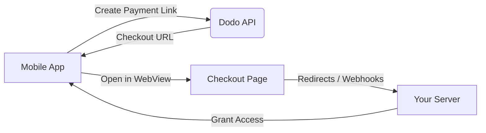

## 소개

Dodo Payments는 개발자가 iOS 앱에서 디지털 상품 및 서비스를 판매할 수 있도록 지원하며, 세금 준수, 통화 변환 및 지급과 같은 복잡한 측면을 처리합니다. 이 포괄적인 가이드는 SaaS 도구, 콘텐츠 구독 및 디지털 유틸리티를 위해 Dodo Payments를 iOS 앱에 통합하는 방법을 자세히 설명합니다.

## 개요

Dodo Payments는 귀하의 **Merchant of Record (MoR)** 역할을 하여 디지털 비즈니스의 중요한 측면을 관리합니다:

<Tabs>
<Tab title="우리가 처리하는 것">
- 세금 징수 및 납부 (부가가치세, GST 및 기타 지역 세금)
- 정책 및 지역 결제 방법에 따른 글로벌 결제
- 통화 변환 및 외환
- 차지백 및 사기 방지
- 최종 고객 청구서 및 영수증
- 지역 규정 준수
</Tab>

<Tab title="귀하가 얻는 것">
- 웹 및 모바일 플랫폼을 위한 통합 API
- 인앱 체크아웃 지원 (UPI, 카드, 지갑, BNPL)
- 글로벌 지급 지원 (Payoneer, Wise, 지역 은행 송금)
- 분석 및 보고 대시보드
- 안전한 결제 처리
</Tab>
</Tabs>

## 사용 사례

<CardGroup cols={2}>
<Card title="구독" icon="repeat">
- 프리미엄 콘텐츠 또는 기능 접근
- 유연한 옵션을 갖춘 반복 청구, 무료 체험, 비례 배분 또는 업그레이드 및 다운그레이드
</Card>

<Card title="강의 및 학습" icon="graduation-cap">
- 강의당 요금 접근
- 번들 콘텐츠 패키지
- 평생 또는 갱신 가능한 라이센스
- 진행 상황 추적 통합
</Card>

<Card title="디지털 다운로드" icon="download">
- 일회성 구매 (PDF, 음악, 도구)
- 디지털 자산 전달
- 라이센스 키 관리
</Card>

<Card title="SaaS 도구" icon="screwdriver-wrench">
- 소프트웨어 서비스 구독
- 사용 기반 청구
- 팀 및 기업 계획
</Card>
</CardGroup>

## 통합 흐름

Dodo Payments를 앱에 통합하려면 호스팅된 체크아웃 또는 인앱 브라우저 솔루션을 사용할 수 있습니다.

### 통합 단계

<Steps>
<Step title="모바일 앱에서 Dodo API로">
프로세스는 모바일 앱이 Dodo API와 상호작용하여 결제 링크를 생성하는 것으로 시작됩니다.
</Step>

<Step title="Dodo API에서 모바일 앱으로">
Dodo API는 모바일 앱에 체크아웃 URL을 제공하여 응답합니다.
</Step>

<Step title="모바일 앱에서 체크아웃 페이지로">
모바일 앱은 이 체크아웃 URL을 WebView 내에서 열어 사용자를 체크아웃 페이지로 안내합니다.
</Step>

<Step title="체크아웃 페이지에서 귀하의 서버로">
체크아웃 프로세스가 완료되면 체크아웃 페이지는 리디렉션 또는 웹훅을 통해 귀하의 서버와 통신합니다.
</Step>

<Step title="귀하의 서버에서 모바일 앱으로">
마지막으로, 귀하의 서버는 구매한 콘텐츠 또는 서비스에 대한 접근을 허용하여 모바일 앱에서 거래 사이클을 완료합니다.
</Step>
</Steps>

<Card title="모바일 통합 가이드" icon="mobile" href="/developer-resources/mobile-integration">
완전한 개발자 워크스루를 위해 모바일 통합 가이드를 탐색하세요.
</Card>

## 지역 가용성

Dodo Payments는 Apple이 외부 결제를 명시적으로 허용하는 App Store 지역 또는 규제 기관이나 법원 명령에 의해 의무화된 경우에만 대체 인앱 구매 흐름을 가능하게 합니다.

### 지원되는 지역

<AccordionGroup>
<Accordion title="미국">
현재 법원 명령 및 Apple의 업데이트된 지침에 따라 허용되는 범위 내에서 지원됩니다.

- 특정 법원 명령에 따라 제공됨
- Apple이 법적 요구 사항을 준수해야 함
- Apple의 구현 지침을 따라야 함
</Accordion>

<Accordion title="유럽 연합 (EU) App Store">
Apple의 EU 대체 조건 및 외부 구매 권한을 통해 지원됩니다.

- Apple의 EU 대체 조건을 통해 활성화됨
- 외부 구매 권한 승인 필요
- EU 디지털 시장법 요구 사항 준수 필요
</Accordion>

<Accordion title="한국">
한국 전용 바이너리를 위한 StoreKit 외부 구매 권한을 통해 지원됩니다.

- StoreKit 외부 구매 권한을 통해 제공됨
- 한국 전용 앱 바이너리 필요
- 한국 통신법 준수 필요
</Accordion>
</AccordionGroup>

<Warning>
Dodo Payments를 어떤 상점에 대해 활성화하기 전에 항상 Apple의 지역별 권한 및 App Store Connect 요구 사항을 검토하고 준수하세요. 지원되지 않는 지역에서 대체 결제 흐름을 사용하는 경우 앱 거부 또는 삭제의 결과를 초래할 수 있습니다.
</Warning>

<Note>
일부 비즈니스 모델 - 서비스 또는 특정 콘텐츠 카테고리와 같은 - 에 대해서는 Apple이 인앱 구매(IAP)의 사용을 전혀 요구하지 않을 수 있습니다. Dodo Payments는 이러한 모델도 지원합니다. 항상 귀하의 앱 분류와 Apple의 최신 지침을 확인하여 귀하의 사용 사례에 대해 IAP가 필수인지 확인하세요.
</Note>

### 더 알아보기

글로벌 정책, 법적 선례 및 App Store 수수료를 우회하는 전략적 접근 방식에 대한 자세한 분석은 다음 포괄적인 가이드를 참조하세요:

<Card title="App Store 및 Play Store 수수료 우회: 전략적 및 법적 플레이북" icon="shield-check" href="/features/bypassing-app-store-fees">
대체 결제 흐름을 합법적으로 구현할 수 있는 위치와 방법을 최신 지역 지침 및 준수 팁과 함께 알아보세요.
</Card>