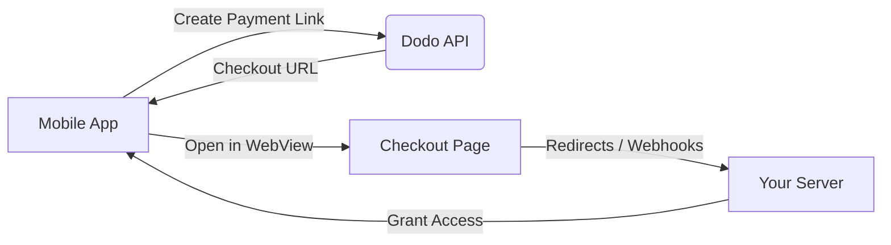

## 소개

Dodo Payments는 개발자가 iOS 앱에서 디지털 상품 및 서비스를 판매할 수 있도록 지원하며, 세금 준수, 통화 변환 및 지급과 같은 복잡한 측면을 처리합니다. 이 포괄적인 가이드는 SaaS 도구, 콘텐츠 구독 및 디지털 유틸리티를 위해 Dodo Payments를 iOS 앱에 통합하는 방법을 자세히 설명합니다.

## 개요

Dodo Payments는 귀하의 **Merchant of Record (MoR)** 역할을 하여 디지털 비즈니스의 중요한 측면을 관리합니다:

<Tabs>
{/* LOCKED_PATTERN_7b95db5ad22ff10e01a4218d7aa6d6be */}
- 세금 징수 및 납부 (VAT, GST 및 기타 지역 세금)
- 정책 및 현지 결제 수단에 따른 글로벌 결제
- 통화 환전 및 외환
- 차지백 및 사기 방지
- 최종 고객 인보이스 및 영수증
- 지역 규정 준수
</Tab>

{/* LOCKED_PATTERN_da399a11cc5287c02436800c294d28be */}
- 웹 및 모바일 플랫폼을 위한 통합 API
- 인앱 체크아웃 지원 (UPI, 카드, 지갑, BNPL)
- 글로벌 지급 지원 (Payoneer, Wise, 현지 은행 송금)
- 분석 및 보고서 대시보드
- 안전한 결제 처리
</Tab>
</Tabs>

## 사용 사례

<CardGroup cols={2}>
{/* LOCKED_PATTERN_25273516451e819dcf5729a5b31c3fb9 */}
- 프리미엄 콘텐츠 또는 기능 액세스
- 유연한 옵션을 갖춘 정기 청구, 무료 평가판, 비례 요금 또는 업그레이드 및 다운그레이드
</Card>

{/* LOCKED_PATTERN_032df751886a698341277e548837215d */}
- 강좌별 결제
- 번들 콘텐츠 패키지
- 평생 또는 갱신 가능한 라이선스
- 진행 상황 추적 통합
</Card>

{/* LOCKED_PATTERN_88cb7887605391efc00e89ceac393617 */}
- 일회성 구매 (PDF, 음악, 도구)
- 디지털 자산 전달
- 라이선스 키 관리
</Card>

{/* LOCKED_PATTERN_53b689678a845fbab7f78be1484fe51d */}
- SaaS 구독
- 사용량 기반 청구
- 팀 및 엔터프라이즈 요금제
</Card>
</CardGroup>

## 통합 흐름

Dodo Payments를 앱에 통합하려면 호스팅된 체크아웃 또는 인앱 브라우저 솔루션을 사용할 수 있습니다.

### 통합 단계

<Steps>
{/* LOCKED_PATTERN_eaf7186d297d5feae774885072c1deff */}
모바일 앱이 Dodo API와 상호작용하여 결제 링크를 생성하는 것으로 프로세스가 시작됩니다.
</Step>

{/* LOCKED_PATTERN_b32fbf0225071fa4e66b7da8eafe9ef9 */}
Dodo API는 모바일 앱에 체크아웃 URL을 제공합니다.
</Step>

{/* LOCKED_PATTERN_d976b5e50a0a8a20a8206d907f16914f */}
그런 다음 모바일 앱은 이 체크아웃 URL을 WebView 내에서 열어 사용자를 체크아웃 페이지로 안내합니다.
</Step>

{/* LOCKED_PATTERN_44d5bb8ba746348cda77bbdfc76b7fa5 */}
체크아웃 과정이 완료되면 체크아웃 페이지는 리디렉션 또는 웹훅을 통해 서버와 통신합니다.
</Step>

{/* LOCKED_PATTERN_5f4ad8be947cf24adc5f501029294d3c */}
마지막으로 서버는 구매한 콘텐츠나 서비스에 대한 액세스를 허용하여 모바일 앱에서 거래 주기를 완료합니다.
</Step>
</Steps>

{/* LOCKED_PATTERN_b9b6430ebe2f8c301db006aee204f66d */}
전체 개발자 안내서는 모바일 통합 가이드를 참조하십시오.
</Card>

## 지역 가용성

Dodo Payments는 Apple이 외부 결제를 명시적으로 허용하는 App Store 지역 또는 규제 기관이나 법원 명령에 의해 의무화된 경우에만 대체 인앱 구매 흐름을 가능하게 합니다.

### 지원되는 지역

<AccordionGroup>
{/* LOCKED_PATTERN_2d6a072cfe841357c870b65ab28b5291 */}
현재 법원 명령과 Apple의 최신 지침이 허용하는 범위 내에서 지원됩니다.

- 특정 법원 명령 조항에 따라 제공됩니다.
- Apple이 법적 요구 사항을 준수하는 경우 적용됩니다.
- Apple의 구현 지침을 따라야 합니다.
</Accordion>

{/* LOCKED_PATTERN_4ec7a4d0b0e955daa950f2acd6b96083 */}
Apple의 EU 대체 조건 및 외부 구매 권한을 통해 지원됩니다.

- Apple의 EU 대체 조건을 통해 활성화됩니다.
- 외부 구매 권한 승인이 필요합니다.
- EU 디지털 시장법 요건을 준수해야 합니다.
</Accordion>

{/* LOCKED_PATTERN_6bb22099c6c9aa7ba0a1c7dba319d124 */}
한국 전용 바이너리에 대한 StoreKit 외부 구매 권한을 통해 지원됩니다.

- StoreKit 외부 구매 권한을 통해 제공됩니다.
- 한국 전용 앱 바이너리가 필요합니다.
- 한국 통신법을 준수해야 합니다.
</Accordion>
</AccordionGroup>

<Warning>
Dodo Payments를 어느 스토어프런트에서든 활성화하기 전에 Apple의 지역별 권한 및 App Store Connect 요구 사항을 반드시 검토하고 준수하십시오. 지원되지 않는 지역에서 대체 결제 흐름을 사용할 경우 앱 거부 또는 제거로 이어질 수 있습니다.
</Warning>

<Note>
서비스나 특정 콘텐츠 카테고리와 같은 일부 비즈니스 모델의 경우 Apple이 인앱 결제(IAP) 사용을 요구하지 않을 수 있습니다. Dodo Payments는 이러한 모델도 지원합니다. 귀하의 앱 분류 및 Apple의 최신 지침을 항상 확인하여 IAP가 귀하의 사용 사례에 필수인지 판단하십시오.
</Note>

### 더 알아보기

글로벌 정책, 법적 선례 및 App Store 수수료를 우회하는 전략적 접근 방식에 대한 자세한 분석은 다음 포괄적인 가이드를 참조하세요:

{/* LOCKED_PATTERN_4c4ef7dc147bdbe9f5385b01ed7a302b */}
법적으로 대체 결제 흐름을 구현할 수 있는 위치와 방법을 최신 지역 안내 및 준수 요령과 함께 알아보십시오.
</Card>