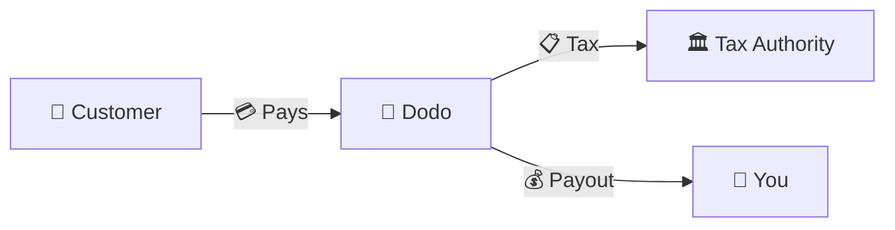
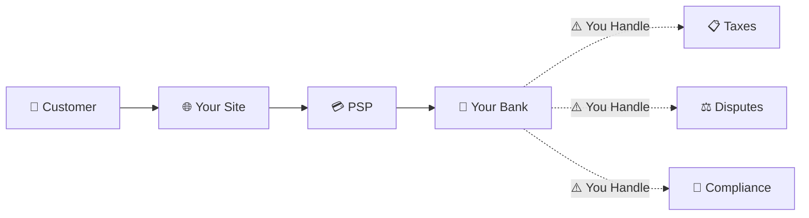
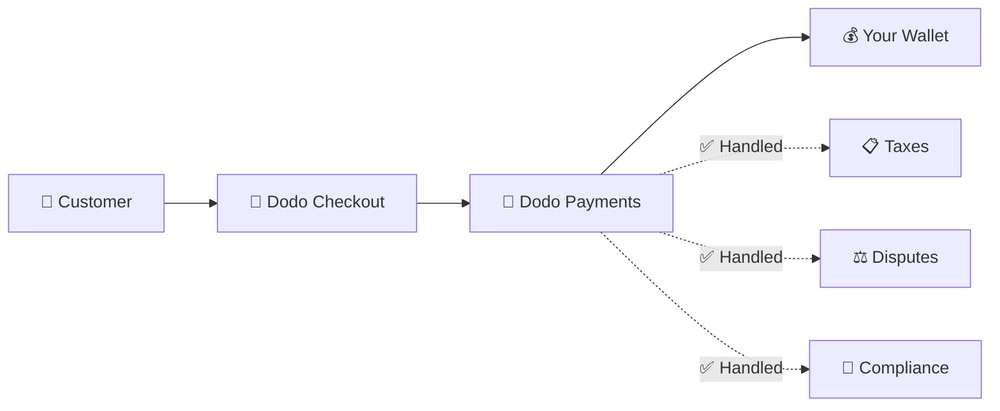
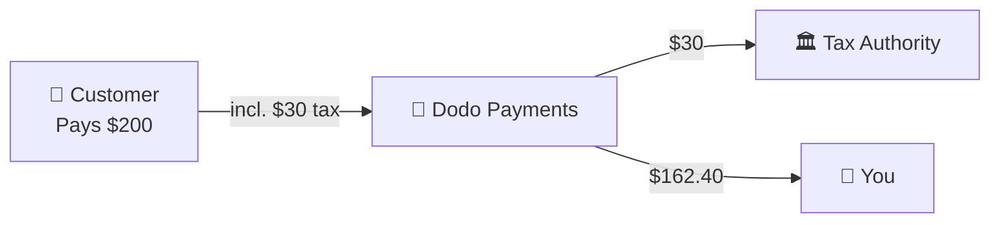

Dodo Payments는 **Merchant of Record (MoR)**로 운영됩니다. 우리는 귀하의 디지털 제품의 법적 판매자가 되어 결제, 세금, 사기 및 준수에 대한 책임을 지므로 귀하는 제품 개발에만 집중할 수 있습니다.

<CardGroup cols={3}>
<Card title="220+ Regions" icon="globe">
세금 준수는 자동으로 처리됩니다
</Card>

<Card title="30+ Payment Methods" icon="credit-card">
카드, 지갑 및 현지 결제 수단
</Card>

<Card title="Zero Tax Filing" icon="file-invoice">
모든 송금 업무를 처리합니다
</Card>
</CardGroup>

## Merchant of Record란 무엇인가요?

**Merchant of Record**는 고객의 신용 카드 명세서에 나타나는 법적 실체로, 거래에 대한 책임을 집니다. Dodo Payments를 MoR로 사용할 때:

- **우리는 법적 판매자입니다** — Dodo가 은행 명세서와 영수증에 나타납니다.
- **귀하는 제품 제작자입니다** — 귀하는 제품을 구축하고 가격을 책정하며 제공할 수 있습니다.
- **우리는 백오피스를 처리합니다** — 세금, 분쟁, 준수 및 청구 지원.
- **귀하는 순수익을 받습니다** — 수익이 귀하의 계좌에 직접 입금됩니다.

<Note>
Merchant of Record를 마치 세계 금융팀을 고용해 각국의 송장, 세금 및 청구를 처리하는 것으로 생각하세요 — 귀하는 손 하나 까딱할 필요 없습니다.
</Note>

## Merchant of Record를 사용하는 이유는 무엇인가요?

디지털 제품을 전 세계에 판매하는 것은 유럽의 VAT, 호주의 GST, 미국의 판매세 및 수많은 기타 요구 사항을 탐색하는 것을 의미합니다. 각 관할권마다 다른 규칙, 세율, 기준 및 신고 마감일이 있습니다.

| 귀하의 책임 | MoR 없이 | Dodo를 MoR로 사용할 때 |
|---------------------|:-----------:|:----------------:|
| VAT/GST 등록 | ❌ 귀하 | ✅ Dodo |
| 세금 계산 | ❌ 귀하 | ✅ Dodo |
| 세금 신고 및 송금 | ❌ 귀하 | ✅ Dodo |
| 차지백 책임 | ❌ 귀하 | ✅ Dodo |
| PCI 준수 | ❌ 귀하 | ✅ Dodo |
| 다중 통화 지원 | ❌ 복잡함 | ✅ 내장됨 |
| 지역 결제 방법 | ❌ 각각 통합 | ✅ 30+ 포함 |

<Tip>
**예시**: 프랑스 고객에게 월 €50 구독을 판매하시나요?

**MoR 없이**: 프랑스 VAT에 등록하고, €60(20% VAT)를 청구하고, 분기별 프랑스 신고를 하고, 감사에 대응해야 합니다 — 프랑스어로요.

**Dodo와 함께**: €60을 수금하고 프랑스에 €10 VAT를 송금하며 수수료를 뺀 €50을 지급합니다. 귀하는 코드만 작성하세요.
</Tip>

## PSP와 MoR: 주요 차이점

**Payment Service Provider**(예: Stripe)와 **Merchant of Record**의 차이를 이해하는 것은 중요합니다.

### Payment Service Provider (PSP)

PSP는 거래를 처리하지만 귀하를 법적 판매자로 남겨둡니다:

<Warning>
PSP를 사용할 경우, **귀하**는 고객이 있는 모든 관할 구역에서 세금 등록, 징수, 신고 및 송금의 책임을 집니다.
</Warning>

### Merchant of Record (Dodo)

MoR은 법적 판매자가 되어 준수를 처음부터 끝까지 처리합니다:

<Check>
Dodo를 MoR로 사용할 경우, 세금, 분쟁 및 준수를 처리합니다. 귀하는 서류 없이 순지급금을 받습니다.
</Check>

### 나란히 비교

| 측면 | PSP (Stripe 등) | MoR (Dodo) |
|--------|:------------------:|:----------:|
| 법적 판매자 | 귀사 | Dodo |
| 고객 명세서에 표시 | 귀하의 이름 | Dodo |
| 세금 등록 | ❌ 귀하 | ✅ Dodo |
| 세금 계산 | ❌ 귀하 | ✅ Dodo |
| 세금 송금 | ❌ 귀하 | ✅ Dodo |
| 차지백 위험 | ❌ 귀하 | ✅ Dodo |
| PCI 준수 | ❌ 귀하 | ✅ Dodo |
| 글로벌 설정 | 복잡함 | 간단함 |

<Info>
**중요**: PSP와 MoR 모두 결제 처리를 다룹니다. 핵심 차이는 **세금 준수 및 거래 책임에 대해 누가 법적 책임을 지느냐**입니다.
</Info>

## 세금 준수는 어떻게 작동하나요?

Dodo는 전체 세금 생애 주기를 자동으로 처리합니다:

<Steps>
<Step title="Customer Location">
고객의 국가를 감지하여 적용되는 세칙(부가세, GST, 판매세 또는 기타 현지 요건)을 결정합니다.
</Step>

<Step title="Rate Calculation">
정확한 세율은 제품 유형, 고객 위치 및 B2B/B2C 상태에 따라 계산됩니다. EU 사업 고객이 유효한 VAT 번호를 보유한 경우, 역외과세가 적용됩니다.
</Step>

<Step title="Collection at Checkout">
세금은 체크아웃 시 명확하게 표시되고 징수됩니다. 고객은 자신이 지불하는 금액을 정확히 확인합니다.
</Step>

<Step title="Filing & Remittance">
우리는 신고서를 제출하고 징수한 세금을 적절한 당국에 예정대로 납부합니다. 귀하는 세금 양식을 볼 필요가 없습니다.
</Step>
</Steps>

## 수익 흐름

고객에서 귀하의 계좌로 돈이 이동하는 방식은 다음과 같습니다:

### 예시 지급 내역

| 항목 | 금액 |
|-----------|-------:|
| 고객 결제 | $200.00 |
| 판매세 (15% VAT) | −$30.00 |
| Dodo 플랫폼 수수료 (4%) | −$8.00 |
| 결제 처리 | −$0.60 |
| **귀하의 지급액** | **$162.40** |

## MoR과 PSP 중 언제 선택해야 하나요?

<Tabs>
<Tab title="Choose Dodo (MoR)">
**Dodo Payments는 다음에 이상적입니다:**

- 디지털 제품, SaaS 또는 구독을 판매합니다
- 여러 국가에 고객이 있습니다
- 세금 등록의 번거로움을 피하고 싶습니다
- 예측 가능하고 아웃소싱된 준수를 선호합니다
- 최대한의 통제보다 시장 진입 속도를 중요하게 생각합니다
- 분쟁과 사기를 직접 관리하고 싶지 않습니다
</Tab>

<Tab title="Consider a PSP">
**PSP는 다음에 적합할 수 있습니다:**

- 주로 한 국가에서 운영합니다
- 내부 재무 및 준수 팀을 보유하고 있습니다
- 체크아웃 UX에 대한 절대적인 제어가 필요합니다
- 극도로 낮은 마진으로 작업합니다
- 실물 상품을 판매합니다 (MoR는 디지털에 집중)
</Tab>
</Tabs>

<Note>
많은 기업이 처음에는 PSP를 사용하다가 국제적으로 확장하면서 MoR로 전환합니다. Dodo는 이 전환을 원활하게 지원합니다.
</Note>

## 자주 묻는 질문

<AccordionGroup>
<Accordion title="What appears on my customer's credit card statement?">
Dodo Payments가 가맹점으로 표시됩니다. 문자 수 제한이 허용하는 한 제품/브랜드에 대한 참조를 포함하며 고객은 제품 정보를 보여주는 상세 영수증을 받습니다.
</Accordion>

<Accordion title="Do I still own the customer relationship?">
네. 귀하는 가격, 브랜딩, 제품 제공 및 직접 커뮤니케이션을 제어합니다. Dodo는 청구 메커니즘을 처리하지만 고객은 귀사에서 구매하고 있다는 것을 압니다. 귀사의 브랜드는 체크아웃, 이메일, 송장에 눈에 띄게 표시됩니다.
</Accordion>

<Accordion title="How does B2B VAT reverse charge work?">
EU에서의 B2B 판매의 경우, 고객은 체크아웃에서 VAT 번호를 입력할 수 있습니다. 우리는 이를 검증하고 역외과세를 자동으로 적용합니다 — 세금 부담은 징수 대신 구매자의 VAT 신고로 전가됩니다.
</Accordion>

<Accordion title="Can I use my own payment processor?">
Dodo는 결제 인프라를 이용하는 통합 솔루션으로 운영됩니다. 이 통합이 우리가 세금 및 사기 책임을 맡을 수 있게 해줍니다. 향후 다른 결제 프로세서와의 통합도 제공하기 위해 작업 중입니다.
</Accordion>

<Accordion title="How do refunds work?">
대시보드에서 환불을 시작하세요. 우리는 고객의 원래 결제 수단과 통화로 환불을 처리합니다. 세금 금액은 자동으로 조정되고 정산됩니다.
</Accordion>

<Accordion title="What about my income tax?">
Dodo는 고객 거래에 대한 **판매세**(VAT, GST, 판매세)를 처리합니다. 귀하는 귀사의 소득세, 법인세 및 귀하가 받는 지급금에 대한 세금 의무를 계속 책임집니다.
</Accordion>

<Accordion title="Which countries can I sell to?">
우리는 220개 이상 국가 및 지역에서 결제를 수락하며 지속적으로 확대 중입니다. 전체 목록을 확인하세요:
<Card title="Supported Regions" icon="globe" href="/miscellaneous/list-of-countries-we-accept-payments-from">

View all 220+ countries and regions where we accept payments.
</Card>
</Accordion>
</AccordionGroup>

## 시작하기

<CardGroup cols={2}>
<Card title="Create Account" icon="rocket" href="https://app.dodopayments.com/signup">
무료로 가입하고 몇 분 내에 글로벌 결제를 수락하세요.
</Card>

<Card title="MoR vs PG Deep Dive" icon="scale-balanced" href="/features/mor-vs-pg">
예시와 사용 사례와 함께 자세한 비교.
</Card>

<Card title="Acceptance Policy" icon="building-shield" href="/miscellaneous/merchant-acceptance">
우리가 지원하는 기업에 대해 알아보세요.
</Card>

<Card title="Talk to Us" icon="envelope" href="mailto:founders@dodopayments.com">
팀의 맞춤형 안내를 받아보세요.
</Card>
</CardGroup>
