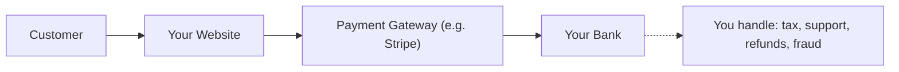
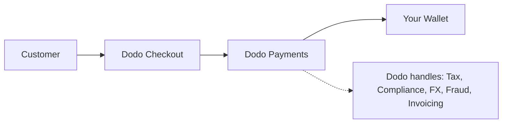

## 소개

이 가이드는 MoR 모델과 전통적인 Payment Gateway 접근 방식을 비교하여 Dodo Payments가 귀하의 비즈니스에 가져다주는 이점을 이해하는 데 도움을 줍니다.

## 핵심 차이점

| 기능                             | MoR (Dodo Payments)         | Payment Gateway (전통적인 PG)           |
|----------------------------------|--------------------------------------------|--------------------------------------------|
| 법적 판매자                     | Dodo Payments (MoR)                        | 귀하의 회사                               |
| 세금 징수 및 송금              | Dodo에서 처리                            | 귀하가 책임짐                             |
| 규정 준수 및 법적 부담         | Dodo가 책임을 짐                         | 귀하가 현지 법률 및 차지백을 처리함      |
| 정산 통화                      | USD, EUR, INR 및 25개 이상의 통화 지원    | 귀하의 상인 계좌에 따라 다름             |
| 리스크 관리                     | 내장된 사기 및 차지백 보호               | 귀하가 자체 도구를 설정함 (예: Stripe Radar) |
| 지급                            | 집계되고 간소화된 글로벌 지급            | PG에서 귀하에게 직접, 은행 설정 필요     |

## 귀하에게 의미하는 것

**Dodo를 MoR로 사용하면**, 우리는 귀하의 고객에게 법적 판매자가 되어 다음을 가능하게 합니다:

- 현지 법인 설정 생략
- VAT, GST 또는 판매세 처리 회피
- 전 세계적으로 더 많은 결제 방법 제공
- 법적 리스크 감소
- 새로운 시장에서 더 빠르게 출시

<Note>
프랑스 사용자에게 디지털 구독을 판매한다고 상상해보세요. Dodo Payments를 통해 결제를 수집하고, 프랑스 당국에 VAT를 신고하며, 순매출을 여러분께 전달합니다. 세금 고민 없음. 법률가도 필요 없음. 오직 성장만.
</Note>

또한, MoR 모델은 귀하의 전체 백오피스를 간소화합니다. Dodo는 귀하의 MoR로서 PCI 준수, 사기 탐지, 통화 변환 및 고객 청구 지원까지 처리하여 귀하의 팀이 제품 및 성장에 집중할 수 있도록 합니다.

## 시각적 비교

**수익 흐름: Payment Gateway**

**수익 흐름: Merchant of Record (Dodo)**

## SaaS 및 디지털 비즈니스에 중요한 이유

비즈니스가 확장됨에 따라 세금, 규정 준수 및 글로벌 결제 선호도를 관리하는 것이 압도적일 수 있습니다. Payment Gateway를 사용할 경우 귀하는 다음에 대한 책임이 있습니다:

- 여러 관할권에서의 VAT/GST 등록 및 신고
- 통화 변환 및 차지백 관리
- 현지화된 체크아웃 및 결제 방법 제공

Dodo Payments를 MoR로 사용하면:
- 현지 법인 설정 없이 글로벌로 확장
- 세금이 귀하를 대신하여 계산, 징수 및 송금됨
- 고객에 맞춘 결제 방법 라이브러리에 접근
- 법적 완충 역할 및 운영 파트너 역할 수행

<Tip>
지불 게이트웨이를 터널로 생각해보세요. 이제 Merchant of Record를 터널, 기차, 운전사, 그리고 발권 직원을 하나로 통합한 존재로 상상해보세요.
</Tip>

## MoR을 사용해야 하는 사람은?

Dodo Payments는 다음과 같은 경우에 적합합니다:
- SaaS 및 디지털 제품 회사
- 인디 제작자 및 솔로프레너
- 100개 이상의 국가에 고객이 있는 글로벌 비즈니스
- 세금 및 규정 준수를 내부에서 관리하고 싶지 않은 회사

국제적으로 확장하고 있거나, 구독을 판매하거나, 운영상의 문제를 줄이고 싶다면 MoR이 더 스마트한 선택입니다.

## 대신 Payment Gateway를 사용할 때

단순히 Payment Gateway를 사용하는 것이 의미가 있는 경우도 있습니다:
- 귀하의 비즈니스가 한 국가에서만 운영됨
- 이미 내부 재무 및 규정 준수 자원이 있음
- 고객 청구 경험에 대한 완전한 제어가 필요함
- 규모에서 마진이 얇고 비용에 민감함

<Note>
많은 스타트업에게 게이트웨이 사용만으로 초반에는 충분할 수 있지만, 복잡성이 커질수록 MoR로 전환하면 시간 절약, 위험 감소, 그리고 국제 성장을 가속화할 수 있습니다.
</Note>

## Dodo Payments를 선택해야 하는 이유

Dodo Payments는 다음을 제공합니다:
- 올인원 결제, 세금 및 규정 준수 스택
- 실시간 FX 및 다중 통화 지원
- 30개 이상의 결제 방법 접근
- 좌석 기반 청구, 구독 및 일회성 결제
- 150개 이상의 국가에서 자동 세금 처리
- 내장된 사기 방지 및 PCI 준수

귀하가 솔로 창립자이든 확장 중인 SaaS 팀이든, Dodo는 글로벌 판매의 복잡성을 간소화합니다.

## 더 알아보기

<CardGroup cols={2}>
{/* LOCKED_PATTERN_255f37658964531eef93d79ee5d8bb7a */}
Dodo가 고객 현지 통화로 가격을 자동으로 표시하는 방법을 알아보세요
</Card>

{/* LOCKED_PATTERN_9bf5b254a8af251551af21558f3421ad */}
Dodo Payments를 통해 이용 가능한 30개 이상의 결제 수단을 확인해보세요
</Card>
</CardGroup>

## 전환할 준비가 되셨나요?

국경이나 병목 현상 없이 글로벌로 판매하기 위해 Dodo Payments를 사용하는 3,000개 이상의 디지털 비즈니스에 가입하세요.

<CardGroup cols={2}>
{/* LOCKED_PATTERN_2d2ae952f85e9d3c5861b83c7818a666 */}
Dodo Payments 계정을 만들고 지금 바로 글로벌 판매를 시작하세요
</Card>

{/* LOCKED_PATTERN_f3b5e9c6689a9ef5e4b14f5eeed286a7 */}
저희 팀에게 맞춤형 안내를 받으세요
</Card>
</CardGroup>

<Tip>
Dodo가 어려운 일들을 처리하게 하세요 - 여러분은 훌륭한 제품 개발에 집중하시면 됩니다.
</Tip>