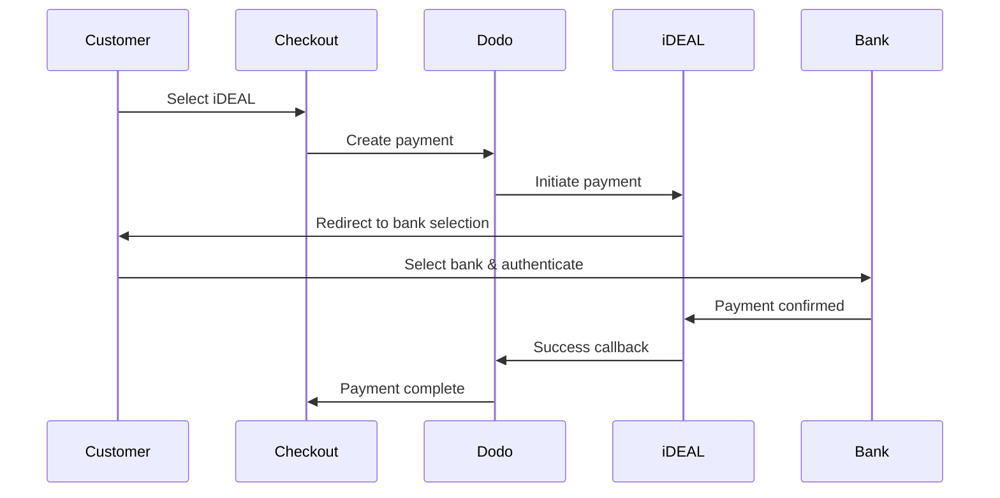

유럽 고객들은 은행 시스템과 통합된 지역 결제 수단을 강하게 선호합니다. 이러한 수단을 제공하면 목표 시장에서 전환율을 20-40% 높일 수 있습니다.

## 지역 유럽 결제 수단이 중요한 이유는?

<CardGroup cols={3}>
{/* LOCKED_PATTERN_efcf455d16a3d54177d3ce475c882342 */}
iDEAL는 네덜란드 온라인 결제의 약 60%를 점유합니다. 제공하지 않으면 고객을 잃게 됩니다.
</Card>

{/* LOCKED_PATTERN_6b22bf3bf0cf724ac8ed217c65843a32 */}
은행 인증 결제는 사기율이 거의 제로이며 청구 취소가 없습니다.
</Card>

{/* LOCKED_PATTERN_4a1acead7202a8a596c7a76e46cacb00 */}
대부분의 유럽 결제 방식은 즉각적인 결제 확인을 제공합니다.
</Card>
</CardGroup>

## 지원되는 방법

| 수단 | 국가 | 시장 점유율 | 통화 | 구독 |
| :----- | :------ | :----------- | :------- | :-----------: |
| **iDEAL** | 네덜란드 | ~60% | EUR | 아니오 |
| **Bancontact** | 벨기에 | ~50% | EUR | 아니오 |
| **EPS** | 오스트리아 | ~30% | EUR | 아니오 |
| **Multibanco** | 포르투갈 | ~40% | EUR | 아니오 |

## iDEAL (네덜란드)

iDEAL은 네덜란드에서 우세한 온라인 결제 수단으로, 모든 주요 네덜란드 은행에 직접 연결됩니다.

### 작동 방식



### 지원 은행

모든 주요 네덜란드 은행이 지원됩니다:
- ABN AMRO
- ASN Bank
- Bunq
- ING
- Knab
- Rabobank
- RegioBank
- Revolut
- SNS
- Triodos Bank
- Van Lanschot

### 구성

```javascript
const session = await client.checkoutSessions.create({
  product_cart: [{ product_id: 'prod_123', quantity: 1 }],
  allowed_payment_method_types: ['ideal', 'credit', 'debit'],
  billing_currency: 'EUR',
  billing_address: {
    country: 'NL',
    zipcode: '1012JS'
  },
  return_url: 'https://example.com/success'
});
```

## Bancontact (벨기에)

Bancontact는 벨기에의 국가 결제 시스템으로, 사실상 모든 벨기에 은행에서 온라인 결제에 사용됩니다.

### 특징
- 기존 벨기에 직불 카드와 호환
- 모바일 앱 지원 (Payconiq by Bancontact)
- 즉시 결제 확인
- 고객의 추가 등록 필요 없음

### 구성

```javascript
const session = await client.checkoutSessions.create({
  product_cart: [{ product_id: 'prod_123', quantity: 1 }],
  allowed_payment_method_types: ['bancontact_card', 'credit', 'debit'],
  billing_currency: 'EUR',
  billing_address: {
    country: 'BE',
    zipcode: '1000'
  },
  return_url: 'https://example.com/success'
});
```

## EPS (오스트리아)

EPS (Electronic Payment Standard)는 오스트리아 고객을 위한 직접 온라인 은행 송금을 가능하게 합니다.

### 특징
- 오스트리아 은행과의 직접 통합
- 실시간 결제 확인
- 오스트리아 소비자 간의 높은 신뢰
- 환불 없음

### 지원 은행

주요 오스트리아 은행 포함:
- Erste Bank
- Bank Austria
- Raiffeisen
- BAWAG
- Volksbank

### 구성

```javascript
const session = await client.checkoutSessions.create({
  product_cart: [{ product_id: 'prod_123', quantity: 1 }],
  allowed_payment_method_types: ['eps', 'credit', 'debit'],
  billing_currency: 'EUR',
  billing_address: {
    country: 'AT',
    zipcode: '1010'
  },
  return_url: 'https://example.com/success'
});
```

## Multibanco (포르투갈)

Multibanco는 포르투갈의 은행 간 네트워크로, 온라인 결제와 ATM 기반 결제를 제공합니다.

### 결제 옵션

1. **온라인 뱅킹** — 인터넷 뱅킹을 통한 직접 은행 송금
2. **ATM 결제** — 고객은 Multibanco ATM에서 결제할 수 있는 참조를 받습니다
3. **모바일 뱅킹** — 은행 모바일 앱을 통한 결제

### ATM 결제 작동 방식

ATM 결제의 경우, 고객은 결제 참조를 받습니다:

```
Entity: 12345
Reference: 123 456 789
Amount: €50.00
Expiry: 24 hours
```

고객은 이 참조를 사용하여 포르투갈의 모든 ATM에서 결제하거나 인터넷 뱅킹을 통해 결제할 수 있습니다.

### 구성

```javascript
const session = await client.checkoutSessions.create({
  product_cart: [{ product_id: 'prod_123', quantity: 1 }],
  allowed_payment_method_types: ['multibanco', 'credit', 'debit'],
  billing_currency: 'EUR',
  billing_address: {
    country: 'PT',
    zipcode: '1000-001'
  },
  return_url: 'https://example.com/success'
});
```

<Note>
Multibanco ATM 결제는 체크아웃과 실제 결제 사이에 지연이 있을 수 있습니다. 결제 확인을 위해 웹후크를 모니터링하세요.
</Note>

## API 방법 유형

| 유형 | 방식 | 국가 |
| :--- | :----- | :------ |
| `ideal` | iDEAL | Netherlands |
| `bancontact_card` | Bancontact | Belgium |
| `eps` | EPS | Austria |
| `multibanco` | Multibanco | Portugal |

## 다국적 유럽 체크아웃

여러 유럽 국가에 서비스를 제공하는 기업을 위해 모든 지역 방법을 포함하세요:

```javascript
const session = await client.checkoutSessions.create({
  product_cart: [{ product_id: 'prod_123', quantity: 1 }],
  allowed_payment_method_types: [
    'ideal',           // Netherlands
    'bancontact_card', // Belgium
    'eps',             // Austria
    'multibanco',      // Portugal
    'credit',          // Fallback
    'debit'            // Fallback
  ],
  billing_currency: 'EUR',
  return_url: 'https://example.com/success'
});
```

Dodo는 고객의 위치에 따라 관련 수단만 자동으로 표시합니다. 네덜란드 고객은 iDEAL을 보고, 벨기에 고객은 Bancontact를 보게 됩니다.

## 테스트

유럽 결제 수단은 샌드박스 모드에서 테스트할 수 있습니다. 테스트 흐름은 은행 인증 과정을 시뮬레이션합니다.

<Steps>
{/* LOCKED_PATTERN_540056f13df545529727751bb5b93f77 */}
Dodo Payments 테스트 API 키를 사용하세요.
</Step>

{/* LOCKED_PATTERN_7920d15f7caeeea70ea62bd0d8d57403 */}
결제 방식과 일치하도록 청구지 국가를 설정하세요:
- `NL`는 iDEAL용
- `BE`는 Bancontact용
- `AT`는 EPS용
- `PT`는 Multibanco용
</Step>

{/* LOCKED_PATTERN_69cef9ebb6025284f3e6858b286f99d9 */}
테스트 환경에서 시뮬레이션된 은행 인증 흐름을 따르세요.
</Step>
</Steps>

## 모범 사례

<AccordionGroup>
{/* LOCKED_PATTERN_6e39e352c5d82a18aefb4abc54215eac */}
네덜란드 고객에게 판매한다면 iDEAL을 포함하세요. 그렇게 하지 않으면 미국에서 Visa를 받지 않는 것과 같아 상당한 매출을 잃게 됩니다.
</Accordion>

{/* LOCKED_PATTERN_9c635a5b2c09ad8acceb0ae222fad819 */}
유럽 결제 방식은 EUR이 필요합니다. 가격이 유로 거래를 지원하는지 확인하세요.
</Accordion>

{/* LOCKED_PATTERN_5a50cae3439b9921374aaa8c0461b4a3 */}
모든 유럽 방식은 은행 사이트로 리디렉션됩니다. 리턴 URL 처리가 견고하고 중간에 흐름을 포기하는 사용자를 대비하는지 확인하세요.
</Accordion>

{/* LOCKED_PATTERN_3a32b87fb89df99c7fb6cbcd532fcd01 */}
모든 유럽 고객이 이 지역 방식에 접근할 수 있는 것은 아닙니다(관광객, 외국인 등). 항상 `credit` 및 `debit`를 대체 수단으로 포함하세요.
</Accordion>

{/* LOCKED_PATTERN_f4321c6674f862219007fe7c6201edc2 */}
Multibanco ATM 결제는 완료까지 몇 시간이 걸릴 수 있습니다. 즉시 결제에 따라 주문 처리를 차단하지 마세요 — 비동기 확인을 위해 웹후크를 사용하세요.
</Accordion>
</AccordionGroup>

## 문제 해결

<AccordionGroup>
{/* LOCKED_PATTERN_ccd66af742dc9530dea0480f544f049c */}
**확인:**
1. 고객의 청구 국가가 방식의 국가와 일치합니까?
2. 통화가 EUR로 설정되어 있습니까?
3. 방식이 `allowed_payment_method_types`에 포함되어 있습니까?

**해결책:** 유럽 방식은 엄격하게 지역별입니다. 청구 국가 `DE`(독일)인 고객은 네덜란드 전용인 iDEAL을 보지 못합니다.
</Accordion>

{/* LOCKED_PATTERN_e65da29a30abf8b0bab16429c0abbf51 */}
**원인:**
- 고객이 은행 인증 중에 취소함
- 은행 인증 시스템이 일시적으로 사용 불가함
- 고객이 잘못된 자격 증명을 입력함

**해결책:** 고객이 다시 시도해야 합니다. 지속적으로 실패하면 다른 결제 수단을 시도하도록 권장하세요.
</Accordion>

{/* LOCKED_PATTERN_6ec718ef8b359d908bb220922e56ef7a */}
**원인:**
- 고객이 은행 리디렉션 중 브라우저를 닫음
- 인증 중 네트워크 문제
- 리턴 URL이 잘못 구성됨

**해결책:** 리턴 URL이 정확하고 접근 가능한지 확인하세요. 성공 및 실패 상태를 모두 처리해야 합니다.
</Accordion>

{/* LOCKED_PATTERN_fc8a3a43e2635e2d30bc6ced94d88e30 */}
**원인:** 고객이 결제 참조를 받았지만 아직 결제하지 않음.

**해결책:** ATM 기반 결제에서는 예상되는 상황입니다. 웹후크 확인을 기다리세요. 참조는 일반적으로 24~72시간 후 만료됩니다.
</Accordion>
</AccordionGroup>

## PSD2 준수

모든 유럽 결제 수단은 PSD2(지급 서비스 지침 2) 규정을 준수합니다:

- **강력한 고객 인증(SCA)** — 은행 인증 흐름에 내장
- **안전한 통신** — 모든 데이터는 안전한 채널을 통해 전송
- **소비자 보호** — EU 소비자 권리에 대한 완전한 준수

## 관련 페이지

<CardGroup cols={2}>
{/* LOCKED_PATTERN_014d7e4ef5d99df996cbbae24da710a6 */}
지원되는 모든 결제 수단을 확인하세요.
</Card>

{/* LOCKED_PATTERN_0da642f750ba9399c6c82f3cf51c812c */}
통화 지원 및 자동 환전.
</Card>

{/* LOCKED_PATTERN_15f99901a394e4ce133a078d90e6360d */}
전체 체크아웃 구현 가이드.
</Card>

{/* LOCKED_PATTERN_4fdc255b113f889a339d4227d31c920b */}
결제 확인을 비동기적으로 처리하세요.
</Card>
</CardGroup>