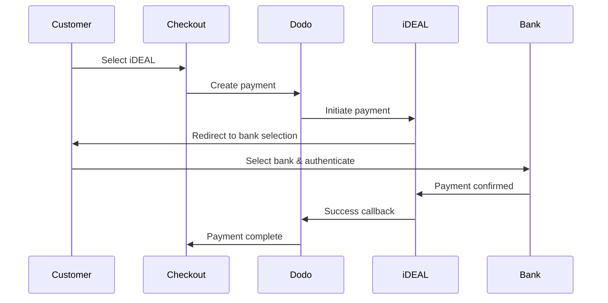

유럽 고객들은 은행 시스템과 통합된 지역 결제 수단을 강하게 선호합니다. 이러한 수단을 제공하면 목표 시장에서 전환율을 20-40% 높일 수 있습니다.

## 지역 유럽 결제 수단이 중요한 이유는?

<CardGroup cols={3}>
<Card title="높은 전환율" icon="chart-line">
iDEAL은 네덜란드 온라인 결제의 ~60%를 차지합니다. 이를 제공하지 않으면 고객을 잃게 됩니다.
</Card>

<Card title="낮은 사기율" icon="shield-check">
은행 인증 결제는 거의 제로의 사기율과 환불이 없습니다.
</Card>

<Card title="실시간 정산" icon="bolt">
대부분의 유럽 결제 수단은 즉시 결제 확인을 제공합니다.
</Card>
</CardGroup>

## 지원되는 방법

| 수단 | 국가 | 시장 점유율 | 통화 | 구독 |
| :----- | :------ | :----------- | :------- | :-----------: |
| **iDEAL** | 네덜란드 | ~60% | EUR | 아니오 |
| **Bancontact** | 벨기에 | ~50% | EUR | 아니오 |
| **EPS** | 오스트리아 | ~30% | EUR | 아니오 |
| **Multibanco** | 포르투갈 | ~40% | EUR | 아니오 |

## iDEAL (네덜란드)

iDEAL은 네덜란드에서 우세한 온라인 결제 수단으로, 모든 주요 네덜란드 은행에 직접 연결됩니다.

### 작동 방식



### 지원 은행

모든 주요 네덜란드 은행이 지원됩니다:
- ABN AMRO
- ASN Bank
- Bunq
- ING
- Knab
- Rabobank
- RegioBank
- Revolut
- SNS
- Triodos Bank
- Van Lanschot

### 구성

```javascript
const session = await client.checkoutSessions.create({
  product_cart: [{ product_id: 'prod_123', quantity: 1 }],
  allowed_payment_method_types: ['ideal', 'credit', 'debit'],
  billing_currency: 'EUR',
  billing_address: {
    country: 'NL',
    zipcode: '1012JS'
  },
  return_url: 'https://example.com/success'
});
```

## Bancontact (벨기에)

Bancontact는 벨기에의 국가 결제 시스템으로, 사실상 모든 벨기에 은행에서 온라인 결제에 사용됩니다.

### 특징
- 기존 벨기에 직불 카드와 호환
- 모바일 앱 지원 (Payconiq by Bancontact)
- 즉시 결제 확인
- 고객의 추가 등록 필요 없음

### 구성

```javascript
const session = await client.checkoutSessions.create({
  product_cart: [{ product_id: 'prod_123', quantity: 1 }],
  allowed_payment_method_types: ['bancontact_card', 'credit', 'debit'],
  billing_currency: 'EUR',
  billing_address: {
    country: 'BE',
    zipcode: '1000'
  },
  return_url: 'https://example.com/success'
});
```

## EPS (오스트리아)

EPS (Electronic Payment Standard)는 오스트리아 고객을 위한 직접 온라인 은행 송금을 가능하게 합니다.

### 특징
- 오스트리아 은행과의 직접 통합
- 실시간 결제 확인
- 오스트리아 소비자 간의 높은 신뢰
- 환불 없음

### 지원 은행

주요 오스트리아 은행 포함:
- Erste Bank
- Bank Austria
- Raiffeisen
- BAWAG
- Volksbank

### 구성

```javascript
const session = await client.checkoutSessions.create({
  product_cart: [{ product_id: 'prod_123', quantity: 1 }],
  allowed_payment_method_types: ['eps', 'credit', 'debit'],
  billing_currency: 'EUR',
  billing_address: {
    country: 'AT',
    zipcode: '1010'
  },
  return_url: 'https://example.com/success'
});
```

## Multibanco (포르투갈)

Multibanco는 포르투갈의 은행 간 네트워크로, 온라인 결제와 ATM 기반 결제를 제공합니다.

### 결제 옵션

1. **온라인 뱅킹** — 인터넷 뱅킹을 통한 직접 은행 송금
2. **ATM 결제** — 고객은 Multibanco ATM에서 결제할 수 있는 참조를 받습니다
3. **모바일 뱅킹** — 은행 모바일 앱을 통한 결제

### ATM 결제 작동 방식

ATM 결제의 경우, 고객은 결제 참조를 받습니다:

```
Entity: 12345
Reference: 123 456 789
Amount: €50.00
Expiry: 24 hours
```

고객은 이 참조를 사용하여 포르투갈의 모든 ATM에서 결제하거나 인터넷 뱅킹을 통해 결제할 수 있습니다.

### 구성

```javascript
const session = await client.checkoutSessions.create({
  product_cart: [{ product_id: 'prod_123', quantity: 1 }],
  allowed_payment_method_types: ['multibanco', 'credit', 'debit'],
  billing_currency: 'EUR',
  billing_address: {
    country: 'PT',
    zipcode: '1000-001'
  },
  return_url: 'https://example.com/success'
});
```

<Note>
Multibanco ATM 결제는 결제 후 실제 결제까지 지연이 발생할 수 있습니다. 결제 확인을 위해 웹훅을 모니터링하세요.
</Note>

## API 방법 유형

| 유형 | 수단 | 국가 |
| :--- | :----- | :------ |
| `ideal` | iDEAL | 네덜란드 |
| `bancontact_card` | Bancontact | 벨기에 |
| `eps` | EPS | 오스트리아 |
| `multibanco` | Multibanco | 포르투갈 |

## 다국적 유럽 체크아웃

여러 유럽 국가에 서비스를 제공하는 기업을 위해 모든 지역 방법을 포함하세요:

```javascript
const session = await client.checkoutSessions.create({
  product_cart: [{ product_id: 'prod_123', quantity: 1 }],
  allowed_payment_method_types: [
    'ideal',           // Netherlands
    'bancontact_card', // Belgium
    'eps',             // Austria
    'multibanco',      // Portugal
    'credit',          // Fallback
    'debit'            // Fallback
  ],
  billing_currency: 'EUR',
  return_url: 'https://example.com/success'
});
```

Dodo는 고객의 위치에 따라 관련 수단만 자동으로 표시합니다. 네덜란드 고객은 iDEAL을 보고, 벨기에 고객은 Bancontact를 보게 됩니다.

## 테스트

유럽 결제 수단은 샌드박스 모드에서 테스트할 수 있습니다. 테스트 흐름은 은행 인증 과정을 시뮬레이션합니다.

<Steps>
<Step title="테스트 모드 활성화">
Dodo Payments 테스트 API 키를 사용하세요.
</Step>

<Step title="적절한 청구 주소 설정">
청구 주소 국가를 결제 방법에 맞게 설정하세요:
- `NL` for iDEAL
- `BE` for Bancontact
- `AT` for EPS
- `PT` for Multibanco
</Step>

<Step title="테스트 흐름 완료">
테스트 환경에서 시뮬레이션된 은행 인증 흐름을 따르세요.
</Step>
</Steps>

## 모범 사례

<AccordionGroup>
<Accordion title="목표 시장에 대한 지역 방법 항상 포함하기">
네덜란드 고객에게 판매할 경우 iDEAL을 포함하세요. 그렇게 하지 않으면 미국에서 Visa를 수락하지 않는 것과 같아 — 상당한 매출을 잃게 됩니다.
</Accordion>

<Accordion title="지역에 맞는 통화 사용하기">
유럽 결제 수단은 EUR를 요구합니다. 가격이 유로 거래를 지원하는지 확인하세요.
</Accordion>

<Accordion title="리다이렉트를 우아하게 처리하기">
모든 유럽 방법은 은행 사이트로의 리다이렉트를 포함합니다. 성공 및 실패 상태를 처리하는 견고한 리턴 URL 처리가 필요합니다.
</Accordion>

<Accordion title="카드 대체 수단 제공하기">
모든 유럽 고객이 이러한 지역 방법에 접근할 수 있는 것은 아닙니다(관광객, 외국인 거주자 등). 항상 `credit` 및 `debit`를 대체 수단으로 포함하세요.
</Accordion>

<Accordion title="Multibanco 처리 시간 고려하기">
Multibanco ATM 결제는 완료하는 데 몇 시간이 걸릴 수 있습니다. 즉시 결제에 따라 이행을 차단하지 마세요 — 비동기 확인을 위해 웹훅을 사용하세요.
</Accordion>
</AccordionGroup>

## 문제 해결

<AccordionGroup>
<Accordion title="유럽 방법이 나타나지 않음">
**확인 사항:**
1. 고객 청구 국가가 방법의 국가와 일치합니까?
2. 통화가 EUR로 설정되어 있습니까?
3. `allowed_payment_method_types`에 방법이 포함되어 있습니까?

**해결책:** 유럽 방법은 철저히 지역적입니다. 청구 국가가 `DE` (독일)인 고객은 네덜란드 전용인 iDEAL을 보지 못합니다.
</Accordion>

<Accordion title="은행 인증 실패">
**원인:**
- 고객이 은행 인증 도중 취소함
- 은행 인증 시스템 일시적으로 비활성화됨
- 고객이 잘못된 자격 증명을 입력함

**해결책:** 고객에게 다시 시도하도록 하세요. 계속이 발생하는 경우 다른 결제 방법을 시도해 보라고 제안하세요.
</Accordion>

<Accordion title="리다이렉트가 완료되지 않음">
**원인:**
- 고객이 은행 리다이렉트 도중 브라우저를 닫음
- 인증 도중 네트워크 문제
- 리턴 URL 오류 구성

**해결책:** 리턴 URL이 올바르고 접근 가능한지 확인하세요. 성공 및 실패 상태를 모두 처리하도록 합니다.
</Accordion>

<Accordion title="Multibanco 결제 보류 중">
**원인:** 고객이 결제 참조를 받았지만 아직 결제하지 않음.

**해결책:** 이것은 ATM 기반 결제에 대해 예상되는 바입니다. 웹훅 확인을 기다리세요. 참조는 일반적으로 24-72시간 내에 만료됩니다.
</Accordion>
</AccordionGroup>

## PSD2 준수

모든 유럽 결제 수단은 PSD2(지급 서비스 지침 2) 규정을 준수합니다:

- **강력한 고객 인증(SCA)** — 은행 인증 흐름에 내장
- **안전한 통신** — 모든 데이터는 안전한 채널을 통해 전송
- **소비자 보호** — EU 소비자 권리에 대한 완전한 준수

## 관련 페이지

<CardGroup cols={2}>
<Card title="결제 방법 개요" icon="credit-card" href="/features/payment-methods">
지원되는 모든 결제 방법을 보세요.
</Card>

<Card title="적응형 통화" icon="globe" href="/features/adaptive-currency">
통화 지원 및 자동 변환.
</Card>

<Card title="체크아웃 가이드" icon="book" href="/developer-resources/checkout-session">
완전한 체크아웃 구현 가이드.
</Card>

<Card title="웹훅" icon="webhook" href="/developer-resources/webhooks">
결제 확인을 비동기적으로 처리하세요.
</Card>
</CardGroup>