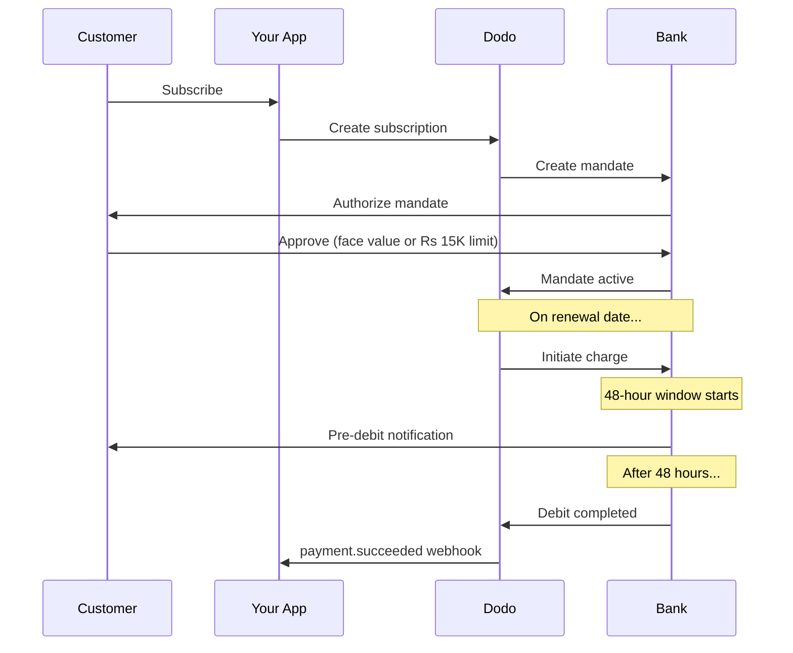

인도는 UPI(디지털 거래의 60% 이상)와 루페이 카드가 지배하는 독특한 결제 인프라를 갖추고 있습니다. 도도 페이먼트는 구독 지침에 대해 RBI 규정을 완전히 준수하며 두 가지를 모두 지원합니다.

## 인도 결제 수단이 중요한 이유

<CardGroup cols={3}>
<Card title="UPI Dominance" icon="mobile">
UPI는 월 100억 건 이상의 거래를 처리합니다. 많은 인도 고객이 국제 카드를 보유하지 않았습니다.
</Card>

<Card title="Low Transaction Costs" icon="indian-rupee-sign">
UPI는 거래 수수료가 거의 없습니다. 거래량이 많고 단가가 낮은 거래에 적합합니다.
</Card>

<Card title="Subscription Support" icon="repeat">
대부분의 대체 결제 수단과 달리 UPI와 루페이는 RBI 지침을 통해 반복 결제를 지원합니다.
</Card>
</CardGroup>

## 지원되는 수단

| 방법 | 유형 | 구독 | 최소 금액 |
| :----- | :--- | :-----------: | :--------- |
| **UPI Collect** | QR 코드 / VPA | 예* | ₹1 |
| **Rupay Credit** | 카드 | 예* | ₹1 |
| **Rupay Debit** | 카드 | 예* | ₹1 |

*구독은 특별 처리 규칙이 적용된 RBI 준수 지침이 필요합니다.

## 구성

### API 방식 유형

| 유형 | 설명 |
| :--- | :---------- |
| `upi_collect` | QR 코드 또는 VPA 입력을 통한 UPI |
| `credit` | 루페이를 포함한 신용카드 |
| `debit` | 루페이를 포함한 직불카드 |

### 예시: 인도 중심 체크아웃

```javascript
const session = await client.checkoutSessions.create({
  product_cart: [{ product_id: 'prod_123', quantity: 1 }],
  allowed_payment_method_types: [
    'upi_collect',
    'credit',
    'debit'
  ],
  billing_currency: 'INR',
  customer: {
    email: 'customer@example.in',
    name: 'Priya Sharma',
    phone_number: '+919876543210'
  },
  billing_address: {
    country: 'IN',
    zipcode: '560001'
  },
  return_url: 'https://example.com/success'
});
```

### UPI 요구사항

UPI가 체크아웃에 표시되려면:
1. **청구 국가**는 인도여야 합니다 (`IN`)
2. **통화**는 INR이어야 합니다
3. 인도 이외 판매자의 경우: **Adaptive Currency**를 활성화해야 합니다

<Warning>
인도 이외 판매자이고 Adaptive Currency가 활성화되어 있지 않으면 고객에게 UPI가 제공되지 않습니다.
</Warning>

## RBI 지침 기반 구독

인도 결제 수단 구독은 RBI(인도 준비은행) 규정 하에 고유한 요구사항으로 운영됩니다.

### RBI 지침 작동 방식



### 지침 유형

| 구독 금액 | 지침 유형 | 한도 |
| :------------------ | :----------- | :---- |
| **Rs 15,000 미만** | 요구형 지침 | Rs 15,000 |
| **Rs 15,000 이상** | 고정 금액 지침 | 정확한 구독 금액 |

**플랜 변경 시 중요:** 업그레이드로 인해 기존 지침 한도를 초과하는 요금이 발생하면 요금 청구에 실패하고 고객은 재승인해야 합니다.

### 48시간 처리 지연

이는 국제 카드 결제와 가장 큰 차이점입니다:

<Steps>
<Step title="Charge Initiated (Day 0)">
예정된 갱신일에 도도는 은행에 청구를 시작합니다.
</Step>

<Step title="Pre-Debit Notification">
고객은 은행으로부터 예정된 출금에 대한 알림을 받습니다.
</Step>

<Step title="48-Hour Window">
고객은 이 기간 동안 은행 앱을 통해 지침을 취소할 수 있습니다.
</Step>

<Step title="Debit Completed (~48-51 hours)">
48시간 후(은행 처리로 최대 3시간 추가 가능), 자금이 인출됩니다.
</Step>

<Step title="Webhook Sent">
`payment.succeeded` 웹후크는 실제 출금 이후에 전송되며, 시작 시점에는 전송되지 않습니다.
</Step>
</Steps>

<Warning>
**청구 시작 시점에 혜택을 제공하지 마세요.** 예정된 청구일로부터 약 48~51시간 후에 도착하는 `payment.succeeded` 웹후크를 기다리세요.
</Warning>

### 48시간 창 처리 방법

```javascript
// DON'T do this:
async function handleSubscriptionRenewal(subscription) {
  // ❌ Bad: Granting access immediately when charge is initiated
  grantPremiumAccess(subscription.customer_id);
}

// DO this:
async function handlePaymentWebhook(event) {
  if (event.type === 'payment.succeeded') {
    // ✅ Good: Only grant access after payment is confirmed
    grantPremiumAccess(event.data.customer_id);
  }
  
  if (event.type === 'payment.failed') {
    // Handle failed payment (mandate cancelled, insufficient funds)
    revokePremiumAccess(event.data.customer_id);
  }
}
```

### 인도 구독을 위한 웹후크 이벤트

| 이벤트 | 시기 | 행동 |
| :---- | :--- | :----- |
| `subscription.active` | 승인 의무화 시점 | 구독 시작 기록 |
| `payment.succeeded` | 청구일 약 48시간 후 | 액세스 부여/유지 |
| `payment.failed` | 출금 실패 | 고객 통지, 액세스 일시중지 |
| `subscription.on_hold` | 결제 실패 | 결제 수단 업데이트 요청 |
| `subscription.active` | 결제 후 재활성화 | 액세스 복원 |

## 테스트

### UPI 테스트 ID

| 상태 | UPI ID |
| :----- | :----- |
| 성공 | `success@upi` |
| 실패 | `failure@upi` |

### 인도 카드 테스트 번호

| 브랜드 | 시나리오 | 카드 번호 | 만료 | CVV |
| :---- | :------- | :---------- | :----- | :-- |
| Visa | 성공 | `4576238912771450` | 06/32 | 123 |
| Visa | 거절됨 | `4706131211212123` | 06/32 | 123 |
| Mastercard | 성공 | `5409162669381034` | 06/32 | 123 |
| Mastercard | 거절됨 | `5105105105105100` | 06/32 | 123 |

## 모범 사례

<AccordionGroup>
<Accordion title="Plan for the 48-hour delay">
청구 시작과 실제 결제 사이의 간극을 처리할 수 있도록 애플리케이션을 설계하세요. 다음을 고려하세요:
- 구독 접근을 위한 유예 기간
- 처리 시간에 대한 명확한 고객 안내
- 날짜 기반이 아닌 웹후크 중심 이행
</Accordion>

<Accordion title="Handle mandate cancellations">
고객은 은행 앱에서 언제든 지침을 취소할 수 있습니다. `subscription.on_hold` 웹후크를 모니터링하고 고객에게 재구독하거나 결제 수단을 업데이트하도록 안내하세요.
</Accordion>

<Accordion title="Set appropriate mandate amounts">
변동 가격(예: 사용 기반)인 경우 Rs 15,000 요구형 지침이 충분한지 고려하세요. 청구액이 이를 초과할 수 있다면 고객이 재승인해야 합니다.
</Accordion>

<Accordion title="Offer UPI prominently">
인도 고객에게는 UPI가 주요 결제 옵션이어야 합니다. 많은 사용자가 익숙하고 마찰이 적다는 이유로 카드를 대신 선호합니다.
</Accordion>
</AccordionGroup>

## 문제 해결

<AccordionGroup>
<Accordion title="UPI not appearing at checkout">
**확인:**
1. 청구 국가가 `IN`로 설정되어 있나요?
2. 통화가 `INR`로 설정되어 있나요?
3. 인도 외 상인인 경우: Adaptive Currency가 활성화되어 있나요?
4. `upi_collect`가 `allowed_payment_method_types`에 포함되어 있나요?

**해결 방법:** 청구 주소에 `country: "IN"` 및 `billing_currency: "INR"`이 포함되었는지 확인하세요.
</Accordion>

<Accordion title="Subscription charge failed after upgrade">
**원인:** 새로운 청구 금액이 기존 지침 한도(Rs 15,000 기준)를 초과했습니다.

**해결 방법:** 고객이 결제 수단을 업데이트하여 적절한 한도로 새 지침을 설정해야 합니다。
</Accordion>

<Accordion title="Subscription on hold but customer claims they didn't cancel">
**원인:** 고객이 48시간 창 동안 지침을 취소했거나 은행이 출금을 거부했을 수 있습니다.

**해결 방법:** 고객이 지침을 재승인하거나 결제 수단을 업데이트해야 합니다。
</Accordion>

<Accordion title="Payment deduction delayed beyond 48 hours">
**원인:** 은행 API 지연으로 인해 처리 시간이 2~3시간 더 길어질 수 있습니다.

**해결 방법:** 이는 예상되는 사항입니다. 시스템이 최대 약 51시간까지의 지연을 처리할 수 있도록 구축하세요。
</Accordion>

<Accordion title="Mandate cancelled but subscription still active">
**원인:** 처리 창에서 지침 취소가 즉시 구독 취소로 연결되지 않는 RBI 규정의 특수 사례입니다.

**해결 방법:** 다음 청구가 실패하고 구독은 `on_hold` 상태로 이동합니다. `payment.failed` 웹후크를 모니터링하세요。
</Accordion>
</AccordionGroup>

## 관련 페이지

<CardGroup cols={2}>
<Card title="Payment Methods Overview" icon="credit-card" href="/features/payment-methods">
지원되는 모든 결제 수단을 확인하세요。
</Card>

<Card title="Subscriptions" icon="repeat" href="/features/subscription">
RBI 지침을 포함한 전체 구독 문서를 확인하세요。
</Card>

<Card title="Webhooks" icon="webhook" href="/developer-resources/webhooks">
결제 이벤트에 대한 웹후크 처리。
</Card>

<Card title="Testing Process" icon="flask" href="/miscellaneous/testing-process">
UPI ID와 인도 카드 등 모든 테스트 데이터。
</Card>
</CardGroup>