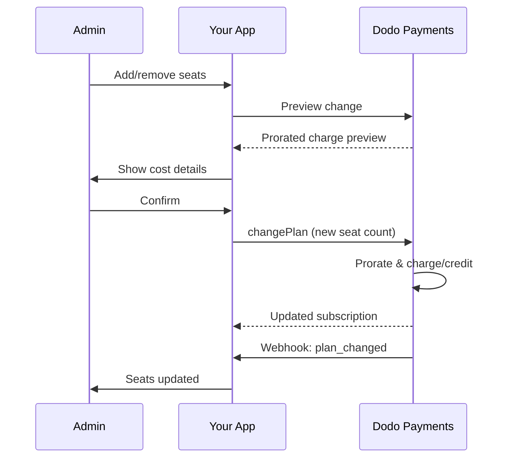

<Info>
좌석 기반 청구를 사용하면 고객이 필요한 사용자, 팀원 또는 라이선스 수를 기준으로 요금을 부과할 수 있습니다. 이는 팀 협업 도구, 엔터프라이즈 소프트웨어 및 B2B SaaS 제품의 표준 가격 모델입니다.
</Info>

<CardGroup cols={2}>
{/* LOCKED_PATTERN_5dfc50fd981c1ac3b2cf0747476bb603 */}
  단계별 가이드 및 코드 예제.
</Card>

{/* LOCKED_PATTERN_30543381f1fd7c60d748be8f75d9f37b */}
  좌석 기반 청구를 지원하는 애드온 시스템에 대해 알아보세요.
</Card>

{/* LOCKED_PATTERN_d4eae9dc8961f74fa117678acde32bcf */}
  좌석 기반 구독 및 요금제 변경을 관리하세요.
</Card>

{/* LOCKED_PATTERN_241c5464cd41914f29f11d1460552fad */}
  구독 웹후크를 통해 좌석 변경을 추적하세요.
</Card>
</CardGroup>

---

## 좌석 기반 청구란?

좌석 기반 청구(사용자별 또는 좌석별 가격 책정이라고도 함)는 고객이 제품에 접근하는 사용자 수에 따라 요금을 부과합니다. 고정 요금 대신 팀 규모에 따라 가격이 조정됩니다.

### 일반적인 사용 사례

| 산업 | 예시 | 가격 모델 |
|----------|---------|---------------|
| 팀 협업 | Slack, Notion, Asana | 활성 사용자 기준/월 |
| 개발 도구 | GitHub, GitLab, Jira | 좌석 기준/월 |
| CRM 소프트웨어 | Salesforce, HubSpot | 사용자 라이센스 기준 |
| 디자인 도구 | Figma, Canva | 편집자 좌석 기준 |
| 보안 소프트웨어 | 1Password, Okta | 사용자 기준/월 |
| 화상 회의 | Zoom, Teams | 호스트 라이센스 기준 |

### 좌석 기반 가격 책정의 이점

**귀하의 비즈니스를 위해:**
- 고객이 성장함에 따라 수익이 자연스럽게 증가
- 고객이 예산을 세울 수 있는 예측 가능한 가격
- 개인에서 팀, 기업으로의 명확한 업그레이드 경로
- 팀이 확장됨에 따라 더 높은 고객 생애 가치

**고객을 위해:**
- 사용하는 만큼만 지불
- 비용을 이해하고 예측하기 쉬움
- 필요에 따라 사용자 추가/제거의 유연성
- 팀 규모에 맞는 공정한 가격

---

## Dodo Payments에서의 좌석 기반 청구 작동 방식

Dodo Payments는 **부가 기능** 시스템을 사용하여 좌석 기반 청구를 구현합니다. 작동 방식은 다음과 같습니다:

### 아키텍처 개요

팀 프로 구독은 월 $99이며 5석이 포함됩니다. 5명 이상 사용자 있는 경우 추가 좌석당 월 $15를 더 내야 합니다. 

예: 팀이 15석이 필요할 경우:
- 기본 요금제: $99/월 (5석 포함)
- 애드온: 추가 10석 × $15/월 = $150/월
- 총 월 비용: $99 + $150 = 15석에 대해 $249

### 주요 구성 요소

| 구성 요소 | 목적 | 예시 |
|-----------|---------|---------|
| 기본 제품 | 포함된 좌석이 있는 핵심 구독 | "팀 요금제 - \$99/월 (5개 좌석 포함)" |
| 좌석 부가 기능 | 추가 사용자에 대한 좌석 요금 | "추가 좌석 - \$15/월" |
| 수량 | 구매한 추가 좌석 수 | 10개 추가 좌석 |

---

## 가격 책정 전략

비즈니스에 맞는 좌석 기반 가격 책정 전략을 선택하세요:

### 전략 1: 기본 + 좌석별 부가 기능

기본 요금제에 정해진 수의 좌석을 포함하고 추가 좌석에 대해 요금을 부과합니다.

**예시:**

```
Starter Plan: $49/month
├── Includes: 3 seats
├── Extra seats: $10/month each
└── 8 total seats = $49 + (5 × $10) = $99/month
```

**최고의 경우:** 소규모 팀이 기본 제공으로 기능할 수 있는 제품.

### 전략 2: 순수 좌석별 가격 책정

기본 요금 없이 좌석당 고정 요금을 부과합니다.

**예시:**

```
Per User: $12/month
├── 5 users = $60/month
├── 20 users = $240/month
└── 100 users = $1,200/month
```

**구현:** 기본 요금제를 \$0으로 설정하고 좌석 부가 기능만 사용합니다.

**최고의 경우:** 간단하고 투명한 가격 책정; 사용량 기반 모델.

### 전략 3: 계층형 좌석 가격 책정

다양한 기본 요금제와 서로 다른 좌석당 요금.

**예시:**

```
Starter: $0/month base + $15/seat
├── Lower features, higher per-seat cost

Professional: $99/month base + $10/seat
├── More features, lower per-seat cost

Enterprise: $499/month base + $7/seat
└── All features, volume discount on seats
```

**구현:** 각 계층에 대해 서로 다른 부가 기능 가격으로 별도의 제품을 만듭니다.

**최고의 경우:** 더 높은 계층으로의 업그레이드를 장려; 기업 판매.

### 전략 4: 좌석 번들

좌석을 개별적으로 판매하는 대신 묶음으로 판매합니다.

**예시:**

```
5-Seat Pack: $50/month ($10/seat)
10-Seat Pack: $80/month ($8/seat)
25-Seat Pack: $175/month ($7/seat)
```

**구현:** 다양한 묶음 크기에 대해 여러 부가 기능을 만듭니다.

**최고의 경우:** 구매 결정을 단순화; 더 큰 약속을 장려합니다.

---

## 좌석 기반 청구 설정하기

### 1단계: 가격 책정 계획하기

구현 전에 가격 구조를 정의합니다:

<Steps>
{/* LOCKED_PATTERN_8f90ecc6ba09743be9ab340aa5a551cf */}
기본 구독에 포함할 항목을 결정하세요:
- 기본 가격 (순수 좌석 기준일 경우 $0 가능)
- 포함된 좌석 수
- 해당 등급에서 사용할 수 있는 기능
</Step>

{/* LOCKED_PATTERN_170e31746a3dd1fcece04ceccae9b797 */}
추가 좌석 애드온 가격을 결정하세요:
- 추가 좌석당 가격
- 볼륨 할인 (다수의 애드온 활용)
- 최대 허용 좌석 수 (해당 시)
</Step>

{/* LOCKED_PATTERN_8c15c36cd0c3272db0db1a96e4d332dc */}
청구 주기에 맞춰 좌석 가격을 조정하세요:
- 월간 구독 → 월별 좌석 요금
- 연간 구독 → 연간 좌석 요금 (종종 할인됨)
</Step>
</Steps>

### 2단계: 좌석 부가 기능 만들기

Dodo Payments 대시보드에서:

1. **제품** → **부가 기능**으로 이동합니다.
2. **부가 기능 만들기**를 클릭합니다.
3. 부가 기능을 구성합니다:

| 필드 | 값 | 비고 |
|-------|-------|-------|
| 이름 | "추가 좌석" 또는 "팀원" | 명확하고 사용자 친화적인 이름 |
| 설명 | "작업 공간에 팀원을 추가하세요" | 고객이 얻는 것 설명 |
| 가격 | 좌석당 가격 | 예: \$10.00 |
| 통화 | 기본 제품과 일치 | 반드시 동일한 통화여야 함 |
| 세금 카테고리 | 기본 제품과 동일 | 일관된 세금 처리를 보장 |

<Tip>
청구서에서 이해하기 쉬운 설명적인 애드온 이름을 만드세요. "추가 팀 좌석"은 청구서를 확인하는 고객에게 "좌석 애드온"보다 더 명확합니다.
</Tip>

### 3단계: 기본 구독 만들기

구독 제품을 만듭니다:

1. **제품** → **제품 만들기**로 이동합니다.
2. **구독** 선택
3. 가격 및 세부정보 구성
4. **부가 기능** 섹션에서 좌석 부가 기능을 연결합니다.

### 4단계: 제품에 부가 기능 연결하기

좌석 부가 기능을 구독에 연결합니다:

1. 구독 제품을 편집합니다.
2. **부가 기능** 섹션으로 스크롤합니다.
3. **부가 기능 추가** 클릭
4. 좌석 부가 기능 선택
5. 변경 사항 저장

<Check>
귀하의 구독 상품은 이제 좌석 기반 가격 책정을 지원합니다. 고객은 체크아웃 중에 어느 수량의 추가 좌석이든 구매할 수 있습니다.
</Check>

---

## 좌석 관리

### 새로운 구독에 좌석 추가하기

체크아웃 세션을 생성할 때 좌석 수를 지정합니다:

```typescript
const session = await client.checkoutSessions.create({
  product_cart: [{
    product_id: 'prod_team_plan',
    quantity: 1,
    addons: [{
      addon_id: 'addon_seat',
      quantity: 10  // 10 additional seats
    }]
  }],
  customer: { email: 'admin@company.com' },
  return_url: 'https://yourapp.com/success'
});
```

### 기존 구독의 좌석 수 변경하기

좌석을 조정하려면 Change Plan API를 사용합니다:

```typescript
// Add 5 more seats to existing subscription
await client.subscriptions.changePlan('sub_123', {
  product_id: 'prod_team_plan',
  quantity: 1,
  proration_billing_mode: 'prorated_immediately',
  addons: [{
    addon_id: 'addon_seat',
    quantity: 15  // New total: 15 additional seats
  }]
});
```

### 좌석 제거하기

좌석 수를 줄이려면 더 낮은 수량을 지정합니다:

```typescript
// Reduce from 15 to 8 additional seats
await client.subscriptions.changePlan('sub_123', {
  product_id: 'prod_team_plan',
  quantity: 1,
  proration_billing_mode: 'difference_immediately',
  addons: [{
    addon_id: 'addon_seat',
    quantity: 8  // Reduced to 8 additional seats
  }]
});
```

### 모든 추가 좌석 제거하기

모든 부가 기능을 제거하려면 빈 addons 배열을 전달합니다:

```typescript
// Remove all additional seats, keep only base plan seats
await client.subscriptions.changePlan('sub_123', {
  product_id: 'prod_team_plan',
  quantity: 1,
  proration_billing_mode: 'difference_immediately',
  addons: []  // Removes all add-ons
});
```

---

## 좌석 변경에 대한 비례 배분

고객이 중간 주기에 좌석을 추가하거나 제거할 때 비례 배분이 청구 방식을 결정합니다.



### 비례 배분 모드

| 모드 | 좌석 추가 | 좌석 제거 |
|------|-------------|----------------|
| `prorated_immediately` | 청구 주기의 남은 기간에 대해 요금 부과 | 사용하지 않은 기간에 대해 크레딧 부여 |
| `difference_immediately` | 전체 좌석 요금 청구 | 향후 갱신에 크레딧 적용 |
| `full_immediately` | 전체 좌석 요금 청구, 청구 주기 재설정 | 크레딧 없음 |

### 비례 배분 예시

**시나리오: 남은 청구 주기 15일, 좌석 5개를 좌석당 $10에 추가**

<Tabs>
{/* LOCKED_PATTERN_7648ba425844faa1251e7c2508881bd6 */}

```
Prorated charge = ($10 × 5 seats) × (15 days / 30 days)
                = $50 × 0.5
                = $25 immediate charge
```

고객은 지금 $25를 지불하고 이후 갱신 시 $50/월을 납부합니다.
</Tab>

{/* LOCKED_PATTERN_14967e5128d43a5dabfd1120fa81b437 */}

```
Immediate charge = $10 × 5 seats = $50
```

고객은 청구 주기 위치와 관계없이 지금 $50 전액을 지불합니다.
</Tab>

{/* LOCKED_PATTERN_4e8bc31cac215c51dc616cc2b4d7cae7 */}

```
Immediate charge = Full subscription + add-ons
Billing cycle resets to today
```

고객은 전액을 지불하고 새로운 청구 주기가 시작됩니다.
</Tab>
</Tabs>

**시나리오: prorated_immediately로 사이클 중간에 좌석 3개 제거**

```
Current: Team Plan ($99/month) + 10 extra seats × $10/seat = $199/month
Change: Remove 3 seats (10 → 7 extra seats) on day 20 of 30-day cycle
Remaining: 10 days

Credit for removed seats:
  = ($10 × 3 seats) × (10 days / 30 days)
  = $30 × 0.333
  = $10.00 credit

→ $10.00 credit added to subscription
→ Next renewal: $99 + (7 × $10) = $169.00/month
→ Credit auto-applies: $169.00 − $10.00 = $159.00 on next invoice
```

<Tip>
**좌석 변경을 위한 비례 배분 모드 선택**: 팀이 자주 좌석을 조정한다면 일 단위 요금이 공정한 `prorated_immediately`을 사용하세요. 전 좌석 가격을 기준으로 더 간단한 계산을 원하면 `difference_immediately`을 사용하여 전체 좌석 요금을 청구하거나 크레딧을 부여하세요. 자세한 비교는 [비례 배분 가이드](/developer-resources/subscription-upgrade-downgrade#proration-modes)를 참조하세요.
</Tip>

### 변경하기 전에 미리보기

변경하기 전에 항상 비례 배분을 미리 보세요:

```typescript
const preview = await client.subscriptions.previewChangePlan('sub_123', {
  product_id: 'prod_team_plan',
  quantity: 1,
  proration_billing_mode: 'prorated_immediately',
  addons: [{ addon_id: 'addon_seat', quantity: 20 }]
});

console.log('Immediate charge:', preview.immediate_charge.summary);
// Show customer: "Adding 5 seats will cost $25 today"
```

---

## 웹후크로 좌석 추적

좌석 변경을 추적하려면 구독 웹후크를 수신하세요:

### 관련 이벤트

| 이벤트 | 발생 시점 | 사용 사례 |
|-------|----------------|----------|
| `subscription.active` | 새 구독이 활성화될 때 | 초기 좌석을 할당하세요 |
| `subscription.plan_changed` | 좌석이 추가되거나 제거될 때 | 앱 내 좌석 수를 업데이트하세요 |
| `subscription.renewed` | 구독이 갱신될 때 | 좌석 수가 변하지 않았는지 확인하세요 |
| `subscription.cancelled` | 구독이 취소될 때 | 모든 좌석을 해제하세요 |

### 웹후크 핸들러 예시

```typescript
app.post('/webhooks/dodo', async (req, res) => {
  const event = req.body;

  switch (event.type) {
    case 'subscription.active':
      // New subscription - provision seats
      const seats = calculateTotalSeats(event.data);
      await provisionSeats(event.data.customer_id, seats);
      break;

    case 'subscription.plan_changed':
      // Seats changed - update access
      const newSeats = calculateTotalSeats(event.data);
      await updateSeatCount(event.data.subscription_id, newSeats);
      break;

    case 'subscription.cancelled':
      // Subscription cancelled - deprovision
      await deprovisionAllSeats(event.data.subscription_id);
      break;
  }

  res.json({ received: true });
});

function calculateTotalSeats(subscriptionData) {
  const baseSeats = 5;  // Included in plan
  const addonSeats = subscriptionData.addons?.reduce(
    (total, addon) => total + addon.quantity, 0
  ) || 0;
  return baseSeats + addonSeats;
}
```

---

## 좌석 제한 적용

애플리케이션에서 좌석 제한을 반드시 적용하세요. Dodo Payments가 청구를 추적하지만 접근 제어는 귀하가 책임집니다.

### 적용 전략

<Tabs>
{/* LOCKED_PATTERN_1d31b7e688044b0efbd19ad2d6fe35e3 */}
좌석 수를 초과하는 사용자가 추가되지 않도록 엄격히 방지하세요.

```typescript
async function inviteUser(teamId: string, email: string) {
  const team = await getTeam(teamId);
  const subscription = await getSubscription(team.subscriptionId);
  const totalSeats = calculateTotalSeats(subscription);
  const usedSeats = await countTeamMembers(teamId);

  if (usedSeats >= totalSeats) {
    throw new Error('No seats available. Please upgrade your plan.');
  }

  await sendInvitation(teamId, email);
}
```

</Tab>

{/* LOCKED_PATTERN_13b3f8c9c63e02e97bed8afbecbc9f91 */}
경고와 유예 기간을 두고 초과를 허용하세요.

```typescript
async function inviteUser(teamId: string, email: string) {
  const team = await getTeam(teamId);
  const { totalSeats, usedSeats } = await getSeatInfo(team);

  if (usedSeats >= totalSeats) {
    // Allow but flag for billing
    await flagOverage(teamId, usedSeats - totalSeats + 1);
    await notifyAdmin(team.adminEmail, 'You have exceeded your seat limit');
  }

  await sendInvitation(teamId, email);
}
```

</Tab>

{/* LOCKED_PATTERN_b053ebd757bb6327d33717eadf7a8f52 */}
제한에 도달하면 자동으로 좌석을 추가하세요.

```typescript
async function inviteUser(teamId: string, email: string) {
  const team = await getTeam(teamId);
  const { totalSeats, usedSeats, subscriptionId } = await getSeatInfo(team);

  if (usedSeats >= totalSeats) {
    // Automatically add a seat
    await client.subscriptions.changePlan(subscriptionId, {
      product_id: team.productId,
      quantity: 1,
      proration_billing_mode: 'prorated_immediately',
      addons: [{ addon_id: 'addon_seat', quantity: totalSeats - baseSeats + 1 }]
    });

    await notifyAdmin(team.adminEmail, 'A new seat was added to your plan');
  }

  await sendInvitation(teamId, email);
}
```

</Tab>
</Tabs>

---

## 고급 패턴

### 다양한 좌석 유형

다른 가격으로 다양한 좌석 유형을 제공하세요:

```
Full Seats: $20/month - Full access to all features
View-Only Seats: $5/month - Read-only access
Guest Seats: $0/month - Limited external collaborator access
```

**구현 방법:** 좌석 유형마다 별도의 애드온을 만드세요.

```typescript
const session = await client.checkoutSessions.create({
  product_cart: [{
    product_id: 'prod_team_plan',
    quantity: 1,
    addons: [
      { addon_id: 'addon_full_seat', quantity: 10 },
      { addon_id: 'addon_viewer_seat', quantity: 25 },
      { addon_id: 'addon_guest_seat', quantity: 50 }
    ]
  }]
});
```

### 연간 좌석 할인

할인된 연간 좌석 가격을 제공하세요:

```
Monthly: $15/seat/month
Annual: $12/seat/month (20% savings)
```

**구현 방법:** 월간 및 연간 요금제에 대해 서로 다른 애드온 가격으로 별도 상품을 만드세요.

### 최소 좌석 요건

일부 요금제에는 최소 좌석 수를 요구하세요:

```typescript
async function validateSeatCount(planId: string, seatCount: number) {
  const minimums = {
    'prod_starter': 1,
    'prod_team': 5,
    'prod_enterprise': 25
  };

  if (seatCount < minimums[planId]) {
    throw new Error(`${planId} requires at least ${minimums[planId]} seats`);
  }
}
```

---

## 모범 사례

### 가격 책정 모범 사례

- **명확한 소통**: 가격 페이지에 좌석당 가격을 눈에 띄게 표시하세요
- **포함된 좌석**: 마찰을 줄이기 위해 기본 가격에 몇 좌석을 포함하는 것을 고려하세요
- **볼륨 할인**: 대형 팀에 대해 좌석당 요금을 낮춰 엔터프라이즈 계약을 따내세요
- **연간 인센티브**: 현금 흐름과 유지율을 높이기 위해 연간 요금제를 할인하세요

### 기술적 모범 사례

- **좌석 수 캐시**: 매 요청마다 API 호출을 피하기 위해 구독 좌석 수를 로컬에 캐시하세요
- **정기 동기화**: API를 통해 로컬 좌석 수를 Dodo Payments와 주기적으로 동기화하세요
- **실패 처리**: 좌석 변경이 실패하면 명확한 오류 메시지와 재시도 옵션을 제공하세요
- **감사 로그**: 청구 분쟁 및 규정 준수를 위해 모든 좌석 변경을 기록하세요

### 사용자 경험 모범 사례

- **실시간 피드백**: 좌석을 조정할 때 즉시 비용 영향을 보여주세요
- **확인 단계**: 청구 변경 전에 확인을 요구하세요
- **비례 배분 투명성**: 적용 전에 비례 배분 요금을 명확히 설명하세요
- **쉬운 축소**: 좌석 수를 줄이는 것을 어렵게 만들지 마세요 (신뢰를 쌓습니다)

---

## 문제해결

<AccordionGroup>
{/* LOCKED_PATTERN_4a54068c0366de7cd698037f63ad06d7 */}
**증상**: 애플리케이션이 구독과 다른 좌석 수를 표시합니다.

**원인**:
- 웹후크를 수신하지 못했거나 처리되지 않음
- 좌석 변경 중 경쟁 상태 발생
- 캐시된 데이터가 업데이트되지 않음

**해결 방법**:
1. `subscription.plan_changed`에 대한 웹후크 핸들러를 구현하세요
2. 현재 구독을 가져오는 "청구와 동기화" 버튼을 추가하세요
3. 정기적인 갱신을 보장하기 위해 캐시 TTL을 설정하세요
</Accordion>

{/* LOCKED_PATTERN_62506e5aa738923207d9cef5cba18998 */}
**증상**: 고객이 사이클 중간 청구 금액에 혼란스러워합니다.

**원인**:
- 비례 배분 모드가 명확히 전달되지 않음
- 고객이 확인 전에 미리보기를 보지 못함

**해결 방법**:
1. 변경하기 전에 항상 `previewChangePlan`을 사용하세요
2. “좌석 X개 추가 = 오늘 $Y (Z일 동안 비례 배분됨)”처럼 명확한 내역을 보여주세요
3. 도움말 센터에 비례 배분 정책을 문서화하세요
</Accordion>

{/* LOCKED_PATTERN_a0edc83ae355b61df85c2a2a9b2f2774 */}
**증상**: 체크아웃 중에 좌석 애드온을 사용할 수 없습니다.

**원인**:
- 애드온이 상품에 연결되지 않음
- 애드온이 보관되었거나 삭제됨
- 상품과 애드온 간 통화 불일치

**해결 방법**:
1. 상품 설정에서 애드온이 연결되어 있는지 확인하세요
2. 애드온 대시보드에서 상태를 확인하세요
3. 통화가 정확히 일치하는지 확인하세요
</Accordion>

{/* LOCKED_PATTERN_a1ec125a9845064654c125fd57ed0115 */}
**증상**: 고객이 좌석을 줄이려 하지만 사용자에게 할당된 상태입니다.

**해결 방법**:
1. 좌석을 줄이기 전에 제거해야 할 사용자를 보여주세요
2. 워크플로우를 구현하세요: 사용자 제거 → 좌석 감소
3. 좌석 감소를 시행하기 전에 유예 기간을 고려하세요
</Accordion>
</AccordionGroup>

---

## 관련 문서

<CardGroup cols={2}>
{/* LOCKED_PATTERN_67d22b5654e273ff1785a13fd2a08eef */}
  코드 포함 완전한 구현 가이드.
</Card>

{/* LOCKED_PATTERN_64b8932d6eae113337e408ad28c3e677 */}
  애드온 시스템을 깊이 이해하세요.
</Card>

{/* LOCKED_PATTERN_61918d5684b68ec0c29a61927d4aac95 */}
  구독 수정 처리.
</Card>

{/* LOCKED_PATTERN_a38ca2694c5ac00d14f82dd9641df0b4 */}
  구독 이벤트 추적.
</Card>
</CardGroup>
