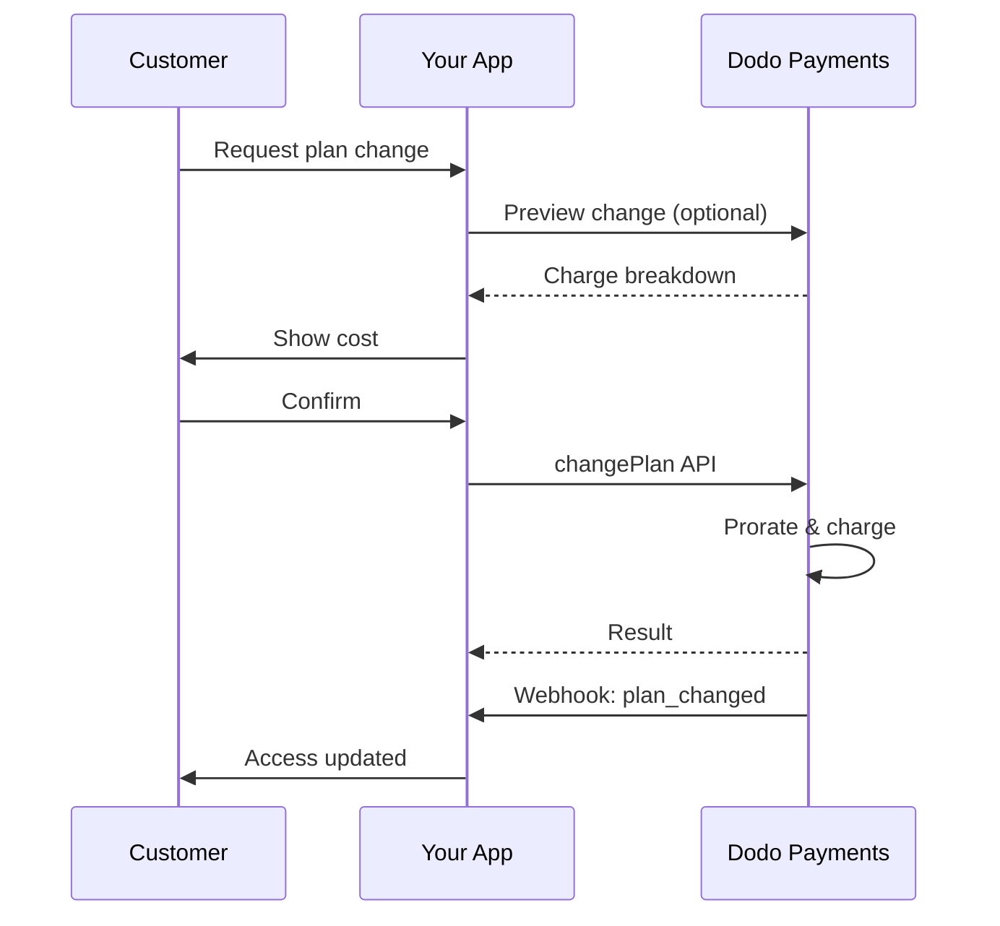
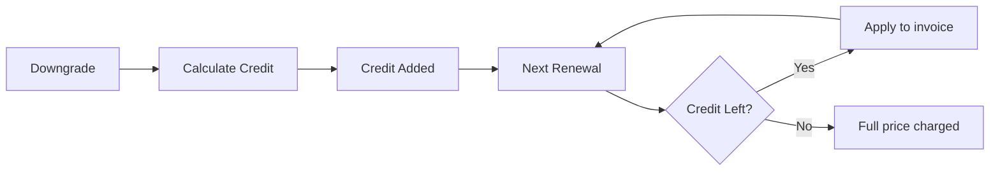

<Info>
구독을 통해 자동 갱신되는 지속적인 액세스를 판매할 수 있습니다. 유연한 청구 주기, 무료 평가판, 요금제 변경 및 추가 기능을 활용하여 각 고객에게 맞춤 가격을 제공하세요.
</Info>

<CardGroup cols={2}>
<Card title="Upgrade & Downgrade" icon="repeat" href="/developer-resources/subscription-upgrade-downgrade">
요금제 변경은 정산 및 수량 업데이트로 관리하세요.
</Card>

<Card title="On‑Demand Subscriptions" icon="bolt" href="/developer-resources/ondemand-subscriptions">
지금 약정(mandate)을 승인하고 나중에 맞춤 금액으로 청구하세요.
</Card>

<Card title="Customer Portal" icon="id-card" href="/features/customer-portal">
고객이 요금제, 청구, 취소를 직접 관리할 수 있게 하세요.
</Card>

<Card title="Subscription Webhooks" icon="code" href="/developer-resources/webhooks/intents/subscription">
생성, 갱신, 취소 같은 라이프사이클 이벤트에 대응하세요.
</Card>
</CardGroup>

## 구독이란 무엇인가요?

구독은 고객이 일정에 따라 구매하는 반복 제품입니다. 다음과 같은 경우에 적합합니다:

- **SaaS 라이센스**: 앱, API 또는 플랫폼 액세스
- **회원제**: 커뮤니티, 프로그램 또는 클럽
- **디지털 콘텐츠**: 강의, 미디어 또는 프리미엄 콘텐츠
- **지원 계획**: SLA, 성공 패키지 또는 유지 관리

## 주요 이점

- **예측 가능한 수익**: 자동 갱신이 포함된 반복 청구
- **유연한 주기**: 월별, 연간, 사용자 정의 간격 및 체험판
- **요금제 민첩성**: 업그레이드 및 다운그레이드에 대한 비례 배분
- **추가 기능 및 좌석**: 선택적, 수량화 가능한 업그레이드 첨부
- **원활한 체크아웃**: 호스팅된 체크아웃 및 고객 포털
- **개발자 우선**: 생성, 변경 및 사용 추적을 위한 명확한 API

## 구독 생성하기

Dodo Payments 대시보드에서 구독 제품을 생성한 후 체크아웃 또는 API를 통해 판매하세요. 제품과 활성 구독을 분리하면 가격 버전을 관리하고 추가 기능을 첨부하며 성과를 독립적으로 추적할 수 있습니다.

### 구독 제품 생성

대시보드에서 필드를 구성하여 구독이 판매, 갱신 및 청구되는 방식을 정의하세요. 아래 섹션은 생성 양식에서 보는 내용과 직접적으로 연결됩니다.

#### 제품 세부정보

- **제품 이름** (필수): 체크아웃, 고객 포털 및 송장에 표시되는 이름입니다.
- **제품 설명** (필수): 체크아웃 및 송장에 표시되는 명확한 가치 설명입니다.
- **제품 이미지** (필수): PNG/JPG/WebP 최대 3MB. 체크아웃 및 송장에서 사용됩니다.
- **브랜드**: 특정 브랜드와 제품을 연결하여 테마 및 이메일에 사용합니다.
- **세금 카테고리** (필수): 세금 규칙을 결정하기 위해 카테고리(예: SaaS)를 선택합니다.

<Tip>
가장 정확한 세금 범주를 선택하여 지역별 세금 징수가 올바르게 이루어지도록 하세요.
</Tip>

#### 가격 책정

- **가격 유형**: <b>구독</b> (이 가이드) 선택. 대안으로는 일회성 결제 및 사용 기반 청구가 있습니다.
- **가격** (필수): 통화가 포함된 기본 반복 가격.
- **적용 가능한 할인 (%)**: 기본 가격에 적용되는 선택적 비율 할인; 체크아웃 및 송장에 반영됩니다.
- **매 반복 결제** (필수): 갱신 간격, 예: 매 1개월. 주기(개월 또는 년)와 수량을 선택합니다.
- **구독 기간** (필수): 구독이 활성 상태로 유지되는 총 기간 (예: 10년). 이 기간이 끝나면 연장이 없는 한 갱신이 중단됩니다.
- **체험 기간 일수** (필수): 체험 길이를 일수로 설정합니다. 체험을 비활성화하려면 0을 사용합니다. 체험이 끝나면 첫 번째 요금이 자동으로 발생합니다.
- **추가 기능 선택**: 고객이 기본 요금제와 함께 구매할 수 있는 최대 10개의 추가 기능을 첨부합니다.

<Warning>
활성 제품의 가격을 변경하면 신규 구매에만 적용되며, 기존 구독은 요금제 변경 및 정산 설정을 따릅니다.
</Warning>

<Info>
추가 기능은 좌석 수나 저장 공간과 같이 수량화 가능한 부가 요금에 적합합니다. 고객이 변경할 때 허용 수량과 정산 동작을 제어할 수 있습니다.
</Info>

#### 고급 설정

- **세금 포함 가격**: 적용 가능한 세금을 포함한 가격을 표시합니다. 최종 세금 계산은 여전히 고객 위치에 따라 다릅니다.
- **라이센스 키 생성**: 구매 후 각 고객에게 고유한 키를 발급합니다. <a href="/features/license-keys">라이센스 키</a> 가이드를 참조하세요.
- **디지털 제품 배송**: 구매 후 파일이나 콘텐츠를 자동으로 전달합니다. <a href="/features/digital-product-delivery">디지털 제품 배송</a>에서 자세히 알아보세요.
- **메타데이터**: 내부 태그 지정 또는 클라이언트 통합을 위해 사용자 정의 키-값 쌍을 첨부합니다. <a href="/api-reference/metadata">메타데이터</a>를 참조하세요.

<Tip>
메타데이터를 사용하여 계정 ID 등 시스템 식별자를 저장해 나중에 이벤트와 인보이스를 조정하세요.
</Tip>

## 구독 체험

체험을 통해 고객은 즉시 결제 없이 구독에 액세스할 수 있습니다. 체험이 끝나면 첫 번째 청구가 자동으로 발생합니다.

### 체험 구성

제품 가격 섹션에서 **Trial Period Days**를 설정하세요 (비활성화하려면 `0`). 구독 생성 시 이를 재정의할 수 있습니다:

```typescript
// Via subscription creation
const subscription = await client.subscriptions.create({
  customer_id: 'cus_123',
  product_id: 'prod_monthly',
  trial_period_days: 14  // Overrides product's trial period
});

// Via checkout session
const session = await client.checkoutSessions.create({
  product_cart: [{ product_id: 'prod_monthly', quantity: 1 }],
  subscription_data: { trial_period_days: 14 }
});
```

<Warning>
`trial_period_days` 값은 0~10,000일 사이여야 합니다.
</Warning>

### 체험 상태 감지

<Warning>
현재 트라이얼 상태를 직접 감지하는 필드는 없습니다. 다음은 결제를 조회해야 하는 비효율적인 우회 방식이며, 더 효율적인 솔루션을 개발 중입니다.
</Warning>

구독이 체험 중인지 확인하려면 구독의 결제 목록을 검색하세요. 금액이 0인 결제가 정확히 하나 있는 경우, 구독은 체험 기간에 있습니다:

```typescript
const subscription = await client.subscriptions.retrieve('sub_123');
const payments = await client.payments.list({
  subscription_id: subscription.subscription_id
});

// Check if subscription is in trial
const isInTrial = payments.items.length === 1 && 
                  payments.items[0].total_amount === 0;
```

### 체험 기간 업데이트

평가판을 연장하려면 다음 값을 업데이트하세요:

```typescript
await client.subscriptions.update('sub_123', {
  next_billing_date: '2025-02-15T00:00:00Z'  // New trial end date
});
```

<Warning>
`next_billing_date`을 과거 시간으로 설정할 수 없습니다. 날짜는 미래여야 합니다.
</Warning>

## 구독 요금제 변경

요금제 변경을 통해 구독을 업그레이드하거나 다운그레이드하고, 수량을 조정하거나 다른 제품으로 마이그레이션할 수 있습니다. 각 변경은 선택한 비례 배분 모드에 따라 즉시 요금을 부과합니다.

<Tip>
Dodo Payments 대시보드에서 직접 구독 요금제를 변경하고 다음 청구일을 업데이트할 수 있습니다. 이를 통해 API 호출 없이 고객 지원 요청, 프로모션 업그레이드, 요금제 마이그레이션을 빠르게 처리할 수 있습니다.
</Tip>

<Tip>
셀프서비스 요금제 변경 활성화: 고객이 고객 포털을 통해 직접 업그레이드/다운그레이드 하도록 하려면 구독 제품을 제품 컬렉션에 추가하고 구독 설정에서 "Allow Subscription Updates"를 활성화하세요.
</Tip>



<Card title="Product Collections" icon="layer-group" href="/features/product-collections">
  관련 제품을 컬렉션으로 묶어 고객 포털에서 원활한 업그레이드/다운그레이드 경로를 제공하세요.
</Card>

### 정산 모드

요금제를 변경할 때 고객 청구 방식을 선택하세요:

<Info>
**세 가지 정산 모드 간단 비교:**

| | `prorated_immediately` | `difference_immediately` | `full_immediately` |
|---|---|---|---|
| **업그레이드** | 남은 기간에 대한 정산 요금 | 전체 가격 차이 청구 | 새 요금제 전체 가격 청구 |
| **다운그레이드** | 남은 기간에 대한 정산 크레딧 | 가격 차이를 크레딧으로 처리 | 크레딧 없이 전체 금액 청구 |
| **청구 주기** | 변경 없음 | 변경 없음 | 오늘로 리셋 |
| **추천 상황** | 시간 기반 공정한 과금 | 간단한 계층 변경 | 청구 주기 재설정 |
</Info>

#### `prorated_immediately`
현재 청구 주기의 남은 시간 기준으로 정산 금액을 부과합니다. 미사용 시간을 고려한 공정한 과금에 적합합니다.

```typescript
await client.subscriptions.changePlan('sub_123', {
  product_id: 'prod_pro',
  quantity: 1,
  proration_billing_mode: 'prorated_immediately'
});
```

#### `difference_immediately`
즉시 가격 차이를 청구하거나(업그레이드) 미래 갱신에 대한 크레딧을 추가합니다(다운그레이드). 간단한 업그레이드/다운그레이드 상황에 적합합니다.

```typescript
// Upgrade: charges $50 (difference between $30 and $80)
// Downgrade: credits remaining value, auto-applied to renewals
await client.subscriptions.changePlan('sub_123', {
  product_id: 'prod_pro',
  quantity: 1,
  proration_billing_mode: 'difference_immediately'
});
```

<Info>
`difference_immediately`을 사용한 다운그레이드 크레딧은 구독 범위이며 자동으로 미래 갱신에 적용됩니다. 이는 <a href="/features/customer-credit">Customer Credits</a>과 구분됩니다.
</Info>

고객이 `difference_immediately`으로 다운그레이드하면 미사용 금액이 구독 범위 크레딧이 되어 자동으로 미래 갱신 상쇄:



#### `full_immediately`
남은 시간을 무시하고 즉시 새 요금제 전체 금액을 청구합니다. 청구 주기 재설정에 적합합니다.

```typescript
await client.subscriptions.changePlan('sub_123', {
  product_id: 'prod_monthly',
  quantity: 1,
  proration_billing_mode: 'full_immediately'
});
```

<AccordionGroup>
<Accordion title="Example: Prorated upgrade calculation">

**시나리오**: 30일 주기의 16일째에 Basic ($30/월) 고객이 `prorated_immediately`를 사용하여 Pro ($80/월)로 업그레이드합니다.

```
Unused credit from Basic = $30 × (15 remaining / 30 total) = $15.00
Prorated cost of Pro     = $80 × (15 remaining / 30 total) = $40.00
────────────────────────────────────────────────────────────────────
Immediate charge         = $40.00 − $15.00 = $25.00
```

다음 갱신은 원래 청구일에 발생하며: **$80.00/월**.

<Tip>
자세한 계산 예제와 엣지 케이스는 전체 [Upgrade & Downgrade Guide](/developer-resources/subscription-upgrade-downgrade)를 참조하세요.
</Tip>

</Accordion>
<Accordion title="Example: Downgrade credit calculation">

**시나리오**: Pro ($80/월) 고객이 `difference_immediately`을 사용하여 Starter ($20/월)로 다운그레이드합니다.

```
Credit = Old plan − New plan = $80 − $20 = $60.00
```

이 $60 크레딧은 자동으로 미래 갱신에 적용됩니다:
- 갱신 1: $20 − $20 (크레딧) = **$0.00** (크레딧 $40 남음)
- 갱신 2: $20 − $20 (크레딧) = **$0.00** (크레딧 $20 남음)  
- 갱신 3: $20 − $20 (크레딧) = **$0.00** (크레딧 소진)
- 갱신 4: **$20.00** (전체 금액)

<Info>
크레딧 관리 방식에 대해 자세히 알아보려면 [Upgrade & Downgrade Guide](/developer-resources/subscription-upgrade-downgrade)를 참고하세요.
</Info>

</Accordion>
</AccordionGroup>

### 애드온을 통한 요금제 변경

요금제 변경 시 애드온을 수정하세요. 애드온은 정산 계산에 포함됩니다:

```typescript
await client.subscriptions.changePlan('sub_123', {
  product_id: 'prod_pro',
  quantity: 1,
  proration_billing_mode: 'difference_immediately',
  addons: [{ addon_id: 'addon_extra_seats', quantity: 2 }]  // Add add-ons
  // addons: []  // Empty array removes all existing add-ons
});
```

<Info>
요금제 변경은 즉시 청구를 유발합니다. 청구 실패 시 구독이 `on_hold` 상태로 전환될 수 있습니다. `subscription.plan_changed` 웹훅 이벤트를 통해 변경 사항을 추적하세요.
</Info>

### 요금제 변경 미리보기

요금제 변경을 확정하기 전에 청구 금액과 결과 구독을 미리 확인하세요:

```typescript
const preview = await client.subscriptions.previewChangePlan('sub_123', {
  product_id: 'prod_pro',
  quantity: 1,
  proration_billing_mode: 'prorated_immediately'
});

// Show customer the charge before confirming
console.log('You will be charged:', preview.immediate_charge.summary);
```

<Card title="Preview Change Plan API" icon="eye" href="/api-reference/subscriptions/preview-change-plan">
  요금제 변경을 확정하기 전에 미리 확인하세요.
</Card>

## 구독 상태

구독은 수명 주기 동안 여러 상태에 있을 수 있습니다:

- **`active`**: 구독이 활성 상태이며 자동으로 갱신됩니다
- **`on_hold`**: 결제 실패로 구독이 일시중단 상태입니다. 재활성화를 위해 결제 수단 업데이트 필요
- **`cancelled`**: 구독이 취소되어 갱신되지 않습니다
- **`expired`**: 구독이 종료일에 도달했습니다
- **`pending`**: 구독이 생성 또는 처리 중입니다

### 보류 상태

다음과 같은 경우 구독이 `on_hold` 상태에 진입합니다:

- 갱신 결제가 실패했을 때 (잔액 부족, 카드 만료 등)
- 요금제 변경 청구가 실패했을 때
- 결제 수단 인증이 실패했을 때

<Warning>
`on_hold` 상태의 구독은 자동으로 갱신되지 않습니다. 구독을 재활성화하려면 결제 수단을 업데이트해야 합니다.
</Warning>

### 보류 상태에서 재활성화

`on_hold` 상태의 구독을 재활성화하려면 결제 수단을 업데이트하세요. 그러면 자동으로 다음을 수행합니다:

1. 남은 금액에 대한 청구를 생성합니다
2. 인보이스를 생성합니다
3. 새 결제 수단으로 결제를 처리합니다
4. 결제 성공 시 구독을 `active` 상태로 재활성화합니다

```typescript
// Reactivate subscription from on_hold
const response = await client.subscriptions.updatePaymentMethod('sub_123', {
  type: 'new',
  return_url: 'https://example.com/return'
});

// For on_hold subscriptions, a charge is automatically created
if (response.payment_id) {
  console.log('Charge created:', response.payment_id);
  // Redirect customer to response.payment_link to complete payment
  // Monitor webhooks for payment.succeeded and subscription.active
}
```

<Info>
`on_hold` 구독의 결제 수단을 성공적으로 업데이트하면 `payment.succeeded`에 이어 `subscription.active` 웹훅 이벤트를 받게 됩니다.
</Info>

## API 관리

<AccordionGroup>
<Accordion title="Create subscriptions">
`POST /subscriptions`을 사용하여 제품에서 프로그래밍 방식으로 구독을 생성하고 선택적으로 평가판 및 애드온을 포함하세요.

<Card title="API Reference" icon="code" href="/api-reference/subscriptions/post-subscriptions">
구독 생성 API를 참조하세요.
</Card>
</Accordion>

<Accordion title="Update subscriptions">
`PATCH /subscriptions/{id}`을 사용하여 수량을 업데이트하거나, 다음 청구일에 취소하거나, 메타데이터를 수정하세요.

<Card title="API Reference" icon="code" href="/api-reference/subscriptions/patch-subscriptions">
구독 세부 정보를 업데이트하는 방법을 알아보세요.
</Card>
</Accordion>

<Accordion title="Change plans (proration)">
정산 제어를 통해 활성 제품과 수량을 변경하세요.
<Card title="API Reference" icon="code" href="/api-reference/subscriptions/change-plan">
요금제 변경 옵션을 검토하세요.
</Card>
</Accordion>

### 온디맨드 구독
온디맨드 구독을 생성하고 필요에 따라 나중에 요금을 청구합니다:

<Accordion title="On‑demand charges">
온디맨드 구독은 요청에 따라 특정 금액을 청구합니다.
<Card title="API Reference" icon="code" href="/api-reference/subscriptions/create-charge">
온디맨드 구독을 청구하세요.
</Card>
</Accordion>

### 활성 구독에 대한 결제 방법 업데이트
활성 구독의 결제 방법을 업데이트합니다:

<Accordion title="List and retrieve">
`GET /subscriptions`을 사용해 모든 구독을 나열하고 `GET /subscriptions/{id}`을 사용해 하나를 조회하세요.
<Card title="API Reference" icon="code" href="/api-reference/subscriptions/get-subscriptions">
나열 및 조회 API를 살펴보세요.
</Card>
</Accordion>

### 보류에서 구독 재활성화
결제 실패로 인해 보류 상태에 있는 구독을 재활성화합니다:

<Accordion title="Usage history">
계량형 또는 하이브리드 요금 모델의 기록된 사용량을 가져오세요.
<Card title="API Reference" icon="code" href="/api-reference/subscriptions/get-usage-history">
사용 기록 API를 확인하세요.
</Card>
</Accordion>

## RBI 준수 의무가 있는 구독

<Accordion title="Update payment method">
구독의 결제 수단을 업데이트하세요. 활성 구독의 경우 향후 갱신을 위한 결제 수단이 업데이트되고, `on_hold` 상태의 구독의 경우 남은 금액에 대한 청구를 생성하여 구독을 재활성화합니다.
<Card title="API Reference" icon="code" href="/api-reference/subscriptions/update-payment-method">
결제 수단을 업데이트하고 구독을 재활성화하는 방법을 알아보세요.
</Card>
</Accordion>
</AccordionGroup>

  ### 의무 한도

## 일반적인 사용 사례

- **SaaS 및 API**: 좌석 또는 사용량에 대한 애드온이 포함된 계층형 액세스
- **콘텐츠 및 미디어**: 도입 평가판이 포함된 월간 액세스
- **B2B 지원 플랜**: 프리미엄 지원 애드온이 포함된 연간 계약
- **도구 및 플러그인**: 라이선스 키 및 버전별 릴리스

## 통합 예시

### 체크아웃 세션 (구독)
체크아웃 세션을 생성할 때 구독 제품과 선택적 애드온을 포함하세요:

```typescript
const session = await client.checkoutSessions.create({
  product_cart: [
    {
      product_id: 'prod_subscription',
      quantity: 1
    }
  ]
});
```

### 정산을 포함한 요금제 변경
요금제 업그레이드 또는 다운그레이드 시 정산 동작을 제어하세요:

```typescript
await client.subscriptions.changePlan('sub_123', {
  product_id: 'prod_new',
  quantity: 1,
  proration_billing_mode: 'difference_immediately'
});
```

### 다음 청구일에 취소 예약
현재 청구 주기 종료 시점에 취소가 적용되도록 예약하세요:

```typescript
await client.subscriptions.update('sub_123', {
  cancel_at_next_billing_date: true
});
```

### 온디맨드 구독
온디맨드 구독을 생성하고 필요할 때 청구하세요:

```typescript
const onDemand = await client.subscriptions.create({
  customer_id: 'cus_123',
  product_id: 'prod_on_demand',
  on_demand: true
});

await client.subscriptions.createCharge(onDemand.id, {
  amount: 4900,
  currency: 'USD',
  description: 'Extra usage for September'
});
```

### 활성 구독의 결제 수단 업데이트
활성 구독의 결제 수단을 업데이트하세요:

```typescript
// Update with new payment method
const response = await client.subscriptions.updatePaymentMethod('sub_123', {
  type: 'new',
  return_url: 'https://example.com/return'
});

// Or use existing payment method
await client.subscriptions.updatePaymentMethod('sub_123', {
  type: 'existing',
  payment_method_id: 'pm_abc123'
});
```

### on_hold 상태에서 구독 재활성화
결제 실패로 보류된 구독을 재활성화하세요:

```typescript
// Update payment method - automatically creates charge for remaining dues
const response = await client.subscriptions.updatePaymentMethod('sub_123', {
  type: 'new',
  return_url: 'https://example.com/return'
});

if (response.payment_id) {
  // Charge created for remaining dues
  // Redirect customer to response.payment_link
  // Monitor webhooks: payment.succeeded → subscription.active
}
```

## RBI 준수 약정이 있는 구독

  UPI 및 인도 카드 구독은 특정 약정 요건과 함께 RBI(인도 준비은행) 규정을 준수합니다:

  ### 약정 한도

  약정 유형과 금액은 구독의 반복 청구 금액에 따라 달라집니다:

  - **Rs 15,000 미만 청구:** Rs 15,000 INR에 대한 온디맨드 약정을 생성합니다. 약정 한도 내에서 구독 빈도에 따라 주기적으로 구독 금액이 청구됩니다.
  - **Rs 15,000 이상 청구:** 정확한 구독 금액에 대한 구독 약정(또는 온디맨드 약정)을 생성합니다.

인도 결제 수단에 대한 RBI 준수 약정에 대한 자세한 정보는 <a href="/features/payment-methods/india">India Payment Methods</a> 페이지를 참고하세요.

  ### 업그레이드 및 다운그레이드 고려사항

  **중요:** 구독을 업그레이드하거나 다운그레이드할 때 약정 한도를 신중하게 고려하세요:

  - 업그레이드/다운그레이드로 인해 Rs 15,000를 초과하는 금액이 기존 온디맨드 결제 한도를 넘어가면 거래가 실패할 수 있습니다.
  - 이 경우 고객은 결제 수단을 업데이트하거나 구독을 다시 변경하여 올바른 한도의 새 약정을 설정해야 할 수 있습니다.

  ### 고액 청구에 대한 승인

  Rs 15,000 이상 구독 청구의 경우:

  - 고객은 은행으로부터 거래 승인을 요청받습니다.
  - 고객이 거래를 승인하지 않으면 거래가 실패하고 구독이 보류 상태로 전환됩니다.

  ### 48시간 처리 지연

  **처리 일정:** 인도 카드 및 UPI 구독의 반복 청구는 고유한 처리 패턴을 따릅니다:

  - 청구는 구독 빈도에 따라 예정된 날짜에 **시작**됩니다.
  - 실제 **출금**은 결제 시작 후 **48시간**이 지난 후에만 발생합니다.
  - 이 48시간 창은 은행 API 응답에 따라 최대 **추가 2~3시간**까지 연장될 수 있습니다.

  ### 약정 취소 창

  48시간 처리 창 동안:

  - 고객은 은행 앱을 통해 약정을 취소할 수 있습니다.
  - 고객이 이 기간 동안 약정을 취소하면 구독은 **활성 상태**로 유지됩니다 (이는 인도 카드 및 UPI AutoPay 구독에 특화된 엣지 케이스입니다).
  - 그러나 실제 출금이 실패하면 구독을 **보류** 처리합니다.

  **엣지 케이스 처리:** 청구 시작 시점에 고객에게 혜택, 크레딧 또는 구독 사용을 바로 제공하는 경우, 애플리케이션에서 이 48시간 창을 적절히 처리해야 합니다. 다음을 고려하세요:

  - 결제 확인 시까지 혜택 활성화를 지연
  - 유예 기간 또는 임시 액세스 구현
  - 약정 취소를 모니터링해 구독 상태 확인
  - 애플리케이션 로직에서 구독 보류 상태 처리

  <Tip>
  구독 웹훅을 모니터링하여 결제 상태 변경을 추적하고 48시간 창 동안 약정이 취소되는 엣지 케이스를 처리하세요.
  </Tip>

## 모범 사례

- **명확한 계층 구성을 시작하세요**: 차이가 명백한 2~3개 요금제
- **가격을 명확히 안내하세요**: 총액, 정산, 다음 갱신 정보를 보여주세요
- **평가판을 신중히 사용하세요**: 단순한 시간보다 온보딩으로 전환 유도
- **애드온 활용**: 기본 요금제는 단순하게 유지하고 부가 옵션으로 업셀하세요
- **변경 사항을 테스트하세요**: 테스트 모드에서 요금제 및 정산 변경을 검증하세요

<Info>
구독은 반복 수익을 위한 유연한 기반입니다. 단순하게 시작하고 철저히 테스트하며 채택률, 이탈률, 확장 지표를 기반으로 반복하세요.
</Info>