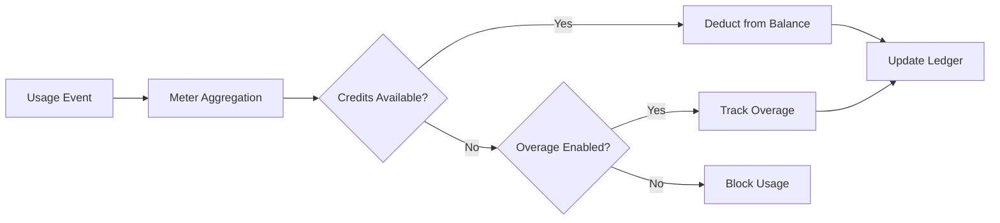

<Info>
미터는 원시 이벤트를 청구 가능한 수량으로 변환합니다. 이벤트를 필터링하고 집계 함수(Count, Sum, Max, Last)를 적용하여 고객별 사용량을 계산합니다.
</Info>

<Frame>

</Frame>

## API 리소스

<AccordionGroup>
<Accordion title="View Meter API References">
<CardGroup cols={2}>
<Card title="Create Meter" icon="plus" href="/api-reference/meters/create-meter">
API를 통해 미터를 프로그램 방식으로 생성합니다.
</Card>

<Card title="List Meters" icon="list" href="/api-reference/meters/get-meters">
계정의 모든 미터를 가져옵니다.
</Card>

<Card title="Get Meter" icon="eye" href="/api-reference/meters/retrieve-meter">
ID로 특정 미터의 세부 정보를 가져옵니다.
</Card>

<Card title="Archive Meter" icon="arrow-rotate-right" href="/api-reference/meters/archive-meter">
사용량 추적을 중지하려면 미터를 보관 처리합니다.
</Card>

<Card title="Unarchive Meter" icon="arrow-rotate-left" href="/api-reference/meters/unarchive-meter">
보관 처리된 미터를 복원하여 추적을 재개합니다.
</Card>
</CardGroup>
</Accordion>
</AccordionGroup>

## 미터 생성

<Steps>
<Step title="Basic Information">
<ParamField path="Meter Name" type="string" required>
설명 이름(예: "API Requests", "Token Usage")
</ParamField>

<ParamField path="Event Name" type="string" required>
정확한 이벤트 이름(대/소문자 구분). 예: `api.call`, `image.generated`
</ParamField>
</Step>

<Step title="Aggregation">
<ParamField path="Aggregation Type" type="string" required>
이벤트가 집계되는 방법을 선택하세요:

- **Count**: 이벤트의 총 개수(API 호출, 업로드 등)
- **Sum**: 숫자 값을 더함(토큰, 바이트)
- **Max**: 기간 중 가장 높은 값(최대 사용자 수)
- **Last**: 가장 최근 값
</ParamField>

<ParamField path="Over Property" type="string">
집계할 메타데이터 키(Count를 제외한 모든 유형에 필요). 예: `tokens`, `bytes`, `duration_ms`
</ParamField>

<ParamField path="Measurement Unit" type="string" required>
청구서에 표시될 단위 레이블. 예: `calls`, `tokens`, `GB`, `hours`
</ParamField>
</Step>

<Step title="Filtering (Optional)">
<Frame>

</Frame>

어떤 이벤트가 계산될지를 필터링하기 위한 조건을 추가합니다:
- **AND 논리**: 모든 조건이 일치해야 함
- **OR 논리**: 어떤 조건이든 일치할 수 있음

**비교자**: 같음, 같지 않음, 초과, 미만, 포함

필터링을 활성화하고, 논리를 선택한 다음, 속성 키, 비교 연산자 및 값을 사용해 조건을 추가합니다.
</Step>

<Step title="Create">
구성을 검토하고 **Create Meter**을 클릭합니다.
</Step>
</Steps>

## 분석 보기

<Frame>

</Frame>

미터 대시보드는 다음을 보여줍니다:
- **개요**: 총 사용량 및 사용량 차트
- **이벤트**: 수신된 개별 이벤트
- **고객**: 고객별 사용량 및 요금

## 통화 대신 크레딧으로 청구

기본적으로 미터는 고객에게 단위당 달러(또는 구성된 통화)로 청구합니다. 대신 미터를 **크레딧 잔액에서 차감**하도록 설정할 수 있으며, 사용량이 금전적 청구를 생성하는 대신 크레딧을 소비합니다.

<Info>
Credit-based deduction requires a [Credit Entitlement](/features/credit-based-billing) attached to the same product. Create your credit first, then link it to the meter.
</Info>

### 크레딧 기반 차감을 사용해야 할 때

| 시나리오 | Standard (currency) | Credit-based |
|----------|-------------------|--------------|
| 단순한 단위당 가격 책정 ($0.01/call) | ✅ 가장 적합 | 불필요한 오버헤드 |
| 선불 크레딧 팩 (토큰 10K 구매 후 시간 경과 사용) | ❌ 표현 불가 | ✅ 가장 적합 |
| 구독과 함께 묶인 사용량 (프로 요금제에 100K 호출 포함) | 무료 임계값을 통해 가능 | ✅ 더 나음 - 크레딧은 이월되고 만료되며 포털에 표시 |
| 크레딧 풀을 공유하는 다중 미터 제품 | ❌ 각 미터가 별도 청구 | ✅ 모든 미터가 단일 잔액에서 차감 |

### 크레딧을 차감하도록 미터 구성하기

<Steps>
<Step title="Create a Credit Entitlement">
먼저 **Products → Credits**에서 크레딧을 생성하세요. 단위(예: "API Calls", "Tokens"), 정밀도, 수명 주기 설정(만료, 이월, 초과 사용)을 정의합니다.

자세한 지침은 [Credit-Based Billing guide](/features/credit-based-billing)를 참조하세요.
</Step>

<Step title="Create or Edit a Usage-Based Product">
사용 기반 제품으로 이동하여 **Meter** 구성 섹션을 엽니다.
</Step>

<Step title="Add a Meter">
미터를 연결하려면 **+** 버튼을 클릭하세요. 이벤트 이름, 집계 유형, 측정 단위를 평소처럼 구성합니다.
</Step>

<Step title="Enable 'Bill Usage in Credits'">
미터 구성에서 **Bill usage in Credits**를 켜면 크레딧 설정이 표시됩니다:

<Frame caption="Toggle 'Bill usage in Credits' to switch from currency-based to credit-based deduction.">

</Frame>

<ParamField path="Credit Entitlement" type="string" required>
이 미터가 어느 크레딧 권한에서 차감할지 선택합니다.
</ParamField>

<ParamField path="Meter units per credit" type="number" required>
1 크레딧을 차감하기 위해 필요한 사용 단위 수입니다. 예를 들어:
- `1` = 각 미터 이벤트가 1 크레딧을 차감
- `100` = 100개의 미터 이벤트가 1 크레딧을 차감
- `1000` = 1,000개의 API 호출이 1 크레딧을 소비
</ParamField>
</Step>

<Step title="Set the Free Threshold">
**Free Threshold**는 여전히 적용되며, 이 임계값 이하의 이벤트는 크레딧을 차감하지 않습니다.

**예시**: 무료 임계값이 1,000이고 미터당 크레딧 수가 1인 경우:
- 고객이 2,500개의 API 호출 사용
- 처음 1,000개는 무료
- 나머지 1,500개는 잔액에서 1,500 크레딧 차감
</Step>
</Steps>

### 크레딧 차감 작동 방식

구성되면 차감 파이프라인이 자동으로 실행됩니다:

1. **이벤트 수신** - 애플리케이션이 [Event Ingestion API](/features/usage-based-billing/event-ingestion)를 통해 사용 이벤트를 전송합니다
2. **미터 집계** - 이벤트가 미터 구성(Count, Sum, Max, Last)에 따라 집계됩니다
3. **백그라운드 워커 처리** - 매분 워커가 마지막 체크포인트 이후의 새 이벤트를 가져옵니다
4. **크레딧 차감** - 집계된 사용량이 `meter_units_per_credit` 요율로 크레딧으로 변환되어 **FIFO 순서**로 (가장 오래된 권한부터) 차감됩니다
5. **초과 사용 추적** - 잔액이 0이 되고 초과 사용이 활성화된 경우, 사용량은 계속되며 설정된 동작에 따라 처리됩니다(리셋 시 면제, 다음 인보이스에 청구, 부족분으로 이월)

<Warning>
크레딧 차감은 비동기적으로 실행되며(약 1분 간격). 이벤트 수집과 잔액 차감 사이에 짧은 지연이 있을 수 있습니다. 이 지연을 고려하여 애플리케이션을 설계하고, 개별 요청의 접근 제어에서 실시간 잔액 확인에 의존하지 마세요.
</Warning>

### 다중 미터, 단일 크레딧 풀

동일한 제품의 여러 미터를 **동일한 크레딧 권한**에 연결할 수 있습니다. 모든 미터가 하나의 공유 잔액에서 차감됩니다.

**예시**: 두 개의 미터를 가진 AI 플랫폼:
- `text.generation` - 1,000 토큰당 1 크레딧
- `image.generation` - 이미지당 10 크레딧

둘 다 동일한 "AI Credits" 풀에서 차감되며 고객은 포털에서 하나의 통합된 잔액을 확인합니다.

<Tip>
미터별로 다른 `meter_units_per_credit` 요율을 사용하여 상대적인 비용을 표현하세요. 비용이 높은 작업(이미지 생성)은 비용이 낮은 작업(텍스트 완성)보다 크레딧당 미터 단위가 적습니다.
</Tip>

<CardGroup cols={2}>
<Card title="List Customer Ledger" icon="scroll" href="/api-reference/credit-entitlements/list-customer-ledger">
고객의 전체 크레딧 차감 내역 보기.
</Card>
<Card title="Get Customer Balance" icon="wallet" href="/api-reference/credit-entitlements/get-customer-balance">
API를 통해 고객의 현재 크레딧 잔액 확인.
</Card>
</CardGroup>

## 문제 해결

<AccordionGroup>
<Accordion title="Events not appearing">
- 이벤트 이름은 정확히 일치해야 합니다(대소문자 구분)
- 미터 필터가 이벤트를 제외하고 있지 않은지 확인하세요
- 고객 ID가 존재하는지 확인하세요
- 테스트를 위해 필터를 일시적으로 비활성화하세요
</Accordion>

<Accordion title="Aggregation not working">
- Over Property가 메타데이터 키와 정확히 일치하는지 확인하세요
- 숫자를 사용하세요, 문자열이 아닌: `tokens: 150` not `"150"`
- 모든 이벤트에 필수 속성을 포함하세요
</Accordion>

<Accordion title="Filters not working">
- 대소문자를 정확히 일치시켜야 합니다
- 데이터 유형에 맞는 연산자를 사용하세요
- 필터링된 속성을 이벤트에 포함시켰는지 확인하세요
</Accordion>

<Accordion title="Wrong usage totals">
- 이벤트 탭에서 실제 수신된 이벤트 수를 확인하세요
- 집계 유형(Count vs Sum)을 확인하세요
- Sum/Max의 경우 값이 숫자인지 확인하세요
</Accordion>
</AccordionGroup>

## 다음 단계

<CardGroup cols={2}>

<Card title="Send Events" icon="bolt" href="/features/usage-based-billing/event-ingestion">
애플리케이션에서 미터로 사용 이벤트 전송을 시작하세요.
</Card>

<Card title="View Blueprints" icon="copy" href="/features/usage-based-billing/ingestion-blueprints">
일반적인 사용 사례에 대해 기성 미터 구성을 사용하세요.
</Card>
</CardGroup>
