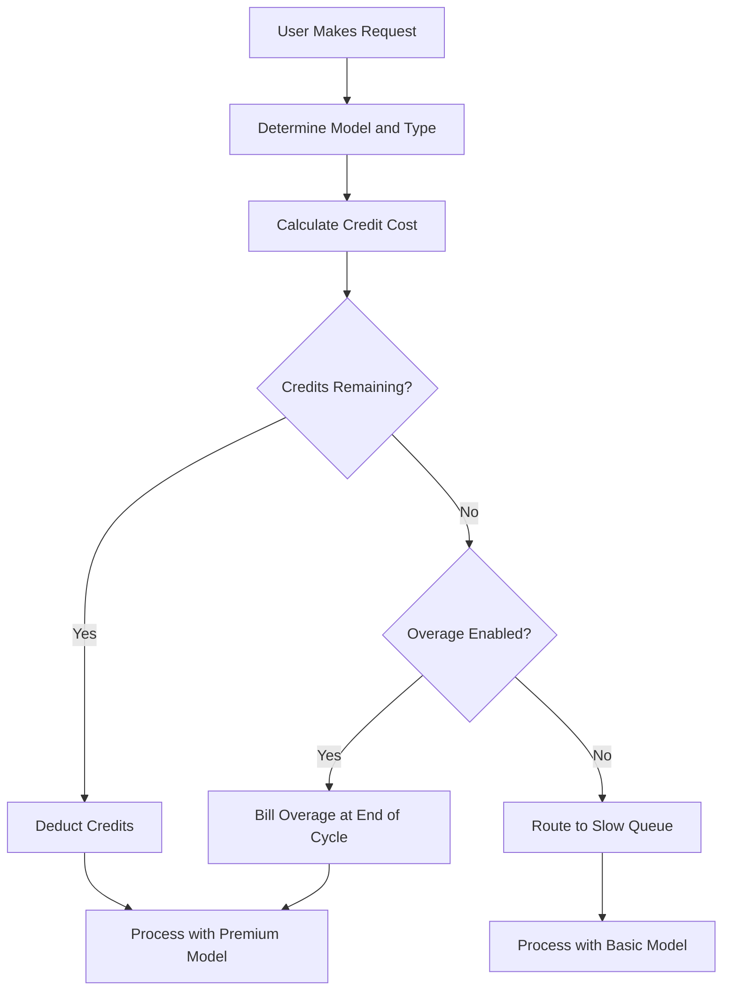

## Como o Cursor Cobra

O Cursor usa um modelo híbrido que combina uma assinatura mensal com um pool de créditos que se esgota. Essa abordagem oferece um preço previsível para os usuários enquanto gerencia os custos variáveis de diferentes modelos de IA.

**Planos de Preços**: O Cursor oferece níveis do Hobby ao Ultra, equilibrando acesso premium e padrão para se adequar a diferentes fluxos de trabalho.

| Plano | Preço | Solicitações Premium | Solicitações Lentas |
| :--- | :--- | :--- | :--- |
| Hobby | Free | 50/mês | Ilimitado |
| Pro | \$20/mês | 500/mês | Ilimitado |
| Pro+ | \$60/mês | Solicitações premium ilimitadas | - |
| Ultra | \$200/mês | Solicitações premium ilimitadas | - |

**Esgotamento com Peso por Modelo**: Diferentes solicitações consomem quantidades distintas de créditos com base no custo do modelo subjacente. Isso permite que o Cursor ofereça uma única assinatura que cobre vários provedores, garantindo que operações caras sejam contabilizadas.

| Tipo de Solicitação | Modelo | Custo em Créditos |
| :--- | :--- | :--- |
| Preenchimento de Aba | Padrão | 0 |
| Conversa | GPT-4o Mini | 1 |
| Conversa | Claude 3.5 Sonnet | 1 |
| Compositor | GPT-4o | 5 |
| Agente | Claude 3.5 Sonnet | 10 |
| Agente | o1-preview | 25 |

**Esgotamento de Créditos e Excedentes**: Quando os créditos acabam, os usuários passam para uma fila "Lenta" com modelos mais baratos em vez de serem bloqueados. Como alternativa, eles podem ativar excedentes baseados no uso para manter o acesso premium por um custo fixo por solicitação.



4. **Enterprise e Business**: Equipes usam utilização agrupada em que toda a organização compartilha um único bucket de créditos. Isso simplifica o gerenciamento e garante que usuários intensos não atinjam limites individuais enquanto outros têm capacidade ociosa.

## O que o torna único

O modelo do Cursor equilibra experiência do usuário com custos de infraestrutura ao resolver problemas com os quais os modelos tradicionais de cobrança SaaS têm dificuldade.
- **Abstração de Provedores**: Uma única assinatura engloba vários provedores de LLM como OpenAI e Anthropic, lidando com preços complexos e chaves de API nos bastidores.
- **Esgotamento Ponderado**: Os custos se alinham ao valor ao cobrar mais por modelos poderosos, fazendo o preço parecer justo e transparente para todos os usuários.
- **Degradação Suave**: A fila "Lenta" evita cortes abruptos, mantendo os usuários no produto e incentivando upgrades sem punições.
- **Créditos Compartilhados**: Buckets em nível de equipe reduzem atrito para clientes empresariais permitindo compartilhamento eficiente de recursos em toda a organização.

## Recrie isso com o Dodo Payments

Você pode replicar esse mesmo modelo usando as concessões de crédito e cobrança baseada em uso do Dodo Payments. Os passos a seguir irão guiá-lo pela implementação.

<Steps>
  <Step title="Create a Custom Unit Credit Entitlement">
    Primeiro, defina o sistema de créditos no painel do Dodo. Essa concessão representará as "Solicitações Premium" que os usuários recebem com a assinatura.

    *   **Tipo de Crédito:** Unidade Personalizada
    *   **Nome da Unidade:** "Solicitações Premium"
    *   **Precisão:** 0 (já que você não pode usar meia solicitação)
    *   **Expiração do Crédito:** 30 dias (isso garante que os créditos se renovem a cada ciclo de faturamento)
    *   **Acúmulo:** Desativado (solicitações não utilizadas não são transferidas para o mês seguinte)
    *   **Excedente:** Ativado
    *   **Preço por Unidade:** \$0.04 (o custo de cada solicitação após o pool inicial ser esgotado)
    *   **Comportamento de Excedente:** Cobrar excedente na fatura (isso adiciona o custo do excedente à próxima fatura)

    Essa configuração garante que os usuários tenham um pool fixo de solicitações a cada mês, com a opção de pagar por mais se necessário. É a base do modelo híbrido de cobrança.
  </Step>

  <Step title="Create Subscription Products">
    Crie produtos separados para cada nível. Vincule a mesma concessão de crédito a cada produto, mas com quantidades diferentes. Isso permite gerenciar todos os níveis com um único sistema de créditos, tornando fácil atualizar ou rebaixar usuários.

    *   **Hobby:** \$0/mês, 50 créditos/ciclo
    *   **Pro:** \$20/mês, 500 créditos/ciclo
    *   **Pro+:** \$60/mês, 5000 créditos/ciclo (efetivamente ilimitado para a maioria)
    *   **Ultra:** \$200/mês, 50000 créditos/ciclo (efetivamente ilimitado)

    Quando um usuário assina um desses produtos, o Dodo aloca automaticamente o número correspondente de créditos em sua conta. Isso acontece instantaneamente, proporcionando uma experiência de onboarding contínua.
  </Step>

  <Step title="Create a Usage Meter Linked to Credits">
    Crie um medidor chamado `ai.request` com agregação **Soma** na propriedade `credit_cost`. Vincule esse medidor à sua concessão de crédito ativando o botão "Cobrar uso em Créditos". Defina as unidades do medidor por crédito como 1.

    Para lidar com o esgotamento ponderado por modelo, você gerenciará o custo de crédito no nível da aplicação. Quando um usuário faz uma solicitação, seu app determina o custo com base no modelo ou no tipo de ação.

    ```typescript
    import DodoPayments from 'dodopayments';
    
    /**
     * Determines the credit cost for a given request type and model.
     * This logic lives in your application and can be updated without
     * changing your billing configuration.
     */
    function getCreditCost(requestType: string, model: string): number {
      const costs: Record<string, Record<string, number>> = {
        'tab_completion': { 'default': 0 },
        'chat': { 'gpt-4o-mini': 1, 'gpt-4o': 1, 'claude-sonnet': 1 },
        'composer': { 'gpt-4o-mini': 2, 'gpt-4o': 5, 'claude-sonnet': 5 },
        'agent': { 'gpt-4o': 10, 'claude-sonnet': 10, 'o1': 25 }
      };
      
      // Default to 1 credit if the combination isn't found
      return costs[requestType]?.[model] ?? 1;
    }
    
    /**
     * Ingests usage events into Dodo Payments.
     * For weighted requests, we send multiple events or use a sum aggregation.
     */
    async function trackRequest(customerId: string, requestType: string, model: string) {
      const creditCost = getCreditCost(requestType, model);
      
      // Tab completions are free, so we don't need to track them for billing
      if (creditCost === 0) return;
      
      const client = new DodoPayments({
        bearerToken: process.env.DODO_PAYMENTS_API_KEY,
      });
      
      await client.usageEvents.ingest({
        events: [{
          event_id: `req_${Date.now()}_${Math.random().toString(36).slice(2)}`,
          customer_id: customerId,
          event_name: 'ai.request',
          timestamp: new Date().toISOString(),
          metadata: {
            request_type: requestType,
            model: model,
            credit_cost: creditCost
          }
        }]
      });
    }
    ```

    <Tip>
      Se quiser usar um único evento para solicitações ponderadas, defina a agregação do medidor como **Soma** e use uma propriedade como `credit_cost` como o valor a ser somado. Isso costuma ser mais eficiente para ingestão de alto volume e simplifica a lógica da sua aplicação.
    </Tip>
  </Step>

  <Step title="Handle Credit Exhaustion (Slow Queue)">
    Escute o webhook `credit.balance_low` do Dodo. Quando os créditos de um usuário estiverem quase zerados, você pode encaminhá-lo para uma fila lenta na sua aplicação. É aqui que você implementa a lógica de "degradação suave".

    ```typescript
    import DodoPayments from 'dodopayments';
    import express from 'express';
    
    const app = express();
    app.use(express.raw({ type: 'application/json' }));
    
    const client = new DodoPayments({
      bearerToken: process.env.DODO_PAYMENTS_API_KEY,
      webhookKey: process.env.DODO_PAYMENTS_WEBHOOK_KEY,
    });
    
    app.post('/webhooks/dodo', async (req, res) => {
      try {
        const event = client.webhooks.unwrap(req.body.toString(), {
          headers: {
            'webhook-id': req.headers['webhook-id'] as string,
            'webhook-signature': req.headers['webhook-signature'] as string,
            'webhook-timestamp': req.headers['webhook-timestamp'] as string,
          },
        });
        
        if (event.type === 'credit.balance_low') {
          const customerId = event.data.customer_id;
          await updateUserTier(customerId, 'slow');
          await notifyUser(customerId, 'You have used most of your premium requests. Switching to standard models.');
        }
        
        res.json({ received: true });
      } catch (error) {
        res.status(401).json({ error: 'Invalid signature' });
      }
    });
    
    /**
     * Routes a request based on the user's current tier.
     * This function is called before every AI request to determine the model and queue.
     */
    async function routeRequest(customerId: string, requestType: string) {
      const tier = await getUserTier(customerId);
      
      if (tier === 'slow') {
        // Route to a cheaper model and a lower priority queue
        // This saves costs while keeping the user active in the product
        return { model: 'gpt-4o-mini', queue: 'standard' };
      }
      
      // Premium routing for users with remaining credits
      // This provides the best possible performance and model quality
      return { model: 'claude-sonnet', queue: 'priority' };
    }
    ```

  </Step>

  <Step title="Create Checkout">
    Por fim, gere uma sessão de checkout para o usuário assinar um plano. O Dodo cuida do processamento de pagamentos, conformidade fiscal e alocação de créditos automaticamente.

    ```typescript
    import DodoPayments from 'dodopayments';
    
    const client = new DodoPayments({
      bearerToken: process.env.DODO_PAYMENTS_API_KEY,
    });
    
    /**
     * Creates a checkout session for a new subscription.
     * This is typically called when a user clicks an "Upgrade" button.
     */
    const session = await client.checkoutSessions.create({
      product_cart: [
        { product_id: 'prod_cursor_pro', quantity: 1 }
      ],
      customer: { email: 'developer@example.com' },
      return_url: 'https://yourapp.com/dashboard'
    });
    ```

  </Step>
</Steps>

## Acelere com o Blueprint de Ingestão de LLM

A cobrança ponderada por créditos acima lida com sua monetização principal. Para análises mais aprofundadas sobre o consumo real de tokens entre provedores, o [Blueprint de Ingestão de LLM](/developer-resources/ingestion-blueprints/llm) pode ser executado junto com seu sistema de créditos.

```bash
npm install @dodopayments/ingestion-blueprints
```

```typescript
import { createLLMTracker } from '@dodopayments/ingestion-blueprints';
import OpenAI from 'openai';
import Anthropic from '@anthropic-ai/sdk';

// Track raw token usage for analytics alongside credit-weighted billing
const openaiTracker = createLLMTracker({
  apiKey: process.env.DODO_PAYMENTS_API_KEY,
  environment: 'live_mode',
  eventName: 'analytics.openai_tokens',
});

const anthropicTracker = createLLMTracker({
  apiKey: process.env.DODO_PAYMENTS_API_KEY,
  environment: 'live_mode',
  eventName: 'analytics.anthropic_tokens',
});

const openai = new OpenAI({ apiKey: process.env.OPENAI_API_KEY });
const anthropic = new Anthropic({ apiKey: process.env.ANTHROPIC_API_KEY });

// Wrap each provider separately
const trackedOpenAI = openaiTracker.wrap({ client: openai, customerId: 'customer_123' });
const trackedAnthropic = anthropicTracker.wrap({ client: anthropic, customerId: 'customer_123' });

// Token tracking is automatic, credit deduction still uses your weighted system
const response = await trackedOpenAI.chat.completions.create({
  model: 'gpt-4o',
  messages: [{ role: 'user', content: 'Hello!' }],
});
```

Isso oferece duas camadas de dados: cobrança ponderada por créditos para monetização e contagem bruta de tokens para análise de custos e monitoramento de margem.

<Tip>
O Blueprint de LLM oferece suporte a OpenAI, Anthropic, Groq, Google Gemini e mais. Consulte a [documentação completa do blueprint](/developer-resources/ingestion-blueprints/llm) para ver todos os provedores suportados.
</Tip>

## Créditos Compartilhados por Equipe (Enterprise)

Os planos Business e Enterprise do Cursor agrupam créditos em uma equipe. Você pode implementar isso com o Dodo criando uma única assinatura para a organização em vez de usuários individuais. Isso garante que o uso da equipe seja consolidado e administrado como uma única entidade, o que é um requisito importante para clientes maiores.

### Estratégia de Implementação

1.  **Cliente em Nível Organizacional:** Crie um único `customer_id` no Dodo para toda a organização. Esse cliente representa a entidade de cobrança da equipe e detém o pool compartilhado de créditos. Todas as faturas e alocações de crédito estão vinculadas a esse ID.
2.  **Cobrança por Assento:** Use complementos do Dodo para cobrar uma taxa por usuário da plataforma. Quando uma equipe adiciona um novo membro, você atualiza a quantidade do complemento "Assento". Isso garante que sua receita escale com o número de usuários, mantendo o pool de créditos separado. É uma maneira organizada de lidar com cobrança multidimensional.
3.  **Rastreamento de Uso Compartilhado:** Todas as solicitações dos membros da equipe são ingeridas usando o `customer_id` da organização. Isso garante que cada solicitação de qualquer membro da equipe reduza o mesmo pool central de créditos. Você ainda pode rastrear o uso individual incluindo um `user_id` nos metadados do evento para relatórios e análises internas.

Essa abordagem lhe dá o melhor dos dois mundos: uma taxa previsível por usuário para a plataforma e um pool compartilhado de créditos para recursos caros de IA. Também simplifica a experiência dos membros da equipe, já que eles não precisam gerenciar seus próprios limites individuais.

## Comparação com Cobrança SaaS Tradicional

A cobrança SaaS tradicional geralmente envolve níveis com tarifa fixa (por exemplo, \$10/mês por 100 unidades). Se um usuário precisa de 101 unidades, muitas vezes precisa mudar para o nível de \$50/mês. Isso cria efeitos de "penhasco" que podem frustrar os usuários e gerar churn. Também não considera o custo variável de diferentes tipos de uso, o que é crítico no espaço de IA.

O modelo do Cursor, impulsionado pelo Dodo, é muito mais flexível e justo:

*   **Sem Efeitos de "Penhasco"**: Os usuários não precisam fazer upgrade apenas porque atingiram um limite. Eles podem pagar por excedentes ou aceitar desempenho mais lento. Isso os mantém no produto e reduz atrito, levando a maior satisfação do cliente e menor churn.
*   **Alinhamento de Custos**: Sua receita escala diretamente com seus custos de infraestrutura. Se um usuário usa modelos caros, ele paga mais (seja por créditos ou excedentes). Isso protege suas margens e permite oferecer recursos de alto custo de forma sustentável sem comprometer seu modelo de negócios.
*   **Melhor Retenção**: Ao não cortar o acesso dos usuários, você os mantém engajados com seu produto mesmo após atingirem o limite. Eles podem continuar trabalhando, o que constrói fidelidade a longo prazo e aumenta o valor vitalício do cliente. É um ganha-ganha para o usuário e para o provedor.

## Lidando com Atualizações e Evolução de Modelos

Um dos desafios da cobrança de IA é que os modelos estão constantemente sendo atualizados ou substituídos. Modelos novos podem ter estruturas de custo ou características de desempenho diferentes. Com o sistema de créditos do Dodo, você pode lidar com isso de forma suave no nível da aplicação sem precisar migrar seus dados de cobrança.

Se você introduzir um modelo novo e mais caro, basta atualizar sua função `getCreditCost` para atribuir um custo maior. Você não precisa alterar sua configuração de cobrança nem atualizar assinaturas existentes. Esse desacoplamento da cobrança e da lógica da aplicação é uma grande vantagem, pois permite que você iterar sobre seu produto na velocidade da IA sem ser limitado pelo sistema de cobrança.

## Notificações ao Usuário e Transparência

Para oferecer uma ótima experiência ao usuário, é importante mantê-lo informado sobre o uso de créditos. Transparência constrói confiança e ajuda os usuários a gerenciar seus custos de forma eficaz. Você pode usar os webhooks do Dodo para disparar notificações em vários limiares (por exemplo, 50%, 80% e 100% de uso).

Essas notificações podem ser enviadas por e-mail, alertas dentro do app ou mensagens no Slack. Ao fornecer feedback em tempo real sobre o uso, você incentiva os usuários a gerenciar seu consumo ou atualizar o plano antes de chegarem à "fila lenta". Essa abordagem proativa reduz tickets de suporte e melhora a experiência geral do usuário, fazendo seu produto parecer mais profissional e centrado no usuário.

## Segurança e Prevenção de Fraudes

Ao implementar um sistema baseado em créditos, é importante considerar segurança e prevenção de fraudes. Como os créditos têm valor monetário direto, eles podem ser alvo de abusos.

*   **Idempotência:** Use sempre `event_id`s únicos ao ingerir eventos de uso para evitar contagem dupla. A API de ingestão do Dodo lida automaticamente com idempotência se você fornecer um ID único, garantindo que uma nova tentativa de rede não cobre o usuário duas vezes.
*   **Limitação de Taxa:** Implemente limitação de taxa no nível da aplicação para evitar que um único usuário esgote os créditos (ou seu orçamento de API) muito rapidamente. Isso protege sua infraestrutura e o bolso do usuário.
*   **Monitoramento:** Monitore padrões de uso em busca de anomalias que possam indicar compartilhamento de conta ou abuso automatizado. As análises do Dodo podem ajudá-lo a identificar esses padrões, permitindo que você tome medidas antes que se tornem um problema maior.

## Melhores Práticas para Sistemas de Créditos

Ao construir um sistema de cobrança baseado em créditos, mantenha estas melhores práticas em mente:

1.  **Mantenha Simples:** Não torne seu sistema de créditos muito complexo. Os usuários devem conseguir entender facilmente quanto custa uma solicitação e quantos créditos lhes restam.
2.  **Ofereça Valor:** Garanta que os créditos ofereçam valor real ao usuário. Se o custo de uma solicitação for muito alto, os usuários sentirão que estão sendo explorados.
3.  **Seja Transparente:** Mostre sempre ao usuário seu saldo atual de créditos e o histórico de uso. Isso constrói confiança e reduz confusão.
4.  **Automatize Tudo:** Use os webhooks e APIs do Dodo para automatizar ao máximo o processo de cobrança. Isso reduz trabalho manual e garante que sua cobrança esteja sempre precisa.

## Principais Recursos do Dodo Utilizados

<CardGroup cols={2}>
  <Card title="Credit-Based Billing" icon="coins" href="/features/credit-based-billing">
    Gerencie pools de créditos que se esgotam e excedentes com unidades personalizadas.
  </Card>
  <Card title="Subscriptions" icon="calendar" href="/features/subscription">
    Configure cobranças recorrentes para diferentes níveis com créditos integrados.
  </Card>
  <Card title="Usage-Based Billing" icon="chart-line" href="/features/usage-based-billing/introduction">
    Monitore eventos e cobre com base no consumo em tempo real.
  </Card>
  <Card title="Event Ingestion" icon="bolt" href="/features/usage-based-billing/event-ingestion">
    Envie dados de uso em grande volume para o Dodo com baixa latência.
  </Card>
  <Card title="Webhooks" icon="webhook" href="/developer-resources/webhooks/intents/credit">
    Reaja a mudanças no saldo de créditos e automatize a categorização de usuários.
  </Card>
  <Card title="LLM Ingestion Blueprint" icon="brain-circuit" href="/developer-resources/ingestion-blueprints/llm">
    Rastreamento automático de tokens em múltiplos provedores de LLM.
  </Card>
</CardGroup>
