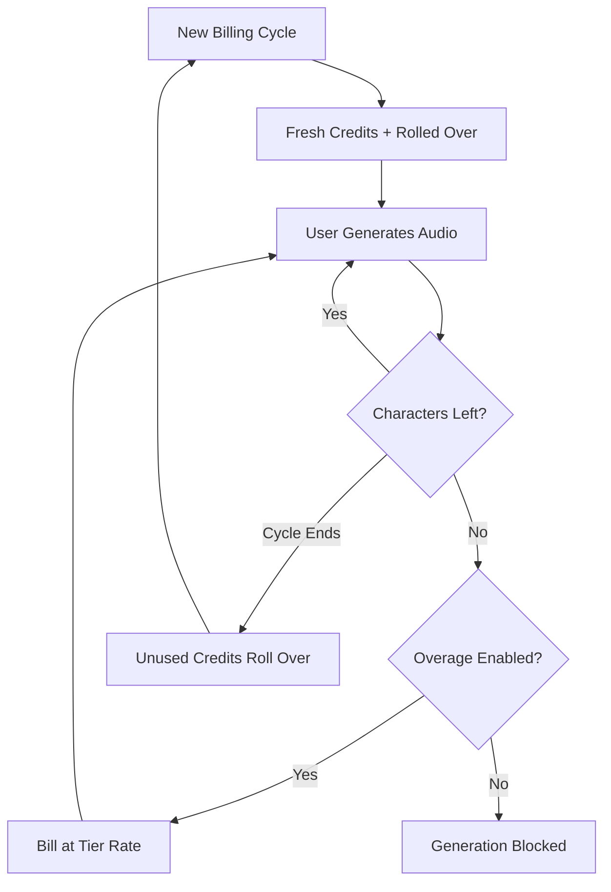

A ElevenLabs construiu uma posição dominante no espaço de voz com IA ao tornar sua cobrança tão fluida quanto sua síntese de fala. O modelo deles gira em torno de uma unidade única de valor: o caractere. Seja gerando texto para fala, clonando uma voz ou dublando um vídeo, você consome de um único pool unificado de créditos de caracteres.

## Como a ElevenLabs cobra

A estrutura de preços da ElevenLabs usa cotas mensais fixas vinculadas aos níveis de assinatura. À medida que os usuários avançam para níveis superiores, eles obtêm mais caracteres e acesso a recursos mais avançados, como clonagem vocal profissional ou direitos comerciais.

| Plano | Preço | Caracteres/Mês | Taxa de Excesso |
| :--- | :--- | :--- | :--- |
| Gratuito | \$0 | 10.000 | Não disponível |
| Starter | \$5/mês | 30.000 | ~\$0,30/1K chars |
| Creator | \$22/mês | 100.000 | ~\$0,24/1K chars |
| Pro | \$99/mês | 500.000 | ~\$0,15/1K chars |
| Scale | \$330/mês | 2.000.000 | ~\$0,10/1K chars |

1. **Preço baseado em caracteres**: Caracteres são a moeda universal em toda a plataforma. Texto para fala, dublagem e clonagem vocal usam o mesmo saldo, simplificando o acompanhamento do uso.
2. **Mecânica de rollover**: Caracteres não utilizados são transferidos para o próximo ciclo de cobrança em vez de expirarem. A ElevenLabs aplica um limite para evitar acumulação infinita, garantindo que os usuários mantenham o valor da assinatura.
3. **Excessos escalonados**: Os excessos são gerenciados com base no nível de assinatura. Planos mais básicos têm excessos desativados por padrão, enquanto níveis superiores permitem cobranças opt-in para manter a continuidade do serviço.

## O que o torna único

Várias escolhas estratégicas tornam o modelo de cobrança da ElevenLabs particularmente eficaz para reter usuários e incentivar upgrades.

- **Rollover de caracteres**: Créditos acumuláveis reduzem a ansiedade de “use ou perca” ao transportar o investimento não utilizado. Isso mantém o valor da assinatura mesmo durante períodos de menor atividade.
- **Preço escalonado para excessos**: As tarifas de excesso diminuem conforme o plano aumenta, criando um forte incentivo para fazer upgrade. Usuários frequentemente acham níveis mais altos mais atraentes devido ao custo menor por uso adicional.
- **Consumo unificado**: Um único pool de caracteres para todos os serviços elimina o ônus cognitivo de gerenciar cotas separadas. Os usuários só precisam acompanhar um número para entender a capacidade restante.
- **Excessos opt-in**: Usuários profissionais podem habilitar excessos para garantir continuidade, enquanto usuários casuais se beneficiam da segurança de um limite rígido.



## Construa isso com o Dodo Payments

Você pode replicar esse modelo sofisticado usando a cobrança baseada em créditos e a medição de uso do Dodo Payments.

<Steps>
<Step title="Create a Custom Unit Credit Entitlement">
Primeiro, defina a unidade "Characters" que servirá como moeda da sua plataforma.

1. Vá para **Entitlements** no seu painel do Dodo.
2. Crie um novo **Credit Entitlement**.
3. Defina o **Credit Type** como **Custom Unit**.
4. Nomeie a unidade como "Characters".
5. Defina a **Precision** como 0, já que caracteres são sempre unidades inteiras.
6. Configure o **Credit Expiry** para 30 dias para corresponder ao ciclo de cobrança mensal.
7. Ative o **Rollover** com estas configurações:
    - **Max Rollover Percentage**: 100% (permite que todos os caracteres não utilizados sejam transferidos).
    - **Rollover Timeframe**: 1 Month.
    - **Max Rollover Count**: 1 (os créditos podem acumular uma vez e então expiram).
</Step>

<Step title="Create Tiered Subscription Products">
Crie cinco produtos de assinatura. Você anexará o mesmo direito “Characters” a cada um, mas com configurações diferentes para cada nível.

| Produto | Preço | Créditos/Ciclo | Excesso habilitado | Preço do excesso (por 1K chars) |
| :--- | :--- | :--- | :--- | :--- |
| Gratuito | \$0/mês | 10.000 | Não | - |
| Starter | \$5/mês | 30.000 | Sim (opt-in) | \$0,30 |
| Creator | \$22/mês | 100.000 | Sim | \$0,24 |
| Pro | \$99/mês | 500.000 | Sim | \$0,15 |
| Scale | \$330/mês | 2.000.000 | Sim | \$0,10 |

Ao anexar o direito de crédito a cada produto, desmarque **Import Default Credit Settings**. Isso permite configurar o **Price Per Unit** específico para excessos naquele nível. Defina o **Overage Behavior** para **Bill overage at billing** e configure um **Low Balance Threshold** em 10% da cota do nível.

</Step>

<Step title="Create a Usage Meter">
O medidor de uso conecta a atividade da sua aplicação ao sistema de créditos.

1. Crie um novo medidor chamado `tts.characters`.
2. Defina a **Aggregation** como **Sum**. Isso somará a propriedade `characters` de cada evento enviado.
3. Vincule esse medidor ao direito de crédito “Characters”.
4. Defina **Meter units per credit** como 1. Isso garante que um caractere usado em seu app equivale a um crédito deduzido do saldo.

</Step>

<Step title="Send Usage Events">
Integre o rastreamento de uso no código do seu aplicativo. Sempre que um usuário gerar áudio, envie um evento para o Dodo.

```typescript
import DodoPayments from 'dodopayments';

async function trackGeneration(
  customerId: string,
  text: string, 
  service: 'tts' | 'dubbing' | 'cloning'
) {
  const characterCount = text.length;

  const client = new DodoPayments({
    bearerToken: process.env.DODO_PAYMENTS_API_KEY,
  });

  await client.usageEvents.ingest({
    events: [{
      event_id: `gen_${Date.now()}_${Math.random().toString(36).slice(2)}`,
      customer_id: customerId,
      event_name: 'tts.characters',
      timestamp: new Date().toISOString(),
      metadata: {
        characters: characterCount,
        service: service,
        voice_id: 'voice_abc123'
      }
    }]
  });
}
```

</Step>

<Step title="Handle Low Balance and Overage">
Use webhooks para manter seus usuários informados sobre o uso de caracteres.

```typescript
import DodoPayments from 'dodopayments';
import express from 'express';

const app = express();
app.use(express.raw({ type: 'application/json' }));

const client = new DodoPayments({
  bearerToken: process.env.DODO_PAYMENTS_API_KEY,
  webhookKey: process.env.DODO_PAYMENTS_WEBHOOK_KEY,
});

app.post('/webhooks/dodo', async (req, res) => {
  try {
    const event = client.webhooks.unwrap(req.body.toString(), {
      headers: {
        'webhook-id': req.headers['webhook-id'] as string,
        'webhook-signature': req.headers['webhook-signature'] as string,
        'webhook-timestamp': req.headers['webhook-timestamp'] as string,
      },
    });

    switch (event.type) {
      case 'credit.balance_low':
        await notifyUser(event.data.customer_id, 
          'You are running low on characters. Consider upgrading your plan for more characters and lower overage rates.'
        );
        break;
      case 'credit.deducted':
        await logUsage(event.data);
        break;
      case 'credit.overage_charged':
        await notifyUser(event.data.customer_id,
          'You have exceeded your character quota. Overage charges will appear on your next invoice.'
        );
        break;
    }

    res.json({ received: true });
  } catch (error) {
    res.status(401).json({ error: 'Invalid signature' });
  }
});
```

</Step>

<Step title="Create Checkout">
Quando um usuário estiver pronto para assinar, crie uma sessão de checkout para o nível escolhido.

```typescript
const session = await client.checkoutSessions.create({
  product_cart: [
    { product_id: 'prod_elevenlabs_pro', quantity: 1 }
  ],
  customer: { email: 'creator@example.com' },
  return_url: 'https://yourapp.com/dashboard'
});
```

</Step>
</Steps>

## Acelere com o Stream Ingestion Blueprint

Para rastrear a saída de áudio juntamente com a cobrança baseada em caracteres, o [Stream Ingestion Blueprint](/developer-resources/ingestion-blueprints/stream) oferece uma maneira simplificada de medir o consumo de largura de banda.

```bash
npm install @dodopayments/ingestion-blueprints
```

```typescript
import { Ingestion, trackStreamBytes } from '@dodopayments/ingestion-blueprints';

const ingestion = new Ingestion({
  apiKey: process.env.DODO_PAYMENTS_API_KEY,
  environment: 'live_mode',
  eventName: 'tts.audio_bytes',
});

// After generating audio, track the output size
const audioBuffer = await generateSpeech(text, voiceId);

await trackStreamBytes(ingestion, {
  customerId: customerId,
  bytes: audioBuffer.byteLength,
  metadata: {
    voice_id: voiceId,
    service: 'tts',
    format: 'mp3',
  },
});
```

Use o Stream Blueprint para rastrear a largura de banda de áudio juntamente com o sistema de crédito baseado em caracteres. Isso dá visibilidade sobre os custos reais de infraestrutura por geração.

<Tip>
O Stream Blueprint também suporta agrupamento em cenários de alto volume. Veja a [documentação completa do blueprint](/developer-resources/ingestion-blueprints/stream) para padrões de uso avançados.
</Tip>

## Incentivo de upgrade: Preço escalonado para excessos

A parte mais brilhante do modelo ElevenLabs é como ele usa as tarifas de excesso para impulsionar upgrades. Ao tornar o custo por caractere mais barato em níveis superiores, eles mudam a conversa de “quanto eu preciso?” para “quanto posso economizar?”.

| Nível | Caracteres incluídos | Excesso (por 1K) | Custo efetivo com 500K caracteres |
| :--- | :--- | :--- | :--- |
| Creator | 100.000 | \$0,24 | \$22 + (400 * \$0,24) = \$118 |
| Pro | 500.000 | \$0,15 | \$99 (sem excesso) |

Um usuário que consome regularmente 500.000 caracteres no plano Creator paga \$118 por mês em assinatura mais excessos. Fazer upgrade para o plano Pro cobre o mesmo uso por \$99, economizando \$19 por mês. A tarifa de excesso mais baixa em níveis superiores significa que, à medida que o uso cresce, o upgrade se torna a decisão financeira óbvia.

Com o Dodo Payments, você implementa isso desmarcando a caixa **Import Default Credit Settings** ao anexar créditos aos produtos de assinatura. Isso dá controle total sobre o **Price Per Unit** de cada nível específico, permitindo recompensar seus clientes que pagam mais com as melhores tarifas.
