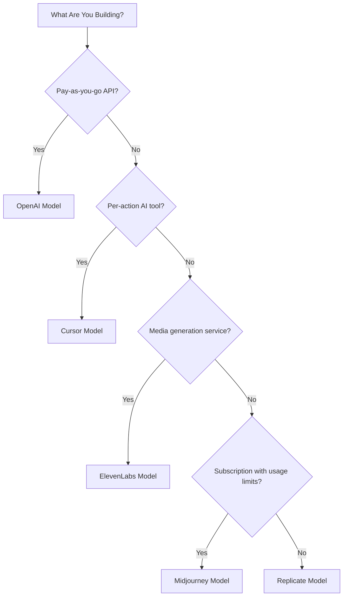

## Os Cinco Modelos

| Aplicativo | Métrica Primária | Inovação Única | Recurso Dodo |
| :--- | :--- | :--- | :--- |
| OpenAI | Tokens (denominados em fiat) | Créditos pré-pagos denominados em fiat com saldo que nunca expira | Credit-Based Billing (Fiat Credits) |
| Cursor | Solicitações Premium | Esgotamento de créditos ponderado por modelo (custos diferentes por modelo) | Credit-Based Billing (Custom Unit) |
| ElevenLabs | Caracteres | Cotas de caracteres com rollover + precificação escalonada para excedentes | Credit-Based Billing (Rollover + Overage) |
| Midjourney | Tempo de GPU | "Relax Mode" como fallback ilimitado após a cota | Subscription + Usage Meters |
| Replicate | Segundos de Execução | Medição pura por segundo específica de hardware | Pure Usage-Based Billing |

## Compreendendo Padrões de Créditos

| Padrão | Exemplo | Recurso Dodo | Tipo de Unidade |
| :--- | :--- | :--- | :--- |
| Créditos pré-pagos denominados em fiat | API da OpenAI (recarga de crédito de \$5, sem retirada) | Credit-Based Billing (Fiat Credits) | Unidades virtuais denominadas em dólar |
| Créditos virtuais de uso | Cursor Premium Requests, ElevenLabs Characters | Credit-Based Billing (Custom Unit) | Unidades arbitrárias (requisições, caracteres) |
| Medição pura de consumo | Cobrança por segundo da Replicate | Usage-Based Billing (Meters) | Medição direta (segundos, bytes) |
| Assinatura + excedente medido | Midjourney Fast Hours com fallback Relax | Subscription + Usage Meters | Baseado em tempo com limite gratuito |

<Info>
Créditos Fiat na Cobrança Baseada em Créditos da Dodo representam valores denominados em dólares da plataforma sem valor monetário fora do seu ecossistema. Os clientes não podem retirá-los como dinheiro.
</Info>

## Qual Modelo Você Deve Usar?

- Construir uma plataforma de API pay-as-you-go: modelo da OpenAI (Créditos Fiat)
- Construir uma ferramenta de IA com precificação por ação: modelo do Cursor (Créditos de Unidade Personalizada)
- Construir um serviço de geração de mídia: modelo da ElevenLabs (Créditos com Rolagem)
- Construir um serviço de assinatura com limites de uso: modelo do Midjourney (Assinatura + Medidores de Uso)
- Construir uma plataforma de infraestrutura/computação: modelo do Replicate (Medição Pura)

<CardGroup cols={2}>
  <Card title="OpenAI" icon="/images/logos/openai.svg" href="/developer-resources/billing-deconstructions/openai">
    Replique o modelo de créditos pré-pagos baseados em tokens.
  </Card>
  <Card title="Cursor" icon="/images/logos/cursor.svg" href="/developer-resources/billing-deconstructions/cursor">
    Construa limites de uso ponderados por modelo.
  </Card>
  <Card title="ElevenLabs" icon="/images/logos/elevenlabs.svg" href="/developer-resources/billing-deconstructions/elevenlabs">
    Implemente cotas de caracteres com rollover e cobranças extras.
  </Card>
  <Card title="Midjourney" icon="/images/logos/midjourney.svg" href="/developer-resources/billing-deconstructions/midjourney">
    Combine assinaturas com fallback baseado em uso.
  </Card>
  <Card title="Replicate" icon="/images/logos/replicate.svg" href="/developer-resources/billing-deconstructions/replicate">
    Configure medição pura de consumo por segundo.
  </Card>
</CardGroup>

## Recursos da Dodo

<CardGroup cols={2}>
  <Card title="Credit-Based Billing" href="/features/credit-based-billing">
    Gerencie créditos pré-pagos e unidades virtuais.
  </Card>
  <Card title="Usage-Based Billing" href="/features/usage-based-billing/introduction">
    Meça o consumo em tempo real.
  </Card>
  <Card title="Subscriptions" href="/features/subscription">
    Gerencie faturamento recorrente e administração de planos.
  </Card>
  <Card title="Hybrid Billing" href="/features/hybrid-billing">
    Combine múltiplos modelos de cobrança para máxima flexibilidade.
  </Card>
</CardGroup>

## Blueprints de Ingestão

Cada desconstrução inclui integração com os [Ingestion Blueprints](/features/usage-based-billing/ingestion-blueprints), SDKs pré-construídos que lidam automaticamente com o rastreamento de eventos. Em vez de construir manualmente eventos de uso, utilize um blueprint para obter medição pronta para produção em minutos.

<CardGroup cols={3}>
  <Card title="LLM Blueprint" icon="brain-circuit" href="/developer-resources/ingestion-blueprints/llm">
    Rastreamento automático de tokens para OpenAI, Anthropic, Groq e mais.
  </Card>
  <Card title="Stream Blueprint" icon="tower-broadcast" href="/developer-resources/ingestion-blueprints/stream">
    Monitore a largura de banda de streaming de áudio e vídeo.
  </Card>
  <Card title="Time Range Blueprint" icon="clock" href="/developer-resources/ingestion-blueprints/time-range">
    Fature pela duração de computação com precisão de milissegundos.
  </Card>
</CardGroup>
