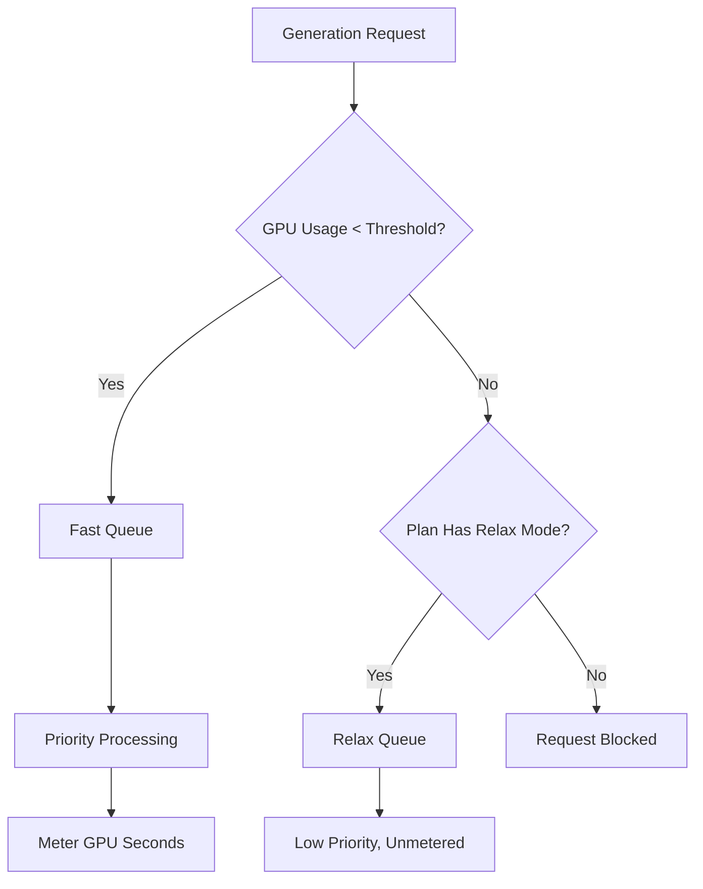

Midjourney é uma plataforma de IA generativa que utiliza um modelo de cobrança único baseado em tempo de GPU em vez de simplesmente contar imagens. Essa abordagem garante que renderizações complexas e em alta resolução custem mais do que rascunhos rápidos e em baixa resolução.

## Como o Midjourney cobra

Os planos de assinatura do Midjourney concedem aos usuários uma quantidade específica de "Horas de GPU Rápida" por mês. Essas horas representam o tempo computacional real gasto nas suas gerações.

| Plano | Preço | Horas de GPU Rápida | Modo Relax | Modo Stealth |
| :--- | :--- | :--- | :--- | :--- |
| Basic | $10/mês | ~3,3 h | Não | Não |
| Standard | $30/mês | 15 h | Ilimitado | Não |
| Pro | $60/mês | 30 h | Ilimitado | Sim |
| Mega | $120/mês | 60 h | Ilimitado | Sim |

1. **Camadas de preços**: o Midjourney oferece quatro níveis de assinatura que variam de $10 a $120 por mês, cada um fornecendo uma quantidade definida de horas de GPU rápida.
2. **Modo Relax**: os planos Standard e superiores incluem gerações ilimitadas em uma fila de baixa prioridade assim que as horas rápidas acabam, garantindo que os usuários nunca encontrem um limite rígido de uso.
3. **Horas extras de GPU**: os usuários podem comprar tempo adicional de GPU Rápida por aproximadamente $4 por hora caso precisem de resultados imediatos após esgotar o valor mensal.
4. **Medição em segundos de GPU**: o uso é monitorado pelo tempo computacional real gasto nas gerações, o que significa que renderizações complexas custam mais do que rascunhos simples.
5. **Loop da comunidade**: usuários ativos podem ganhar horas de GPU bônus avaliando imagens na galeria, o que ajuda a treinar modelos enquanto recompensa a comunidade.
## O que o torna único

O modelo do Midjourney é eficaz porque alinha custo com valor e uso de recursos.

* **Cobrança por tempo de GPU** alinha o custo ao uso de recursos, garantindo que renderizações complexas sejam precificadas de forma justa em comparação com rascunhos simples.
* **Modo Relax** oferece um fallback ilimitado que reduz o churn ao manter o acesso ao serviço mesmo após os limites mensais serem atingidos.
* **A divisão Fast vs Relax** incentiva upgrades ao oferecer processamento prioritário para usuários que valorizam velocidade e resultados imediatos.
* **Horas extras de GPU** fornecem uma opção flexível de recarga para usuários avançados que precisam de capacidade adicional de alta prioridade no meio do mês.

## Construa isso com Dodo Payments

Você pode replicar esse modelo usando Dodo Payments combinando assinaturas com medidores de uso e lógica em nível de aplicação.

<Steps>

<Step title="Create a Usage Meter">

Primeiro, crie um medidor para monitorar os segundos de GPU usados por cada cliente.

* **Nome do medidor**: `gpu.fast_seconds`
* **Agregação**: **Soma** (some a propriedade `gpu_seconds` de cada evento)

Você só rastreará eventos em que o modo de geração é "rápido". Gerações em modo Relax não são metrificadas para fins de cobrança.

</Step>

<Step title="Create Subscription Products with Usage Pricing">

Crie seus produtos de assinatura e vincule o medidor de uso com um limite gratuito.

| Produto | Preço base | Limite gratuito (segundos) | Taxa de excedente |
| :--- | :--- | :--- | :--- |
| Basic | $10/mês | 12.000 (3,3 h) | N/D (Limite rígido) |
| Standard | $30/mês | 54.000 (15 h) | $0,00 (Modo Relax) |
| Pro | $60/mês | 108.000 (30 h) | $0,00 (Modo Relax) |
| Mega | $120/mês | 216.000 (60 h) | $0,00 (Modo Relax) |

Para o plano Basic, você desativará o excedente para aplicar um limite rígido. Para os outros planos, o "Modo Relax" é gerenciado pela lógica da sua aplicação quando o medidor mostra que o limite foi ultrapassado.

</Step>

<Step title="Implement Application-Level Relax Mode">

A ideia principal é que o Modo Relax não é um recurso de cobrança. É seu aplicativo roteando requisições para uma fila mais lenta quando o medidor de uso do Dodo informa que o limite foi atingido.

```typescript
async function handleGenerationRequest(customerId: string, prompt: string) {
  const usage = await getCustomerUsage(customerId, 'gpu.fast_seconds');
  const subscription = await getSubscription(customerId);
  const threshold = getThresholdForPlan(subscription.product_id);
  
  if (usage.current >= threshold) {
    if (subscription.product_id === 'prod_basic') {
      throw new Error('Fast GPU hours exhausted. Upgrade to Standard for Relax Mode.');
    }
    
    // Relax Mode. Route to low-priority queue
    return await queueGeneration(customerId, prompt, {
      priority: 'low',
      mode: 'relax',
      model: 'standard'
    });
  }
  
  // Fast Mode. Priority processing
  return await queueGeneration(customerId, prompt, {
    priority: 'high',
    mode: 'fast',
    model: 'premium'
  });
}
```

</Step>

<Step title="Send Usage Events (Fast Mode Only)">

Envie eventos de uso para o Dodo somente quando uma geração for realizada no modo Fast.

```typescript
import DodoPayments from 'dodopayments';

async function trackFastGeneration(customerId: string, gpuSeconds: number, jobId: string) {
  // Only track Fast mode generations. Relax mode is free and unlimited
  const client = new DodoPayments({
    bearerToken: process.env.DODO_PAYMENTS_API_KEY,
  });

  await client.usageEvents.ingest({
    events: [{
      event_id: `gen_${jobId}`,
      customer_id: customerId,
      event_name: 'gpu.fast_seconds',
      timestamp: new Date().toISOString(),
      metadata: {
        gpu_seconds: gpuSeconds,
        resolution: '1024x1024',
        mode: 'fast'
      }
    }]
  });
}
```

</Step>

<Step title="Sell Extra Fast Hours (One-Time Top-Up)">

Crie um produto de pagamento único para "Hora Extra de GPU Rápida" por $4. Quando um cliente fizer essa compra, você pode conceder limite adicional ou créditos na sua aplicação.

```typescript
// After customer purchases extra hours
const session = await client.checkoutSessions.create({
  product_cart: [
    { product_id: 'prod_extra_gpu_hour', quantity: 5 }
  ],
  customer: { customer_id: customerId },
  return_url: 'https://yourapp.com/dashboard'
});
```

</Step>

<Step title="Create Checkout for Subscription">

Finalmente, crie uma sessão de checkout para o plano de assinatura.

```typescript
const session = await client.checkoutSessions.create({
  product_cart: [
    { product_id: 'prod_mj_standard', quantity: 1 }
  ],
  customer: { email: 'artist@example.com' },
  return_url: 'https://yourapp.com/studio'
});
```

</Step>

</Steps>

## Acelere com o Blueprint de Ingestão por Faixa de Tempo

O [Time Range Ingestion Blueprint](/developer-resources/ingestion-blueprints/time-range) simplifica o rastreamento do tempo de GPU ao fornecer auxiliares dedicados para cobrança baseada em duração.

```bash
npm install @dodopayments/ingestion-blueprints
```

```typescript
import { Ingestion, trackTimeRange } from '@dodopayments/ingestion-blueprints';

const ingestion = new Ingestion({
  apiKey: process.env.DODO_PAYMENTS_API_KEY,
  environment: 'live_mode',
  eventName: 'gpu.fast_seconds',
});

// Track generation time after a Fast mode job completes
const startTime = Date.now();
const result = await runGeneration(prompt, settings);
const durationMs = Date.now() - startTime;

await trackTimeRange(ingestion, {
  customerId: customerId,
  durationMs: durationMs,
  metadata: {
    mode: 'fast',
    resolution: '1024x1024',
  },
});
```

O blueprint cuida da conversão de duração e do formato dos eventos. Você só precisa fornecer o ID do cliente e o tempo decorrido.

<Tip>
O Blueprint de Faixa de Tempo suporta milissegundos, segundos e minutos. Veja a [documentação completa do blueprint](/developer-resources/ingestion-blueprints/time-range) para todas as opções de duração e melhores práticas.
</Tip>

## A arquitetura Fast vs Relax

O sistema de fila dupla funciona roteando requisições com base no estado atual de uso.



1. Todas as requisições passam pela sua aplicação.
2. A aplicação verifica o medidor de uso do Dodo em relação ao limite gratuito do plano.
3. Se o uso estiver abaixo do limite, a requisição vai para a fila Fast e é metrificada.
4. Se o uso estiver acima do limite, a requisição vai para a fila Relax, que não é metrificada e tem prioridade menor.
5. O plano Basic não tem fallback de Relax, então as requisições são bloqueadas assim que o limite é atingido.

<Info>
O Modo Relax é um padrão em nível de aplicação, não um recurso de cobrança do Dodo. O Dodo monitora seu uso de GPU Rápida e informa quando o limite é ultrapassado. Sua aplicação decide se bloqueia o usuário ou o direciona para uma fila mais lenta.
</Info>

## Principais recursos do Dodo usados

<CardGroup cols={2}>
  <Card title="Subscriptions" icon="calendar" href="/features/subscription">
    Gerencie cobrança recorrente e níveis de planos.
  </Card>
  <Card title="Usage-Based Billing" icon="bolt" href="/features/usage-based-billing/introduction">
    Acompanhe e cobre com base no consumo real de recursos.
  </Card>
  <Card title="Event Ingestion" icon="input-pipe" href="/features/usage-based-billing/event-ingestion">
    Envie eventos de uso em alto volume para a API do Dodo.
  </Card>
  <Card title="Meters" icon="gauge" href="/features/usage-based-billing/meters">
    Defina como os eventos de uso são agregados e cobrados.
  </Card>
  <Card title="One-Time Payments" icon="credit-card" href="/features/one-time-payment-products">
    Venda horas extras ou recargas como compras únicas.
  </Card>
  <Card title="Time Range Blueprint" icon="clock" href="/developer-resources/ingestion-blueprints/time-range">
    Rastreamento simplificado de tempo de GPU com auxiliares baseados em duração.
  </Card>
</CardGroup>
