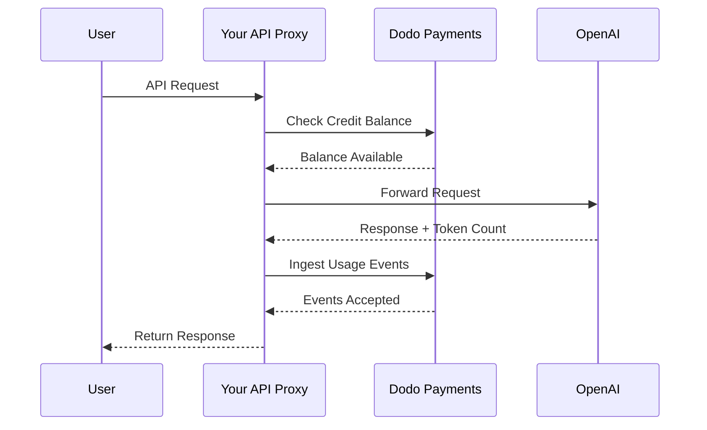
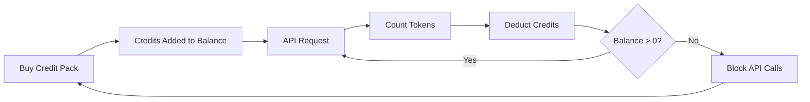

O modelo de cobrança da OpenAI é o padrão-ouro para empresas de IA. Ele combina créditos pré-pagos em moeda fiduciária para uso da API com assinaturas de valor fixo para produtos voltados ao consumidor. Essa abordagem híbrida garante receita previsível enquanto permite que os desenvolvedores escalem seu uso sem atrito.

## Por que o modelo da OpenAI é o padrão

A indústria de IA enfrenta desafios únicos que a cobrança tradicional de SaaS nem sempre resolve. O modelo da OpenAI resolve vários desses problemas simultaneamente.

1. **Receita previsível e baixo risco**: Ao exigir créditos pré-pagos para o uso da API, a OpenAI elimina o risco de usuários acumularem faturas enormes que não conseguem pagar. Você recebe o dinheiro antecipadamente, e o usuário obtém o serviço conforme usa.
2. **Escalabilidade para desenvolvedores**: Um recarga de \$5 é uma barreira de entrada baixa. Conforme a aplicação cresce, os desenvolvedores podem automatizar recargas ou comprar pacotes maiores. O atrito para começar é quase zero, mas o teto para crescimento é ilimitado.
3. **Psicologia do usuário**: Denominar créditos em moeda fiduciária (USD) em vez de “tokens” ou “pontos” abstratos torna o valor claro. Parece uma conta bancária para serviços de IA, o que gera confiança e facilita o planejamento financeiro para empresas.

## Como a OpenAI cobra

A OpenAI opera dois modelos distintos de cobrança que atendem a diferentes necessidades dos usuários.

1. **API (pagamento conforme o uso)**: A API utiliza créditos pré-pagos denominados em moeda fiduciária. Os usuários recarregam suas contas com \$5, \$10, \$50 ou mais. Esses créditos mostram um valor em dólares, mas não têm valor monetário fora da OpenAI. A OpenAI cobra por token com taxas diferentes para tokens de entrada e saída. Os créditos nunca expiram, e quando o saldo do usuário atinge \$0, suas chamadas à API falham imediatamente.
2. **ChatGPT Plus, Team e Enterprise**: São assinaturas de valor fixo. O ChatGPT Plus custa \$20 por mês, enquanto o plano Team custa \$25 por usuário por mês. Esses planos têm limites de uso suaves, em que os usuários são rebaixados para um modelo menor em vez de serem bloqueados.
3. **Camadas de tarifa baseadas em gastos**: À medida que você gasta mais dinheiro total ao longo do tempo, desbloqueia limites de taxa de API mais altos. Esse é um sistema de escalonamento baseado em confiança vinculado diretamente ao seu histórico de cobrança.

| Modelo | Preço | Tokens de entrada | Tokens de saída |
| :--- | :--- | :--- | :--- |
| GPT-4o | Uso baseado | \$2.50 / 1M | \$10.00 / 1M |
| GPT-4o-mini | Uso baseado | \$0.15 / 1M | \$0.60 / 1M |
| o1 | Uso baseado | \$15.00 / 1M | \$60.00 / 1M |

| Plano | Preço | Tipo |
| :--- | :--- | :--- |
| Gratuito | \$0 | Acesso limitado |
| Plus | \$20 / mês | Assinatura com limites suaves |
| Team | \$25 / usuário / mês | Assinatura por assento |
| Enterprise | Personalizado | Cobrança via fatura |
## O que o torna único

A estratégia de cobrança da OpenAI tem várias características-chave que a tornam eficaz para serviços de IA.

- **Créditos denominados em moeda fiduciária**: Os créditos parecem dinheiro porque são denominados em USD. Isso torna a precificação transparente e fácil de entender para os desenvolvedores.
- **Sem expiração**: Saldos que nunca expiram reduzem a pressão de “use ou perca”. Os usuários se sentem confortáveis em recarregar valores maiores porque sabem que o valor não vai desaparecer.
- **Medidores multidimensionais**: Tokens de entrada e saída são monitorados separadamente, mas deduzidos do mesmo saldo de créditos. Isso permite que a OpenAI precifique tokens de saída caros de forma diferente dos tokens de entrada mais baratos.
- **Camadas de confiança**: Vincular limites de taxa ao gasto total incentiva os usuários a permanecer na plataforma e recompensa clientes de longo prazo com melhor desempenho.

## Vantagens estratégicas

Esse modelo cria um ciclo de crescimento poderoso. Custos de entrada baixos atraem desenvolvedores. Créditos pré-pagos fornecem fluxo de caixa imediato. A escalabilidade baseada em uso garante que, conforme os desenvolvedores prosperam, a OpenAI também prospera. O lado de assinatura oferece uma base constante e previsível de receita de não desenvolvedores.

## Construa isso com a Dodo Payments

<Steps>
  <Step title="Create a Fiat Credit Entitlement">
    Comece criando um direito a crédito (credit entitlement) no painel da Dodo Payments. Isso servirá como o saldo central para seus usuários.

    * **Tipo de crédito:** Créditos fiduciários (USD)
    * **Expiração do crédito:** Nunca
    * **Rollover:** Não necessário (já que nunca expiram)
    * **Excedente:** Desativado

    Desativar o excedente garante que as chamadas à API falhem quando o saldo chega a \$0, exatamente como na OpenAI.
  </Step>

  <Step title="Create Top-Up Products">
    Crie produtos de pagamento único para diferentes pacotes de crédito. Você pode oferecer opções de \$5, \$10, \$50 e \$100. Vincule seu direito a crédito fiduciário a cada produto.

    Defina os créditos emitidos por produto em centavos. Para um pacote de \$50, você emitirá 5.000 créditos.

    ```typescript
    import DodoPayments from 'dodopayments';

    const client = new DodoPayments({
      bearerToken: process.env.DODO_PAYMENTS_API_KEY,
    });

    const session = await client.checkoutSessions.create({
      product_cart: [
        { product_id: 'prod_credit_pack_50', quantity: 1 }
      ],
      customer: { email: 'developer@example.com' },
      return_url: 'https://yourapp.com/dashboard'
    });
    ```

  </Step>

  <Step title="Create Usage Meters">
    Crie dois medidores distintos para monitorar o uso de tokens.

    * `llm.input_tokens`: agregação somatória na propriedade `tokens`.
    * `llm.output_tokens`: agregação somatória na propriedade `tokens`.

    Vincule ambos os medidores ao seu direito a crédito fiduciário. Você precisará configurar as “unidades do medidor por crédito” para cada um.

    ### Calculando unidades do medidor por crédito

    Para igualar a precificação do GPT-4o da OpenAI (\$2.50 por 1M de tokens de entrada), você precisa calcular quantos tokens equivalem a \$1 (100 centavos).

    * **Tokens de entrada:** 1.000.000 tokens / \$2.50 = 400.000 tokens por \$1.
    * **Tokens de saída:** 1.000.000 tokens / \$10.00 = 100.000 tokens por \$1.

    No painel da Dodo, você configuraria as “unidades do medidor por crédito” em 400.000 para entrada e 100.000 para saída.
  </Step>

  <Step title="Send Usage Events">
    Após cada requisição LLM, envie os dados de uso para a Dodo Payments. Você pode enviar eventos de entrada e saída em uma única requisição.

    ```typescript
    await client.usageEvents.ingest({
      events: [{
        event_id: `req_${requestId}`,
        customer_id: customerId,
        event_name: 'llm.input_tokens',
        timestamp: new Date().toISOString(),
        metadata: {
          model: 'gpt-4o',
          tokens: 1500
        }
      }, {
        event_id: `req_${requestId}_out`,
        customer_id: customerId,
        event_name: 'llm.output_tokens',
        timestamp: new Date().toISOString(),
        metadata: {
          model: 'gpt-4o',
          tokens: 800
        }
      }]
    });
    ```

  </Step>

  <Step title="Handle Balance Depletion">
    Você deve verificar o saldo do usuário antes de processar uma requisição à API. Se o saldo estiver zero ou negativo, retorne um erro 402.

    ```typescript
    async function checkCreditsBeforeRequest(customerId: string) {
      const balance = await client.creditEntitlements.balances.retrieve(customerId, {
        credit_entitlement_id: 'credit_entitlement_id',
      });

      if (balance.available <= 0) {
        throw new Error('Insufficient credits. Please top up your account.');
      }
    }
    ```

    ### Lidando com webhooks de saldo baixo

    Não espere o usuário atingir \$0 para notificá-lo. Use webhooks para disparar um e-mail ou notificação no aplicativo quando o saldo cair abaixo de um determinado limite.

    ```typescript
    import DodoPayments from 'dodopayments';
    import express from 'express';

    const app = express();
    app.use(express.raw({ type: 'application/json' }));

    const client = new DodoPayments({
      bearerToken: process.env.DODO_PAYMENTS_API_KEY,
      webhookKey: process.env.DODO_PAYMENTS_WEBHOOK_KEY,
    });

    app.post('/webhooks/dodo', async (req, res) => {
      try {
        const event = client.webhooks.unwrap(req.body.toString(), {
          headers: {
            'webhook-id': req.headers['webhook-id'] as string,
            'webhook-signature': req.headers['webhook-signature'] as string,
            'webhook-timestamp': req.headers['webhook-timestamp'] as string,
          },
        });

        if (event.type === 'credit.balance_low') {
          const { customer_id, available_balance } = event.data;
          await sendLowBalanceEmail(customer_id, available_balance);
        }

        res.json({ received: true });
      } catch (error) {
        res.status(401).json({ error: 'Invalid signature' });
      }
    });
    ```

    <Tip>
      A OpenAI envia esses e-mails quando o saldo de um usuário está quase esgotado, dando tempo para ele recarregar sem interrupção do serviço.
    </Tip>
  </Step>

  <Step title="Build the ChatGPT Subscription Side (Optional)">
    Se quiser oferecer um plano de assinatura como o ChatGPT Plus, crie um produto de assinatura separado na Dodo Payments. Esses produtos não precisam de direitos a crédito.

    Para um plano Team, use cobrança por assento adicionando complementos para cada usuário adicional.

    ```typescript
    const session = await client.checkoutSessions.create({
      product_cart: [
        { product_id: 'prod_plus_subscription', quantity: 1 }
      ],
      customer: { email: 'user@example.com' },
      return_url: 'https://yourapp.com/billing'
    });
    ```

    ### Implementando limites suaves

    Para replicar os limites suaves da OpenAI, você pode acompanhar o uso dos usuários de assinatura com os mesmos medidores, mas sem vinculá-los a um direito a crédito. Na lógica da sua aplicação, verifique o uso referente ao período de cobrança atual.

    ```typescript
    async function checkSubscriptionUsage(customerId: string) {
      const usage = await getUsageForCurrentPeriod(customerId);
      
      if (usage > SOFT_CAP_THRESHOLD) {
        // Route to a smaller model instead of blocking
        return 'gpt-4o-mini';
      }
      
      return 'gpt-4o';
    }
    ```

  </Step>
</Steps>

## Acelere com o Blueprint de Ingestão de LLM

Os passos acima mostram como construir e enviar eventos de uso manualmente. Para implantações em produção, o [Blueprint de Ingestão de LLM](/developer-resources/ingestion-blueprints/llm) fornece rastreamento automático de tokens que envolve seu cliente OpenAI diretamente.

```bash
npm install @dodopayments/ingestion-blueprints
```

```typescript
import { createLLMTracker } from '@dodopayments/ingestion-blueprints';
import OpenAI from 'openai';

const openai = new OpenAI({ apiKey: process.env.OPENAI_API_KEY });

const tracker = createLLMTracker({
  apiKey: process.env.DODO_PAYMENTS_API_KEY,
  environment: 'live_mode',
  eventName: 'llm.chat_completion',
});

const trackedClient = tracker.wrap({
  client: openai,
  customerId: customerId,
});

// Every API call now automatically tracks token usage
const response = await trackedClient.chat.completions.create({
  model: 'gpt-4o',
  messages: [{ role: 'user', content: prompt }],
});

// inputTokens, outputTokens, and totalTokens are sent automatically
console.log('Tokens used:', response.usage);
```

O blueprint captura `inputTokens`, `outputTokens` e `totalTokens` de cada resposta da API e os envia como metadados de evento. Configure seu medidor para agregar na propriedade de token apropriada.

<Tip>
O Blueprint de LLM dá suporte à OpenAI, Anthropic, Groq, Google Gemini, OpenRouter e ao SDK Vercel AI. Veja a [documentação completa do blueprint](/developer-resources/ingestion-blueprints/llm) para exemplos específicos de provedores e configurações avançadas.
</Tip>

## Implementando camadas de tarifa baseadas em gasto

As camadas de tarifa da OpenAI são uma forma poderosa de gerenciar capacidade. Você pode implementar isso monitorando o gasto total de um cliente ao longo da vida.

1. **Monitore o gasto vitalício:** Ouça os webhooks `payment.succeeded` e atualize um campo `total_spend` no banco de dados desse cliente.
2. **Defina camadas:** Crie um mapeamento de valores gastos para limites de taxa.
   * Camada 1: gasto de \$0 a \$50 -> 3 RPM
   * Camada 2: gasto de \$50 a \$250 -> 10 RPM
   * Camada 3: gasto acima de \$250 -> 50 RPM
3. **Aplique os limites:** No middleware da sua API, verifique a camada do cliente e imponha o limite de taxa correspondente.

```typescript
async function getRateLimitForCustomer(customerId: string) {
  const customer = await db.customers.findUnique({ where: { id: customerId } });
  const totalSpend = customer.total_spend;

  if (totalSpend >= 25000) return TIER_3_LIMITS; // $250.00
  if (totalSpend >= 5000) return TIER_2_LIMITS;  // $50.00
  return TIER_1_LIMITS;
}
```

## Exemplo completo de implementação: O proxy da API

Em um cenário real, você provavelmente terá um proxy de API que fica entre seus usuários e o provedor de LLM. Esse proxy cuida da autenticação, verificação de créditos e relatório de uso.



```typescript
import DodoPayments from 'dodopayments';
import OpenAI from 'openai';

const client = new DodoPayments({
  bearerToken: process.env.DODO_PAYMENTS_API_KEY,
});
const openai = new OpenAI({ apiKey: process.env.OPENAI_API_KEY });

export async function handleApiRequest(req, res) {
  const { customerId, prompt, model } = req.body;

  try {
    // 1. Check credit balance
    const balance = await client.creditEntitlements.balances.retrieve(customerId, {
      credit_entitlement_id: 'credit_entitlement_id',
    });

    if (balance.available <= 0) {
      return res.status(402).json({ error: 'Insufficient credits. Please top up.' });
    }

    // 2. Call OpenAI
    const completion = await openai.chat.completions.create({
      model: model,
      messages: [{ role: 'user', content: prompt }],
    });

    const { prompt_tokens, completion_tokens } = completion.usage;

    // 3. Ingest usage events to Dodo
    await client.usageEvents.ingest({
      events: [
        {
          event_id: `req_${completion.id}_in`,
          customer_id: customerId,
          event_name: 'llm.input_tokens',
          timestamp: new Date().toISOString(),
          metadata: { model, tokens: prompt_tokens }
        },
        {
          event_id: `req_${completion.id}_out`,
          customer_id: customerId,
          event_name: 'llm.output_tokens',
          timestamp: new Date().toISOString(),
          metadata: { model, tokens: completion_tokens }
        }
      ]
    });

    // 4. Return response to user
    res.json(completion);

  } catch (error) {
    console.error('API Error:', error);
    res.status(500).json({ error: 'Internal server error' });
  }
}
```

## Lidando com casos de borda

Ao construir um sistema de cobrança tão complexo quanto o da OpenAI, você enfrentará vários casos de borda que exigem cuidado.

### Condições de corrida

Se um usuário tiver um saldo muito baixo e enviar várias requisições simultaneamente, ele pode exceder o limite de crédito antes que o primeiro evento seja processado. Para evitar isso, você pode implementar um pequeno “buffer” ou usar um bloqueio distribuído sobre o saldo do cliente durante a requisição.

### Latência de ingestão de eventos

A Dodo Payments processa eventos de forma assíncrona. Isso significa que pode haver um pequeno atraso entre uma chamada à API e a dedução de crédito. Para a maioria dos casos de uso, isso é aceitável. Se você precisar de aplicação estrita em tempo real, pode manter um cache local do saldo do usuário e atualizá-lo de forma otimista.

### Tratamento de reembolsos

Se você reembolsar a compra de um pacote de crédito, a Dodo Payments cuidará automaticamente do direito a crédito, se configurado. No entanto, você deve garantir que a lógica da sua aplicação reflita essa mudança imediatamente para evitar que os usuários usem créditos que não possuem mais.

### Suporte a múltiplos modelos

Se você suporta vários modelos com precificação diferente, tem duas opções:
1. **Medidores separados:** Crie medidores separados para cada modelo (por exemplo, `gpt-4o.input_tokens`, `gpt-4o-mini.input_tokens`).
2. **Eventos ponderados:** Use um único medidor, mas multiplique o valor `tokens` por um peso antes de enviá-lo à Dodo. Por exemplo, se o GPT-4o for 10x mais caro que o GPT-4o-mini, você pode enviar 10x os tokens para as requisições GPT-4o.

A OpenAI utiliza a abordagem de medidores separados internamente para manter registros claros de uso por modelo.

## Visão geral da arquitetura



Os medidores rastreiam tokens e deduzem o valor correspondente do saldo de crédito do usuário com base nas taxas configuradas.

## Conclusão

Reproduzir o modelo de cobrança da OpenAI com a Dodo Payments oferece o melhor dos dois mundos: a flexibilidade da cobrança baseada em uso e a previsibilidade dos créditos pré-pagos. Seguindo este guia, você pode construir um sistema de cobrança que escala com seus usuários enquanto protege suas margens.

Seja você quem está construindo o próximo grande LLM ou uma ferramenta de IA nichada, esses padrões ajudarão a criar uma experiência profissional e amigável aos desenvolvedores. Essa abordagem garante que sua infraestrutura de cobrança seja tão escalável e confiável quanto os modelos de IA que você entrega aos seus clientes.

## Principais recursos da Dodo utilizados

Explore os recursos que tornam essa implementação possível.

<CardGroup cols={2}>
  <Card title="Credit-Based Billing" icon="coins" href="/features/credit-based-billing">
    Gerencie créditos fiduciários pré-pagos e direitos para seus usuários.
  </Card>
  <Card title="Usage-Based Billing" icon="chart-line" href="/features/usage-based-billing/introduction">
    Monitore o uso granular, como tokens, e cobre em tempo real.
  </Card>
  <Card title="One-Time Payments" icon="credit-card" href="/features/one-time-payment-products">
    Venda pacotes de crédito e recargas com um fluxo de checkout simples.
  </Card>
  <Card title="Event Ingestion" icon="bolt" href="/features/usage-based-billing/event-ingestion">
    Envie dados de uso em alto volume para a Dodo Payments com facilidade.
  </Card>
  <Card title="Webhooks" icon="webhook" href="/developer-resources/webhooks/intents/credit">
    Mantenha-se atualizado sobre mudanças no saldo de crédito e alertas de saldo baixo.
  </Card>
  <Card title="LLM Ingestion Blueprint" icon="brain-circuit" href="/developer-resources/ingestion-blueprints/llm">
    Rastreamento automático de tokens para OpenAI e outros provedores de LLM.
  </Card>
</CardGroup>
