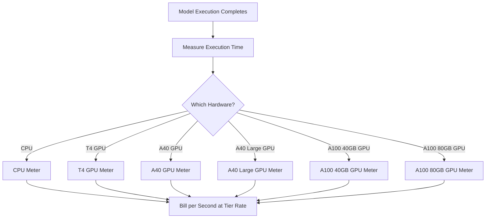

Replicate é uma plataforma para executar modelos de aprendizado de máquina de código aberto na nuvem. O modelo de cobrança deles é um dos exemplos mais puros de precificação baseada em uso na indústria de IA. Não há taxa de assinatura mensal nem valor fixo por execução de modelo. Em vez disso, eles cobram pelo exato tempo de computação consumido, segundo a segundo, com tarifas que variam conforme o hardware subjacente.

Essa abordagem funciona bem para cargas de trabalho de IA porque os tempos de execução são imprevisíveis. Um único usuário pode executar um modelo leve por alguns segundos ou um modelo generativo enorme por vários minutos. Ao vincular o custo aos recursos de computação em vez do modelo em si, a Replicate mantém os preços transparentes e escaláveis.

## Como a Replicate Cobra

Os preços da Replicate são desacoplados do modelo específico em execução. Quer você esteja gerando uma imagem com SDXL ou executando o Llama 3, a cobrança é determinada pelo nível de hardware e pela duração da execução. Isso permite que eles hospedem milhares de modelos de código aberto sem precisar de um plano de preços separado para cada um.

| Hardware | Preço por Segundo | Preço por Hora |
| :--- | :--- | :--- |
| NVIDIA CPU | $0.000100 | $0.36 |
| NVIDIA T4 GPU | $0.000225 | $0.81 |
| NVIDIA A40 GPU | $0.000575 | $2.07 |
| NVIDIA A40 (Large) GPU | $0.000725 | $2.61 |
| NVIDIA A100 (40GB) GPU | $0.001150 | $4.14 |
| NVIDIA A100 (80GB) GPU | $0.001400 | $5.04 |



1. **Tarifas específicas por hardware**: O custo por segundo varia com base nos recursos de computação necessários. Cada nível de hardware tem um ponto de preço diferente.
2. **Modelo puramente baseado no uso**: Não há taxas mensais, excedentes ou limites. Os usuários são cobrados pelo tempo exato de computação (por exemplo, "12.4 seconds on an A100") em vez de por geração.
3. **Granularidade por segundo**: Provedores em nuvem tradicionais cobram por hora ou minuto, o que gera desperdício em tarefas curtas. A cobrança por segundo elimina essa ineficiência tanto para experimentos rápidos quanto para cargas de produção pesadas.

<Info>
Inícios a frio também são cobrados. A primeira requisição a um modelo frequentemente leva de 10 a 30 segundos para carregar o modelo na memória. Esse tempo de carregamento é cobrado à mesma tarifa da execução.
</Info>

* **Métricas específicas por hardware:** O mesmo modelo custa mais em hardware melhor. Os usuários escolhem entre velocidade e custo. Uma GPU T4 serve para tarefas sem sensibilidade a tempo, enquanto uma A100 atende aplicações em tempo real.
* **Granularidade por segundo:** A cobrança é calculada segundo a segundo, portanto os usuários nunca pagam a mais por tarefas curtas.
* **Sem assinatura:** Compromisso zero para começar. Escala infinitamente com o uso, sendo ideal para startups e desenvolvedores experimentando diferentes modelos.
* **Independente de modelo:** A lógica de cobrança permanece a mesma independentemente do tipo de tarefa (geração de imagem, processamento de texto, transcrição de áudio ou síntese de vídeo). Isso permite que a plataforma suporte um vasto ecossistema de modelos sem tabelas de preços complexas.

## Recrie isso com Dodo Payments

Você pode reproduzir esse modelo de cobrança usando os recursos de faturamento baseado no uso da Dodo Payments. O segredo é usar múltiplos medidores para rastrear os diferentes níveis de hardware e associá-los a um único produto.

<Steps>
  <Step title="Create Usage Meters (One Per Hardware Class)">
    Crie medidores separados para cada nível de hardware. Cada tipo de hardware tem um custo por segundo diferente, então a medição independente permite que a Dodo precifique cada nível de forma distinta e forneça faturas itemizadas.

    | Nome do Medidor | Nome do Evento | Agregação | Propriedade |
    | :--- | :--- | :--- | :--- |
    | CPU Compute | `compute.cpu` | Sum | `execution_seconds` |
    | GPU T4 Compute | `compute.gpu_t4` | Sum | `execution_seconds` |
    | GPU A40 Compute | `compute.gpu_a40` | Sum | `execution_seconds` |
    | GPU A40 Large Compute | `compute.gpu_a40_large` | Sum | `execution_seconds` |
    | GPU A100 40GB Compute | `compute.gpu_a100_40` | Sum | `execution_seconds` |
    | GPU A100 80GB Compute | `compute.gpu_a100_80` | Sum | `execution_seconds` |

    A agregação `Sum` na propriedade `execution_seconds` calcula o tempo total de computação por nível de hardware durante o período de cobrança.
  </Step>

  <Step title="Create a Usage-Based Product">
    Crie um novo produto no painel da Dodo Payments:

    * **Tipo de precificação:** Cobrança baseada no uso
    * **Preço base:** $0/mês (sem taxa de assinatura)
    * **Frequência de cobrança:** Mensal

    Anexe todos os medidores com seus preços por unidade:

    | Medidor | Preço por Unidade (por segundo) |
    | :--- | :--- |
    | compute.cpu | $0.000100 |
    | compute.gpu_t4 | $0.000225 |
    | compute.gpu_a40 | $0.000575 |
    | compute.gpu_a40_large | $0.000725 |
    | compute.gpu_a100_40 | $0.001150 |
    | compute.gpu_a100_80 | $0.001400 |

    Defina o **Limite Gratuito** como 0 para todos os medidores. Cada segundo de execução é cobrável.
  </Step>

  <Step title="Send Usage Events">
    Envie eventos de uso para a Dodo sempre que uma execução de modelo for concluída. Inclua um `event_id` único para cada previsão a fim de garantir idempotência.

    ```typescript
    import DodoPayments from 'dodopayments';

    type HardwareTier = 'cpu' | 'gpu_t4' | 'gpu_a40' | 'gpu_a40_large' | 'gpu_a100_40' | 'gpu_a100_80';

    const client = new DodoPayments({
      bearerToken: process.env.DODO_PAYMENTS_API_KEY,
    });

    async function trackModelExecution(
      customerId: string,
      modelId: string,
      hardware: HardwareTier,
      executionSeconds: number,
      predictionId: string
    ) {
      const eventName = `compute.${hardware}`;

      await client.usageEvents.ingest({
        events: [{
          event_id: `pred_${predictionId}`,
          customer_id: customerId,
          event_name: eventName,
          timestamp: new Date().toISOString(),
          metadata: {
            execution_seconds: executionSeconds,
            model_id: modelId,
            hardware: hardware
          }
        }]
      });
    }

    // Example: SDXL image generation on A100
    await trackModelExecution(
      'cus_abc123',
      'stability-ai/sdxl',
      'gpu_a100_80',
      8.3,  // 8.3 seconds of A100 time
      'pred_xyz789'
    );
    ```

  </Step>

  <Step title="Measure Execution Time Precisely">
    Envolva a execução do modelo com temporização precisa usando `performance.now()`. Arredonde para o décimo de segundo mais próximo para cobrança.

    ```typescript
    async function runModelWithMetering(
      customerId: string,
      modelId: string,
      hardware: HardwareTier,
      input: Record<string, unknown>
    ) {
      const predictionId = `pred_${Date.now()}`;
      const startTime = performance.now();

      try {
        const result = await executeModel(modelId, input, hardware);
        const executionSeconds = (performance.now() - startTime) / 1000;
        const billedSeconds = Math.round(executionSeconds * 10) / 10;

        await trackModelExecution(
          customerId,
          modelId,
          hardware,
          billedSeconds,
          predictionId
        );

        return result;
      } catch (error) {
        // Still bill for compute time even on failure
        const executionSeconds = (performance.now() - startTime) / 1000;
        if (executionSeconds > 1) {
          await trackModelExecution(
            customerId,
            modelId,
            hardware,
            Math.round(executionSeconds * 10) / 10,
            predictionId
          );
        }
        throw error;
      }
    }
    ```

  </Step>

  <Step title="Create Checkout">
    Quando um usuário se cadastra, crie uma sessão de checkout para o produto baseado no uso. A Dodo lida automaticamente com cobrança recorrente e faturamento.

    ```typescript
    const session = await client.checkoutSessions.create({
      product_cart: [
        { product_id: 'prod_compute_payg', quantity: 1 }
      ],
      customer: { email: 'ml-engineer@company.com' },
      return_url: 'https://yourplatform.com/dashboard'
    });
    ```

  </Step>
</Steps>

## Acelere com o Blueprint de Ingestão Time Range

O [Time Range Ingestion Blueprint](/developer-resources/ingestion-blueprints/time-range) simplifica o rastreamento de computação por segundo. Crie uma instância de ingestão por nível de hardware e use `trackTimeRange` para uma submissão de eventos mais limpa.

```bash
npm install @dodopayments/ingestion-blueprints
```

```typescript
import { Ingestion, trackTimeRange } from '@dodopayments/ingestion-blueprints';

// Create one ingestion instance per hardware tier
function createHardwareIngestion(hardware: string) {
  return new Ingestion({
    apiKey: process.env.DODO_PAYMENTS_API_KEY,
    environment: 'live_mode',
    eventName: `compute.${hardware}`,
  });
}

const ingestions: Record<string, Ingestion> = {
  cpu: createHardwareIngestion('cpu'),
  gpu_t4: createHardwareIngestion('gpu_t4'),
  gpu_a40: createHardwareIngestion('gpu_a40'),
  gpu_a40_large: createHardwareIngestion('gpu_a40_large'),
  gpu_a100_40: createHardwareIngestion('gpu_a100_40'),
  gpu_a100_80: createHardwareIngestion('gpu_a100_80'),
};

// Track execution after a model run completes
const startTime = performance.now();
const result = await executeModel(modelId, input, hardware);
const durationMs = performance.now() - startTime;

await trackTimeRange(ingestions[hardware], {
  customerId: customerId,
  durationMs: durationMs,
  metadata: {
    model_id: modelId,
    hardware: hardware,
  },
});
```

O blueprint cuida da formatação da duração e da construção dos eventos. Combinado com instâncias de ingestão por hardware, esse padrão mapeia de forma organizada para a metrificação multi-nível da Replicate.

<Tip>
Para trabalhos de longa duração, combine o Blueprint Time Range com monitoramento por batimentos intervalados. Consulte a [documentação completa do blueprint](/developer-resources/ingestion-blueprints/time-range) para padrões avançados.
</Tip>

## Estimativa de Custos para Usuários

Como a cobrança baseada no uso pode ser imprevisível, forneça aos usuários estimativas de custo antes que eles executem um modelo. Isso reduz surpresas na fatura e gera confiança.

### Cálculos de Custos de Exemplo

| Modelo | Hardware | Tempo Médio | Custo por Execução |
| :--- | :--- | :--- | :--- |
| SDXL (imagem) | A100 80GB | ~8 sec | ~$0.0112 |
| Llama 3 (texto) | A100 40GB | ~3 sec | ~$0.0035 |
| Whisper (áudio) | GPU T4 | ~15 sec | ~$0.0034 |

### Construindo um Calculador de Custos

```typescript
function estimateCost(hardware: HardwareTier, estimatedSeconds: number): number {
  const rates: Record<HardwareTier, number> = {
    'cpu': 0.000100,
    'gpu_t4': 0.000225,
    'gpu_a40': 0.000575,
    'gpu_a40_large': 0.000725,
    'gpu_a100_40': 0.001150,
    'gpu_a100_80': 0.001400
  };

  return Number((rates[hardware] * estimatedSeconds).toFixed(4));
}

// Show the user before running: "This will cost approximately $0.0098"
const estimate = estimateCost('gpu_a100_80', 8.5);
```

## Empresarial: Capacidade Reservada

Para clientes empresariais que precisam de disponibilidade garantida e ausência de inícios a frio, a Replicate oferece "Instâncias Privadas" a uma tarifa horária fixa.

Com a Dodo Payments, modelei isso como um produto de assinatura:

* **Tipo de Produto:** Assinatura
* **Preço:** Valor mensal fixo (por exemplo, "Instância Reservada A100 - $500/mês")
* **Ciclo de Cobrança:** Mensal

Você ainda pode enviar eventos de uso para monitoramento e análises, mas a assinatura cobre o custo. À medida que o volume de um usuário cresce, migrar do modelo pay-as-you-go para capacidade reservada geralmente se torna mais econômico.

## Avançado: Medição por Heartbeat

Para tarefas que levam vários minutos ou horas, enviar um único evento no final é arriscado. Se o processo travar, você perde os dados de uso. Uma abordagem melhor é enviar eventos de uso a cada 30-60 segundos durante a execução.

```typescript
async function runLongTaskWithHeartbeat(
  customerId: string,
  modelId: string,
  hardware: HardwareTier
) {
  const predictionId = `pred_${Date.now()}`;
  let totalSeconds = 0;

  const heartbeatInterval = setInterval(async () => {
    try {
      await trackModelExecution(
        customerId,
        modelId,
        hardware,
        30,
        `${predictionId}_${totalSeconds}`
      );
      totalSeconds += 30;
    } catch (error) {
      console.error('Heartbeat tracking failed:', error, { predictionId, totalSeconds });
    }
  }, 30000);

  try {
    await executeLongTask();
  } finally {
    clearInterval(heartbeatInterval);
  }
}
```

## Principais Recursos da Dodo Utilizados

<CardGroup cols={2}>
  <Card title="Usage-Based Billing" icon="chart-line" href="/features/usage-based-billing/introduction">
    Configure produtos que cobram com base no consumo.
  </Card>
  <Card title="Meters" icon="gauge" href="/features/usage-based-billing/meters">
    Defina as métricas que você deseja rastrear e cobrar.
  </Card>
  <Card title="Event Ingestion" icon="bolt" href="/features/usage-based-billing/event-ingestion">
    Envie dados de uso para a Dodo em tempo real.
  </Card>
  <Card title="Subscriptions" icon="calendar" href="/features/subscription">
    Gerencie cobranças recorrentes para capacidade reservada e planos empresariais.
  </Card>
  <Card title="Time Range Blueprint" icon="clock" href="/developer-resources/ingestion-blueprints/time-range">
    Rastreamento de computação por segundo com auxiliares de duração.
  </Card>
</CardGroup>
