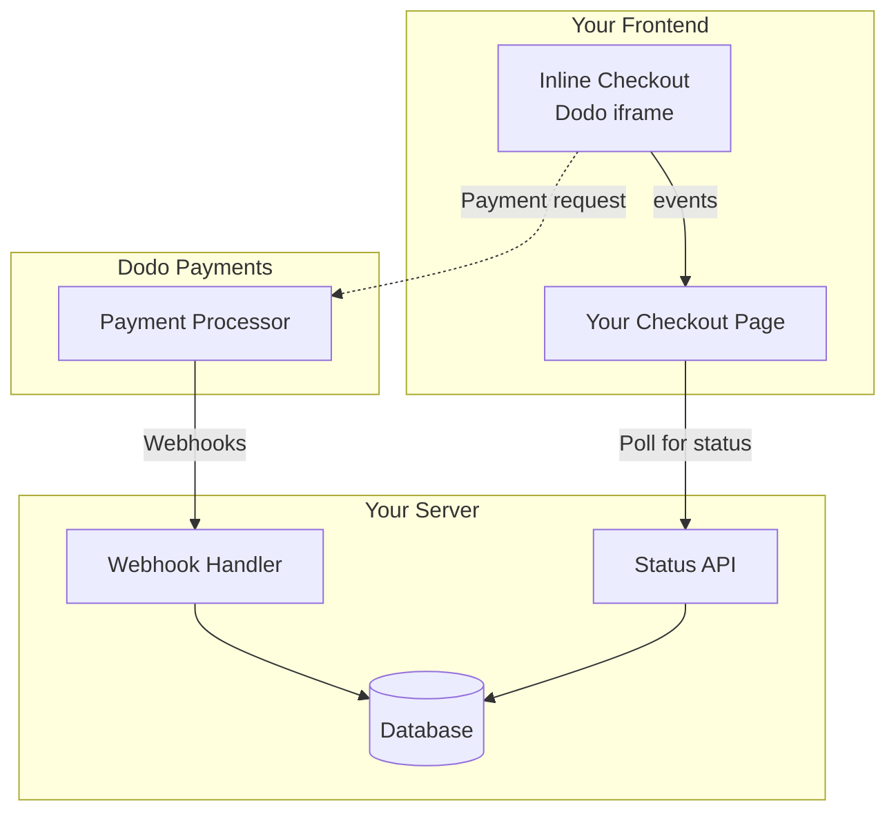

## Visão Geral

O checkout inline permite que você crie experiências de checkout totalmente integradas que se misturam perfeitamente com seu site ou aplicativo. Ao contrário do [checkout em sobreposição](/developer-resources/overlay-checkout), que se abre como um modal sobre sua página, o checkout inline incorpora o formulário de pagamento diretamente no layout da sua página.

Usando o checkout inline, você pode:

- Criar experiências de checkout que estão totalmente integradas ao seu aplicativo ou site
- Permitir que o Dodo Payments capture com segurança as informações do cliente e de pagamento em um quadro de checkout otimizado
- Exibir itens, totais e outras informações do Dodo Payments em sua página
- Usar métodos e eventos da SDK para construir experiências de checkout avançadas

<Frame>
    
</Frame>

## Como Funciona

O checkout inline funciona incorporando um quadro seguro do Dodo Payments em seu site ou aplicativo.

O quadro de checkout lida com a coleta de informações do cliente e a captura de detalhes de pagamento. Sua página exibe a lista de itens, totais e opções para alterar o que está no checkout. A SDK permite que sua página e o quadro de checkout interajam entre si.

O Dodo Payments cria automaticamente uma assinatura quando um checkout é concluído, pronto para você provisionar.

<Note>
O frame de checkout embutido lida com todas as informações de pagamento sensíveis de forma segura, garantindo conformidade PCI sem certificação adicional do seu lado.
</Note>

## O Que Faz um Bom Checkout Inline?

É importante que os clientes saibam de quem estão comprando, o que estão comprando e quanto estão pagando.

Para construir um checkout inline que seja compatível e otimizado para conversão, sua implementação deve incluir:

<Frame caption="Example inline checkout layout showing required elements">
    
</Frame>

1. **Informações recorrentes**: Se for recorrente, com que frequência ocorre e o total a ser pago na renovação. Se for um teste, quanto tempo dura o teste.
2. **Descrições dos itens**: Uma descrição do que está sendo comprado.
3. **Totais da transação**: Totais da transação, incluindo subtotal, total de impostos e total geral. Certifique-se de incluir a moeda também.
4. **Rodapé do Dodo Payments**: O quadro completo do checkout inline, incluindo o rodapé do checkout que contém informações sobre o Dodo Payments, nossos termos de venda e nossa política de privacidade.
5. **Política de reembolso**: Um link para sua política de reembolso, se for diferente da política padrão de reembolso do Dodo Payments.

<Warning>
Sempre exiba o frame completo do checkout embutido, incluindo o rodapé. Remover ou ocultar informações legais viola os requisitos de conformidade.
</Warning>

## Jornada do Cliente

O fluxo de checkout é determinado pela configuração da sua sessão de checkout. Dependendo de como você configura a sessão de checkout, os clientes experimentarão um checkout que pode apresentar todas as informações em uma única página ou em várias etapas.

<Steps>
<Step title="Customer opens checkout">

Você pode abrir o checkout inline passando itens ou uma transação existente. Use o SDK para mostrar e atualizar informações na página, e métodos do SDK para atualizar itens com base na interação do cliente.
    

</Step>

<Step title="Customer enters their details">

O checkout inline primeiro pede aos clientes que insiram seu endereço de e-mail, selecionem seu país e (quando necessário) insiram seu CEP ou código postal. Esta etapa coleta todas as informações necessárias para determinar impostos e opções de pagamento disponíveis.

Você pode preencher automaticamente os detalhes do cliente e apresentar endereços salvos para agilizar a experiência.

</Step>

<Step title="Customer selects payment method">

Após inserir seus dados, os clientes são apresentados com os métodos de pagamento disponíveis e o formulário de pagamento. As opções podem incluir cartão de crédito ou débito, PayPal, Apple Pay, Google Pay e outros métodos de pagamento locais com base em sua localização.

Exiba métodos de pagamento salvos, se disponíveis, para acelerar o checkout.


</Step>

<Step title="Checkout completed">

O Dodo Payments direciona cada pagamento para o melhor adquirente para aquela venda, garantindo a melhor chance possível de sucesso. Os clientes entram em um fluxo de sucesso que você pode construir.


</Step>

<Step title="Dodo Payments creates subscription">

O Dodo Payments cria automaticamente uma assinatura para o cliente, pronta para você provisionar. O método de pagamento que o cliente usou é mantido em arquivo para renovações ou alterações de assinatura.


</Step>
</Steps>

## Começo Rápido

Comece com o Checkout Inline da Dodo Payments em apenas algumas linhas de código:

```typescript
import { DodoPayments } from "dodopayments-checkout";

// Initialize the SDK for inline mode
DodoPayments.Initialize({
  mode: "test",
  displayType: "inline",
  onEvent: (event) => {
    console.log("Checkout event:", event);
  },
});

// Open checkout in a specific container
DodoPayments.Checkout.open({
  checkoutUrl: "https://test.dodopayments.com/session/cks_123",
  elementId: "dodo-inline-checkout" // ID of the container element
});
```

<Tip>
Certifique-se de ter um elemento contêiner com o `id` correspondente na sua página: `<div id="dodo-inline-checkout"></div>`.
</Tip>

## Guia de Integração Passo a Passo

<Steps>
<Step title="Install the SDK">

Instale o SDK de Checkout da Dodo Payments:

<CodeGroup>

```bash npm
npm install dodopayments-checkout
```

```bash yarn
yarn add dodopayments-checkout
```

```bash pnpm
pnpm add dodopayments-checkout
```

</CodeGroup>

</Step>

<Step title="Initialize the SDK for Inline Display">

Inicialize o SDK e especifique `displayType: 'inline'`. Você também deve escutar o evento `checkout.breakdown` para atualizar sua interface com cálculos em tempo real de impostos e totais.

```typescript
import { DodoPayments } from "dodopayments-checkout";

DodoPayments.Initialize({
  mode: "test",
  displayType: "inline",
  onEvent: (event) => {
    if (event.event_type === "checkout.breakdown") {
      const breakdown = event.data?.message;
      // Update your UI with breakdown.subTotal, breakdown.tax, breakdown.total, etc.
    }
  },
});
```

</Step>

<Step title="Create a Container Element">

Adicione um elemento ao seu HTML onde o quadro de checkout será injetado:

```html
<div id="dodo-inline-checkout"></div>
```

</Step>

<Step title="Open the Checkout">

Chame `DodoPayments.Checkout.open()` com o `checkoutUrl` e o `elementId` do seu contêiner:

```typescript
DodoPayments.Checkout.open({
  checkoutUrl: "https://test.dodopayments.com/session/cks_123",
  elementId: "dodo-inline-checkout"
});
```

</Step>

<Step title="Test Your Integration">

1. Inicie seu servidor de desenvolvimento:

```bash
npm run dev
```

2. Teste o fluxo de checkout:
   - Insira seu e-mail e detalhes de endereço no quadro inline.
   - Verifique se seu resumo de pedido personalizado é atualizado em tempo real.
   - Teste o fluxo de pagamento usando credenciais de teste.
   - Confirme se os redirecionamentos funcionam corretamente.

<Check>
Você deve ver eventos `checkout.breakdown` registrados no console do navegador se você adicionou um log no callback `onEvent`.
</Check>

</Step>

<Step title="Go Live">

Quando você estiver pronto para produção:

1. Altere o modo para `'live'`:

```typescript
DodoPayments.Initialize({
  mode: "live",
  displayType: "inline",
  onEvent: (event) => {
    // Handle events
  }
});
```

2. Atualize suas URLs de checkout para usar sessões de checkout ao vivo do seu backend.
3. Teste o fluxo completo em produção.

</Step>
</Steps>

## Exemplo Completo em React

Este exemplo demonstra como implementar um resumo de pedido customizado junto ao checkout embutido, mantendo-os sincronizados usando o evento `checkout.breakdown`.

```tsx
"use client";

import { useEffect, useState } from 'react';
import { DodoPayments, CheckoutBreakdownData } from 'dodopayments-checkout';

export default function CheckoutPage() {
  const [breakdown, setBreakdown] = useState<Partial<CheckoutBreakdownData>>({});

  useEffect(() => {
    // 1. Initialize the SDK
    DodoPayments.Initialize({
      mode: 'test',
      displayType: 'inline',
      onEvent: (event) => {
        // 2. Listen for the 'checkout.breakdown' event
        if (event.event_type === "checkout.breakdown") {
          const message = event.data?.message as CheckoutBreakdownData;
          if (message) setBreakdown(message);
        }
      }
    });

    // 3. Open the checkout in the specified container
    DodoPayments.Checkout.open({
      checkoutUrl: 'https://test.dodopayments.com/session/cks_123',
      elementId: 'dodo-inline-checkout'
    });

    return () => DodoPayments.Checkout.close();
  }, []);

  const format = (amt: number | null | undefined, curr: string | null | undefined) => 
    amt != null && curr ? `${curr} ${(amt/100).toFixed(2)}` : '0.00';

  const currency = breakdown.currency ?? breakdown.finalTotalCurrency ?? '';

  return (
    <div className="flex flex-col md:flex-row min-h-screen">
      {/* Left Side - Checkout Form */}
      <div className="w-full md:w-1/2 flex items-center">
        <div id="dodo-inline-checkout" className='w-full' />
      </div>

      {/* Right Side - Custom Order Summary */}
      <div className="w-full md:w-1/2 p-8 bg-gray-50">
        <h2 className="text-2xl font-bold mb-4">Order Summary</h2>
        <div className="space-y-2">
          {breakdown.subTotal && (
            <div className="flex justify-between">
              <span>Subtotal</span>
              <span>{format(breakdown.subTotal, currency)}</span>
            </div>
          )}
          {breakdown.discount && (
            <div className="flex justify-between">
              <span>Discount</span>
              <span>{format(breakdown.discount, currency)}</span>
            </div>
          )}
          {breakdown.tax != null && (
            <div className="flex justify-between">
              <span>Tax</span>
              <span>{format(breakdown.tax, currency)}</span>
            </div>
          )}
          <hr />
          {(breakdown.finalTotal ?? breakdown.total) && (
            <div className="flex justify-between font-bold text-xl">
              <span>Total</span>
              <span>{format(breakdown.finalTotal ?? breakdown.total, breakdown.finalTotalCurrency ?? currency)}</span>
            </div>
          )}
        </div>
      </div>
    </div>
  );
}

```

## Referência da API

### Configuração

#### Opções de Inicialização

```typescript
interface InitializeOptions {
  mode: "test" | "live";
  displayType: "inline"; // Required for inline checkout
  onEvent: (event: CheckoutEvent) => void;
}
```

| Opção | Tipo | Obrigatório | Descrição |
|--------|------|------------|-------------|
| `mode` | `"test" \| "live"` | Sim | Modo de ambiente. |
| `displayType` | `"inline" \| "overlay"` | Sim | Deve ser definido como `"inline"` para incorporar o checkout. |
| `onEvent` | `function` | Sim | Função de callback para lidar com eventos do checkout. |

#### Opções de Checkout

```typescript
export type FontSize = "xs" | "sm" | "md" | "lg" | "xl" | "2xl";
export type FontWeight = "normal" | "medium" | "bold" | "extraBold";

interface CheckoutOptions {
  checkoutUrl: string;
  elementId: string; // Required for inline checkout
  options?: {
    showTimer?: boolean;
    showSecurityBadge?: boolean;
    manualRedirect?: boolean;
    payButtonText?: string;
    fontSize?: FontSize;
    fontWeight?: FontWeight;
  };
}
```

| Opção | Tipo | Obrigatório | Descrição |
|--------|------|----------|-------------|
| `checkoutUrl` | `string` | Sim | URL da sessão de checkout. |
| `elementId` | `string` | Sim | O `id` do elemento DOM onde o checkout deve ser renderizado. |
| `options.showTimer` | `boolean` | Não | Mostrar ou ocultar o temporizador do checkout. Padrão para `true`. Quando desativado, você receberá o evento `checkout.link_expired` quando a sessão expirar. |
| `options.showSecurityBadge` | `boolean` | Não | Mostrar ou ocultar o selo de segurança. Padrão para `true`. |
| `options.manualRedirect` | `boolean` | Não | Quando ativado, o checkout não redirecionará automaticamente após a conclusão. Em vez disso, você receberá os eventos `checkout.status` e `checkout.redirect_requested` para lidar com o redirecionamento por conta própria. |
| `options.payButtonText` | `string` | Não | Texto personalizado para exibir no botão de pagamento. |
| `options.fontSize` | `FontSize` | Não | Tamanho global da fonte do checkout. |
| `options.fontWeight` | `FontWeight` | Não | Peso global da fonte do checkout. |

### Métodos

#### Abrir Checkout

Abre o quadro de checkout no contêiner especificado.

```typescript
DodoPayments.Checkout.open({
  checkoutUrl: "https://test.dodopayments.com/session/cks_123",
  elementId: "dodo-inline-checkout"
});
```

Você também pode passar opções adicionais para personalizar o comportamento do checkout:

```typescript
DodoPayments.Checkout.open({
  checkoutUrl: "https://test.dodopayments.com/session/cks_123",
  elementId: "dodo-inline-checkout",
  options: {
    showTimer: false,
    showSecurityBadge: false,
    manualRedirect: true,
    payButtonText: "Pay Now",
  },
});
```

Ao usar `manualRedirect`, trate a conclusão do checkout no seu callback `onEvent`:

```typescript
DodoPayments.Initialize({
  mode: "test",
  displayType: "inline",
  onEvent: (event) => {
    if (event.event_type === "checkout.status") {
      const status = event.data?.message?.status;
      // Handle status: "succeeded", "failed", or "processing"
    }
    if (event.event_type === "checkout.redirect_requested") {
      const redirectUrl = event.data?.message?.redirect_to;
      // Redirect the customer manually
      window.location.href = redirectUrl;
    }
    if (event.event_type === "checkout.link_expired") {
      // Handle expired checkout session
    }
  },
});
```

#### Fechar Checkout

Remove programaticamente o quadro de checkout e limpa os ouvintes de eventos.

```typescript
DodoPayments.Checkout.close();
```

#### Verificar Status

Retorna se o quadro de checkout está atualmente injetado.

```typescript
const isOpen = DodoPayments.Checkout.isOpen();
// Returns: boolean
```

### Eventos

O SDK fornece eventos em tempo real por meio do callback `onEvent`. Para o checkout embutido, o evento `checkout.breakdown` é particularmente útil para sincronizar sua interface.

| Tipo de evento | Descrição |
|------------|-------------|
| `checkout.opened` | O frame do checkout foi carregado. |
| `checkout.form_ready` | O formulário do checkout está pronto para receber os dados do usuário. Útil para ocultar estados de carregamento e mostrar a interface do checkout. |
| `checkout.breakdown` | Disparado quando preços, impostos ou descontos são atualizados. |
| `checkout.customer_details_submitted` | Os detalhes do cliente foram enviados. |
| `checkout.pay_button_clicked` | Disparado quando o cliente clica no botão de pagamento. Útil para analytics e acompanhamento de funis de conversão. |
| `checkout.redirect` | O checkout realizará um redirecionamento (por exemplo, para uma página bancária). |
| `checkout.error` | Ocorreu um erro durante o checkout. |
| `checkout.link_expired` | Disparado quando a sessão de checkout expira. Só é recebido quando `showTimer` está definido como `false`. |
| `checkout.status` | Disparado quando `manualRedirect` está habilitado. Contém o status do checkout (`succeeded`, `failed` ou `processing`). |
| `checkout.redirect_requested` | Disparado quando `manualRedirect` está habilitado. Contém a URL para redirecionar o cliente. |

#### Dados de Quebra do Checkout

O evento `checkout.breakdown` fornece os seguintes dados:

```typescript
interface CheckoutBreakdownData {
  subTotal?: number;          // Amount in cents
  discount?: number;         // Amount in cents
  tax?: number;              // Amount in cents
  total?: number;            // Amount in cents
  currency?: string;         // e.g., "USD"
  finalTotal?: number;       // Final amount including adjustments
  finalTotalCurrency?: string; // Currency for the final total
}
```

#### Dados do Evento de Status do Checkout

Quando `manualRedirect` está habilitado, você recebe o evento `checkout.status` com os seguintes dados:

```typescript
interface CheckoutStatusEventData {
  message: {
    status?: "succeeded" | "failed" | "processing";
  };
}
```

#### Dados do Evento de Redirecionamento do Checkout Solicitado

Quando `manualRedirect` está habilitado, você recebe o evento `checkout.redirect_requested` com os seguintes dados:

```typescript
interface CheckoutRedirectRequestedEventData {
  message: {
    redirect_to?: string;
  };
}
```

#### Entendendo o Evento de Quebra

O evento `checkout.breakdown` é a principal forma de manter a interface da sua aplicação sincronizada com o estado do checkout da Dodo Payments.

**Quando ele é disparado:**
- **Na inicialização**: Imediatamente após o quadro de checkout ser carregado e estar pronto.
- **Na mudança de endereço**: Sempre que o cliente seleciona um país ou insere um código postal que resulta em um recálculo de impostos.

**Detalhes do Campo:**

| Campo | Descrição |
|-------|-------------|
| `subTotal` | A soma de todos os itens na sessão antes de qualquer desconto ou imposto ser aplicado. |
| `discount` | O valor total de todos os descontos aplicados. |
| `tax` | O valor calculado de impostos. No modo `inline`, isso é atualizado dinamicamente à medida que o usuário interage com os campos de endereço. |
| `total` | O resultado matemático de `subTotal - discount + tax` na moeda base da sessão. |
| `currency` | O código ISO da moeda (por exemplo, `"USD"`) para o subtotal, desconto e valores de impostos padrão. |
| `finalTotal` | O valor real cobrado do cliente. Isso pode incluir ajustes de câmbio adicionais ou taxas de métodos locais que não fazem parte da decomposição básica de preços. |
| `finalTotalCurrency` | A moeda na qual o cliente está realmente pagando. Isso pode diferir de `currency` se houver paridade do poder de compra ou conversão para moeda local ativa. |

**Dicas de Integração Importantes:**

1.  **Formatação de Moeda**: Os preços são sempre retornados como inteiros na menor unidade monetária (por exemplo, centavos para USD, ienes para JPY). Para exibi-los, divida por 100 (ou pela potência adequada de 10) ou use uma biblioteca de formatação como `Intl.NumberFormat`.
2.  **Tratamento de Estados Iniciais**: Quando o checkout carrega pela primeira vez, `tax` e `discount` podem ser `0` ou `null` até que o usuário forneça informações de cobrança ou aplique um código. Sua interface deve lidar com esses estados de forma elegante (por exemplo, exibindo um traço `—` ou ocultando a linha).
3.  **O "Total Final" vs "Total"**: Enquanto `total` fornece o cálculo de preço padrão, `finalTotal` é a fonte de verdade para a transação. Se `finalTotal` estiver presente, ele reflete exatamente o que será cobrado no cartão do cliente, incluindo quaisquer ajustes dinâmicos.
4.  **Feedback em Tempo Real**: Use o campo `tax` para mostrar aos usuários que os impostos estão sendo calculados em tempo real. Isso dá uma sensação “ao vivo” à sua página de checkout e reduz atritos durante a etapa de preenchimento do endereço.

## Opções de Implementação

### Instalação via Gerenciador de Pacotes

Instale via npm, yarn ou pnpm conforme mostrado no [Guia de Integração Passo a Passo](#step-by-step-integration-guide).

### Implementação CDN

Para uma integração rápida sem uma etapa de build, você pode usar nosso CDN:

```html
<!DOCTYPE html>
<html lang="en">
<head>
    <meta charset="UTF-8">
    <meta name="viewport" content="width=device-width, initial-scale=1.0">
    <title>Dodo Payments Inline Checkout</title>
    
    <!-- Load DodoPayments -->
    <script src="https://cdn.jsdelivr.net/npm/dodopayments-checkout@latest/dist/index.js"></script>
    <script>
        // Initialize the SDK
        DodoPaymentsCheckout.DodoPayments.Initialize({
            mode: "test",
            displayType: "inline",
            onEvent: (event) => {
                console.log('Checkout event:', event);
            }
        });
    </script>
</head>
<body>
    <div id="dodo-inline-checkout"></div>

    <script>
        // Open the checkout
        DodoPaymentsCheckout.DodoPayments.Checkout.open({
            checkoutUrl: "https://test.dodopayments.com/session/cks_123",
            elementId: "dodo-inline-checkout"
        });
    </script>
</body>
</html>
```

## Atualizar Método de Pagamento

O inline checkout suporta **atualizações de método de pagamento** para assinaturas. Quando um cliente precisa atualizar seu método de pagamento — seja para uma assinatura ativa ou para reativar uma assinatura em espera — você pode renderizar o fluxo de atualização diretamente dentro do layout da sua página.

### Como Funciona

1. Chame a [Update Payment Method API](/features/subscription#update-payment-method-for-active-subscription) para obter um `payment_link`:

```typescript
const response = await client.subscriptions.updatePaymentMethod('sub_123', {
  type: 'new',
  return_url: 'https://example.com/return'
});
```

2. Passe o `payment_link` retornado como o `checkoutUrl` para abrir o inline checkout:

```typescript
DodoPayments.Checkout.open({
  checkoutUrl: response.payment_link,
  elementId: "dodo-inline-checkout"
});
```

O iframe embutido renderiza apenas o formulário de coleta do método de pagamento. Os clientes podem inserir novos dados de cartão ou selecionar um método de pagamento salvo sem sair da sua página.

### Para Assinaturas em Espera

Ao atualizar o método de pagamento de uma assinatura no status `on_hold`, a Dodo Payments cria automaticamente uma cobrança pelos valores pendentes. Monitore os webhooks `payment.succeeded` e `subscription.active` para confirmar a reativação.

```typescript
const response = await client.subscriptions.updatePaymentMethod('sub_123', {
  type: 'new',
  return_url: 'https://example.com/return'
});

if (response.payment_id) {
  // Charge created for remaining dues
  // Open inline checkout for payment collection
  DodoPayments.Checkout.open({
    checkoutUrl: response.payment_link,
    elementId: "dodo-inline-checkout"
  });
}
```

<Tip>
Você também pode usar um método de pagamento salvo existente em vez de coletar novos dados passando `type: 'existing'` com um `payment_method_id` para a Update Payment Method API.
</Tip>

## Tratamento de Erros

O SDK fornece informações detalhadas sobre erros por meio do sistema de eventos. Sempre implemente um tratamento adequado de erros no seu callback `onEvent`:

```typescript
DodoPayments.Initialize({
  mode: "test",
  displayType: "inline",
  onEvent: (event: CheckoutEvent) => {
    if (event.event_type === "checkout.error") {
      console.error("Checkout error:", event.data?.message);
      // Handle error appropriately
    }
  }
});
```

<Warning>
Sempre trate o evento `checkout.error` para proporcionar uma boa experiência ao usuário quando ocorrerem problemas.
</Warning>

## Melhores Práticas

1. **Design Responsivo**: Garanta que o elemento contêiner tenha largura e altura suficientes. O iframe normalmente se expandirá para preencher seu contêiner.
2. **Sincronização**: Use o evento `checkout.breakdown` para manter seu resumo de pedido personalizado ou tabelas de preços sincronizados com o que o usuário vê no frame do checkout.
3. **Estados de Esqueleto**: Exiba um indicador de carregamento no seu contêiner até que o evento `checkout.opened` seja disparado.
4. **Limpeza**: Chame `DodoPayments.Checkout.close()` quando seu componente for desmontado para limpar o iframe e os ouvintes de eventos.

<Info>
Para implementações em modo escuro, é recomendado usar `#0d0d0d` como cor de fundo para garantir uma integração visual otimizada com o frame do inline checkout.
</Info>

## Validação do Status do Pagamento

<Warning>
Não confie exclusivamente nos eventos do inline checkout para determinar o sucesso ou a falha do pagamento. Sempre implemente validação no lado do servidor usando webhooks e/ou polling.
</Warning>

### Por que a Validação no Lado do Servidor é Essencial

Embora eventos do inline checkout como `checkout.status` forneçam feedback em tempo real, eles **não** devem ser sua única fonte de verdade sobre o status do pagamento. Problemas de rede, travamentos do navegador ou usuários fechando a página podem fazer com que eventos sejam perdidos. Para garantir uma validação confiável do pagamento:

1. **Seu servidor deve escutar eventos de webhook** - A Dodo Payments envia webhooks para alterações no status do pagamento
2. **Implemente um mecanismo de polling** - Seu frontend deve consultar seu servidor em busca de atualizações de status
3. **Combine ambas as abordagens** - Use webhooks como fonte principal e polling como alternativa

### Arquitetura Recomendada



### Etapas de Implementação

**1. Escute eventos do checkout** - Quando o usuário clicar em pagar, comece a se preparar para verificar o status:

```typescript
onEvent: (event) => {
  if (event.event_type === 'checkout.status') {
    // Start polling your server for confirmed status
    startPolling();
  }
}
```

**2. Consulte seu servidor** - Crie um endpoint que verifique seu banco de dados em busca do status do pagamento (atualizado pelos webhooks):

```typescript
// Poll every 2 seconds until status is confirmed
const interval = setInterval(async () => {
  const { status } = await fetch(`/api/payments/${paymentId}/status`).then(r => r.json());
  if (status === 'succeeded' || status === 'failed') {
    clearInterval(interval);
    handlePaymentResult(status);
  }
}, 2000);
```

**3. Trate webhooks no lado do servidor** - Atualize seu banco de dados quando a Dodo enviar os webhooks `payment.succeeded` ou `payment.failed`. Veja nossa [documentação de Webhooks](/developer-resources/webhooks) para mais detalhes.

### Tratando Redirecionamentos (3DS, Google Pay, UPI)

Ao usar `manualRedirect: true`, certos métodos de pagamento exigem redirecionar o usuário para fora da sua página para autenticação:

- **3D Secure (3DS)** - Autenticação do cartão
- **Google Pay** - Autenticação da carteira em alguns fluxos
- **UPI** - Redirecionamentos do método de pagamento indiano

Quando um redirecionamento for necessário, você receberá o evento `checkout.redirect_requested`. Redirecione o usuário para a URL fornecida:

```typescript
if (event.event_type === 'checkout.redirect_requested') {
  const redirectUrl = event.data?.message?.redirect_to;
  // Save payment ID before redirect, then redirect
  sessionStorage.setItem('pendingPaymentId', paymentId);
  window.location.href = redirectUrl;
}
```

Após a autenticação ser concluída (sucesso ou falha), o usuário retorna à sua página. **Não presuma sucesso apenas porque o usuário retornou.** Em vez disso:

1. Verifique se o usuário está retornando de um redirecionamento (por exemplo, via `sessionStorage`)
2. Comece a consultar seu servidor em busca do status confirmado do pagamento
3. Exiba um estado “Verificando pagamento…” enquanto realiza o polling
4. Mostre a interface de sucesso/falha com base no status confirmado pelo servidor

<Tip>
Sempre verifique o status do pagamento no lado do servidor após redirecionamentos. O retorno do usuário à sua página apenas significa que a autenticação foi concluída — não indica se o pagamento foi bem-sucedido ou não.
</Tip>

## Solução de Problemas

<AccordionGroup>
<Accordion title="Checkout frame is not appearing">
- Verifique se `elementId` corresponde ao `id` de um `div` que realmente existe no DOM.
- Certifique-se de que `displayType: 'inline'` foi passado para `Initialize`.
- Verifique se o `checkoutUrl` é válido.
</Accordion>

<Accordion title="Taxes are not updating in my UI">
- Certifique-se de que você está escutando o evento `checkout.breakdown`.
- Os impostos só são calculados depois que o usuário insere um país e um código postal válidos no frame do checkout.
</Accordion>
</AccordionGroup>

## Habilitando Carteiras Digitais

Para obter informações detalhadas sobre como configurar o Apple Pay, Google Pay e outras carteiras digitais, consulte a página <a href="/features/payment-methods/digital-wallets">Digital Wallets</a>.

### Configuração Rápida para Apple Pay

<Steps>
<Step title="Download domain association file">
Faça o download do [arquivo de associação de domínio do Apple Pay](http://checkout.dodopayments.com/.well-known/apple-developer-merchantid-domain-association).
</Step>

<Step title="Request activation">
Envie um e-mail para **support@dodopayments.com** com a URL do seu domínio em produção e solicite a ativação do Apple Pay.
</Step>

<Step title="Test after confirmation">
Após a confirmação, verifique se o Apple Pay aparece no checkout e teste o fluxo completo.
</Step>
</Steps>

<Warning>
O Apple Pay exige verificação de domínio antes de aparecer em produção. Entre em contato com o suporte antes de ir ao ar se você planeja oferecer Apple Pay.
</Warning>

## Compatibilidade com Navegadores

O SDK Dodo Payments Checkout oferece suporte aos seguintes navegadores:

- Chrome (última versão)
- Firefox (última versão)
- Safari (última versão)
- Edge (última versão)
- IE11+

## Inline vs Overlay Checkout

Escolha o tipo de checkout certo para o seu caso de uso:

| Recurso | Inline Checkout | Overlay Checkout |
|---------|-----------------|------------------|
| Profundidade de integração | Totalmente incorporado na página | Modal sobre a página |
| Controle de layout | Controle total | Limitado |
| Branding | Integrado | Separado da página |
| Esforço de implementação | Maior | Menor |
| Ideal para | Páginas de checkout personalizadas, fluxos com alta conversão | Integração rápida, páginas existentes |

<Tip>
Use o **inline checkout** quando quiser máximo controle sobre a experiência do checkout e branding contínuo. Use o **overlay checkout** para integrações mais rápidas com alterações mínimas nas suas páginas existentes.
</Tip>

## Recursos Relacionados

<CardGroup cols={2}>
<Card title="Overlay Checkout" icon="layer-group" href="/developer-resources/overlay-checkout">
    Use o overlay checkout para uma integração rápida baseada em modal.
</Card>

<Card title="Checkout Sessions API" icon="code" href="/api-reference/checkout-sessions/create">
    Crie sessões de checkout para alimentar suas experiências de checkout.
</Card>

<Card title="Webhooks" icon="webhook" href="/developer-resources/webhooks">
    Trate eventos de pagamento no lado do servidor com webhooks.
</Card>

<Card title="Integration Guide" icon="book" href="/developer-resources/integration-guide">
    Guia completo para integrar a Dodo Payments.
</Card>
</CardGroup>

Para mais ajuda, visite nossa [comunidade no Discord](https://discord.gg/bYqAp4ayYh) ou entre em contato com nossa equipe de suporte para desenvolvedores.
