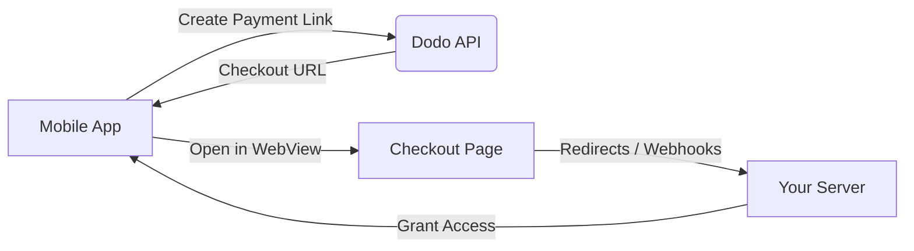

## Introdução

Dodo Payments capacita desenvolvedores a vender bens e serviços digitais em aplicativos iOS, lidando com aspectos complexos como conformidade fiscal, conversão de moeda e pagamentos. Este guia abrangente detalha como integrar o Dodo Payments em seu aplicativo iOS, especificamente para ferramentas SaaS, assinaturas de conteúdo e utilitários digitais.

## Visão Geral

Dodo Payments atua como seu **Merchant of Record (MoR)**, gerenciando aspectos críticos do seu negócio digital:

<Tabs>
<Tab title="What We Handle">
- Coleta e repasse de tributos (IVA, GST e outros impostos regionais)
- Pagamentos globais de acordo com políticas e métodos locais
- Conversão de moeda e câmbio
- Chargebacks e prevenção de fraudes
- Faturamento e recibos para o cliente final
- Conformidade com regulamentações regionais
</Tab>

<Tab title="What You Get">
- Uma API unificada para plataformas web e mobile
- Suporte a checkouts in-app (UPI, cartões, carteiras, BNPL)
- Suporte a pagamentos globais (Payoneer, Wise, transferências bancárias locais)
- Painel de análise e relatórios
- Processamento seguro de pagamentos
</Tab>
</Tabs>

## Casos de Uso

<CardGroup cols={2}>
<Card title="Subscriptions" icon="repeat">
- Acesso a conteúdo ou recursos premium
- Cobrança recorrente com opções flexíveis, testes gratuitos, prorrata, upgrades e downgrades
</Card>

<Card title="Courses and Learning" icon="graduation-cap">
- Acesso pay-per-course
- Pacotes de conteúdo combinados
- Licenças vitalícias ou renováveis
- Integração de rastreamento de progresso
</Card>

<Card title="Digital Downloads" icon="download">
- Compras pontuais (PDFs, músicas, ferramentas)
- Entrega de ativos digitais
- Gerenciamento de chaves de licença
</Card>

<Card title="SaaS Tools" icon="screwdriver-wrench">
- Assinaturas de Software como Serviço
- Cobrança baseada no uso
- Planos para equipes e empresas
</Card>
</CardGroup>

## Fluxo de Integração

Você pode integrar o Dodo Payments em seu aplicativo usando nosso checkout hospedado ou solução de navegador dentro do aplicativo.

### Etapas de Integração

<Steps>
<Step title="Mobile App to Dodo API">
O processo começa com o aplicativo móvel criando um link de pagamento ao interagir com a API da Dodo.
</Step>

<Step title="Dodo API to Mobile App">
A API da Dodo responde fornecendo uma URL de checkout de volta ao aplicativo móvel.
</Step>

<Step title="Mobile App to Checkout Page">
O aplicativo móvel então abre essa URL de checkout dentro de um WebView, levando o usuário à página de checkout.
</Step>

<Step title="Checkout Page to Your Server">
Ao completar o processo de checkout, a página de checkout se comunica com seu servidor por meio de redirecionamentos ou webhooks.
</Step>

<Step title="Your Server to Mobile App">
Finalmente, seu servidor concede acesso ao conteúdo ou serviço comprado, completando o ciclo de transação de volta no aplicativo móvel.
</Step>
</Steps>

<Card title="Mobile Integration Guide" icon="mobile" href="/developer-resources/mobile-integration">
Para um guia completo para desenvolvedores, explore nosso Mobile Integration Guide.
</Card>

## Disponibilidade Regional

Dodo Payments permite fluxos alternativos de compra dentro do aplicativo apenas nas regiões da App Store onde a Apple explicitamente permite pagamentos externos, ou onde um regulador ou ordem judicial o exige.

### Regiões Suportadas

<AccordionGroup>
<Accordion title="United States">
Suportado na medida permitida por ordens judiciais atuais e diretrizes atualizadas da Apple.

- Disponível sob disposições específicas determinadas pela justiça
- Sujeito à conformidade da Apple com requisitos legais
- Deve seguir as diretrizes de implementação da Apple
</Accordion>

<Accordion title="European Union (EU) App Store">
Suportado por meio dos Termos Alternativos da Apple para a UE e do Direito de Compra Externa.

- Habilitado por meio dos Termos Alternativos da Apple para a UE
- Requer aprovação do Direito de Compra Externa
- Deve cumprir os requisitos da Lei de Mercados Digitais da UE
</Accordion>

<Accordion title="South Korea">
Suportado por meio do Direito de Compra Externa do StoreKit para binários exclusivos da Coreia.

- Disponível via Direito de Compra Externa do StoreKit
- Requer binário de app específico para a Coreia
- Deve cumprir a legislação de telecomunicações coreana
</Accordion>
</AccordionGroup>

<Warning>
Revise e cumpra sempre os direitos específicos por região da Apple e os requisitos do App Store Connect antes de habilitar o Dodo Payments para qualquer vitrine. Utilizar fluxos de pagamento alternativos em regiões não suportadas pode resultar em rejeição ou remoção do app.
</Warning>

<Note>
Para alguns modelos de negócios — como serviços ou determinadas categorias de conteúdo — a Apple pode não exigir o uso de compras dentro do app (IAP). O Dodo Payments também suporta esses modelos. Verifique sempre a classificação do seu app e as diretrizes mais recentes da Apple para determinar se a IAP é obrigatória para o seu caso de uso.
</Note>

### Saiba Mais

Para uma análise detalhada das políticas globais, precedentes legais e abordagens estratégicas para contornar as taxas da App Store, consulte nosso guia abrangente:

<Card title="Bypassing App Store & Play Store Fees: A Strategic and Legal Playbook" icon="shield-check" href="/features/bypassing-app-store-fees">
Saiba onde e como você pode implementar legalmente fluxos de pagamento alternativos, com orientações regionais atualizadas e dicas de conformidade.
</Card>