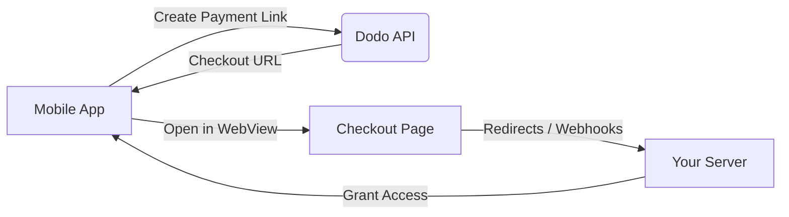

## Introdução

Dodo Payments capacita desenvolvedores a vender bens e serviços digitais em aplicativos iOS, lidando com aspectos complexos como conformidade fiscal, conversão de moeda e pagamentos. Este guia abrangente detalha como integrar o Dodo Payments em seu aplicativo iOS, especificamente para ferramentas SaaS, assinaturas de conteúdo e utilitários digitais.

## Visão Geral

Dodo Payments atua como seu **Merchant of Record (MoR)**, gerenciando aspectos críticos do seu negócio digital:

<Tabs>
<Tab title="O que Nós Gerenciamos">
- Coleta e remessa de impostos (VAT, GST e outros impostos regionais)
- Pagamentos globais conforme políticas e métodos de pagamento locais
- Conversão de moeda e câmbio
- Chargebacks e prevenção de fraudes
- Faturamento e recibos para o cliente final
- Conformidade com regulamentos regionais
</Tab>

<Tab title="O que Você Recebe">
- Uma API unificada para plataformas web e móveis
- Suporte para checkouts dentro do aplicativo (UPI, cartões, carteiras, BNPL)
- Suporte a pagamentos globais (Payoneer, Wise, transferências bancárias locais)
- Painel de análise e relatórios
- Processamento de pagamentos seguro
</Tab>
</Tabs>

## Casos de Uso

<CardGroup cols={2}>
<Card title="Assinaturas" icon="repeat">
- Acesso a conteúdo ou recursos premium
- Faturamento recorrente com opções flexíveis, testes gratuitos, prorrata ou upgrades e downgrades
</Card>

<Card title="Cursos e Aprendizado" icon="graduation-cap">
- Acesso por curso pago
- Pacotes de conteúdo agrupados
- Licenças vitalícias ou renováveis
- Integração de rastreamento de progresso
</Card>

<Card title="Downloads Digitais" icon="download">
- Compras únicas (PDFs, música, ferramentas)
- Entrega de ativos digitais
- Gerenciamento de chaves de licença
</Card>

<Card title="Ferramentas SaaS" icon="screwdriver-wrench">
- Assinaturas de Software como Serviço
- Faturamento baseado em uso
- Planos para equipes e empresas
</Card>
</CardGroup>

## Fluxo de Integração

Você pode integrar o Dodo Payments em seu aplicativo usando nosso checkout hospedado ou solução de navegador dentro do aplicativo.

### Etapas de Integração

<Steps>
<Step title="Aplicativo Móvel para API Dodo">
O processo começa com o aplicativo móvel criando um link de pagamento ao interagir com a API Dodo.
</Step>

<Step title="API Dodo para Aplicativo Móvel">
A API Dodo responde fornecendo uma URL de checkout de volta para o aplicativo móvel.
</Step>

<Step title="Aplicativo Móvel para Página de Checkout">
O aplicativo móvel então abre esta URL de checkout dentro de um WebView, levando o usuário à página de checkout.
</Step>

<Step title="Página de Checkout para Seu Servidor">
Após a conclusão do processo de checkout, a página de checkout se comunica com seu servidor através de redirecionamentos ou webhooks.
</Step>

<Step title="Seu Servidor para Aplicativo Móvel">
Finalmente, seu servidor concede acesso ao conteúdo ou serviço adquirido, completando o ciclo da transação de volta no aplicativo móvel.
</Step>
</Steps>

<Card title="Guia de Integração Móvel" icon="mobile" href="/developer-resources/mobile-integration">
Para um walkthrough completo para desenvolvedores, explore nosso Guia de Integração Móvel.
</Card>

## Disponibilidade Regional

Dodo Payments permite fluxos alternativos de compra dentro do aplicativo apenas nas regiões da App Store onde a Apple explicitamente permite pagamentos externos, ou onde um regulador ou ordem judicial o exige.

### Regiões Suportadas

<AccordionGroup>
<Accordion title="Estados Unidos">
Suportado na medida permitida por ordens judiciais atuais e diretrizes atualizadas da Apple.

- Disponível sob disposições específicas determinadas por tribunal
- Sujeito à conformidade da Apple com requisitos legais
- Deve seguir as diretrizes de implementação da Apple
</Accordion>

<Accordion title="App Store da União Europeia (UE)">
Suportado através dos Termos Alternativos da UE da Apple e do Direito de Compra Externa.

- Habilitado através dos Termos Alternativos da UE da Apple
- Requer aprovação do Direito de Compra Externa
- Deve cumprir os requisitos da Lei de Mercados Digitais da UE
</Accordion>

<Accordion title="Coreia do Sul">
Suportado através do Direito de Compra Externa do StoreKit para binários exclusivos da Coreia.

- Disponível via Direito de Compra Externa do StoreKit
- Requer binário de aplicativo específico para a Coreia
- Deve cumprir a lei de telecomunicações da Coreia
</Accordion>
</AccordionGroup>

<Warning>
Sempre revise e cumpra os direitos específicos de cada região da Apple e os requisitos do App Store Connect antes de habilitar o Dodo Payments para qualquer loja. Usar fluxos de pagamento alternativos em regiões não suportadas pode resultar na rejeição ou remoção do aplicativo.
</Warning>

<Note>
Para alguns modelos de negócios - como serviços ou certas categorias de conteúdo - a Apple pode não exigir o uso de compra dentro do aplicativo (IAP) de forma alguma. O Dodo Payments também suporta esses modelos. Sempre verifique a classificação do seu aplicativo e as diretrizes mais recentes da Apple para determinar se o IAP é obrigatório para seu caso de uso.
</Note>

### Saiba Mais

Para uma análise detalhada das políticas globais, precedentes legais e abordagens estratégicas para contornar as taxas da App Store, consulte nosso guia abrangente:

<Card title="Contornando Taxas da App Store e Play Store: Um Manual Estratégico e Legal" icon="shield-check" href="/features/bypassing-app-store-fees">
Saiba onde e como você pode implementar legalmente fluxos de pagamento alternativos, com orientações regionais atualizadas e dicas de conformidade.
</Card>