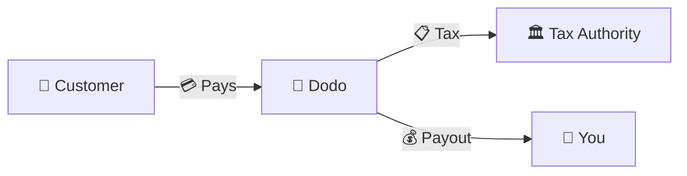
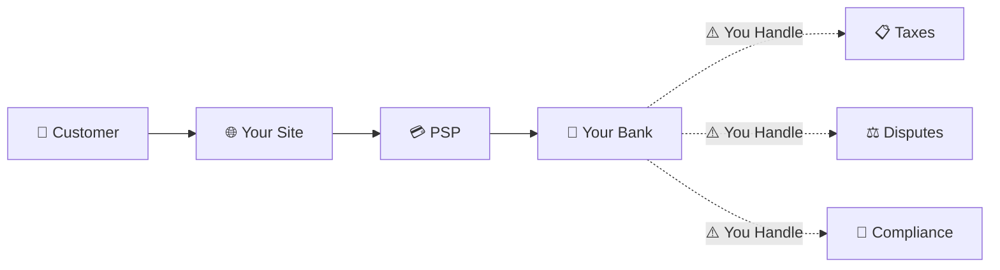
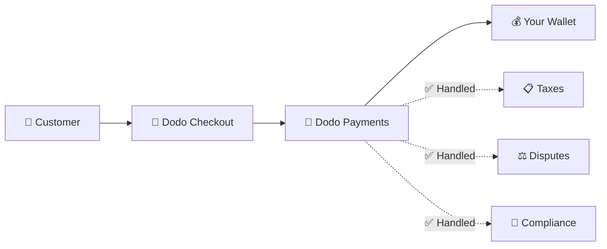
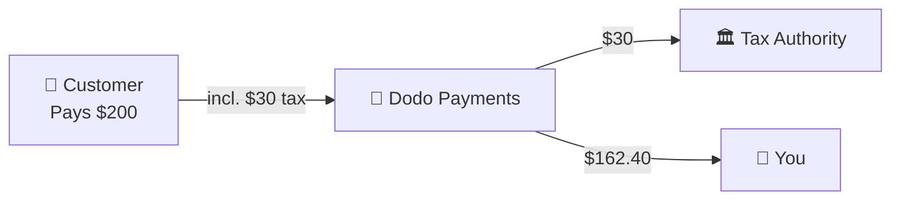

Dodo Payments opera como um **Merchant of Record (MoR)** — nós nos tornamos o vendedor legal de seus produtos digitais, assumindo a responsabilidade por pagamentos, impostos, fraudes e conformidade para que você possa se concentrar totalmente em construir seu produto.

<CardGroup cols={3}>
<Card title="220+ Regiões" icon="globe">
Conformidade fiscal tratada automaticamente
</Card>

<Card title="30+ Métodos de Pagamento" icon="credit-card">
Cartões, carteiras e métodos locais
</Card>

<Card title="Zero Declaração de Impostos" icon="file-invoice">
Nós cuidamos de toda a remessa
</Card>
</CardGroup>

## O que é um Merchant of Record?

Um **Merchant of Record** é a entidade legal que aparece na fatura do cartão de crédito do seu cliente e assume a responsabilidade pela transação. Quando você usa a Dodo Payments como seu MoR:

- **Nós somos o vendedor legal** — Dodo aparece em extratos bancários e recibos
- **Você é o criador do produto** — Você constrói, precifica e entrega seu produto
- **Nós cuidamos do back office** — Impostos, disputas, conformidade e suporte de faturamento
- **Você recebe pagamentos líquidos** — Receita depositada diretamente em sua conta

<Note>
Pense em um Merchant of Record como a contratação de uma equipe financeira global que cuida de faturamento, impostos e cobrança em todos os países — sem que você levante um dedo.
</Note>

## Por que usar um Merchant of Record?

Vender produtos digitais globalmente significa navegar pelo IVA na Europa, GST na Austrália, Imposto sobre Vendas nos EUA e inúmeras outras exigências. Cada jurisdição tem regras, taxas, limites e prazos de declaração diferentes.

| Sua Responsabilidade | Sem MoR | Com Dodo como MoR |
|---------------------|:-----------:|:----------------:|
| Registro de IVA/GST | ❌ Você | ✅ Dodo |
| Cálculo de Impostos | ❌ Você | ✅ Dodo |
| Declaração e Remessa de Impostos | ❌ Você | ✅ Dodo |
| Responsabilidade por Chargeback | ❌ Você | ✅ Dodo |
| Conformidade PCI | ❌ Você | ✅ Dodo |
| Suporte a Múltiplas Moedas | ❌ Complexo | ✅ Integrado |
| Métodos de Pagamento Locais | ❌ Integrar Cada | ✅ 30+ Incluídos |

<Tip>
**Exemplo**: Vendendo uma assinatura de €50/mês para um cliente francês?

**Sem MoR**: Registrar para o IVA francês, cobrar €60 (20% IVA), apresentar declarações trimestrais francesas, lidar com auditorias — em francês.

**Com Dodo**: Nós coletamos €60, remetemos €10 de IVA para a França e pagamos a você €50 menos taxas. Você escreve código.
</Tip>

## PSP vs. MoR: Principais Diferenças

Entender a diferença entre um **Provedor de Serviços de Pagamento** (como Stripe) e um **Merchant of Record** é essencial.

### Provedor de Serviços de Pagamento (PSP)

Um PSP processa transações, mas deixa você como o vendedor legal:

<Warning>
Com um PSP, **você** é responsável pelo registro de impostos, coleta, declaração e remessa em cada jurisdição onde você tem clientes.
</Warning>

### Merchant of Record (Dodo)

Um MoR se torna o vendedor legal, lidando com a conformidade de ponta a ponta:

<Check>
Com a Dodo como MoR, nós cuidamos de impostos, disputas e conformidade. Você recebe pagamentos líquidos com zero papelada.
</Check>

### Comparação Lado a Lado

| Aspecto | PSP (Stripe, etc.) | MoR (Dodo) |
|--------|:------------------:|:----------:|
| Vendedor Legal | Sua Empresa | Dodo |
| No Extrato do Cliente | Seu Nome | Dodo |
| Registro de Impostos | ❌ Você | ✅ Dodo |
| Cálculo de Impostos | ❌ Você | ✅ Dodo |
| Remessa de Impostos | ❌ Você | ✅ Dodo |
| Risco de Chargeback | ❌ Você | ✅ Dodo |
| Conformidade PCI | ❌ Você | ✅ Dodo |
| Configuração para Global | Complexo | Simples |

<Info>
**Importante**: Tanto PSPs quanto MoRs lidam com o processamento de pagamentos. A principal diferença é **quem é legalmente responsável** pela conformidade fiscal e responsabilidade pela transação.
</Info>

## Como Funciona a Conformidade Fiscal

A Dodo cuida de todo o ciclo de vida fiscal automaticamente:

<Steps>
<Step title="Localização do Cliente">
Detectamos o país do cliente e determinamos quais regras fiscais se aplicam — IVA, GST, Imposto sobre Vendas ou outros requisitos locais.
</Step>

<Step title="Cálculo da Taxa">
A taxa de imposto correta é calculada com base no tipo de produto, localização do cliente e status B2B/B2C. Clientes empresariais da UE com números de IVA válidos têm a cobrança reversa aplicada.
</Step>

<Step title="Coleta no Checkout">
O imposto é claramente exibido e coletado no checkout. Os clientes veem exatamente o que estão pagando.
</Step>

<Step title="Declaração e Remessa">
Nós apresentamos declarações e pagamos os impostos coletados às autoridades relevantes dentro do prazo. Você nunca vê um formulário fiscal.
</Step>
</Steps>

## Fluxo de Receita

Veja como o dinheiro se move do cliente para sua conta:

### Exemplo de Detalhamento de Pagamento

| Item | Valor |
|-----------|-------:|
| Pagamento do Cliente | $200.00 |
| Imposto sobre Vendas (15% IVA) | −$30.00 |
| Taxa da Plataforma Dodo (4%) | −$8.00 |
| Processamento de Pagamento | −$0.60 |
| **Seu Pagamento** | **$162.40** |

## Quando Escolher MoR vs. PSP

<Tabs>
<Tab title="Escolha Dodo (MoR)">
**Dodo Payments é ideal se você:**

- Vender produtos digitais, SaaS ou assinaturas
- Ter clientes em vários países
- Querer evitar dores de cabeça com registro de impostos
- Preferir conformidade terceirizada e previsível
- Valorizar velocidade de mercado em vez de controle máximo
- Não querer gerenciar disputas e fraudes
</Tab>

<Tab title="Considere um PSP">
**Um PSP pode ser adequado se você:**

- Operar principalmente em um país
- Ter equipes internas de finanças e conformidade
- Precisar de controle absoluto sobre a experiência do checkout
- Trabalhar com margens extremamente finas
- Vender bens físicos (MoRs se concentram em digitais)
</Tab>
</Tabs>

<Note>
Muitas empresas começam com um PSP e mudam para um MoR à medida que escalam internacionalmente. A Dodo oferece suporte à migração para tornar essa transição tranquila.
</Note>

## Perguntas Frequentes

<AccordionGroup>
<Accordion title="O que aparece na fatura do cartão de crédito do meu cliente?">
Dodo Payments aparece como o comerciante. Incluímos sua referência de produto/marca onde os limites de caracteres permitem, e os clientes recebem recibos detalhados mostrando as informações do seu produto.
</Accordion>

<Accordion title="Eu ainda possuo o relacionamento com o cliente?">
Sim. Você controla preços, branding, entrega de produtos e comunicação direta. A Dodo cuida da mecânica de faturamento, mas os clientes sabem que estão comprando de você. Sua marca aparece de forma proeminente no checkout, e-mails e faturas.
</Accordion>

<Accordion title="Como funciona a cobrança reversa de IVA B2B?">
Para vendas B2B na UE, os clientes podem inserir seu número de IVA no checkout. Nós o validamos e aplicamos a cobrança reversa automaticamente — o imposto é transferido para a declaração de IVA do comprador em vez de ser coletado.
</Accordion>

<Accordion title="Posso usar meu próprio processador de pagamentos?">
A Dodo opera como uma solução completa usando nossa infraestrutura de pagamento. Essa integração é o que nos permite assumir a responsabilidade fiscal e de fraude. Estamos trabalhando para fornecer uma integração com outros processadores de pagamento no futuro.
</Accordion>

<Accordion title="Como funcionam os reembolsos?">
Inicie reembolsos a partir do seu painel. Processamos o reembolso no método de pagamento e na moeda originais do cliente. Os valores dos impostos são automaticamente ajustados e reconciliados.
</Accordion>

<Accordion title="E quanto ao meu imposto de renda?">
A Dodo cuida dos **impostos sobre vendas** (IVA, GST, Imposto sobre Vendas) nas transações dos clientes. Você continua responsável pelo imposto de renda da sua empresa, imposto corporativo e obrigações fiscais sobre os pagamentos que recebe.
</Accordion>

<Accordion title="Quais países posso vender?">
Aceitamos pagamentos de mais de 220 países e regiões com expansão contínua. Veja a lista completa:

<Card title="Regiões Suportadas" icon="globe" href="/miscellaneous/list-of-countries-we-accept-payments-from">
Veja todos os 220+ países e regiões onde aceitamos pagamentos.
</Card>
</Accordion>
</AccordionGroup>

## Comece

<CardGroup cols={2}>
<Card title="Criar Conta" icon="rocket" href="https://app.dodopayments.com/signup">
Inscreva-se gratuitamente e aceite pagamentos globais em minutos.
</Card>

<Card title="MoR vs PG Análise Detalhada" icon="scale-balanced" href="/features/mor-vs-pg">
Comparação detalhada com exemplos e casos de uso.
</Card>

<Card title="Política de Aceitação" icon="building-shield" href="/miscellaneous/merchant-acceptance">
Saiba quais negócios apoiamos.
</Card>

<Card title="Fale Conosco" icon="envelope" href="mailto:founders@dodopayments.com">
Obtenha orientação personalizada de nossa equipe.
</Card>
</CardGroup>
