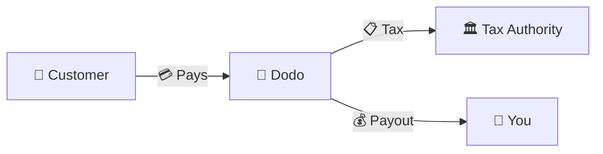
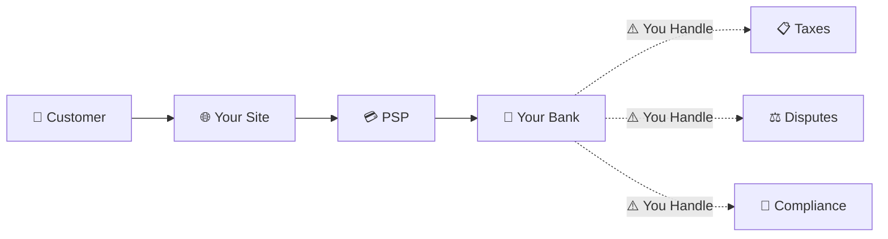
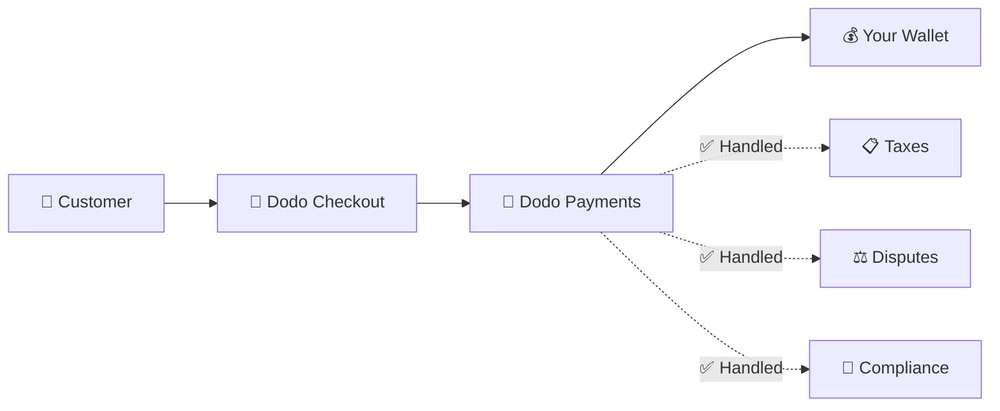
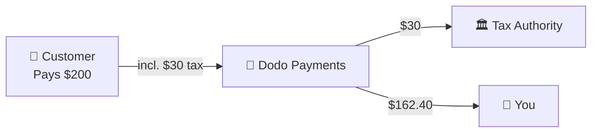

Dodo Payments opera como um **Merchant of Record (MoR)** — nós nos tornamos o vendedor legal de seus produtos digitais, assumindo a responsabilidade por pagamentos, impostos, fraudes e conformidade para que você possa se concentrar totalmente em construir seu produto.

<CardGroup cols={3}>
<Card title="220+ Regions" icon="globe">
Conformidade tributária tratada automaticamente
</Card>

<Card title="30+ Payment Methods" icon="credit-card">
Cartões, carteiras e métodos locais
</Card>

<Card title="Zero Tax Filing" icon="file-invoice">
Cuidamos de toda a remessa
</Card>
</CardGroup>

## O que é um Merchant of Record?

Um **Merchant of Record** é a entidade legal que aparece na fatura do cartão de crédito do seu cliente e assume a responsabilidade pela transação. Quando você usa a Dodo Payments como seu MoR:

- **Nós somos o vendedor legal** — Dodo aparece em extratos bancários e recibos
- **Você é o criador do produto** — Você constrói, precifica e entrega seu produto
- **Nós cuidamos do back office** — Impostos, disputas, conformidade e suporte de faturamento
- **Você recebe pagamentos líquidos** — Receita depositada diretamente em sua conta

<Note>
Pense em um Merchant of Record como contratar uma equipe financeira global que cuida de faturamento, impostos e cobrança em todos os países — sem que você levante um dedo.
</Note>

## Por que usar um Merchant of Record?

Vender produtos digitais globalmente significa navegar pelo IVA na Europa, GST na Austrália, Imposto sobre Vendas nos EUA e inúmeras outras exigências. Cada jurisdição tem regras, taxas, limites e prazos de declaração diferentes.

| Sua Responsabilidade | Sem MoR | Com Dodo como MoR |
|---------------------|:-----------:|:----------------:|
| Registro de IVA/GST | ❌ Você | ✅ Dodo |
| Cálculo de Impostos | ❌ Você | ✅ Dodo |
| Declaração e Remessa de Impostos | ❌ Você | ✅ Dodo |
| Responsabilidade por Chargeback | ❌ Você | ✅ Dodo |
| Conformidade PCI | ❌ Você | ✅ Dodo |
| Suporte a Múltiplas Moedas | ❌ Complexo | ✅ Integrado |
| Métodos de Pagamento Locais | ❌ Integrar Cada | ✅ 30+ Incluídos |

<Tip>
**Exemplo**: Vendendo uma assinatura de €50/mês para um cliente francês?

**Sem MoR**: Registrar para o IVA francês, cobrar €60 (20% IVA), apresentar declarações trimestrais francesas, lidar com auditorias — em francês.

**Com a Dodo**: Nós coletamos €60, remetemos €10 de IVA para a França e pagamos você €50 menos taxas. Você escreve o código.
</Tip>

## PSP vs. MoR: Principais Diferenças

Entender a diferença entre um **Provedor de Serviços de Pagamento** (como Stripe) e um **Merchant of Record** é essencial.

### Provedor de Serviços de Pagamento (PSP)

Um PSP processa transações, mas deixa você como o vendedor legal:

<Warning>
Com um PSP, **você** é responsável por registro fiscal, coleta, declaração e remessa em todas as jurisdições onde possui clientes.
</Warning>

### Merchant of Record (Dodo)

Um MoR se torna o vendedor legal, lidando com a conformidade de ponta a ponta:

<Check>
Com a Dodo como MoR, cuidamos de impostos, disputas e conformidade. Você recebe pagamentos líquidos sem qualquer papelada.
</Check>

### Comparação Lado a Lado

| Aspecto | PSP (Stripe, etc.) | MoR (Dodo) |
|--------|:------------------:|:----------:|
| Vendedor Legal | Sua Empresa | Dodo |
| No Extrato do Cliente | Seu Nome | Dodo |
| Registro de Impostos | ❌ Você | ✅ Dodo |
| Cálculo de Impostos | ❌ Você | ✅ Dodo |
| Remessa de Impostos | ❌ Você | ✅ Dodo |
| Risco de Chargeback | ❌ Você | ✅ Dodo |
| Conformidade PCI | ❌ Você | ✅ Dodo |
| Configuração para Global | Complexo | Simples |

<Info>
**Importante**: Tanto os PSPs quanto os MoRs lidam com processamento de pagamentos. A principal diferença é **quem é legalmente responsável** pela conformidade tributária e pela responsabilidade sobre transações.
</Info>

## Como Funciona a Conformidade Fiscal

A Dodo cuida de todo o ciclo de vida fiscal automaticamente:

<Steps>
<Step title="Customer Location">
Detectamos o país do cliente e determinamos quais regras fiscais se aplicam — IVA, GST, Sales Tax ou outros requisitos locais.
</Step>

<Step title="Rate Calculation">
A alíquota correta é calculada com base no tipo de produto, localização do cliente e status B2B/B2C. Clientes empresariais da UE com número de IVA válido recebem aplicação automática de reverse charge.
</Step>

<Step title="Collection at Checkout">
O imposto é claramente exibido e cobrado no checkout. Os clientes veem exatamente o que estão pagando.
</Step>

<Step title="Filing & Remittance">
Registramos declarações e pagamos os impostos recolhidos às autoridades relevantes conforme o cronograma. Você nunca chega a ver um formulário fiscal.
</Step>
</Steps>

## Fluxo de Receita

Veja como o dinheiro se move do cliente para sua conta:

### Exemplo de Detalhamento de Pagamento

| Item | Valor |
|-----------|-------:|
| Pagamento do Cliente | $200.00 |
| Imposto sobre Vendas (15% IVA) | −$30.00 |
| Taxa da Plataforma Dodo (4%) | −$8.00 |
| Processamento de Pagamento | −$0.60 |
| **Seu Pagamento** | **$162.40** |

## Quando Escolher MoR vs. PSP

<Tabs>
<Tab title="Choose Dodo (MoR)">
**Dodo Payments é ideal se você:**

- Vende produtos digitais, SaaS ou assinaturas
- Tem clientes em vários países
- Quer evitar dores de cabeça com registro fiscal
- Prefere conformidade terceirizada e previsível
- Valoriza rapidez no lançamento em vez de máximo controle
- Não quer gerenciar disputas e fraudes
</Tab>

<Tab title="Consider a PSP">
**Um PSP pode ser adequado para você se você:**

- Opera principalmente em um país
- Tem equipes internas de finanças e conformidade
- Precisa de controle absoluto sobre a experiência de checkout
- Trabalha com margens extremamente apertadas
- Vende produtos físicos (MoRs focam em digital)
</Tab>
</Tabs>

<Note>
Muitas empresas começam com um PSP e migram para um MoR à medida que escalam internacionalmente. A Dodo oferece suporte de migração para tornar essa transição perfeita.
</Note>

## Perguntas Frequentes

<AccordionGroup>
<Accordion title="What appears on my customer's credit card statement?">
A Dodo Payments aparece como o comerciante. Incluímos sua referência de produto/marca quando os limites de caracteres permitem, e os clientes recebem recibos detalhados exibindo as informações do seu produto.
</Accordion>

<Accordion title="Do I still own the customer relationship?">
Sim. Você controla preço, marca, entrega do produto e comunicação direta. A Dodo cuida da mecânica de cobrança, mas os clientes sabem que estão comprando de você. Sua marca aparece de forma destacada no checkout, nos e-mails e nas faturas.
</Accordion>

<Accordion title="How does B2B VAT reverse charge work?">
Para vendas B2B na UE, os clientes podem inserir seu número de IVA no checkout. Validamos o número e aplicamos automaticamente o reverse charge — o imposto é transferido para a declaração de IVA do comprador em vez de ser cobrado.
</Accordion>

<Accordion title="Can I use my own payment processor?">
A Dodo opera como uma solução completa usando nossa infraestrutura de pagamentos. Essa integração é o que nos permite assumir responsabilidade tributária e por fraude. Estamos trabalhando para oferecer integração com outros processadores de pagamento no futuro.
</Accordion>

<Accordion title="How do refunds work?">
Inicie reembolsos a partir do seu painel. Processamos o reembolso na forma de pagamento e moeda originais do cliente. Os valores de imposto são ajustados e reconciliados automaticamente.
</Accordion>

<Accordion title="What about my income tax?">
A Dodo lida com **impostos sobre vendas** (IVA, GST, Sales Tax) nas transações dos clientes. Você continua responsável pelo imposto de renda da sua empresa, imposto corporativo e obrigações fiscais sobre os recebimentos que você recebe.
</Accordion>

<Accordion title="Which countries can I sell to?">
Aceitamos pagamentos de mais de 220 países e regiões com expansão contínua. Veja a lista completa:

<Card title="Supported Regions" icon="globe" href="/miscellaneous/list-of-countries-we-accept-payments-from">
Veja todos os 220+ países e regiões onde aceitamos pagamentos.
</Card>
</Accordion>
</AccordionGroup>

## Comece

<CardGroup cols={2}>
<Card title="Create Account" icon="rocket" href="https://app.dodopayments.com/signup">
Cadastre-se gratuitamente e aceite pagamentos globais em minutos.
</Card>

<Card title="MoR vs PG Deep Dive" icon="scale-balanced" href="/features/mor-vs-pg">
Comparação detalhada com exemplos e casos de uso.
</Card>

<Card title="Acceptance Policy" icon="building-shield" href="/miscellaneous/merchant-acceptance">
Saiba que tipos de empresas apoiamos.
</Card>

<Card title="Talk to Us" icon="envelope" href="mailto:founders@dodopayments.com">
Receba orientação personalizada da nossa equipe.
</Card>
</CardGroup>
