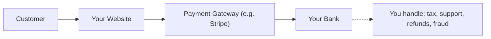
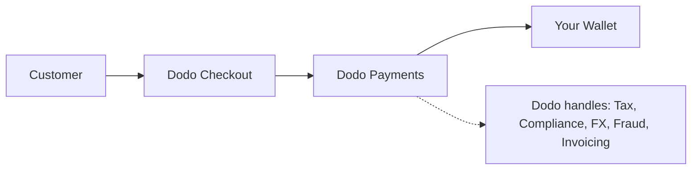

## Introdução

Este guia compara o modelo MoR com a abordagem tradicional de Payment Gateway, ajudando você a entender as vantagens que a Dodo Payments traz para o seu negócio.

## A Diferença Principal

| Recurso                          | MoR (Dodo Payments)         | Payment Gateway (PG Tradicional)           |
|----------------------------------|--------------------------------------------|--------------------------------------------|
| Vendedor Legal                   | Dodo Payments (MoR)                        | Sua Empresa                               |
| Coleta e Remessa de Impostos    | Gerenciado pela Dodo                        | Você é responsável                        |
| Carga de Conformidade e Regulatória | A Dodo assume a responsabilidade         | Você lida com leis locais e chargebacks      |
| Moeda de Liquidação              | USD, EUR, INR e 25+ outras suportadas      | Depende da sua conta de comerciante       |
| Gestão de Risco                  | Proteção contra fraudes e chargebacks embutida | Você configura suas próprias ferramentas (ex: Stripe Radar) |
| Pagamentos                       | Pagamentos globais agregados e simplificados | Direto do PG para você, com configuração bancária     |

## O Que Isso Significa Para Você

Com **Dodo como MoR**, nos tornamos o vendedor legal para seus clientes, permitindo que você:

- Pule a configuração de entidades locais
- Evite lidar com VAT, GST ou imposto sobre vendas
- Ofereça mais métodos de pagamento globalmente
- Reduza o risco legal
- Lance mais rápido em novos mercados

<Note>
Imagine vender uma assinatura digital para um usuário na França. Com a Dodo Payments, coletamos o pagamento, registramos o VAT com as autoridades francesas e enviamos a você a receita líquida. Sem dores de cabeça fiscais. Sem advogados. Apenas crescimento.
</Note>

Além disso, o modelo MoR simplifica todo o seu back office. Como seu MoR, a Dodo cuida da conformidade PCI, detecção de fraudes, conversão de moeda e até suporte à cobrança de clientes, liberando sua equipe para se concentrar em produto e crescimento.

## Comparação Visual

**Fluxo de Receita: Payment Gateway**

**Fluxo de Receita: Merchant of Record (Dodo)**

## Por Que Isso Importa Para Empresas de SaaS e Digitais

À medida que seu negócio cresce, gerenciar impostos, conformidade e preferências de pagamento globais pode se tornar esmagador. Com um payment gateway, você é responsável por:

- Registro e apresentação de VAT/GST em várias jurisdições
- Gerenciar conversão de moeda e chargebacks
- Fornecer checkout e métodos de pagamento localizados

Com a Dodo Payments como seu MoR:
- Você se expande globalmente sem configurar entidades locais
- Os impostos são calculados, coletados e remetidos em seu nome
- Você ganha acesso a uma biblioteca de métodos de pagamento adaptados aos seus clientes
- Atuamos como seu buffer legal e parceiro operacional

<Tip>
"Pense em um payment gateway como um túnel. Agora imagine o Merchant of Record como um túnel, trem, motorista e equipe de bilhetagem tudo em um."
</Tip>

## Quem Deve Usar MoR?

A Dodo Payments é perfeita para:
- Empresas de SaaS e produtos digitais
- Criadores independentes e empreendedores individuais
- Negócios globais com clientes em mais de 100 países
- Empresas que não querem gerenciar impostos e conformidade internamente

Se você está se expandindo internacionalmente, vendendo assinaturas ou apenas quer reduzir dores de cabeça operacionais, MoR é a escolha mais inteligente.

## Quando Usar um Payment Gateway em Vez Disso

Existem casos em que usar apenas um payment gateway pode fazer sentido:
- Seu negócio opera apenas em um país
- Você já possui recursos internos de finanças e conformidade
- Você requer controle total sobre a experiência de cobrança do cliente
- Você é altamente sensível a custos com margens finas em escala

<Note>
Para muitas startups, usar um gateway pode ser suficiente inicialmente - mas à medida que a complexidade cresce, mudar para um MoR pode economizar tempo, reduzir riscos e acelerar o crescimento internacional.
</Note>

## Por Que Escolher a Dodo Payments

A Dodo Payments oferece:
- Pilha de pagamentos, impostos e conformidade tudo em um
- Suporte em tempo real para FX e multi-moeda
- Acesso a mais de 30 métodos de pagamento
- Cobrança baseada em assentos, assinaturas e pagamentos únicos
- Tratamento automatizado de impostos em mais de 150 países
- Prevenção de fraudes embutida e conformidade PCI

Seja você um fundador solo ou uma equipe de SaaS em crescimento, a Dodo simplifica as complexidades de vender globalmente.

## Saiba Mais

<CardGroup cols={2}>
<Card title="Suporte a Moeda Adaptativa" icon="money-bill-wave" href="/features/adaptive-currency">
Saiba como a Dodo apresenta automaticamente os preços nas moedas locais de seus clientes
</Card>

<Card title="Métodos de Pagamento Suportados" icon="credit-card" href="/features/payment-methods">
Descubra os mais de 30 métodos de pagamento disponíveis através da Dodo Payments
</Card>
</CardGroup>

## Pronto para Mudar?

Junte-se a mais de 3.000 empresas digitais que usam a Dodo Payments para vender globalmente, sem fronteiras ou gargalos.

<CardGroup cols={2}>
<Card title="Inscreva-se Gratuitamente" icon="user-plus" href="https://app.dodopayments.com/signup">
Crie sua conta Dodo Payments e comece a vender globalmente hoje
</Card>

<Card title="Fale com Vendas" icon="envelope" href="mailto:founders@dodopayments.com">
Obtenha orientação personalizada de nossa equipe
</Card>
</CardGroup>

<Tip>
Deixe a Dodo lidar com as partes difíceis - para que você possa se concentrar em construir um ótimo produto.
</Tip>