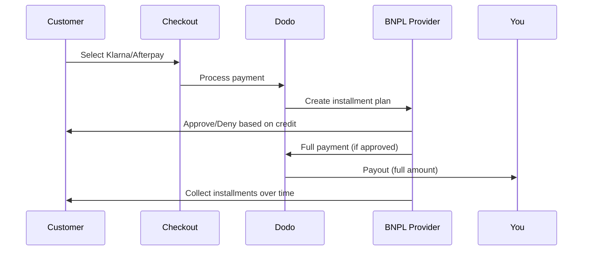

Compre Agora Pague Depois (BNPL) permite que os clientes dividam compras em parcelas sem juros, aumentando o valor médio dos pedidos em 20-50% e as taxas de conversão em 10-30% para transações elegíveis.

## Por que oferecer BNPL?

<CardGroup cols={3}>
<Card title="Higher AOV" icon="chart-line">
Os clientes gastam mais quando podem parcelar os pagamentos ao longo do tempo. O valor médio do pedido aumenta 20-50%.
</Card>

<Card title="Better Conversion" icon="percent">
Removendo atritos no pagamento no checkout. As taxas de conversão melhoram 10-30% para itens de alto valor.
</Card>

<Card title="Zero Risk" icon="shield-check">
Os provedores BNPL lidam com o risco de crédito e a cobrança. Você recebe o pagamento integral adiantado.
</Card>
</CardGroup>

## Provedores compatíveis

### Klarna

| Recurso | Detalhes |
| :------ | :------ |
| **Disponibilidade** | EUA + 19 países europeus |
| **Moedas** | USD, EUR, GBP, DKK, NOK, SEK, CZK, RON, PLN, CHF |
| **Mínimo** | $50,01 (ou equivalente) |
| **Assinaturas** | Não |

**Países compatíveis:** Áustria, Bélgica, República Tcheca, Dinamarca, Finlândia, França, Alemanha, Grécia, Irlanda, Itália, Países Baixos, Noruega, Polônia, Portugal, Romênia, Espanha, Suécia, Suíça, Reino Unido, Estados Unidos

**Opções de pagamento:**
- **Pay in 4** — Divida em 4 pagamentos sem juros
- **Pay in 30 days** — Pagamento integral em 30 dias
- **Financing** — Planos de parcela de prazo mais longo

### Afterpay (Clearpay)

| Recurso | Detalhes |
| :------ | :------ |
| **Disponibilidade** | EUA, Reino Unido |
| **Moedas** | USD, GBP |
| **Mínimo** | $50,01 (ou equivalente) |
| **Assinaturas** | Não |

**Opções de pagamento:**
- **Pay in 4** — 4 pagamentos sem juros a cada 2 semanas

<Note>
No Reino Unido, Afterpay funciona como “Clearpay”, mas usa o mesmo tipo de API (`afterpay_clearpay`).
</Note>

### Billie

| Recurso | Detalhes |
| :------ | :------ |
| **Disponibilidade** | Global |
| **Moedas** | GBP |
| **Mínimo** | Nenhum |
| **Assinaturas** | Não |

**Sobre a Billie:**
A Billie é uma solução B2B de Compre Agora Pague Depois que permite às empresas oferecer prazos flexíveis aos clientes. Foi projetada para transações business-to-business nas quais os compradores precisam de opções de pagamento via fatura.

**Opções de pagamento:**
- **Invoice Payment** — Pague dentro dos prazos acordados
- **Flexible Terms** — Cronogramas de pagamento amigáveis para empresas

## Configuração

### Tipos de método de API

| Tipo | Provedor |
| :--- | :------- |
| `klarna` | Klarna |
| `afterpay_clearpay` | Afterpay / Clearpay |
| `billie` | Billie (B2B) |

### Exemplo

```javascript
const session = await client.checkoutSessions.create({
  product_cart: [{ product_id: 'prod_123', quantity: 1 }],
  allowed_payment_method_types: [
    'klarna',
    'afterpay_clearpay',
    'credit',
    'debit'
  ],
  customer: {
    email: 'customer@example.com',
    name: 'Jane Smith'
  },
  billing_address: {
    country: 'US',
    zipcode: '10001'
  },
  return_url: 'https://example.com/success'
});
```

<Warning>
Inclua sempre `credit` e `debit` como alternativas. Nem todos os clientes são elegíveis para BNPL, e transações abaixo de $50,01 não se qualificam.
</Warning>

## Valor mínimo da transação

**Tanto Klarna quanto Afterpay exigem mínimo de $50,01 USD** (ou equivalente nas moedas compatíveis).

Transações abaixo desse limite:
- As opções de BNPL não aparecem no checkout
- Nenhum erro é exibido — as opções simplesmente não aparecem
- Pagamentos com cartão continuam disponíveis

Isso é comportamento esperado. Não inclua BNPL em `allowed_payment_method_types` para produtos com valor inferior a $50.

## Como funcionam as parcelas



**Pontos principais:**
- Você recebe o **pagamento integral adiantado** do provedor BNPL
- O provedor BNPL gerencia o **risco de crédito e a cobrança**
- O cliente paga o provedor diretamente ao longo de **4 parcelas** (típico)
- **Sem estornos** por falha nas parcelas — esse é o risco do provedor

## Testes

### Dados de teste da Klarna

Use estes dados em modo de teste:

| Campo | Aprovado | Negado |
| :---- | :------- | :----- |
| **Data de nascimento** | 07-10-1970 | 07-10-1970 |
| **Nome** | Test | Test |
| **Sobrenome** | Person-us | Person-us |
| **Email** | customer@email.us | customer+denied@email.us |
| **Rua** | Amsterdam Ave | Amsterdam Ave |
| **Número** | 509 | 509 |
| **Cidade** | New York | New York |
| **Estado** | New York | New York |
| **CEP** | 10024-3941 | 10024-3941 |
| **Telefone** | +13106683312 | +13106354386 |

<Note>
A transação precisa ser de pelo menos $50 para que a Klarna apareça como opção.
</Note>

### Testes da Afterpay

<Steps>
<Step title="Select Afterpay">
Escolha Afterpay no checkout e clique em Pagar.
</Step>

<Step title="Successful payment">
Use qualquer e-mail válido e endereço de entrega.
</Step>

<Step title="Failed authentication">
Para testar falha: feche o modal da Afterpay na página de redirecionamento. O status de pagamento muda para `requires_payment_method`.
</Step>
</Steps>

## Melhores práticas

<AccordionGroup>
<Accordion title="Target high-ticket items">
O BNPL funciona melhor para produtos entre $100 e $1000. A proposta de valor de “pague ao longo do tempo” é mais atraente nessa faixa.
</Accordion>

<Accordion title="Show installment amounts">
“4 pagamentos de $25” é mais atraente do que “$100 com Klarna”. Mostre o valor por parcela sempre que possível.
</Accordion>

<Accordion title="Don't force BNPL for low-value products">
Abaixo de $50, o BNPL não aparece mesmo. Abaixo de $100, a maioria dos clientes prefere cartões. Foque a promoção de BNPL em itens de valor mais alto.
</Accordion>

<Accordion title="Collect billing address">
Os provedores BNPL exigem informações de cobrança para verificações de crédito. Garanta que seu checkout colete o endereço completo.
</Accordion>

<Accordion title="Set clear expectations">
Os clientes devem entender que estão entrando em um contrato de crédito com Klarna/Afterpay, não com você.
</Accordion>
</AccordionGroup>

## Limitações

### Sem assinaturas
Os métodos de pagamento BNPL **não suportam pagamentos recorrentes**. Para produtos de assinatura, use cartões ou outros métodos compatíveis com recorrência.

### Aprovação baseada em crédito
Os provedores BNPL realizam verificações de crédito instantâneas. Nem todos os clientes serão aprovados. As taxas de aprovação variam de acordo com:
- Histórico de crédito do cliente com o provedor
- Valor da transação
- Localização do cliente

### Mapeamento de moeda e país

Cada moeda está restrita à sua região correspondente:

| Moeda | Países compatíveis |
| :------- | :------------------ |
| **USD** | Apenas Estados Unidos |
| **EUR** | Todos os países europeus compatíveis (Áustria, Bélgica, República Tcheca, Dinamarca, Finlândia, França, Alemanha, Grécia, Irlanda, Itália, Países Baixos, Noruega, Polônia, Portugal, Romênia, Espanha, Suécia, Suíça) |
| **GBP** | Reino Unido e todos os países europeus compatíveis |

Outras moedas compatíveis com a Klarna (DKK, NOK, SEK, CZK, RON, PLN, CHF) funcionam em seus respectivos países.

<Info>
Por exemplo, uma transação em USD exibirá opções BNPL apenas para clientes nos EUA. Uma transação em EUR mostrará opções em todos os países europeus suportados. Uma transação em GBP mostrará opções para clientes no Reino Unido e em todos os países europeus compatíveis.
</Info>

| Provedor | Moedas compatíveis |
| :------- | :------------------- |
| Klarna | USD, EUR, GBP, DKK, NOK, SEK, CZK, RON, PLN, CHF |
| Afterpay | USD (EUA), GBP (Reino Unido) |

## Solução de problemas

<AccordionGroup>
<Accordion title="BNPL not appearing at checkout">
**Verifique:**
1. O valor da transação é de pelo menos $50,01?
2. O cliente está em um país compatível?
3. A moeda é suportada pelo provedor BNPL?
4. O método BNPL foi incluído em `allowed_payment_method_types`?

**Solução:** Na maioria dos casos, a transação está abaixo do mínimo. Verifique se o valor atende ao limite de $50,01.
</Accordion>

<Accordion title="Customer denied by BNPL provider">
**Causas:**
- Histórico de crédito insuficiente no provedor
- Muitos planos de parcela ativos
- Falha na verificação de identidade

**Solução:** Isso é esperado para alguns clientes. Garanta que alternativas com cartão estejam disponíveis. Não exponha motivos específicos de negação.
</Accordion>

<Accordion title="Payment stuck in pending">
**Causa:** O cliente não concluiu o fluxo de autenticação com o provedor BNPL.

**Solução:** O pagamento será encerrado por tempo limite e falhará. O cliente pode tentar novamente ou usar outro método.
</Accordion>
</AccordionGroup>

## Páginas relacionadas

<CardGroup cols={2}>
<Card title="Payment Methods Overview" icon="credit-card" href="/features/payment-methods">
Veja todos os métodos de pagamento compatíveis.
</Card>

<Card title="Checkout Guide" icon="book" href="/developer-resources/checkout-session">
Guia completo de implementação do checkout.
</Card>

<Card title="Testing Process" icon="flask" href="/miscellaneous/testing-process">
Todos os dados de teste para métodos de pagamento.
</Card>

<Card title="Adaptive Currency" icon="globe" href="/features/adaptive-currency">
Suporte a moedas e conversão.
</Card>
</CardGroup>