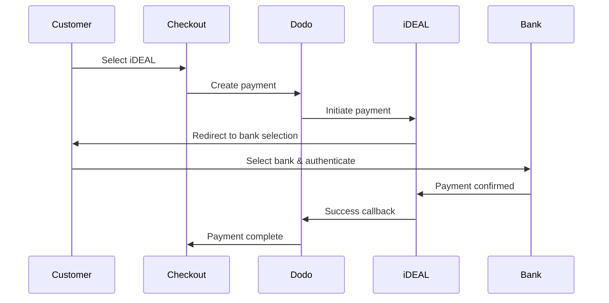

Os clientes europeus preferem fortemente métodos de pagamento locais que se integram aos seus sistemas bancários. Oferecer esses métodos pode aumentar as taxas de conversão em 20-40% nos mercados-alvo.

## Por Que Métodos de Pagamento Locais Europeus?

<CardGroup cols={3}>
<Card title="Higher Conversion" icon="chart-line">
O iDEAL captura ~60% dos pagamentos online holandeses. Não oferecê-lo significa perder clientes.
</Card>

<Card title="Lower Fraud" icon="shield-check">
Pagamentos autenticados pelo banco têm taxas de fraude quase zero e não geram estornos.
</Card>

<Card title="Real-Time Settlement" icon="bolt">
A maioria dos métodos europeus fornece confirmação de pagamento instantânea.
</Card>
</CardGroup>

## Métodos Suportados

| Método | País | Participação de Mercado | Moeda | Assinaturas |
| :----- | :------ | :----------- | :------- | :-----------: |
| **iDEAL** | Países Baixos | ~60% | EUR | Não |
| **Bancontact** | Bélgica | ~50% | EUR | Não |
| **EPS** | Áustria | ~30% | EUR | Não |
| **Multibanco** | Portugal | ~40% | EUR | Não |

## iDEAL (Países Baixos)

iDEAL é o método de pagamento online dominante nos Países Baixos, conectando-se diretamente a todos os principais bancos holandeses.

### Como Funciona



### Bancos Suportados

Todos os principais bancos holandeses são suportados:
- ABN AMRO
- ASN Bank
- Bunq
- ING
- Knab
- Rabobank
- RegioBank
- Revolut
- SNS
- Triodos Bank
- Van Lanschot

### Configuração

```javascript
const session = await client.checkoutSessions.create({
  product_cart: [{ product_id: 'prod_123', quantity: 1 }],
  allowed_payment_method_types: ['ideal', 'credit', 'debit'],
  billing_currency: 'EUR',
  billing_address: {
    country: 'NL',
    zipcode: '1012JS'
  },
  return_url: 'https://example.com/success'
});
```

## Bancontact (Bélgica)

Bancontact é o esquema de pagamento nacional da Bélgica, usado por virtualmente todos os bancos belgas para pagamentos online.

### Recursos
- Funciona com cartões de débito belgas existentes
- Suporte a aplicativos móveis (Payconiq by Bancontact)
- Confirmação de pagamento instantânea
- Nenhuma inscrição adicional necessária para clientes

### Configuração

```javascript
const session = await client.checkoutSessions.create({
  product_cart: [{ product_id: 'prod_123', quantity: 1 }],
  allowed_payment_method_types: ['bancontact_card', 'credit', 'debit'],
  billing_currency: 'EUR',
  billing_address: {
    country: 'BE',
    zipcode: '1000'
  },
  return_url: 'https://example.com/success'
});
```

## EPS (Áustria)

EPS (Padrão de Pagamento Eletrônico) habilita transferências bancárias online diretas para clientes austríacos.

### Recursos
- Integração direta com bancos austríacos
- Confirmação de pagamento em tempo real
- Alta confiança entre os consumidores austríacos
- Sem chargebacks

### Bancos Suportados

Principais bancos austríacos incluindo:
- Erste Bank
- Bank Austria
- Raiffeisen
- BAWAG
- Volksbank

### Configuração

```javascript
const session = await client.checkoutSessions.create({
  product_cart: [{ product_id: 'prod_123', quantity: 1 }],
  allowed_payment_method_types: ['eps', 'credit', 'debit'],
  billing_currency: 'EUR',
  billing_address: {
    country: 'AT',
    zipcode: '1010'
  },
  return_url: 'https://example.com/success'
});
```

## Multibanco (Portugal)

Multibanco é a rede interbancária de Portugal, oferecendo tanto pagamentos online quanto pagamentos em caixa eletrônica.

### Opções de Pagamento

1. **Internet Banking** — Transferência bancária direta via internet banking
2. **Pagamento em Caixa Eletrônica** — O cliente recebe uma referência para pagar em qualquer caixa Multibanco
3. **Mobile Banking** — Pagamento via aplicativos móveis do banco

### Como Funciona o Pagamento em Caixa Eletrônica

Para pagamentos em caixas eletrônicas, os clientes recebem uma referência de pagamento:

```
Entity: 12345
Reference: 123 456 789
Amount: €50.00
Expiry: 24 hours
```

O cliente pode pagar em qualquer caixa eletrônica portuguesa ou via internet banking usando esta referência.

### Configuração

```javascript
const session = await client.checkoutSessions.create({
  product_cart: [{ product_id: 'prod_123', quantity: 1 }],
  allowed_payment_method_types: ['multibanco', 'credit', 'debit'],
  billing_currency: 'EUR',
  billing_address: {
    country: 'PT',
    zipcode: '1000-001'
  },
  return_url: 'https://example.com/success'
});
```

<Note>
Pagamentos via Multibanco em caixas eletrônicos podem ter atraso entre a finalização da compra e o pagamento real. Monitore os webhooks para confirmação de pagamento.
</Note>

## Tipos de Métodos de API

| Tipo | Método | País |
| :--- | :----- | :------ |
| `ideal` | iDEAL | Netherlands |
| `bancontact_card` | Bancontact | Belgium |
| `eps` | EPS | Austria |
| `multibanco` | Multibanco | Portugal |

## Checkout Europeu em Múltiplos Países

Para empresas que atendem a múltiplos países europeus, inclua todos os métodos regionais:

```javascript
const session = await client.checkoutSessions.create({
  product_cart: [{ product_id: 'prod_123', quantity: 1 }],
  allowed_payment_method_types: [
    'ideal',           // Netherlands
    'bancontact_card', // Belgium
    'eps',             // Austria
    'multibanco',      // Portugal
    'credit',          // Fallback
    'debit'            // Fallback
  ],
  billing_currency: 'EUR',
  return_url: 'https://example.com/success'
});
```

Dodo automaticamente mostra apenas os métodos relevantes com base na localização do cliente. Um cliente holandês verá iDEAL; um cliente belga verá Bancontact.

## Testes

Os métodos de pagamento europeus podem ser testados em modo sandbox. O fluxo de teste simula o processo de autenticação do banco.

<Steps>
<Step title="Enable test mode">
Use suas chaves de API de teste do Dodo Payments.
</Step>

<Step title="Set appropriate billing address">
Defina o país do endereço de cobrança para combinar com o método de pagamento:
- `NL` para iDEAL
- `BE` para Bancontact
- `AT` para EPS
- `PT` para Multibanco
</Step>

<Step title="Complete the test flow">
Siga o fluxo simulado de autenticação bancária no ambiente de testes.
</Step>
</Steps>

## Melhores Práticas

<AccordionGroup>
<Accordion title="Always include regional methods for target markets">
Se você vende para clientes holandeses, inclua o iDEAL. Não fazê-lo é como não aceitar Visa nos EUA — você perderá vendas significativas.
</Accordion>

<Accordion title="Match currency to region">
Os métodos de pagamento europeus exigem EUR. Garanta que seus preços suportem transações em euro.
</Accordion>

<Accordion title="Handle redirects gracefully">
Todos os métodos europeus envolvem redirecionamentos para sites bancários. Garanta que o tratamento da URL de retorno seja robusto e considere usuários que abandonam o fluxo no meio do caminho.
</Accordion>

<Accordion title="Provide card fallbacks">
Nem todos os clientes europeus têm acesso a esses métodos regionais (turistas, expatriados etc.). Sempre inclua `credit` e `debit` como alternativas.
</Accordion>

<Accordion title="Consider Multibanco timing">
Pagamentos Multibanco em caixas eletrônicos podem levar horas para serem concluídos. Não bloqueie o cumprimento com base em pagamento imediato — use webhooks para confirmação assíncrona.
</Accordion>
</AccordionGroup>

## Solução de Problemas

<AccordionGroup>
<Accordion title="European method not appearing">
**Verifique:**
1. O país de cobrança do cliente corresponde ao país do método?
2. A moeda está configurada para EUR?
3. O método está incluído em `allowed_payment_method_types`?

**Solução:** Métodos europeus são estritamente regionais. Um cliente com país de cobrança `DE` (Alemanha) não verá o iDEAL, que é exclusivo dos Países Baixos.
</Accordion>

<Accordion title="Bank authentication failed">
**Causas:**
- Cliente cancelou durante a autenticação bancária
- O sistema de autenticação do banco ficou temporariamente indisponível
- Cliente inseriu credenciais incorretas

**Solução:** O cliente deve tentar novamente. Se o problema persistir, sugira tentar um método de pagamento diferente.
</Accordion>

<Accordion title="Redirect not completing">
**Causas:**
- Cliente fechou o navegador durante o redirecionamento bancário
- Problemas de rede durante a autenticação
- URL de retorno mal configurada

**Solução:** Verifique se a URL de retorno está correta e acessível. Garanta que ela lide com os estados de sucesso e falha.
</Accordion>

<Accordion title="Multibanco payment pending">
**Causa:** Cliente recebeu referência de pagamento, mas ainda não pagou.

**Solução:** Isso é esperado para pagamentos baseados em caixas eletrônicos. Aguarde a confirmação via webhook. A referência normalmente expira em 24 a 72 horas.
</Accordion>
</AccordionGroup>

## Conformidade com PSD2

Todos os métodos de pagamento europeus estão em conformidade com as regulamentações PSD2 (Diretiva de Serviços de Pagamento 2):

- **Autenticação Forte do Cliente (SCA)** — Integrada ao fluxo de autenticação bancária
- **Comunicação Segura** — Todos os dados transmitidos por canais seguros
- **Proteção ao Consumidor** — Total conformidade com os direitos dos consumidores da UE

## Páginas Relacionadas

<CardGroup cols={2}>
<Card title="Payment Methods Overview" icon="credit-card" href="/features/payment-methods">
Veja todos os métodos de pagamento suportados.
</Card>

<Card title="Adaptive Currency" icon="globe" href="/features/adaptive-currency">
Suporte de moeda e conversão automática.
</Card>

<Card title="Checkout Guide" icon="book" href="/developer-resources/checkout-session">
Guia completo de implementação do checkout.
</Card>

<Card title="Webhooks" icon="webhook" href="/developer-resources/webhooks">
Trate confirmações de pagamento de forma assíncrona.
</Card>
</CardGroup>