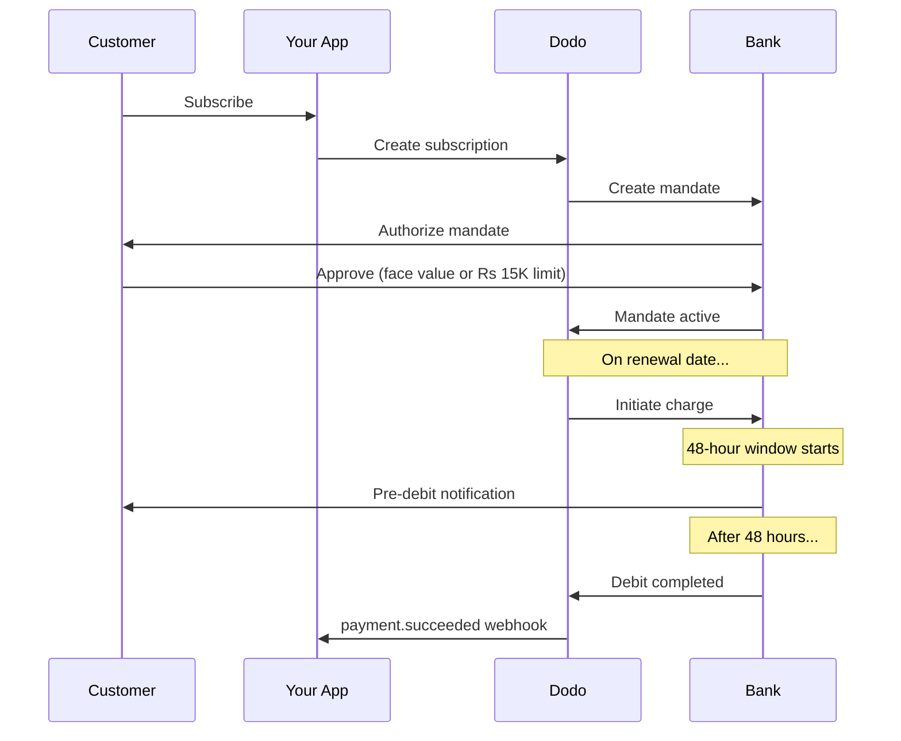

A Índia possui uma infraestrutura de pagamentos única dominada pelo UPI (mais de 60% das transações digitais) e pelos cartões Rupay. A Dodo Payments oferece suporte a ambos com total conformidade ao RBI para mandatos de assinatura.

## Por que os métodos de pagamento da Índia importam

<CardGroup cols={3}>
<Card title="UPI Dominance" icon="mobile">
O UPI processa mais de 10 bilhões de transações por mês. Muitos clientes indianos não possuem cartões internacionais.
</Card>

<Card title="Low Transaction Costs" icon="indian-rupee-sign">
O UPI tem taxas de transação quase zero. Excelente para transações de alto volume e baixo valor.
</Card>

<Card title="Subscription Support" icon="repeat">
Ao contrário da maioria dos métodos de pagamento alternativos, UPI e Rupay suportam pagamentos recorrentes via mandatos do RBI.
</Card>
</CardGroup>

## Métodos suportados

| Método | Tipo | Assinaturas | Valor mínimo |
| :----- | :--- | :-----------: | :--------- |
| **UPI Collect** | QR code / VPA | Sim* | ₹1 |
| **Rupay Credit** | Card | Sim* | ₹1 |
| **Rupay Debit** | Card | Sim* | ₹1 |

*Assinaturas exigem mandatos compatíveis com o RBI com regras especiais de processamento.

## Configuração

### Tipos de método de API

| Tipo | Descrição |
| :--- | :---------- |
| `upi_collect` | UPI via QR code ou entrada de VPA |
| `credit` | Cartões de crédito incluindo Rupay |
| `debit` | Cartões de débito incluindo Rupay |

### Exemplo: Checkout focado na Índia

```javascript
const session = await client.checkoutSessions.create({
  product_cart: [{ product_id: 'prod_123', quantity: 1 }],
  allowed_payment_method_types: [
    'upi_collect',
    'credit',
    'debit'
  ],
  billing_currency: 'INR',
  customer: {
    email: 'customer@example.in',
    name: 'Priya Sharma',
    phone_number: '+919876543210'
  },
  billing_address: {
    country: 'IN',
    zipcode: '560001'
  },
  return_url: 'https://example.com/success'
});
```

### Requisitos para UPI

Para que o UPI apareça no checkout:
1. **País de cobrança** deve ser Índia (`IN`)
2. **Moeda** deve ser INR
3. Para comerciantes não indianos: **Moeda Adaptativa** deve estar habilitada

<Warning>
Se você for um comerciante não indiano e a Moeda Adaptativa não estiver habilitada, o UPI não ficará disponível para seus clientes.
</Warning>

## Assinaturas com mandatos do RBI

As assinaturas com métodos de pagamento indianos operam sob as regulamentações do RBI (Reserve Bank of India) com requisitos exclusivos.

### Como funcionam os mandatos do RBI



### Tipos de mandato

| Valor da assinatura | Tipo de mandato | Limite |
| :------------------ | :----------- | :---- |
| **Abaixo de Rs 15.000** | Mandato sob demanda | Rs 15.000 |
| **Rs 15.000 ou mais** | Mandato de valor fixo | Valor exato da assinatura |

**Importante para alterações de plano:** se um upgrade resultar em uma cobrança que exceda o limite do mandato existente, a cobrança falhará e o cliente precisará reautorizar.

### O atraso de processamento de 48 horas

Esta é a diferença mais importante em relação aos pagamentos com cartão internacional:

<Steps>
<Step title="Charge Initiated (Day 0)">
Na data de renovação programada, a Dodo inicia a cobrança com o banco.
</Step>

<Step title="Pre-Debit Notification">
O cliente recebe notificação do banco sobre o débito iminente.
</Step>

<Step title="48-Hour Window">
O cliente pode cancelar o mandato durante esse período pelo app bancário.
</Step>

<Step title="Debit Completed (~48-51 hours)">
Após 48 horas (mais até 3 horas adicionais para processamento bancário), os fundos são debitados.
</Step>

<Step title="Webhook Sent">
O webhook `payment.succeeded` é enviado após o débito real, não na iniciação.
</Step>
</Steps>

<Warning>
**Não conceda benefícios na iniciação da cobrança.** Espere pelo webhook `payment.succeeded`, que chega ~48-51 horas após a data programada de cobrança.
</Warning>

### Lidando com a janela de 48 horas

```javascript
// DON'T do this:
async function handleSubscriptionRenewal(subscription) {
  // ❌ Bad: Granting access immediately when charge is initiated
  grantPremiumAccess(subscription.customer_id);
}

// DO this:
async function handlePaymentWebhook(event) {
  if (event.type === 'payment.succeeded') {
    // ✅ Good: Only grant access after payment is confirmed
    grantPremiumAccess(event.data.customer_id);
  }
  
  if (event.type === 'payment.failed') {
    // Handle failed payment (mandate cancelled, insufficient funds)
    revokePremiumAccess(event.data.customer_id);
  }
}
```

### Eventos de webhook para assinaturas indianas

| Evento | Quando | Ação |
| :---- | :--- | :----- |
| `subscription.created` | Mandato autorizado | Registre o início da assinatura |
| `payment.succeeded` | ~48h após a data de cobrança | Conceda/continue o acesso |
| `payment.failed` | Débito falhou | Notifique o cliente, pause o acesso |
| `subscription.on_hold` | Pagamento falhou | Solicite atualização do método de pagamento |
| `subscription.active` | Reativado após pagamento | Restaure o acesso |

## Testes

### IDs de teste UPI

| Status | ID UPI |
| :----- | :----- |
| Sucesso | `success@upi` |
| Falha | `failure@upi` |

### Números de cartão de teste indianos

| Bandeira | Cenário | Número do cartão | Validade | CVV |
| :---- | :------- | :---------- | :----- | :-- |
| Visa | Sucesso | `4576238912771450` | 06/32 | 123 |
| Visa | Recusado | `4706131211212123` | 06/32 | 123 |
| Mastercard | Sucesso | `5409162669381034` | 06/32 | 123 |
| Mastercard | Recusado | `5105105105105100` | 06/32 | 123 |

## Melhores práticas

<AccordionGroup>
<Accordion title="Plan for the 48-hour delay">
Construa seu aplicativo para lidar com a lacuna entre a iniciação da cobrança e o pagamento real. Considere:
- Períodos de carência para acesso à assinatura
- Comunicação clara aos clientes sobre o tempo de processamento
- Atendimento acionado por webhook, não por data
</Accordion>

<Accordion title="Handle mandate cancellations">
Os clientes podem cancelar mandatos via apps bancários a qualquer momento. Monitore `subscription.on_hold` webhooks e incentive os clientes a se reinscreverem ou atualizarem seus métodos de pagamento.
</Accordion>

<Accordion title="Set appropriate mandate amounts">
Para preços variáveis (por exemplo, baseados em uso), considere se um mandato sob demanda de Rs 15.000 é suficiente. Se as cobranças puderem exceder isso, os clientes precisarão reautorizar.
</Accordion>

<Accordion title="Offer UPI prominently">
Para clientes indianos, o UPI deve ser a opção de pagamento principal. Muitos usuários o preferem aos cartões devido à familiaridade e menor atrito.
</Accordion>
</AccordionGroup>

## Solução de problemas

<AccordionGroup>
<Accordion title="UPI not appearing at checkout">
**Verifique:**
1. País de cobrança definido para `IN`?
2. Moeda configurada para `INR`?
3. Se for comerciante não indiano: Moeda Adaptativa habilitada?
4. `upi_collect` incluído em `allowed_payment_method_types`?

**Solução:** Verifique se o endereço de cobrança tem `country: "IN"` e `billing_currency: "INR"`.
</Accordion>

<Accordion title="Subscription charge failed after upgrade">
**Causa:** Novo valor de cobrança excede o limite do mandato existente (limite de Rs 15.000).

**Solução:** O cliente deve atualizar o método de pagamento para estabelecer um novo mandato com o limite correto.
</Accordion>

<Accordion title="Subscription on hold but customer claims they didn't cancel">
**Causa:** O cliente pode ter cancelado o mandato durante a janela de 48 horas, ou o banco recusou o débito.

**Solução:** O cliente precisa reautorizar o mandato ou atualizar o método de pagamento.
</Accordion>

<Accordion title="Payment deduction delayed beyond 48 hours">
**Causa:** Atrasos na API do banco podem estender o processamento por mais 2-3 horas.

**Solução:** Isso é esperado. Estruture seu sistema para lidar com atrasos variáveis de até ~51 horas no total.
</Accordion>

<Accordion title="Mandate cancelled but subscription still active">
**Causa:** Caso extremo nas regulamentações do RBI — o cancelamento do mandato durante a janela de processamento não cancela imediatamente a assinatura.

**Solução:** A próxima cobrança falhará e a assinatura passará para `on_hold`. Monitore webhooks para `payment.failed`.
</Accordion>
</AccordionGroup>

## Páginas relacionadas

<CardGroup cols={2}>
<Card title="Payment Methods Overview" icon="credit-card" href="/features/payment-methods">
Veja todos os métodos de pagamento suportados.
</Card>

<Card title="Subscriptions" icon="repeat" href="/features/subscription">
Documentação completa de assinaturas incluindo mandatos do RBI.
</Card>

<Card title="Webhooks" icon="webhook" href="/developer-resources/webhooks">
Tratamento de webhooks para eventos de pagamento.
</Card>

<Card title="Testing Process" icon="flask" href="/miscellaneous/testing-process">
Todos os dados de teste incluindo IDs UPI e cartões indianos.
</Card>
</CardGroup>