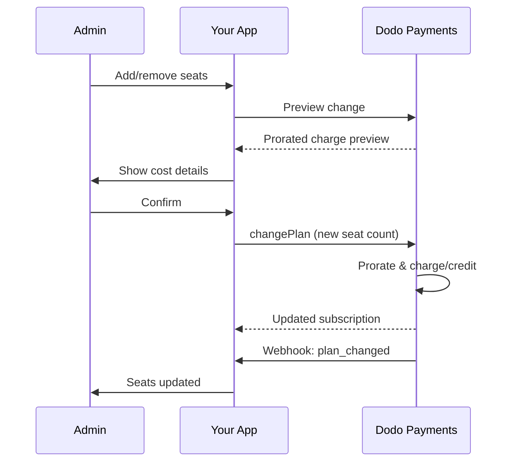

<Info>
A cobrança baseada em assentos permite cobrar os clientes com base no número de usuários, membros da equipe ou licenças de que precisam. É o modelo padrão de precificação para ferramentas de colaboração em equipe, software empresarial e produtos SaaS B2B.
</Info>

<CardGroup cols={2}>
<Card title="Implementation Tutorial" icon="code" href="/developer-resources/seat-based-pricing">
  Guia passo a passo com exemplos de código.
</Card>

<Card title="Add-ons Documentation" icon="puzzle" href="/features/addons">
  Saiba mais sobre o sistema de complementos que alimenta a cobrança baseada em assentos.
</Card>

<Card title="Subscription Management" icon="repeat" href="/features/subscription">
  Gerencie assinaturas baseadas em assentos e mudanças de plano.
</Card>

<Card title="Webhooks" icon="bell" href="/developer-resources/webhooks/intents/subscription">
  Acompanhe alterações de assentos com webhooks de assinatura.
</Card>
</CardGroup>

---

## O que é Cobrança Baseada em Assentos?

A cobrança baseada em assentos (também chamada de preços por usuário ou por assento) cobra dos clientes com base no número de usuários que acessam seu produto. Em vez de uma taxa fixa, o preço escala com o tamanho da equipe.

### Casos de Uso Comuns

| Indústria | Exemplo | Modelo de Preço |
|----------|---------|---------------|
| Colaboração em Equipe | Slack, Notion, Asana | Por usuário ativo/mês |
| Ferramentas para Desenvolvedores | GitHub, GitLab, Jira | Por assento/mês |
| Software de CRM | Salesforce, HubSpot | Por licença de usuário |
| Ferramentas de Design | Figma, Canva | Por assento de editor |
| Software de Segurança | 1Password, Okta | Por usuário/mês |
| Videoconferência | Zoom, Teams | Por licença de anfitrião |

### Benefícios da Cobrança Baseada em Assentos

**Para o Seu Negócio:**
- A receita escala naturalmente à medida que os clientes crescem
- Preços previsíveis que os clientes podem orçar
- Caminho claro de upgrade de individual para equipe para empresarial
- Maior valor vitalício à medida que as equipes se expandem

**Para Seus Clientes:**
- Pague apenas pelo que usam
- Fácil de entender e prever custos
- Flexibilidade para adicionar/remover usuários conforme necessário
- Preços justos que correspondem ao tamanho da equipe

---

## Como a Cobrança Baseada em Assentos Funciona no Dodo Payments

O Dodo Payments implementa a cobrança baseada em assentos usando o sistema de **Add-ons**. Veja como funciona:

### Visão Geral da Arquitetura

Uma assinatura Team Pro custa $99/mês e inclui 5 assentos. Se você tiver mais de 5 usuários, paga $15/mês adicionais por cada assento extra. 

Por exemplo, se sua equipe precisar de 15 assentos:
- Plano base: $99/mês (inclui 5 assentos)
- Complementos: 10 assentos extras × $15/mês = $150/mês
- Custo mensal total: $99 + $150 = $249 por 15 assentos

### Componentes Chave

| Componente | Propósito | Exemplo |
|-----------|---------|---------|
| Produto Base | Assinatura principal com assentos incluídos | "Plano de Equipe - $99/mês (5 assentos incluídos)" |
| Add-on de Assento | Cobrança por assento para usuários adicionais | "Assento Extra - $15/mês cada" |
| Quantidade | Número de assentos adicionais adquiridos | 10 assentos extras |

---

## Estratégias de Preço

Escolha a estratégia de preço baseada em assentos que se encaixa no seu negócio:

### Estratégia 1: Base + Add-on por Assento

Inclua um número definido de assentos no plano base, cobrando por assentos adicionais.

**Exemplo:**

```
Starter Plan: $49/month
├── Includes: 3 seats
├── Extra seats: $10/month each
└── 8 total seats = $49 + (5 × $10) = $99/month
```

**Melhor para:** Produtos onde pequenas equipes podem funcionar com a oferta base.

### Estratégia 2: Preço Puro por Assento

Cobre uma taxa fixa por assento sem taxa base.

**Exemplo:**

```
Per User: $12/month
├── 5 users = $60/month
├── 20 users = $240/month
└── 100 users = $1,200/month
```

**Implementação:** Defina o preço do plano base como $0, use apenas o add-on de assento.

**Melhor para:** Preços simples e transparentes; modelos baseados em uso.

### Estratégia 3: Preço por Assento em Camadas

Diferentes planos base com diferentes taxas por assento.

**Exemplo:**

```
Starter: $0/month base + $15/seat
├── Lower features, higher per-seat cost

Professional: $99/month base + $10/seat
├── More features, lower per-seat cost

Enterprise: $499/month base + $7/seat
└── All features, volume discount on seats
```

**Implementação:** Crie produtos separados para cada camada com preços de add-on diferentes.

**Melhor para:** Incentivar upgrades para camadas superiores; vendas empresariais.

### Estratégia 4: Pacotes de Assentos

Venda assentos em pacotes em vez de individualmente.

**Exemplo:**

```
5-Seat Pack: $50/month ($10/seat)
10-Seat Pack: $80/month ($8/seat)
25-Seat Pack: $175/month ($7/seat)
```

**Implementação:** Crie múltiplos add-ons para diferentes tamanhos de pacotes.

**Melhor para:** Simplificar decisões de compra; incentivar compromissos maiores.

---

## Configurando a Cobrança Baseada em Assentos

### Passo 1: Planeje Sua Estrutura de Preços

Antes da implementação, defina sua estrutura de preços:

<Steps>
<Step title="Define Base Plan">
Decida o que está incluído na assinatura base:
- Preço base (pode ser $0 para um modelo puramente por assento)
- Número de assentos incluídos
- Recursos disponíveis nesse nível
</Step>

<Step title="Set Seat Pricing">
Determine o custo do complemento por assento:
- Preço por assento adicional
- Quaisquer descontos por volume (por meio de vários complementos)
- Máximo de assentos permitidos (se aplicável)
</Step>

<Step title="Consider Billing Frequency">
Alinhe o preço dos assentos com seu ciclo de cobrança:
- Assinaturas mensais → cobranças mensais por assento
- Assinaturas anuais → cobranças anuais por assento (frequentemente com desconto)
</Step>
</Steps>

### Passo 2: Crie o Add-on de Assento

No seu painel do Dodo Payments:

1. Navegue até **Produtos** → **Add-Ons**
2. Clique em **Criar Add-On**
3. Configure o add-on:

| Campo | Valor | Notas |
|-------|-------|-------|
| Nome | "Assento Adicional" ou "Membro da Equipe" | Nome claro e amigável ao usuário |
| Descrição | "Adicione outro membro da equipe ao seu espaço de trabalho" | Explique o que os clientes recebem |
| Preço | Seu preço por assento | ex: $10.00 |
| Moeda | Combine com seu produto base | Deve ser a mesma moeda |
| Categoria de Imposto | A mesma do produto base | Garante tratamento fiscal consistente |

<Tip>
Crie nomes de complementos descritivos que façam sentido nas faturas. "Assento adicional da equipe" é mais claro do que "Complemento de assento" para clientes que revisam suas cobranças.
</Tip>

### Passo 3: Crie o Produto de Assinatura

Crie seu produto de assinatura:

1. Navegue até **Produtos** → **Criar Produto**
2. Selecione **Assinatura**
3. Configure preços e detalhes
4. Na seção **Add-Ons**, anexe seu add-on de assento

### Passo 4: Anexe o Add-on ao Produto

Vincule o add-on de assento à sua assinatura:

1. Edite seu produto de assinatura
2. Role até a seção **Add-Ons**
3. Clique em **Adicionar Add-Ons**
4. Selecione seu add-on de assento
5. Salve as alterações

<Check>
Seu produto de assinatura agora oferece suporte a preços baseados em assentos. Os clientes podem comprar qualquer quantidade de assentos adicionais durante o checkout.
</Check>

---

## Gerenciando Assentos

### Adicionando Assentos a Novas Assinaturas

Ao criar uma sessão de checkout, especifique a quantidade de assentos:

```typescript
const session = await client.checkoutSessions.create({
  product_cart: [{
    product_id: 'prod_team_plan',
    quantity: 1,
    addons: [{
      addon_id: 'addon_seat',
      quantity: 10  // 10 additional seats
    }]
  }],
  customer: { email: 'admin@company.com' },
  return_url: 'https://yourapp.com/success'
});
```

### Alterando a Contagem de Assentos em Assinaturas Existentes

Use a API de Alteração de Plano para ajustar os assentos:

```typescript
// Add 5 more seats to existing subscription
await client.subscriptions.changePlan('sub_123', {
  product_id: 'prod_team_plan',
  quantity: 1,
  proration_billing_mode: 'prorated_immediately',
  addons: [{
    addon_id: 'addon_seat',
    quantity: 15  // New total: 15 additional seats
  }]
});
```

### Removendo Assentos

Para reduzir a contagem de assentos, especifique a quantidade menor:

```typescript
// Reduce from 15 to 8 additional seats
await client.subscriptions.changePlan('sub_123', {
  product_id: 'prod_team_plan',
  quantity: 1,
  proration_billing_mode: 'difference_immediately',
  addons: [{
    addon_id: 'addon_seat',
    quantity: 8  // Reduced to 8 additional seats
  }]
});
```

### Removendo Todos os Assentos Adicionais

Passe um array de add-ons vazio para remover todos os add-ons:

```typescript
// Remove all additional seats, keep only base plan seats
await client.subscriptions.changePlan('sub_123', {
  product_id: 'prod_team_plan',
  quantity: 1,
  proration_billing_mode: 'difference_immediately',
  addons: []  // Removes all add-ons
});
```

---

## Prorrata para Mudanças de Assentos

Quando os clientes adicionam ou removem assentos no meio do ciclo, a prorrata determina como eles são cobrados.



### Modos de prorrata

| Modo | Adicionar assentos | Remover assentos |
|------|--------------------|------------------|
| `prorated_immediately` | Cobrar pelos dias restantes no ciclo | Crédito pelos dias não usados |
| `difference_immediately` | Cobrar o preço total do assento | Crédito aplicado a renovações futuras |
| `full_immediately` | Cobrar o preço total do assento, reiniciar o ciclo de cobrança | Sem crédito |

### Exemplos de prorrata

**Cenário: ciclo de cobrança de 15 dias restantes, adicionando 5 assentos a $10/assento**

<Tabs>
<Tab title="prorated_immediately">

```
Prorated charge = ($10 × 5 seats) × (15 days / 30 days)
                = $50 × 0.5
                = $25 immediate charge
```

O cliente paga $25 agora e depois $50/mês na renovação.
</Tab>

<Tab title="difference_immediately">

```
Immediate charge = $10 × 5 seats = $50
```

O cliente paga os $50 completos agora, independente da posição no ciclo.
</Tab>

<Tab title="full_immediately">

```
Immediate charge = Full subscription + add-ons
Billing cycle resets to today
```

O cliente paga o valor total e um novo ciclo de cobrança começa.
</Tab>
</Tabs>

**Cenário: removendo 3 assentos no meio do ciclo com prorated_immediately**

```
Current: Team Plan ($99/month) + 10 extra seats × $10/seat = $199/month
Change: Remove 3 seats (10 → 7 extra seats) on day 20 of 30-day cycle
Remaining: 10 days

Credit for removed seats:
  = ($10 × 3 seats) × (10 days / 30 days)
  = $30 × 0.333
  = $10.00 credit

→ $10.00 credit added to subscription
→ Next renewal: $99 + (7 × $10) = $169.00/month
→ Credit auto-applies: $169.00 − $10.00 = $159.00 on next invoice
```

<Tip>
**Escolhendo um modo de prorrata para alterações de assentos**: Use `prorated_immediately` para um faturamento justo baseado em dias quando as equipes ajustam assentos com frequência. Use `difference_immediately` para uma matemática mais simples que cobra ou credita o preço total do assento. Veja o [Guia de Prorrata](/developer-resources/subscription-upgrade-downgrade#proration-modes) para comparações detalhadas.
</Tip>

### Visualização antes de alterar

Sempre visualize a prorrata antes de fazer alterações:

```typescript
const preview = await client.subscriptions.previewChangePlan('sub_123', {
  product_id: 'prod_team_plan',
  quantity: 1,
  proration_billing_mode: 'prorated_immediately',
  addons: [{ addon_id: 'addon_seat', quantity: 20 }]
});

console.log('Immediate charge:', preview.immediate_charge.summary);
// Show customer: "Adding 5 seats will cost $25 today"
```

---

## Acompanhando assentos com webhooks

Monitore alterações de assentos ouvindo webhooks de assinatura:

### Eventos relevantes

| Evento | Quando é acionado | Caso de uso |
|-------|------------------|------------|
| `subscription.active` | Nova assinatura ativada | Provisionar assentos iniciais |
| `subscription.plan_changed` | Assentos adicionados/removidos | Atualizar contagem de assentos no seu app |
| `subscription.renewed` | Assinatura renovada | Confirmar que a contagem de assentos permaneceu a mesma |
| `subscription.cancelled` | Assinatura cancelada | Desprovisionar todos os assentos |

### Exemplo de manipulador de webhook

```typescript
app.post('/webhooks/dodo', async (req, res) => {
  const event = req.body;

  switch (event.type) {
    case 'subscription.active':
      // New subscription - provision seats
      const seats = calculateTotalSeats(event.data);
      await provisionSeats(event.data.customer_id, seats);
      break;

    case 'subscription.plan_changed':
      // Seats changed - update access
      const newSeats = calculateTotalSeats(event.data);
      await updateSeatCount(event.data.subscription_id, newSeats);
      break;

    case 'subscription.cancelled':
      // Subscription cancelled - deprovision
      await deprovisionAllSeats(event.data.subscription_id);
      break;
  }

  res.json({ received: true });
});

function calculateTotalSeats(subscriptionData) {
  const baseSeats = 5;  // Included in plan
  const addonSeats = subscriptionData.addons?.reduce(
    (total, addon) => total + addon.quantity, 0
  ) || 0;
  return baseSeats + addonSeats;
}
```

---

## Aplicando limites de assentos

Seu aplicativo deve aplicar limites de assentos. A Dodo Payments acompanha a cobrança, mas você controla o acesso.

### Estratégias de aplicação

<Tabs>
<Tab title="Hard Limit">
Impeça estritamente que usuários sejam adicionados além da contagem de assentos.

```typescript
async function inviteUser(teamId: string, email: string) {
  const team = await getTeam(teamId);
  const subscription = await getSubscription(team.subscriptionId);
  const totalSeats = calculateTotalSeats(subscription);
  const usedSeats = await countTeamMembers(teamId);

  if (usedSeats >= totalSeats) {
    throw new Error('No seats available. Please upgrade your plan.');
  }

  await sendInvitation(teamId, email);
}
```

</Tab>

<Tab title="Soft Limit with Warning">
Permita exceder com um aviso e um período de carência.

```typescript
async function inviteUser(teamId: string, email: string) {
  const team = await getTeam(teamId);
  const { totalSeats, usedSeats } = await getSeatInfo(team);

  if (usedSeats >= totalSeats) {
    // Allow but flag for billing
    await flagOverage(teamId, usedSeats - totalSeats + 1);
    await notifyAdmin(team.adminEmail, 'You have exceeded your seat limit');
  }

  await sendInvitation(teamId, email);
}
```

</Tab>

<Tab title="Auto-Upgrade">
Adicione assentos automaticamente quando o limite for atingido.

```typescript
async function inviteUser(teamId: string, email: string) {
  const team = await getTeam(teamId);
  const { totalSeats, usedSeats, subscriptionId } = await getSeatInfo(team);

  if (usedSeats >= totalSeats) {
    // Automatically add a seat
    await client.subscriptions.changePlan(subscriptionId, {
      product_id: team.productId,
      quantity: 1,
      proration_billing_mode: 'prorated_immediately',
      addons: [{ addon_id: 'addon_seat', quantity: totalSeats - baseSeats + 1 }]
    });

    await notifyAdmin(team.adminEmail, 'A new seat was added to your plan');
  }

  await sendInvitation(teamId, email);
}
```

</Tab>

</Tabs>

---

## Padrões avançados

### Diferentes tipos de assentos

```
Full Seats: $20/month - Full access to all features
View-Only Seats: $5/month - Read-only access
Guest Seats: $0/month - Limited external collaborator access
```

**Implementação:** Crie complementos separados para cada tipo de assento.

```typescript
const session = await client.checkoutSessions.create({
  product_cart: [{
    product_id: 'prod_team_plan',
    quantity: 1,
    addons: [
      { addon_id: 'addon_full_seat', quantity: 10 },
      { addon_id: 'addon_viewer_seat', quantity: 25 },
      { addon_id: 'addon_guest_seat', quantity: 50 }
    ]
  }]
});
```

### Descontos anuais para assentos

Ofereça preços anuais de assentos com desconto:

```
Monthly: $15/seat/month
Annual: $12/seat/month (20% savings)
```

**Implementação:** Crie produtos separados para planos mensais e anuais com preços de complementos diferentes.

### Requisitos mínimos de assentos

Exija um número mínimo de assentos para determinados planos:

```typescript
async function validateSeatCount(planId: string, seatCount: number) {
  const minimums = {
    'prod_starter': 1,
    'prod_team': 5,
    'prod_enterprise': 25
  };

  if (seatCount < minimums[planId]) {
    throw new Error(`${planId} requires at least ${minimums[planId]} seats`);
  }
}
```

---

## Melhores práticas

### Melhores práticas de precificação

- **Clear Communication**: Mostre o preço por assento de forma destacada na sua página de preços
- **Included Seats**: Considere incluir alguns assentos no preço base para reduzir atritos
- **Volume Discounts**: Ofereça taxas por assento mais baixas para equipes maiores e conquiste contratos empresariais
- **Annual Incentives**: Desconte os planos anuais para melhorar o fluxo de caixa e a retenção

### Melhores práticas técnicas

- **Cache Seat Counts**: Armazene localmente a contagem de assentos da assinatura para evitar chamadas de API a cada requisição
- **Sync Regularly**: Sincronize periodicamente sua contagem local de assentos com a Dodo Payments via API
- **Handle Failures**: Se uma alteração de assento falhar, mostre mensagens de erro claras e opções de nova tentativa
- **Audit Trail**: Registre todas as alterações de assentos para disputas de cobrança e conformidade

### Melhores práticas de experiência do usuário

- **Real-Time Feedback**: Mostre o impacto no custo imediatamente ao ajustar os assentos
- **Confirmation Steps**: Exija confirmação antes de mudanças de cobrança
- **Proration Transparency**: Explique claramente as cobranças prorrateadas antes de aplicá-las
- **Easy Downgrades**: Não torne difícil reduzir assentos (isso gera confiança)

---

## Resolução de problemas

<AccordionGroup>
<Accordion title="Seat count mismatch between app and billing">
**Sintoma**: Seu app mostra uma contagem de assentos diferente da assinatura.

**Causas**:
- Webhook não recebido ou processado
- Condição de corrida durante a alteração de assentos
- Dados em cache não atualizados

**Soluções**:
1. Implemente manipuladores de webhook para `subscription.plan_changed`
2. Adicione um botão "Sincronizar com a cobrança" que busca a assinatura atual
3. Defina o TTL do cache para garantir uma atualização regular
</Accordion>

<Accordion title="Proration charges unexpected">
**Sintoma**: Cliente confuso com o valor da cobrança no meio do ciclo.

**Causas**:
- Modo de prorrata não comunicado claramente
- Cliente não viu a prévia antes de confirmar

**Soluções**:
1. Sempre use `previewChangePlan` antes de fazer alterações
2. Mostre um detalhamento claro: "Adicionar X assentos = $Y hoje (prorrateado por Z dias)"
3. Documente sua política de prorrata no centro de ajuda
</Accordion>

<Accordion title="Add-on not appearing in checkout">
**Sintoma**: Complemento de assento não disponível durante o checkout.

**Causas**:
- Complemento não vinculado ao produto
- Complemento arquivado ou excluído
- Incompatibilidade de moeda entre produto e complemento

**Soluções**:
1. Verifique se o complemento está vinculado nas configurações do produto
2. Confira o status do complemento no painel de complementos
3. Garanta que as moedas correspondam exatamente
</Accordion>

<Accordion title="Cannot reduce seats below current usage">
**Sintoma**: Cliente quer reduzir assentos, mas há usuários atribuídos.

**Soluções**:
1. Mostre quais usuários devem ser removidos antes de reduzir os assentos
2. Implemente um fluxo: Remover usuários → Reduzir assentos
3. Considere um período de carência antes de aplicar a redução de assentos
</Accordion>
</AccordionGroup>

---

## Documentação relacionada

<CardGroup cols={2}>
<Card title="Seat-Based Pricing Tutorial" icon="code" href="/developer-resources/seat-based-pricing">
  Guia completo de implementação com código.
</Card>

<Card title="Add-ons" icon="puzzle" href="/features/addons">
  Entenda o sistema de complementos em profundidade.
</Card>

<Card title="Plan Changes & Proration" icon="arrows-rotate" href="/developer-resources/subscription-upgrade-downgrade">
  Lide com modificações de assinatura.
</Card>

<Card title="Subscription Webhooks" icon="bell" href="/developer-resources/webhooks/intents/subscription">
  Acompanhe eventos de assinatura.
</Card>
</CardGroup>
