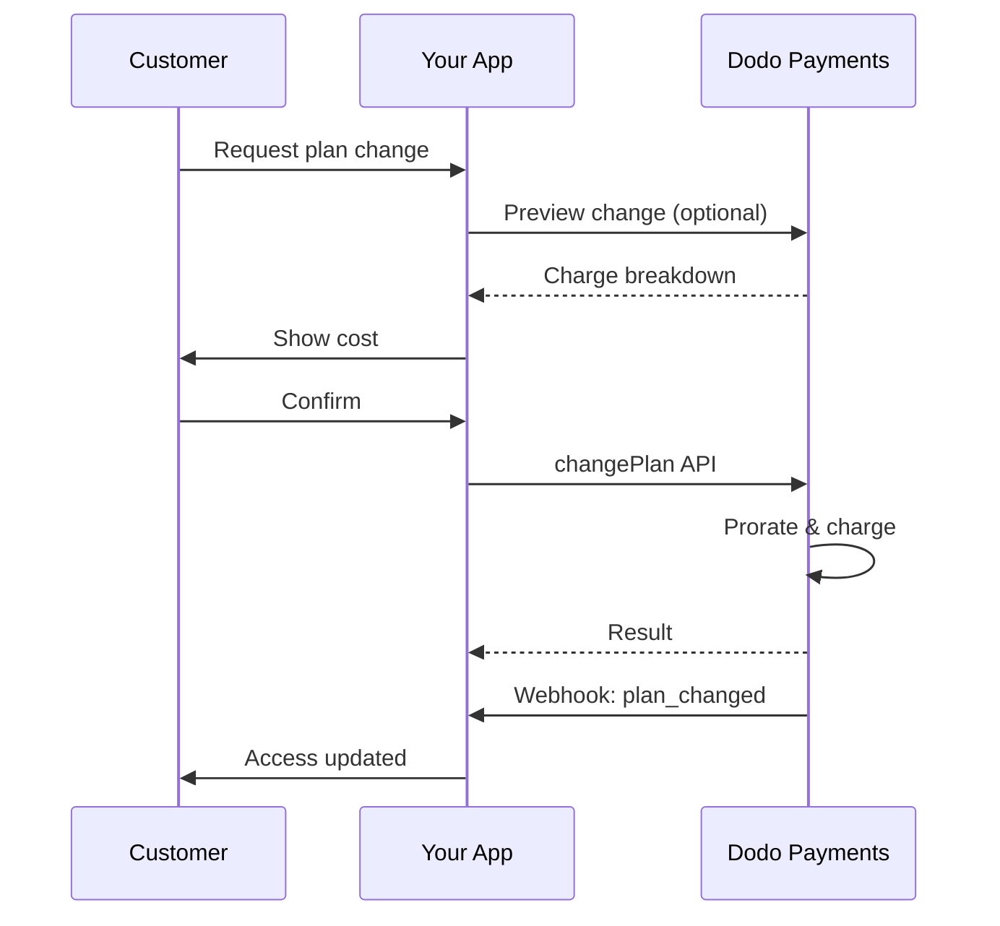
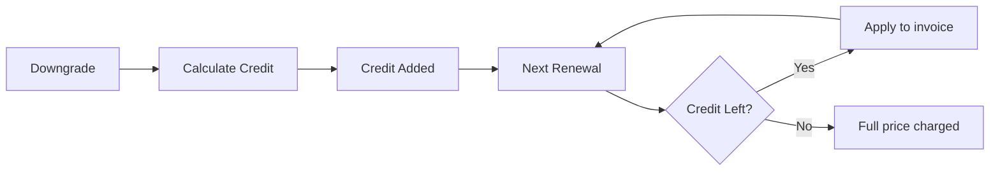

<Info>
Assinaturas permitem vender acesso contínuo com renovações automáticas. Use ciclos de cobrança flexíveis, testes gratuitos, alterações de plano e complementos para ajustar o preço para cada cliente.
</Info>

<CardGroup cols={2}>
{/* LOCKED_PATTERN_e9c6633804a4afc7b38ae988f7ecf803 */}
Controle alterações de plano com rateio e atualização de quantidade.
</Card>

{/* LOCKED_PATTERN_318ae84db3b63552ee4c3b3e5131957c */}
Autorize um mandato agora e cobre depois com valores personalizados.
</Card>

{/* LOCKED_PATTERN_97c52f9aea0902ad308a569911ddfd12 */}
Permita que os clientes gerenciem planos, faturamento e cancelamentos.
</Card>

{/* LOCKED_PATTERN_1cd9a7ac4415843b5e77e9a9493bae92 */}
Reaja a eventos do ciclo de vida como criado, renovado e cancelado.
</Card>
</CardGroup>

## O Que São Assinaturas?

Assinaturas são produtos recorrentes que os clientes compram em um cronograma. Elas são ideais para:

- **Licenças SaaS**: Apps, APIs ou acesso a plataformas
- **Associações**: Comunidades, programas ou clubes
- **Conteúdo digital**: Cursos, mídias ou conteúdo premium
- **Planos de suporte**: SLAs, pacotes de sucesso ou manutenção

## Principais Benefícios

- **Receita previsível**: Cobrança recorrente com renovações automatizadas
- **Ciclos flexíveis**: Mensais, anuais, intervalos personalizados e testes
- **Agilidade no plano**: Prorrata para upgrades e downgrades
- **Complementos e assentos**: Anexe upgrades opcionais e quantificáveis
- **Checkout sem costura**: Checkout hospedado e portal do cliente
- **Focado no desenvolvedor**: APIs claras para criação, mudanças e rastreamento de uso

## Criando Assinaturas

Crie produtos de assinatura no seu painel do Dodo Payments e, em seguida, venda-os através do checkout ou da sua API. Separar produtos de assinaturas ativas permite que você versione preços, anexe complementos e rastreie o desempenho de forma independente.

### Criação de produtos de assinatura

Configure os campos no painel para definir como sua assinatura é vendida, renovada e cobrada. As seções abaixo mapeiam diretamente o que você vê no formulário de criação.

#### Detalhes do produto

- **Nome do Produto** (obrigatório): O nome exibido no checkout, portal do cliente e faturas.
- **Descrição do Produto** (obrigatório): Uma declaração de valor clara que aparece no checkout e nas faturas.
- **Imagem do Produto** (obrigatório): PNG/JPG/WebP de até 3 MB. Usada no checkout e nas faturas.
- **Marca**: Associe o produto a uma marca específica para temas e e-mails.
- **Categoria Fiscal** (obrigatório): Escolha a categoria (por exemplo, SaaS) para determinar as regras fiscais.

<Tip>
Escolha a categoria de imposto mais precisa para garantir a cobrança correta por região.
</Tip>

#### Preços

- **Tipo de Preço**: Escolha <b>Assinatura</b> (este guia). As alternativas são Pagamento Único e Cobrança Baseada em Uso.
- **Preço** (obrigatório): Preço base recorrente com a moeda.
- **Desconto Aplicável (%)**: Percentual de desconto opcional aplicado ao preço base; refletido no checkout e nas faturas.
- **Repetir pagamento a cada** (obrigatório): Intervalo para renovações, por exemplo, a cada 1 Mês. Selecione a cadência (meses ou anos) e a quantidade.
- **Período de Assinatura** (obrigatório): Prazo total pelo qual a assinatura permanece ativa (por exemplo, 10 Anos). Após o término deste período, as renovações param, a menos que sejam estendidas.
- **Dias do Período de Teste** (obrigatório): Defina a duração do teste em dias. Use 0 para desabilitar testes. A primeira cobrança ocorre automaticamente quando o teste termina.
- **Selecionar complemento**: Anexe até 10 complementos que os clientes podem comprar juntamente com o plano base.

<Warning>
Alterar preços de um produto ativo afeta novas compras. Assinaturas existentes seguem suas configurações de alteração de plano e rateio.
</Warning>

<Info>
Complementos são ideais para extras quantificáveis como assentos ou armazenamento. Você pode controlar quantidades permitidas e o comportamento de rateio quando os clientes os alteram.
</Info>

#### Configurações Avançadas

- **Preços Inclusivos de Impostos**: Exiba preços inclusivos de impostos aplicáveis. O cálculo final do imposto ainda varia de acordo com a localização do cliente.
- **Gerar chaves de licença**: Emita uma chave única para cada cliente após a compra. Veja o guia de <a href="/features/license-keys">Chaves de Licença</a>.
- **Entrega de Produto Digital**: Entregue arquivos ou conteúdo automaticamente após a compra. Saiba mais em <a href="/features/digital-product-delivery">Entrega de Produto Digital</a>.
- **Metadados**: Anexe pares de chave-valor personalizados para marcação interna ou integrações de clientes. Veja <a href="/api-reference/metadata">Metadados</a>.

<Tip>
Use metadados para armazenar identificadores do seu sistema (por exemplo, accountId) para que você possa reconciliar eventos e faturas posteriormente.
</Tip>

## Testes de Assinatura

Testes permitem que os clientes acessem assinaturas sem pagamento imediato. A primeira cobrança ocorre automaticamente quando o teste termina.

### Configurando Testes

Defina **Dias do Período de Avaliação** na seção de preços do produto (use `0` para desativar). Você pode substituir isso ao criar assinaturas:

```typescript
// Via subscription creation
const subscription = await client.subscriptions.create({
  customer_id: 'cus_123',
  product_id: 'prod_monthly',
  trial_period_days: 14  // Overrides product's trial period
});

// Via checkout session
const session = await client.checkoutSessions.create({
  product_cart: [{ product_id: 'prod_monthly', quantity: 1 }],
  subscription_data: { trial_period_days: 14 }
});
```

<Warning>
O valor `trial_period_days` deve estar entre 0 e 10.000 dias.
</Warning>

### Detectando o Status do Teste

<Warning>
Atualmente, não há um campo direto para detectar o status de avaliação. A seguir está uma solução alternativa que requer consultar pagamentos, o que é ineficiente. Estamos trabalhando em uma solução mais eficiente.
</Warning>

Para determinar se uma assinatura está em período de teste, recupere a lista de pagamentos da assinatura. Se houver exatamente um pagamento com valor 0, a assinatura está no período de teste:

```typescript
const subscription = await client.subscriptions.retrieve('sub_123');
const payments = await client.payments.list({
  subscription_id: subscription.subscription_id
});

// Check if subscription is in trial
const isInTrial = payments.items.length === 1 && 
                  payments.items[0].total_amount === 0;
```

### Atualizando o Período de Teste

Estenda o período de avaliação atualizando `next_billing_date`:

```typescript
await client.subscriptions.update('sub_123', {
  next_billing_date: '2025-02-15T00:00:00Z'  // New trial end date
});
```

<Warning>
Você não pode definir `next_billing_date` para um horário passado. A data deve estar no futuro.
</Warning>

## Mudanças de Plano de Assinatura

Mudanças de plano permitem que você atualize ou rebaixe assinaturas, ajuste quantidades ou migre para produtos diferentes. Cada mudança aciona uma cobrança imediata com base no modo de prorrata que você selecionar.

<Tip>
Você pode alterar planos de assinatura e atualizar a próxima data de cobrança diretamente no painel do Dodo Payments. Isso oferece um jeito rápido de ajustar assinaturas para solicitações de suporte ao cliente, upgrades promocionais ou migrações de plano sem fazer chamadas de API.
</Tip>

<Tip>
**Ative alterações de plano em autoatendimento:** Deseja que os clientes atualizem ou rebaixem suas próprias assinaturas via Portal do Cliente? Adicione seus produtos de assinatura a uma Coleção de Produtos e ative "Permitir atualizações de assinatura" nas Configurações de Assinatura.
</Tip>



{/* LOCKED_PATTERN_cbe0de1faffb3a1f552c6ce10c001527 */}
  Agrupe produtos relacionados em coleções para habilitar caminhos de upgrade/rebaixamento contínuos no Portal do Cliente.
</Card>

### Modos de Rateio

Escolha como os clientes são cobrados ao mudar de plano:

<Info>
**Comparação rápida dos três modos de rateio:**

| | `prorated_immediately` | `difference_immediately` | `full_immediately` |
|---|---|---|---|
| **Atualização** | Cobrança proporcional pelos dias restantes | Diferença total de preço cobrada | Preço total do novo plano cobrado |
| **Rebaixamento** | Crédito proporcional pelos dias restantes | Diferença total de preço como crédito | Sem crédito, cobrança total |
| **Ciclo de cobrança** | Permanece o mesmo | Permanece o mesmo | Reinicia para hoje |
| **Melhor para** | Cobrança justa baseada no tempo | Mudanças simples de nível | Ciclo de cobrança reiniciado |
</Info>

#### `prorated_immediately`
Cobra o valor proporcional com base no tempo restante no ciclo de cobrança atual. Melhor para uma cobrança justa que considera o tempo não utilizado.

```typescript
await client.subscriptions.changePlan('sub_123', {
  product_id: 'prod_pro',
  quantity: 1,
  proration_billing_mode: 'prorated_immediately'
});
```

#### `difference_immediately`
Cobra a diferença de preço imediatamente (upgrade) ou adiciona crédito para renovações futuras (rebaixamento). Ideal para cenários simples de upgrade/rebaixamento.

```typescript
// Upgrade: charges $50 (difference between $30 and $80)
// Downgrade: credits remaining value, auto-applied to renewals
await client.subscriptions.changePlan('sub_123', {
  product_id: 'prod_pro',
  quantity: 1,
  proration_billing_mode: 'difference_immediately'
});
```

<Info>
Créditos de rebaixamentos usando `difference_immediately` são vinculados à assinatura e aplicados automaticamente às renovações futuras. Eles são distintos de <a href="/features/customer-credit">Customer Credits</a>.
</Info>

Quando um cliente rebaixa usando `difference_immediately`, o valor não utilizado torna-se um crédito vinculado à assinatura que automaticamente compensa renovações futuras:



#### `full_immediately`
Cobra o valor total do novo plano imediatamente, ignorando o tempo restante. Ideal para redefinir ciclos de cobrança.

```typescript
await client.subscriptions.changePlan('sub_123', {
  product_id: 'prod_monthly',
  quantity: 1,
  proration_billing_mode: 'full_immediately'
});
```

<AccordionGroup>
{/* LOCKED_PATTERN_77fa8030551e310988f32a1810cb0d32 */}

**Cenário**: Cliente no plano Basic ($30/month) atualiza para Pro ($80/month) no dia 16 de um ciclo de 30 dias usando `prorated_immediately`.

```
Unused credit from Basic = $30 × (15 remaining / 30 total) = $15.00
Prorated cost of Pro     = $80 × (15 remaining / 30 total) = $40.00
────────────────────────────────────────────────────────────────────
Immediate charge         = $40.00 − $15.00 = $25.00
```

Próxima renovação na data original: **$80.00/month**.

<Tip>
Para exemplos de cálculo mais detalhados e casos extremos, consulte nosso [Upgrade & Downgrade Guide](/developer-resources/subscription-upgrade-downgrade).
</Tip>

</Accordion>
{/* LOCKED_PATTERN_6272a737f845c6ce57dfe1823485561c */}

**Cenário**: Cliente no plano Pro ($80/month) rebaixa para Starter ($20/month) usando `difference_immediately`.

```
Credit = Old plan − New plan = $80 − $20 = $60.00
```

O crédito de $60 é aplicado automaticamente às renovações futuras:
- Renovação 1: $20 − $20 (crédito) = **$0.00** (restam $40 de crédito)
- Renovação 2: $20 − $20 (crédito) = **$0.00** (restam $20 de crédito)  
- Renovação 3: $20 − $20 (crédito) = **$0.00** (crédito esgotado)
- Renovação 4: **$20.00** (preço total)

<Info>
Saiba mais sobre como os créditos são gerenciados no [Upgrade & Downgrade Guide](/developer-resources/subscription-upgrade-downgrade).
</Info>

</Accordion>
</AccordionGroup>

### Alterando Planos com Complementos

Modifique complementos ao mudar de plano. Complementos estão incluídos nos cálculos de rateio:

```typescript
await client.subscriptions.changePlan('sub_123', {
  product_id: 'prod_pro',
  quantity: 1,
  proration_billing_mode: 'difference_immediately',
  addons: [{ addon_id: 'addon_extra_seats', quantity: 2 }]  // Add add-ons
  // addons: []  // Empty array removes all existing add-ons
});
```

<Info>
Mudanças de plano disparam cobranças imediatas. Cobranças falhadas podem mover a assinatura para o status `on_hold`. Acompanhe as alterações por meio de eventos de webhook `subscription.plan_changed`.
</Info>

### Visualizar Alterações de Plano

Antes de confirmar uma alteração de plano, visualize a cobrança exata e a assinatura resultante:

```typescript
const preview = await client.subscriptions.previewChangePlan('sub_123', {
  product_id: 'prod_pro',
  quantity: 1,
  proration_billing_mode: 'prorated_immediately'
});

// Show customer the charge before confirming
console.log('You will be charged:', preview.immediate_charge.summary);
```

{/* LOCKED_PATTERN_4cf51d80aab5581e90ca5178574dd95f */}
  Visualize as alterações de plano antes de confirmá-las.
</Card>

## Estados da Assinatura

As assinaturas podem estar em diferentes estados ao longo do ciclo de vida:

- **`active`**: A assinatura está ativa e renovará automaticamente
- **`on_hold`**: A assinatura está pausada devido a falha no pagamento. É necessário atualizar o método de pagamento para reativar
- **`cancelled`**: A assinatura está cancelada e não será renovada
- **`expired`**: A assinatura atingiu sua data de término
- **`pending`**: A assinatura está sendo criada ou processada

### Estado Em Espera

Uma assinatura entra no estado `on_hold` quando:

- Um pagamento de renovação falha (fundos insuficientes, cartão vencido etc.)
- Uma cobrança de alteração de plano falha
- A autorização do método de pagamento falha

<Warning>
Quando uma assinatura está no estado `on_hold`, ela não será renovada automaticamente. Você deve atualizar o método de pagamento para reativar a assinatura.
</Warning>

### Reativando do Estado Em Espera

Para reativar uma assinatura do estado `on_hold`, atualize o método de pagamento. Isso automaticamente:

1. Cria uma cobrança pelos valores pendentes
2. Gera uma fatura
3. Processa o pagamento usando o novo método de pagamento
4. Reativa a assinatura para o estado `active` após o pagamento bem-sucedido

```typescript
// Reactivate subscription from on_hold
const response = await client.subscriptions.updatePaymentMethod('sub_123', {
  type: 'new',
  return_url: 'https://example.com/return'
});

// For on_hold subscriptions, a charge is automatically created
if (response.payment_id) {
  console.log('Charge created:', response.payment_id);
  // Redirect customer to response.payment_link to complete payment
  // Monitor webhooks for payment.succeeded and subscription.active
}
```

<Info>
Após atualizar com sucesso o método de pagamento de uma assinatura `on_hold`, você receberá os eventos de webhook `payment.succeeded` seguidos por `subscription.active`.
</Info>

## Gerenciamento de API

<AccordionGroup>
{/* LOCKED_PATTERN_90c830137a1db85369b1d7f3d01ae82f */}
Use `POST /subscriptions` para criar assinaturas programaticamente a partir de produtos, com testes opcionais e complementos.


{/* LOCKED_PATTERN_80e2d112f65019b30c4a8db2b540611a */}
Veja a API de criação de assinaturas.
</Card>
</Accordion>

{/* LOCKED_PATTERN_7db9c1f9990c40bba57aa6671f00c67e */}
Use `PATCH /subscriptions/{id}` para atualizar quantidades, cancelar na próxima data de cobrança ou modificar metadados.


{/* LOCKED_PATTERN_adf0aff0c53ede544a3b9267991da09d */}
Saiba como atualizar os detalhes da assinatura.
</Card>
</Accordion>

{/* LOCKED_PATTERN_c014ed82995c82db7ff5269f5df46531 */}
Altere o produto ativo e as quantidades com controles de rateio.


{/* LOCKED_PATTERN_afa3d1700c97ae5510a3b95972626011 */}
Revise as opções de mudança de plano.
</Card>
</Accordion>

{/* LOCKED_PATTERN_e4be3d5898d68fb2f2f5f0e8fdf83e30 */}
Para assinaturas sob demanda, cobre valores específicos conforme necessário.

{/* LOCKED_PATTERN_6a5c708696bc00ef7568a4d6821875e9 */}
Cobre uma assinatura sob demanda.


{/* LOCKED_PATTERN_ea724d9cdc0d6cfdcd00675dcff1781c */}
Use `GET /subscriptions` para listar todas as assinaturas e `GET /subscriptions/{id}` para recuperar uma.


{/* LOCKED_PATTERN_4728f8e0407f9ffad5b85b7c77f6a7a1 */}
Consulte as APIs de listagem e recuperação.


{/* LOCKED_PATTERN_7f09c790a6d7f4120accee35e87f16ba */}
Busque o uso registrado para modelos de preços medidos ou híbridos.


{/* LOCKED_PATTERN_f3047e02844ecc96a820a081613f8e53 */}
Veja a API de histórico de uso.


{/* LOCKED_PATTERN_ccdbd0043049c6f6310fb5a44a412ebf */}
Atualize o método de pagamento de uma assinatura. Para assinaturas ativas, isso atualiza o método para renovações futuras. Para assinaturas em estado `on_hold`, isso reativa a assinatura criando uma cobrança pelos valores pendentes.


{/* LOCKED_PATTERN_d8ea2b81f4bc1c8e6e864e29c8b258c6 */}
Saiba como atualizar métodos de pagamento e reativar assinaturas.
</Card>
</Accordion>
</AccordionGroup>

## Casos de Uso Comuns

- **SaaS e APIs**: Acesso em níveis com complementos para assentos ou uso
- **Conteúdo e mídia**: Acesso mensal com testes introdutórios
- **Planos de suporte B2B**: Contratos anuais com complementos de suporte premium
- **Ferramentas e plugins**: Chaves de licença e lançamentos versionados

## Exemplos de Integração

### Sessões de Checkout (assinaturas)
Ao criar sessões de checkout, inclua seu produto de assinatura e complementos opcionais:

```typescript
const session = await client.checkoutSessions.create({
  product_cart: [
    {
      product_id: 'prod_subscription',
      quantity: 1
    }
  ]
});
```

### Alterações de plano com rateio
Atualize ou rebaixe uma assinatura e controle o comportamento de rateio:

```typescript
await client.subscriptions.changePlan('sub_123', {
  product_id: 'prod_new',
  quantity: 1,
  proration_billing_mode: 'difference_immediately'
});
```

### Cancelar na próxima data de cobrança
Agende um cancelamento que entre em vigor no final do período de cobrança atual:

```typescript
await client.subscriptions.update('sub_123', {
  cancel_at_next_billing_date: true
});
```

### Assinaturas sob demanda
Crie uma assinatura sob demanda e cobre depois conforme necessário:

```typescript
const onDemand = await client.subscriptions.create({
  customer_id: 'cus_123',
  product_id: 'prod_on_demand',
  on_demand: true
});

await client.subscriptions.createCharge(onDemand.id, {
  amount: 4900,
  currency: 'USD',
  description: 'Extra usage for September'
});
```

### Atualizar método de pagamento de assinatura ativa
Atualize o método de pagamento de uma assinatura ativa:

```typescript
// Update with new payment method
const response = await client.subscriptions.updatePaymentMethod('sub_123', {
  type: 'new',
  return_url: 'https://example.com/return'
});

// Or use existing payment method
await client.subscriptions.updatePaymentMethod('sub_123', {
  type: 'existing',
  payment_method_id: 'pm_abc123'
});
```

### Reativar assinatura do estado on_hold
Reative uma assinatura que entrou em espera devido a falha no pagamento:

```typescript
// Update payment method - automatically creates charge for remaining dues
const response = await client.subscriptions.updatePaymentMethod('sub_123', {
  type: 'new',
  return_url: 'https://example.com/return'
});

if (response.payment_id) {
  // Charge created for remaining dues
  // Redirect customer to response.payment_link
  // Monitor webhooks: payment.succeeded → subscription.active
}
```

## Assinaturas com Mandatos Compatíveis com o RBI

  Assinaturas UPI e com cartão indiano operam sob regulamentos do RBI (Banco de Reserva da Índia) com requisitos específicos de mandato:

  ### Limites de Mandato

  O tipo e o valor do mandato dependem da cobrança recorrente da sua assinatura:

  - **Cobranças abaixo de Rs 15.000:** Criamos um mandato sob demanda de Rs 15.000 INR. O valor da assinatura é cobrado periodicamente conforme sua frequência de assinatura, até o limite do mandato.
  - **Cobranças de Rs 15.000 ou mais:** Criamos um mandato de assinatura (ou mandato sob demanda) pelo valor exato da assinatura.

Para obter informações detalhadas sobre mandatos compatíveis com o RBI para métodos de pagamento indianos, veja a página <a href="/features/payment-methods/india">Métodos de Pagamento da Índia</a>.

  ### Considerações sobre Upgrade e Downgrade

  **Importante:** Ao fazer upgrade ou downgrade de assinaturas, considere cuidadosamente os limites de mandato:

  - Se um upgrade/downgrade resultar em um valor de cobrança que exceda Rs 15.000 e ultrapasse o limite de pagamento sob demanda existente, a cobrança da transação pode falhar.
  - Nesses casos, o cliente pode precisar atualizar o método de pagamento ou alterar a assinatura novamente para estabelecer um novo mandato com o limite correto.

  ### Autorização para Cobranças de Alto Valor

  Para cobranças de assinatura de Rs 15.000 ou mais:

  - O cliente receberá um aviso do banco para autorizar a transação.
  - Se o cliente não autorizar a transação, ela falhará e a assinatura será colocada em espera.

  ### Atraso de Processamento de 48 Horas

  **Cronograma de Processamento:** Cobranças recorrentes em cartões indianos e assinaturas UPI seguem um padrão de processamento único:

  - As cobranças são **iniciadas** na data programada conforme sua frequência de assinatura.
  - A **dedução** real da conta do cliente ocorre somente após **48 horas** da iniciação do pagamento.
  - Essa janela de 48 horas pode se estender por mais **2-3 horas adicionais** dependendo das respostas das APIs bancárias.

  ### Janela de Cancelamento do Mandato

  Durante a janela de processamento de 48 horas:

  - Os clientes podem cancelar o mandato pelos aplicativos bancários.
  - Se um cliente cancelar o mandato nesse período, a assinatura permanecerá **ativa** (esse é um caso limite específico de assinaturas com cartão indiano e UPI AutoPay).
  - No entanto, a dedução real pode falhar e, nesse caso, colocaremos a assinatura **em espera**.

  **Tratamento de Casos Limite:** Se você fornecer benefícios, créditos ou uso da assinatura aos clientes imediatamente após a iniciação da cobrança, você precisa lidar com essa janela de 48 horas adequadamente na sua aplicação. Considere:

  - Adiar a ativação dos benefícios até a confirmação do pagamento
  - Implementar períodos de carência ou acesso temporário
  - Monitorar o status da assinatura para cancelamentos de mandato
  - Lidar com estados de espera das assinaturas na lógica da sua aplicação

  <Tip>
  Monitore webhooks de assinaturas para rastrear mudanças no status de pagamento e lidar com casos extremos onde mandatos são cancelados durante a janela de 48 horas.
  </Tip>

## Melhores Práticas

- **Comece com níveis claros**: 2–3 planos com diferenças óbvias
- **Comunique os preços**: Mostre os totais, o rateio e a próxima renovação
- **Use testes com cuidado**: Converta com onboarding, não apenas com tempo
- **Aproveite complementos**: Mantenha os planos base simples e venda extras
- **Teste as alterações**: Valide mudanças de plano e rateio no modo de teste

<Info>
Assinaturas são uma base flexível para receita recorrente. Comece simples, teste exaustivamente e iterate com base em métricas de adoção, churn e expansão.
</Info>