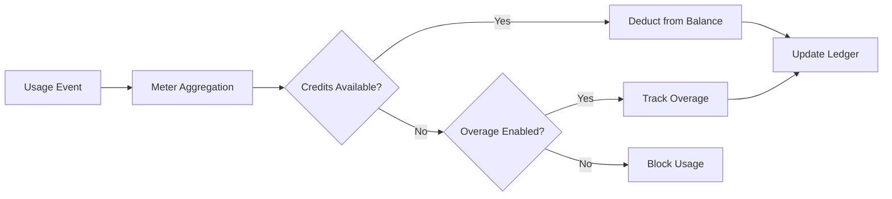

<Info>
Os medidores convertem eventos brutos em quantidades faturáveis. Eles filtram eventos e aplicam funções de agregação (Count, Sum, Max, Last) para calcular o uso por cliente.
</Info>

<Frame>

</Frame>

## Recursos da API

<AccordionGroup>
<Accordion title="View Meter API References">
<CardGroup cols={2}>
<Card title="Create Meter" icon="plus" href="/api-reference/meters/create-meter">
Crie medidores programaticamente via API.
</Card>

<Card title="List Meters" icon="list" href="/api-reference/meters/get-meters">
Recupere todos os medidores em sua conta.
</Card>

<Card title="Get Meter" icon="eye" href="/api-reference/meters/retrieve-meter">
Obtenha detalhes de um medidor específico por ID.
</Card>

<Card title="Archive Meter" icon="arrow-rotate-right" href="/api-reference/meters/archive-meter">
Arquive um medidor para parar de rastrear o uso.
</Card>

<Card title="Unarchive Meter" icon="arrow-rotate-left" href="/api-reference/meters/unarchive-meter">
Restaure um medidor arquivado para retomar o rastreamento.
</Card>
</CardGroup>
</Accordion>
</AccordionGroup>

## Criando um Medidor

<Steps>
<Step title="Basic Information">
<ParamField path="Meter Name" type="string" required>
Nome descritivo (por exemplo, "API Requests", "Token Usage")
</ParamField>

<ParamField path="Event Name" type="string" required>
Nome exato do evento para corresponder (diferencia maiúsculas/minúsculas). Exemplos: `api.call`, `image.generated`
</ParamField>
</Step>

<Step title="Aggregation">
<ParamField path="Aggregation Type" type="string" required>
Escolha como os eventos são agregados:

- **Count**: Número total de eventos (chamadas de API, uploads)
- **Sum**: Some valores numéricos (tokens, bytes)
- **Max**: Maior valor no período (usuários máximos)
- **Last**: Valor mais recente
</ParamField>

<ParamField path="Over Property" type="string">
Chave de metadados para agregar (obrigatória para todos os tipos, exceto Count). Exemplos: `tokens`, `bytes`, `duration_ms`
</ParamField>

<ParamField path="Measurement Unit" type="string" required>
Rótulo da unidade para faturas. Exemplos: `calls`, `tokens`, `GB`, `hours`
</ParamField>
</Step>

<Step title="Filtering (Optional)">
<Frame>

</Frame>

Adicione condições para filtrar quais eventos são contados:
- **Lógica AND**: Todas as condições devem corresponder
- **Lógica OR**: Qualquer condição pode corresponder

**Comparadores**: igual, diferente, maior que, menor que, contém

Ative a filtragem, escolha a lógica, adicione condições com chave de propriedade, comparador e valor.
</Step>

<Step title="Create">
Revise a configuração e clique em **Create Meter**.
</Step>
</Steps>

## Visualizando Análises

<Frame>

</Frame>

Seu painel de medidores mostra:
- **Visão Geral**: Uso total e gráfico de uso
- **Eventos**: Eventos individuais recebidos
- **Clientes**: Uso e cobranças por cliente

## Cobrança em Créditos em vez de Moeda

Por padrão, os medidores cobram os clientes por unidade em dólares (ou na sua moeda configurada). Você pode configurar um medidor para **deduzir de um saldo de créditos** - assim o uso consome créditos em vez de gerar uma cobrança monetária.

<Info>
A dedução baseada em créditos exige um [Credit Entitlement](/features/credit-based-billing) vinculado ao mesmo produto. Crie seu crédito primeiro e, em seguida, vincule-o ao medidor.
</Info>

### Quando usar dedução baseada em créditos

| Cenário | Padrão (moeda) | Baseado em Créditos |
|----------|-------------------|--------------|
| Precificação simples por unidade ($0,01/chamada) | ✅ Melhor opção | Sobrecarga desnecessária |
| Pacotes de crédito pré-pagos (compre 10K tokens, use ao longo do tempo) | ❌ Não é possível expressar | ✅ Melhor opção |
| Uso incluído em assinatura (plano Pro inclui 100K chamadas) | Possível com limite gratuito | ✅ Melhor – créditos acumulam, expiram e aparecem no portal |
| Produtos com múltiplos medidores compartilhando um pool de créditos | ❌ Cada medidor fatura separadamente | ✅ Todos os medidores deduzem de um único saldo |

### Configurando um medidor para deduzir créditos

<Steps>
{/* LOCKED_PATTERN_2f001d4cc191a503bfa27e2b02a887d3 */}
Primeiro, crie um crédito em **Products → Credits**. Defina a unidade (por exemplo, "API Calls", "Tokens"), a precisão e as configurações de ciclo de vida (expiração, rollover, excedente).

Consulte o [guia de Faturamento Baseado em Créditos](/features/credit-based-billing) para obter instruções detalhadas.
</Step>

{/* LOCKED_PATTERN_e56c2bce14c9ffc41b822106f30b9344 */}
Acesse seu produto baseado em uso e abra a seção de configuração do **Meter**.
</Step>

{/* LOCKED_PATTERN_0e1120cd860a229dcc6f92a517f37ac6 */}
Clique no botão **+** para anexar um medidor. Configure o nome do evento, o tipo de agregação e a unidade de medição como de costume.
</Step>

{/* LOCKED_PATTERN_5742803ec5f5aba6317bae5a7cd68e62 */}
Ative **Cobrar uso em Créditos** na configuração do medidor. Isso revela as configurações de crédito:

{/* LOCKED_PATTERN_5164565eee83d03235035c7c8b6b2680 */}

</Frame>

{/* LOCKED_PATTERN_643db6bd6419b3403905cdf5351f1450 */}
Selecione de qual Credit Entitlement este medidor deve deduzir.
</ParamField>

{/* LOCKED_PATTERN_f350d049ff7e758408e63c7b8b7766de */}
O número de unidades de uso necessárias para deduzir 1 crédito. Por exemplo:
- `1` = cada evento do medidor deduz 1 crédito
- `100` = 100 eventos do medidor deduzem 1 crédito
- `1000` = 1.000 chamadas de API consomem 1 crédito
</ParamField>
</Step>

{/* LOCKED_PATTERN_6b77ac14c64de04b72ad44281724bb0c */}
O **Limite Gratuito** ainda se aplica - eventos abaixo desse limite não deduzem créditos.

**Exemplo**: Com um limite gratuito de 1.000 e unidades de medidor por crédito igual a 1:
- O cliente usa 2.500 chamadas de API
- As primeiras 1.000 são gratuitas
- As 1.500 restantes deduzem 1.500 créditos do saldo dele
</Step>
</Steps>

### Como a dedução de créditos funciona

Uma vez configurado, o pipeline de dedução é executado automaticamente:

1. **Os eventos chegam** - Sua aplicação envia eventos de uso por meio da [Event Ingestion API](/features/usage-based-billing/event-ingestion)
2. **O medidor agrega** - os eventos são agregados de acordo com a configuração do medidor (Count, Sum, Max, Last)
3. **Processamento por worker em background** - a cada minuto, um worker busca novos eventos desde o último checkpoint
4. **Créditos são deduzidos** - o uso agregado é convertido em créditos usando a taxa `meter_units_per_credit` e deduzido seguindo a **ordem FIFO** (as concessões mais antigas são consumidas primeiro)
5. **Excesso é monitorado** - se o saldo atingir zero e o excedente estiver ativado, o uso continua e o excedente é tratado conforme o comportamento configurado (perdoado no reset, cobrado na próxima fatura ou levado como déficit)

{/* LOCKED_PATTERN_4907e9f6f7fbd509120d7a87afc829e9 */}
A dedução de créditos é executada de forma assíncrona (a cada ~1 minuto). Pode haver um pequeno atraso entre a ingestão do evento e a dedução no saldo. Projete sua aplicação para lidar com esse atraso - não dependa de verificações de saldo em tempo real para controle de acesso em requisições individuais.
{/* LOCKED_PATTERN_176d815432e7554ac558e8631b2bc397 */}

### Vários medidores, um pool de créditos

Você pode vincular múltiplos medidores no mesmo produto ao **mesmo Credit Entitlement**. Todos os medidores deduzem de um único saldo compartilhado.

**Exemplo**: Uma plataforma de IA com dois medidores:
- `text.generation` - 1 crédito por 1.000 tokens
- `image.generation` - 10 créditos por imagem

Ambos deduzem do mesmo pool "AI Credits". O cliente vê um único saldo unificado em seu portal.

{/* LOCKED_PATTERN_317ec56569e36d0c9e56c2648890a76e */}
Use diferentes taxas `meter_units_per_credit` entre os medidores para expressar custos relativos. Operações caras (geração de imagens) exigem menos unidades de medidor por crédito do que operações baratas (completação de texto).
{/* LOCKED_PATTERN_4dec52ce04aa8849a8a60508baae30ae */}

<CardGroup cols={2}>
{/* LOCKED_PATTERN_2e110f22e0f3741250f140b212ae466d */}
Veja o histórico completo de dedução de créditos de um cliente.
</Card>
{/* LOCKED_PATTERN_83b4a13ef9031c5fd9378a998aeaa952 */}
Verifique o saldo atual de créditos de um cliente via API.
</Card>
</CardGroup>

## Solução de problemas

<AccordionGroup>
<Accordion title="Events not appearing">
- O nome do evento deve coincidir exatamente (considerando maiúsculas e minúsculas)
- Verifique se os filtros do medidor não estão excluindo os eventos
- Verifique se os IDs dos clientes existem
- Desative temporariamente os filtros para testar
</Accordion>

<Accordion title="Aggregation not working">
- Verifique se a Over Property corresponde exatamente à chave de metadata
- Use números, não strings: `tokens: 150` não `"150"`
- Inclua as propriedades obrigatórias em todos os eventos
</Accordion>

<Accordion title="Filters not working">
- Combine exatamente as maiúsculas e minúsculas
- Use os operadores corretos para o tipo de dado
- Garanta que os eventos incluam as propriedades filtradas
</Accordion>

<Accordion title="Wrong usage totals">
- Verifique a aba Eventos para contar os eventos reais recebidos
- Verifique o tipo de agregação (Count vs Sum)
- Garanta que os valores sejam numéricos para Sum/Max
</Accordion>
</AccordionGroup>

## Próximos passos

<CardGroup cols={2}>

<Card title="Send Events" icon="bolt" href="/features/usage-based-billing/event-ingestion">
Comece a enviar eventos de uso da sua aplicação para os seus medidores.
</Card>

<Card title="View Blueprints" icon="copy" href="/features/usage-based-billing/ingestion-blueprints">
Use configurações prontas de medidores para casos de uso comuns.
</Card>
</CardGroup>
