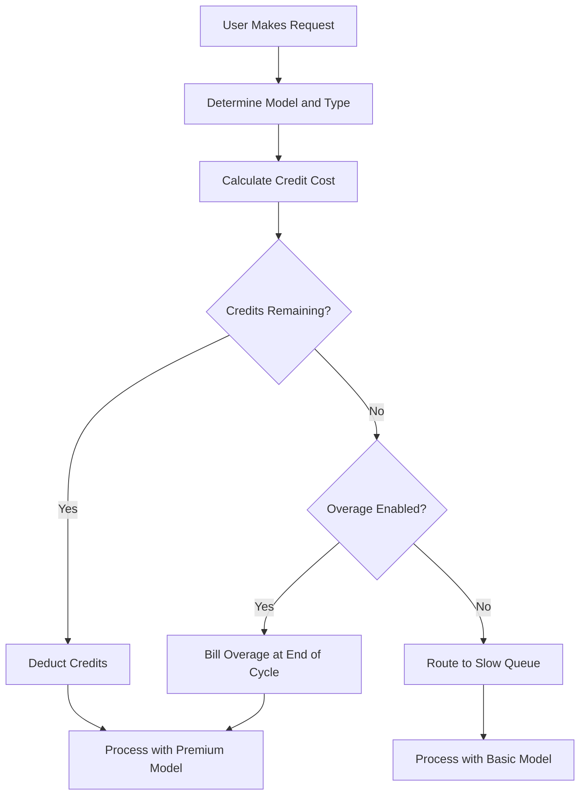

## Hur Cursor fakturerar

Cursor använder en hybridmodell som kombinerar en månadsprenumeration med en uttömmande kreditpool. Detta tillvägagångssätt ger användarna ett förutsägbart pris samtidigt som de varierande kostnaderna för olika AI-modeller hanteras.

**Prisskikt**: Cursor erbjuder skikt från Hobby till Ultra, som balanserar premium- och standardåtkomst för att passa olika arbetsflöden.

| Plan | Pris | Premium Requests | Långsamma förfrågningar |
| :--- | :--- | :--- | :--- |
| Hobby | Gratis | 50/månad | Obegränsat |
| Pro | \$20/månad | 500/månad | Obegränsat |
| Pro+ | \$60/månad | Obegränsat premium | - |
| Ultra | \$200/månad | Obegränsat premium | - |

**Modellviktad uttömning**: Olika förfrågningar förbrukar olika mängder krediter baserat på den underliggande modellens kostnad. Detta gör att Cursor kan erbjuda en enda prenumeration som täcker flera leverantörer samtidigt som dyra operationer kompenseras.

| Request Type | Model | Credit Cost |
| :--- | :--- | :--- |
| Tab Completion | Default | 0 |
| Chat | GPT-4o Mini | 1 |
| Chat | Claude 3.5 Sonnet | 1 |
| Composer | GPT-4o | 5 |
| Agent | Claude 3.5 Sonnet | 10 |
| Agent | o1-preview | 25 |

**Kreditutslutning och övertrasseringar**: När krediterna är slut flyttas användare till en "långsam" kö med billigare modeller istället för att bli avklippta. Alternativt kan de aktivera användningsbaserade övertrasseringar för att behålla premiumåtkomst till en fast kostnad per förfrågan.



4. **Enterprise och Business**: Team använder poolad användning där hela organisationen delar på en gemensam kreditbalja. Det förenklar hantering och säkerställer att tunga användare inte når individuella gränser medan andra har outnyttjad kapacitet.

## Vad som gör det unikt

Cursor balanserar användarupplevelse med infrastrukturkostnader genom att lösa problem som traditionella SaaS-faktureringsmodeller har svårt med.
- **Leverantörsabstraktion**: En enda prenumeration omsluter flera LLM-leverantörer som OpenAI och Anthropic, och hanterar komplex prissättning samt API-nycklar bakom kulisserna.
- **Viktad uttömning**: Kostnaderna överensstämmer med värdet genom att debiteras mer för kraftfulla modeller, vilket gör att prissättningen känns rättvis och transparent för alla användare.
- **Graceful degradation**: Den "långsamma" kön förhindrar hårda avbrott, håller användarna i produkten och uppmuntrar uppgraderingar utan att vara straffande.
- **Poolade krediter**: Teamnivåbaljor minskar friktionen för företagskunder genom att möjliggöra effektiv resursdelning över hela organisationen.

## Bygg detta med Dodo Payments

Du kan återskapa denna exakta modell med Dodo Payments kreditbeviljningar och användningsbaserad fakturering. Följande steg vägleder dig genom implementeringen.

<Steps>
  <Step title="Create a Custom Unit Credit Entitlement">
    Börja med att definiera kreditsystemet i Dodo-instrumentpanelen. Denna beviljning kommer att representera "Premium Requests" som användarna får med sin prenumeration.

    *   **Credit Type:** Custom Unit
    *   **Unit Name:** "Premium Requests"
    *   **Precision:** 0 (eftersom du inte kan använda en halv förfrågan)
    *   **Credit Expiry:** 30 dagar (detta säkerställer att krediter återställs varje faktureringscykel)
    *   **Rollover:** Inaktiverat (oanvända förfrågningar förs inte över till nästa månad)
    *   **Overage:** Aktiverat
    *   **Price Per Unit:** \$0.04 (kostnaden för varje förfrågan efter att den initiala poolen är uttömd)
    *   **Overage Behavior:** Fakturera övertrassering vid fakturering (detta lägger till övertrasseringskostnaden på nästa faktura)

    Denna konfiguration säkerställer att användare har en fast pool med förfrågningar varje månad, med möjlighet att betala för fler om de behöver. Det är grunden för den hybrida faktureringsmodellen.
  </Step>

  <Step title="Create Subscription Products">
    Skapa separata produkter för varje nivå. Koppla samma kreditbeviljning till varje produkt, men med olika mängder. Detta gör att du kan hantera alla nivåer med ett enda kreditsystem, vilket gör det enkelt att uppgradera eller nedgradera användare.

    *   **Hobby:** \$0/månad, 50 krediter/cykel
    *   **Pro:** \$20/månad, 500 krediter/cykel
    *   **Pro+:** \$60/månad, 5000 krediter/cykel (praktiskt taget obegränsat för de flesta)
    *   **Ultra:** \$200/månad, 50000 krediter/cykel (praktiskt taget obegränsat)

    När en användare prenumererar på en av dessa produkter, tilldelar Dodo automatiskt motsvarande antal krediter till deras konto. Detta sker omedelbart och ger en sömlös onboarding-upplevelse.
  </Step>

  <Step title="Create a Usage Meter Linked to Credits">
    Skapa en mätare med namnet `ai.request` med **Sum**-aggregering på egenskapen `credit_cost`. Koppla denna mätare till din kreditbeviljning genom att aktivera växeln "Bill usage in Credits". Ställ in meterens enheter per kredit till 1.

    För att hantera modellviktad uttömning hanterar du kreditkostnaden på applikationsnivå. När en användare gör en förfrågan bestämmer din app kostnaden baserat på modell eller åtgärdstyp.

    ```typescript
    import DodoPayments from 'dodopayments';
    
    /**
     * Determines the credit cost for a given request type and model.
     * This logic lives in your application and can be updated without
     * changing your billing configuration.
     */
    function getCreditCost(requestType: string, model: string): number {
      const costs: Record<string, Record<string, number>> = {
        'tab_completion': { 'default': 0 },
        'chat': { 'gpt-4o-mini': 1, 'gpt-4o': 1, 'claude-sonnet': 1 },
        'composer': { 'gpt-4o-mini': 2, 'gpt-4o': 5, 'claude-sonnet': 5 },
        'agent': { 'gpt-4o': 10, 'claude-sonnet': 10, 'o1': 25 }
      };
      
      // Default to 1 credit if the combination isn't found
      return costs[requestType]?.[model] ?? 1;
    }
    
    /**
     * Ingests usage events into Dodo Payments.
     * For weighted requests, we send multiple events or use a sum aggregation.
     */
    async function trackRequest(customerId: string, requestType: string, model: string) {
      const creditCost = getCreditCost(requestType, model);
      
      // Tab completions are free, so we don't need to track them for billing
      if (creditCost === 0) return;
      
      const client = new DodoPayments({
        bearerToken: process.env.DODO_PAYMENTS_API_KEY,
      });
      
      await client.usageEvents.ingest({
        events: [{
          event_id: `req_${Date.now()}_${Math.random().toString(36).slice(2)}`,
          customer_id: customerId,
          event_name: 'ai.request',
          timestamp: new Date().toISOString(),
          metadata: {
            request_type: requestType,
            model: model,
            credit_cost: creditCost
          }
        }]
      });
    }
    ```

    <Tip>
      Om du vill använda en enda händelse för viktade förfrågningar, ställ in din meteraggregering på **Sum** och använd en egenskap som `credit_cost` som värdet som ska summeras. Detta är ofta mer effektivt för högvolymsingestion och förenklar din applikationslogik.
    </Tip>
  </Step>

  <Step title="Handle Credit Exhaustion (Slow Queue)">
    Lyssna på `credit.balance_low`-webhooken från Dodo. När en användares krediter närmar sig noll kan du växla dem till en långsam kö i din applikation. Här implementerar du den "graceful degradation"-logiken.

    ```typescript
    import DodoPayments from 'dodopayments';
    import express from 'express';
    
    const app = express();
    app.use(express.raw({ type: 'application/json' }));
    
    const client = new DodoPayments({
      bearerToken: process.env.DODO_PAYMENTS_API_KEY,
      webhookKey: process.env.DODO_PAYMENTS_WEBHOOK_KEY,
    });
    
    app.post('/webhooks/dodo', async (req, res) => {
      try {
        const event = client.webhooks.unwrap(req.body.toString(), {
          headers: {
            'webhook-id': req.headers['webhook-id'] as string,
            'webhook-signature': req.headers['webhook-signature'] as string,
            'webhook-timestamp': req.headers['webhook-timestamp'] as string,
          },
        });
        
        if (event.type === 'credit.balance_low') {
          const customerId = event.data.customer_id;
          await updateUserTier(customerId, 'slow');
          await notifyUser(customerId, 'You have used most of your premium requests. Switching to standard models.');
        }
        
        res.json({ received: true });
      } catch (error) {
        res.status(401).json({ error: 'Invalid signature' });
      }
    });
    
    /**
     * Routes a request based on the user's current tier.
     * This function is called before every AI request to determine the model and queue.
     */
    async function routeRequest(customerId: string, requestType: string) {
      const tier = await getUserTier(customerId);
      
      if (tier === 'slow') {
        // Route to a cheaper model and a lower priority queue
        // This saves costs while keeping the user active in the product
        return { model: 'gpt-4o-mini', queue: 'standard' };
      }
      
      // Premium routing for users with remaining credits
      // This provides the best possible performance and model quality
      return { model: 'claude-sonnet', queue: 'priority' };
    }
    ```

  </Step>

  <Step title="Create Checkout">
    Slutligen, skapa en checkout-session för användaren att prenumerera på en plan. Dodo hanterar betalningsbearbetning, skatteefterlevnad och kreditallokering automatiskt.

    ```typescript
    import DodoPayments from 'dodopayments';
    
    const client = new DodoPayments({
      bearerToken: process.env.DODO_PAYMENTS_API_KEY,
    });
    
    /**
     * Creates a checkout session for a new subscription.
     * This is typically called when a user clicks an "Upgrade" button.
     */
    const session = await client.checkoutSessions.create({
      product_cart: [
        { product_id: 'prod_cursor_pro', quantity: 1 }
      ],
      customer: { email: 'developer@example.com' },
      return_url: 'https://yourapp.com/dashboard'
    });
    ```

  </Step>
</Steps>

## Accelerera med LLM Ingestion Blueprint

Den ovanstående kreditviktade faktureringen hanterar din kärnmonetisering. För djupare analys av faktisk tokenförbrukning över leverantörer kan [LLM Ingestion Blueprint](/developer-resources/ingestion-blueprints/llm) köras parallellt med ditt kreditsystem.

```bash
npm install @dodopayments/ingestion-blueprints
```

```typescript
import { createLLMTracker } from '@dodopayments/ingestion-blueprints';
import OpenAI from 'openai';
import Anthropic from '@anthropic-ai/sdk';

// Track raw token usage for analytics alongside credit-weighted billing
const openaiTracker = createLLMTracker({
  apiKey: process.env.DODO_PAYMENTS_API_KEY,
  environment: 'live_mode',
  eventName: 'analytics.openai_tokens',
});

const anthropicTracker = createLLMTracker({
  apiKey: process.env.DODO_PAYMENTS_API_KEY,
  environment: 'live_mode',
  eventName: 'analytics.anthropic_tokens',
});

const openai = new OpenAI({ apiKey: process.env.OPENAI_API_KEY });
const anthropic = new Anthropic({ apiKey: process.env.ANTHROPIC_API_KEY });

// Wrap each provider separately
const trackedOpenAI = openaiTracker.wrap({ client: openai, customerId: 'customer_123' });
const trackedAnthropic = anthropicTracker.wrap({ client: anthropic, customerId: 'customer_123' });

// Token tracking is automatic, credit deduction still uses your weighted system
const response = await trackedOpenAI.chat.completions.create({
  model: 'gpt-4o',
  messages: [{ role: 'user', content: 'Hello!' }],
});
```

Det ger dig två datalager: kreditviktad fakturering för monetisering och råa tokenräkningar för kostnadsanalys och marginalspårning.

<Tip>
LLM Blueprint stöder OpenAI, Anthropic, Groq, Google Gemini och fler. Se [fullständig blueprint-dokumentation](/developer-resources/ingestion-blueprints/llm) för alla stödjda leverantörer.
</Tip>

## Poolade teamkrediter (Enterprise)

Cursors Business- och Enterprise-planer poolar krediter över ett team. Du kan implementera detta med Dodo genom att skapa en enda prenumeration för organisationen istället för individuella användare. Detta säkerställer att teamets användning konsolideras och hanteras som en enhet, vilket är ett stort krav för större kunder.

### Implementeringsstrategi

1.  **Organisationsnivåkund:** Skapa en enda `customer_id` i Dodo för hela organisationen. Denna kund representerar faktureringsenheten för teamet och håller den delade kreditpoolen. Alla fakturor och kreditallokeringar knyts till detta ID.
2.  **Sätebaserad fakturering:** Använd Dodos tillägg för att ta ut en plattformavgift per användare. När ett team lägger till en ny medlem uppdaterar du kvantiteten för "Seat"-tillägget. Detta säkerställer att din intäkt skalar med antalet användare samtidigt som kreditpoolen hålls separat. Det är ett rent sätt att hantera multidimensionell fakturering.
3.  **Delad användningsspårning:** Alla teammedlemmars förfrågningar inges med organisationens `customer_id`. Detta säkerställer att varje förfrågan från någon teammedlem tömmer samma centrala kreditpool. Du kan fortfarande spåra individuell användaranvändning genom att inkludera ett `user_id` i händelsemetadata för intern rapportering och analys.

Detta tillvägagångssätt ger dig det bästa av två världar: en förutsägbar avgift per användare för plattformen och en delad pool av krediter för de dyra AI-resurserna. Det förenklar också användarupplevelsen för teammedlemmarna, eftersom de inte behöver hantera sina egna individuella gränser.

## Jämförelse med traditionell SaaS-fakturering

Traditionell SaaS-fakturering innebär vanligtvis platta nivåer (t.ex. \$10/månad för 100 enheter). Om en användare behöver 101 enheter måste de ofta hoppa till en \$50/månad-nivå. Detta skapar "klippkants"-effekter som kan frustrera användare och leda till churn. Det tar inte heller hänsyn till den varierande kostnaden för olika typer av användning, vilket är avgörande inom AI-området.

Cursors modell, driven av Dodo, är mycket mer flexibel och rättvis:

*   **Inga "klippkants"-effekter:** Användare behöver inte uppgradera bara för att de nått en gräns. De kan betala för övertrasseringar eller acceptera långsammare prestanda. Detta håller dem i produkten och minskar friktionen, vilket leder till högre kundnöjdhet och lägre churn.
*   **Kostnadsanpassning:** Dina intäkter ökar i takt med dina infrastrukturkostnader. Om en användare använder dyra modeller betalar de mer (antingen via krediter eller övertrasseringar). Detta skyddar dina marginaler och låter dig erbjuda högkostnadsfunktioner hållbart utan att riskera affärsmodellen.
*   **Bättre retention:** Genom att inte stänga av användare håller du dem engagerade i din produkt även när de nått sin gräns. De kan fortsätta arbeta, vilket bygger långsiktig lojalitet och ökar kundens livstidsvärde. Det är en win-win för både användare och leverantör.

## Hantering av modelluppdateringar och utveckling

En av utmaningarna med AI-fakturering är att modeller ständigt uppdateras eller ersätts. Nya modeller kan ha olika kostnadsstrukturer eller prestandakaraktäristika. Med Dodos kreditsystem kan du hantera detta smidigt på applikationsnivå utan att behöva migrera din faktureringsdata.

Om du introducerar en ny, dyrare modell uppdaterar du helt enkelt din `getCreditCost`-funktion för att tilldela den en högre kostnad. Du behöver inte ändra din faktureringskonfiguration eller uppdatera befintliga prenumerationer. Denna åtskillnad mellan fakturering och applikationslogik är en stor fördel eftersom den låter dig iterera på din produkt i AI-tempot utan att begränsas av ditt faktureringssystem.

## Användarnotifieringar och transparens

För att erbjuda en bra användarupplevelse är det viktigt att hålla användarna informerade om deras kreditförbrukning. Transparens bygger förtroende och hjälper användare att hantera sina kostnader effektivt. Du kan använda Dodos webhooks för att trigga notifikationer vid olika trösklar (t.ex. 50 %, 80 % och 100 % användning).

Dessa notifikationer kan skickas via e-post, in-app-meddelanden eller Slack-meddelanden. Genom att erbjuda realtidsfeedback om förbrukningen uppmuntrar du användare att hantera sin konsumtion eller uppgradera sin plan innan de når "långsamma kön". Detta proaktiva tillvägagångssätt minskar antalet supportärenden och förbättrar den övergripande användarupplevelsen, vilket gör att din produkt känns mer professionell och användarcentrerad.

## Säkerhet och bedrägeriförebyggande

När du implementerar ett kreditbaserat system är det viktigt att tänka på säkerhet och bedrägeriförebyggande. Eftersom krediter har ett direkt monetärt värde kan de vara ett mål för missbruk.

*   **Idempotens:** Använd alltid unika `event_id` när du matar in användningshändelser för att undvika dubbelräkning. Dodos ingestion API hanterar idempotens automatiskt om du tillhandahåller ett unikt ID, vilket säkerställer att ett nätverksomförsök inte debiterar användaren två gånger.
*   **Hastighetsbegränsning:** Implementera hastighetsbegränsning på applikationsnivå för att förhindra att en enda användare tömmer sina krediter (eller din API-budget) för snabbt. Detta skyddar din infrastruktur och användarens plånbok.
*   **Övervakning:** Övervaka användningsmönster för avvikelser som kan indikera kontodelning eller automatiserat missbruk. Dodos analysverktyg kan hjälpa dig identifiera dessa mönster så att du kan agera innan de blir ett större problem.

## Bästa praxis för kreditsystem

När du bygger ett kreditbaserat faktureringssystem, håll följande bästa praxis i åtanke:

1.  **Håll det enkelt:** Gör inte ditt kreditsystem för komplicerat. Användare bör enkelt kunna förstå hur mycket en förfrågan kostar och hur många krediter de har kvar.
2.  **Ge verkligt värde:** Säkerställ att krediterna ger verkligt värde för användaren. Om kostnaden för en förfrågan är för hög kommer användarna att känna att de blir nickel-and-dimed.
3.  **Var transparent:** Visa alltid användaren deras nuvarande kreditbalans och användningshistorik. Detta bygger förtroende och minskar förvirring.
4.  **Automatisera allt:** Använd Dodos webhooks och API:er för att automatisera så mycket av faktureringsprocessen som möjligt. Det minskar manuellt arbete och säkerställer att din fakturering alltid är korrekt.

## Viktiga Dodo-funktioner som används

<CardGroup cols={2}>
  <Card title="Credit-Based Billing" icon="coins" href="/features/credit-based-billing">
    Hantera uttömmande kreditpooler och övertrasseringar med anpassade enheter.
  </Card>
  <Card title="Subscriptions" icon="calendar" href="/features/subscription">
    Ställ in återkommande fakturering för olika nivåer med integrerade krediter.
  </Card>
  <Card title="Usage-Based Billing" icon="chart-line" href="/features/usage-based-billing/introduction">
    Spåra händelser och fakturera baserat på förbrukning i realtid.
  </Card>
  <Card title="Event Ingestion" icon="bolt" href="/features/usage-based-billing/event-ingestion">
    Skicka volymer av användningsdata till Dodo med låg latens.
  </Card>
  <Card title="Webhooks" icon="webhook" href="/developer-resources/webhooks/intents/credit">
    Reagera på kreditbalansförändringar och automatisera användarnivåer.
  </Card>
  <Card title="LLM Ingestion Blueprint" icon="brain-circuit" href="/developer-resources/ingestion-blueprints/llm">
    Automatisk tokenspårning över flera LLM-leverantörer.
  </Card>
</CardGroup>
