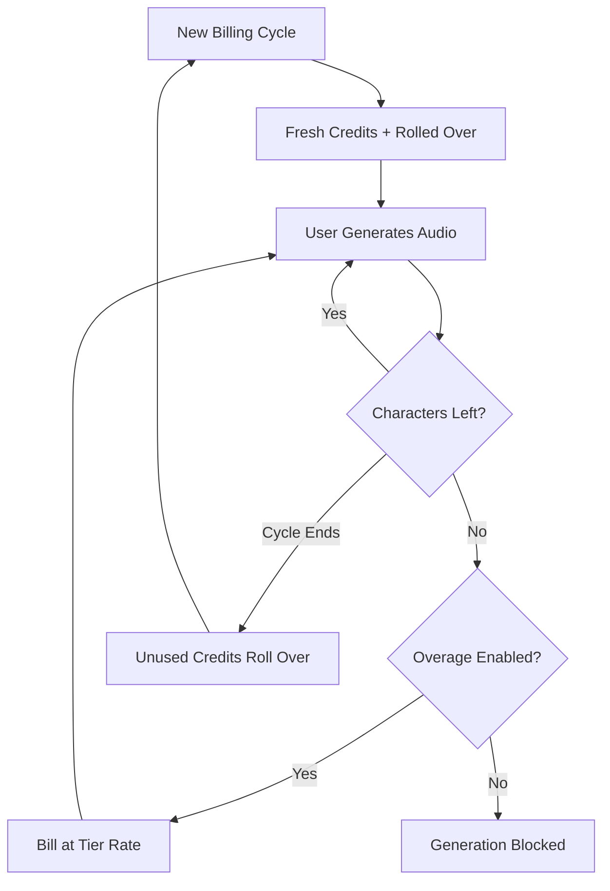

ElevenLabs har byggt en dominerande position inom AI-röstområdet genom att göra sin fakturering lika flytande som deras talsyntes. Deras modell kretsar kring en enda värdeenhet: tecknet. Oavsett om du genererar text-till-tal, klonar en röst eller dubbar en video, använder du från en enhetlig pool med teckenkrediter.

## Hur ElevenLabs fakturerar

ElevenLabs prissättning använder fasta månatliga kvoter kopplade till prenumerationsnivåer. När användare går till högre nivåer får de fler tecken och tillgång till mer avancerade funktioner som professionell röstkloning eller kommersiella rättigheter.

| Plan | Pris | Tecken/månad | Överutnyttjandeavgift |
| :--- | :--- | :--- | :--- |
| Free | \$0 | 10,000 | Not available |
| Starter | \$5/month | 30,000 | ~\$0.30/1K chars |
| Creator | \$22/month | 100,000 | ~\$0.24/1K chars |
| Pro | \$99/month | 500,000 | ~\$0.15/1K chars |
| Scale | \$330/month | 2,000,000 | ~\$0.10/1K chars |

1. **Teckenbaserad prissättning**: Tecken är den universella valutan på hela plattformen. Text-till-tal, Dubbning och Röstkloning drar alla från samma saldo, vilket förenklar användningsspårningen.
2. **Överföringsmekanik**: Oanvända tecken överförs till nästa faktureringscykel istället för att förfalla. ElevenLabs sätter ett tak för att förhindra oändlig ackumulering, vilket säkerställer att användarna behåller värdet från sin prenumeration.
3. **Nivåindelade överutnyttjanden**: Överutnyttjanden hanteras baserat på prenumerationsnivån. Lägre planer har överutnyttjanden inaktiverade som standard för säkerhet, medan högre nivåer tillåter aktiverade avgifter för att behålla tjänstkontinuiteten.

## Vad som gör det unikt

Flera strategiska val gör ElevenLabs faktureringsmodell särskilt effektiv för att behålla användare och uppmuntra uppgraderingar.

- **Teckenöverföring**: Överföringskrediter minskar "använd det eller förlora det"-ångest genom att föra vidare oanvänd investering. Det bibehåller prenumerationens värde även under perioder med lägre aktivitet.
- **Nivåindelad överutnyttjandeprissättning**: Överutnyttjandeavgifter blir lägre ju större planen är, vilket skapar ett starkt incitament att uppgradera. Användare upplever ofta högre nivåer som mer attraktiva tack vare lägre kostnad för ytterligare användning.
- **Enhetlig konsumtion**: En enda teckenpool för alla tjänster tar bort den kognitiva bördan av att hantera separata kvoter. Användare behöver bara hålla koll på ett enda tal för att förstå sin kvarvarande kapacitet.
- **Överutnyttjanden via opt-in**: Professionella användare kan aktivera överutnyttjanden för kontinuitet, medan mer casual användare gynnas av säkerheten i ett hårt tak.



## Bygg detta med Dodo Payments

Du kan reproducera denna sofistikerade modell med Dodo Payments kreditbaserade fakturering och användningsmätning.

<Steps>
<Step title="Create a Custom Unit Credit Entitlement">
Börja med att definiera enheten "Characters" som ska fungera som plattformens valuta.

1. Gå till **Entitlements** i din Dodo-instrumentpanel.
2. Skapa en ny **Credit Entitlement**.
3. Ställ in **Credit Type** på **Custom Unit**.
4. Namnge enheten "Characters".
5. Ställ in **Precision** på 0, eftersom tecken alltid är hela enheter.
6. Ställ in **Credit Expiry** på 30 dagar för att matcha den månatliga faktureringscykeln.
7. Aktivera **Rollover** med dessa inställningar:
    - **Max Rollover Percentage**: 100 % (tillåter att alla oanvända tecken förs vidare).
    - **Rollover Timeframe**: 1 månad.
    - **Max Rollover Count**: 1 (krediter kan rulla över en gång, sedan förfaller de).
</Step>

<Step title="Create Tiered Subscription Products">
Skapa fem prenumerationsprodukter. Du kopplar samma "Characters"-entitlement till varje, men med olika konfigurationer per nivå.

| Produkt | Pris | Krediter/cykel | Överutnyttjande aktiverat | Överutnyttjandepris (per 1K tecken) |
| :--- | :--- | :--- | :--- | :--- |
| Free | \$0/mo | 10,000 | No | - |
| Starter | \$5/mo | 30,000 | Yes (opt-in) | \$0.30 |
| Creator | \$22/mo | 100,000 | Yes | \$0.24 |
| Pro | \$99/mo | 500,000 | Yes | \$0.15 |
| Scale | \$330/mo | 2,000,000 | Yes | \$0.10 |

När du kopplar kreditentitlement till varje produkt ska du avmarkera **Import Default Credit Settings**. Detta gör att du kan ställa in det specifika **Price Per Unit** för överutnyttjanden på den aktuella nivån. Ställ in **Overage Behavior** på **Bill overage at billing** och konfigurera en **Low Balance Threshold** på 10 % av nivåns kvot.
</Step>

<Step title="Create a Usage Meter">
Användningsmätaren kopplar din applikations aktivitet till kreditsystemet.

1. Skapa en ny mätare med namnet `tts.characters`.
2. Ställ in **Aggregation** på **Sum**. Detta lägger ihop `characters`-egenskapen från varje händelse du skickar.
3. Koppla denna mätare till din "Characters"-kreditentitlement.
4. Ställ in **Meter units per credit** till 1. Detta säkerställer att ett tecken som används i din app motsvarar en kredit som dras från saldot.
</Step>

<Step title="Send Usage Events">
Integrera användningsspårningen i din applikationskod. Varje gång en användare genererar ljud, skicka en händelse till Dodo.

```typescript
import DodoPayments from 'dodopayments';

async function trackGeneration(
  customerId: string,
  text: string, 
  service: 'tts' | 'dubbing' | 'cloning'
) {
  const characterCount = text.length;

  const client = new DodoPayments({
    bearerToken: process.env.DODO_PAYMENTS_API_KEY,
  });

  await client.usageEvents.ingest({
    events: [{
      event_id: `gen_${Date.now()}_${Math.random().toString(36).slice(2)}`,
      customer_id: customerId,
      event_name: 'tts.characters',
      timestamp: new Date().toISOString(),
      metadata: {
        characters: characterCount,
        service: service,
        voice_id: 'voice_abc123'
      }
    }]
  });
}
```

</Step>

<Step title="Handle Low Balance and Overage">
Använd webhooks för att hålla dina användare informerade om deras teckenkonsumtion.

```typescript
import DodoPayments from 'dodopayments';
import express from 'express';

const app = express();
app.use(express.raw({ type: 'application/json' }));

const client = new DodoPayments({
  bearerToken: process.env.DODO_PAYMENTS_API_KEY,
  webhookKey: process.env.DODO_PAYMENTS_WEBHOOK_KEY,
});

app.post('/webhooks/dodo', async (req, res) => {
  try {
    const event = client.webhooks.unwrap(req.body.toString(), {
      headers: {
        'webhook-id': req.headers['webhook-id'] as string,
        'webhook-signature': req.headers['webhook-signature'] as string,
        'webhook-timestamp': req.headers['webhook-timestamp'] as string,
      },
    });

    switch (event.type) {
      case 'credit.balance_low':
        await notifyUser(event.data.customer_id, 
          'You are running low on characters. Consider upgrading your plan for more characters and lower overage rates.'
        );
        break;
      case 'credit.deducted':
        await logUsage(event.data);
        break;
      case 'credit.overage_charged':
        await notifyUser(event.data.customer_id,
          'You have exceeded your character quota. Overage charges will appear on your next invoice.'
        );
        break;
    }

    res.json({ received: true });
  } catch (error) {
    res.status(401).json({ error: 'Invalid signature' });
  }
});
```

</Step>

<Step title="Create Checkout">
När en användare är redo att prenumerera, skapa en checkout-session för den valda nivån.

```typescript
const session = await client.checkoutSessions.create({
  product_cart: [
    { product_id: 'prod_elevenlabs_pro', quantity: 1 }
  ],
  customer: { email: 'creator@example.com' },
  return_url: 'https://yourapp.com/dashboard'
});
```

</Step>
</Steps>

## Snabba upp med Stream Ingestion Blueprint

För att spåra ljudutmatning tillsammans med teckenbaserad fakturering ger [Stream Ingestion Blueprint](/developer-resources/ingestion-blueprints/stream) ett strömlinjeformat sätt att mäta bandbreddsförbrukningen.

```bash
npm install @dodopayments/ingestion-blueprints
```

```typescript
import { Ingestion, trackStreamBytes } from '@dodopayments/ingestion-blueprints';

const ingestion = new Ingestion({
  apiKey: process.env.DODO_PAYMENTS_API_KEY,
  environment: 'live_mode',
  eventName: 'tts.audio_bytes',
});

// After generating audio, track the output size
const audioBuffer = await generateSpeech(text, voiceId);

await trackStreamBytes(ingestion, {
  customerId: customerId,
  bytes: audioBuffer.byteLength,
  metadata: {
    voice_id: voiceId,
    service: 'tts',
    format: 'mp3',
  },
});
```

Använd Stream Blueprint för att spåra ljudbandbredd tillsammans med ditt teckenbaserade kreditsystem. Det ger dig insyn i faktiska infrastrukturella kostnader per generering.

<Tip>
Stream Blueprint stöder också batchning för scenarier med hög volym. Se [fullständig blueprint-dokumentation](/developer-resources/ingestion-blueprints/stream) för avancerade användningsmönster.
</Tip>

## Incitament för uppgradering: nivåindelad överutnyttjandeprissättning

Den mest briljanta delen med ElevenLabs-modellen är hur den använder överutnyttjandepriser för att driva uppgraderingar. Genom att göra kostnaden per tecken billigare på högre nivåer förändrar de konversationen från "hur mycket behöver jag?" till "hur mycket kan jag spara?".

| Nivå | Inkluderade tecken | Överutnyttjande (per 1K) | Effektiv kostnad vid 500K tecken |
| :--- | :--- | :--- | :--- |
| Creator | 100,000 | \$0.24 | \$22 + (400 * \$0.24) = \$118 |
| Pro | 500,000 | \$0.15 | \$99 (No overage) |

En användare som regelbundet förbrukar 500,000 tecken på Creator-nivån betalar \$118 per månad i prenumeration plus överutnyttjanden. Att uppgradera till Pro-nivån täcker samma användning för \$99 och sparar \$19 per månad. Den lägre överutnyttjandeavgiften på högre nivåer betyder att när användningen växer blir uppgraderingen det uppenbara ekonomiska valet.

Med Dodo Payments implementerar du detta genom att avmarkera rutan **Import Default Credit Settings** när du kopplar krediter till dina prenumerationsprodukter. Detta ger dig full kontroll över **Price Per Unit** för varje specifik nivå, så att du kan belöna dina mest betalande kunder med de bästa priserna.

## Viktiga Dodo-funktioner som används

<CardGroup cols={2}>
  <Card title="Credit-Based Billing" icon="coins" href="/features/credit-based-billing">
    Hantera teckenkvoter, överföringar och utgångar.
  </Card>
  <Card title="Subscriptions" icon="calendar" href="/features/subscription">
    Konfigurera de återkommande nivåerna som levererar månatliga teckenallokeringar.
  </Card>
  <Card title="Usage-Based Billing" icon="chart-line" href="/features/usage-based-billing/introduction">
    Spåra teckenkonsumtion i realtid över dina tjänster.
  </Card>
  <Card title="Event Ingestion" icon="bolt" href="/features/usage-based-billing/event-ingestion">
    Skicka högvolymdata om användning till Dodo med minimal latenstid.
  </Card>
  <Card title="Webhooks" icon="webhook" href="/developer-resources/webhooks/intents/credit">
    Reagera på låga saldon och överutnyttjandehändelser i realtid.
  </Card>
  <Card title="Stream Ingestion Blueprint" icon="tower-broadcast" href="/developer-resources/ingestion-blueprints/stream">
    Spåra bandbredd för ljudströmning för usage-baserad fakturering.
  </Card>
</CardGroup>
