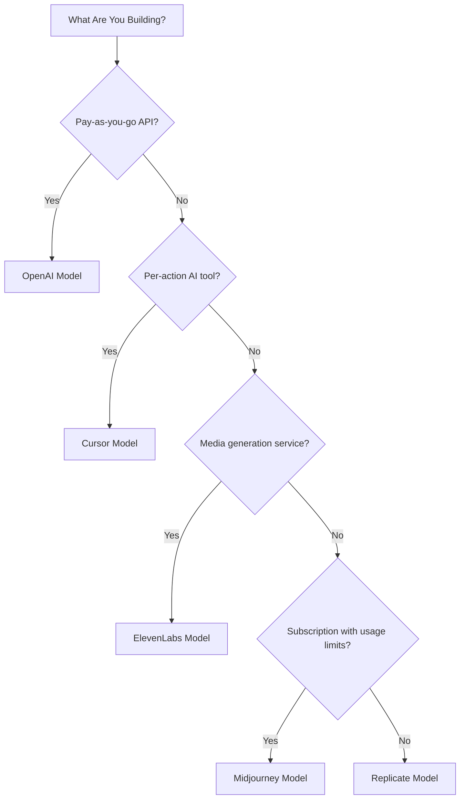

## De fem modellerna

| App | Primär metrisk | Unik innovation | Dodo-funktion |
| :--- | :--- | :--- | :--- |
| OpenAI | Token (i fiat-valuta) | Förbetalda fiat-krediter med balans som aldrig löper ut | Kreditbaserad fakturering (Fiat-krediter) |
| Cursor | Premiumförfrågningar | Modellviktad kreditförbrukning (olika kostnader per modell) | Kreditbaserad fakturering (Anpassad enhet) |
| ElevenLabs | Tecken | Teckenkvoter med överföring + flerstegsöverpris | Kreditbaserad fakturering (Överföring + Överpris) |
| Midjourney | GPU-tid | "Relax-läge" obegränsade fallback efter kvot | Prenumeration + användningsmätare |
| Replicate | Exekveringssekunder | Hårdvaruspecifik ren mätning per sekund | Ren användningsbaserad fakturering |

## Förstå kreditmönster

| Mönster | Exempel | Dodo-funktion | Enhetstyp |
| :--- | :--- | :--- | :--- |
| Förbetalda fiat-krediter | OpenAI API (5 USD kreditpåfyllning, ingen uttagning) | Kreditbaserad fakturering (Fiat-krediter) | Dollar denominerade virtuella enheter |
| Virtuella användningskrediter | Cursor Premium Requests, ElevenLabs Characters | Kreditbaserad fakturering (Anpassad enhet) | Godtyckliga enheter (förfrågningar, tecken) |
| Ren konsumtionsmätning | Replicate per-sekunds fakturering | Användningsbaserad fakturering (Mätare) | Direkt mätning (sekunder, byte) |
| Prenumeration + mätt överpris | Midjourney Fast Hours med Relax fallback | Prenumeration + användningsmätare | Tidsbaserat med fri gräns |

<Info>
Fiat-krediter i Dodos kreditbaserade fakturering representerar plattformsdenominerade dollarmängder utan monetärt värde utanför ditt ekosystem. Kunder kan inte ta ut dem som kontanter.
</Info>

## Vilken modell bör du använda?

- Bygger en "pay-as-you-go" API-plattform: OpenAI-modellen (Fiat-krediter)
- Bygger ett AI-verktyg med pris per åtgärd: Cursor-modellen (Anpassade enhetskrediter)
- Bygger en mediegenereringstjänst: ElevenLabs-modellen (Överföringskrediter)
- Bygger en prenumerationstjänst med användningsgränser: Midjourney-modellen (Prenumeration + användningsmätare)
- Bygger en infrastruktur-/compute-plattform: Replicate-modellen (Ren mätning)

<CardGroup cols={2}>
  <Card title="OpenAI" icon="/images/logos/openai.svg" href="/developer-resources/billing-deconstructions/openai">
    Återskapa den tokenbaserade förbetalda kreditmodellen.
  </Card>
  <Card title="Cursor" icon="/images/logos/cursor.svg" href="/developer-resources/billing-deconstructions/cursor">
    Bygg modellviktade användningsgränser.
  </Card>
  <Card title="ElevenLabs" icon="/images/logos/elevenlabs.svg" href="/developer-resources/billing-deconstructions/elevenlabs">
    Implementera teckenkvoter med överföring och överpris.
  </Card>
  <Card title="Midjourney" icon="/images/logos/midjourney.svg" href="/developer-resources/billing-deconstructions/midjourney">
    Kombinera prenumerationer med användningsbaserad fallback.
  </Card>
  <Card title="Replicate" icon="/images/logos/replicate.svg" href="/developer-resources/billing-deconstructions/replicate">
    Sätt upp ren per-sekunds konsumtionsmätning.
  </Card>
</CardGroup>

## Dodo-funktioner

<CardGroup cols={2}>
  <Card title="Credit-Based Billing" href="/features/credit-based-billing">
    Hantera förbetalda krediter och virtuella enheter.
  </Card>
  <Card title="Usage-Based Billing" href="/features/usage-based-billing/introduction">
    Mät konsumtion i realtid.
  </Card>
  <Card title="Subscriptions" href="/features/subscription">
    Hantera återkommande fakturering och planhantering.
  </Card>
  <Card title="Hybrid Billing" href="/features/hybrid-billing">
    Kombinera flera faktureringsmodeller för maximal flexibilitet.
  </Card>
</CardGroup>

## Inmatningsplanscher

Varje dekonstruktion inkluderar integration med Dodos [Ingestion Blueprints](/features/usage-based-billing/ingestion-blueprints), färdigbyggda SDK:er som automatiskt hanterar händelsespårning. Istället för att manuellt konstruera användningshändelser, använd en plan för att få produktionsfärdig mätning på några minuter.

<CardGroup cols={3}>
  <Card title="LLM Blueprint" icon="brain-circuit" href="/developer-resources/ingestion-blueprints/llm">
    Automatisk tokenspårning för OpenAI, Anthropic, Groq och fler.
  </Card>
  <Card title="Stream Blueprint" icon="tower-broadcast" href="/developer-resources/ingestion-blueprints/stream">
    Spåra ljud- och videoströmmars bandbredd.
  </Card>
  <Card title="Time Range Blueprint" icon="clock" href="/developer-resources/ingestion-blueprints/time-range">
    Fakturera per beräkningstid ner till millisekunden.
  </Card>
</CardGroup>
