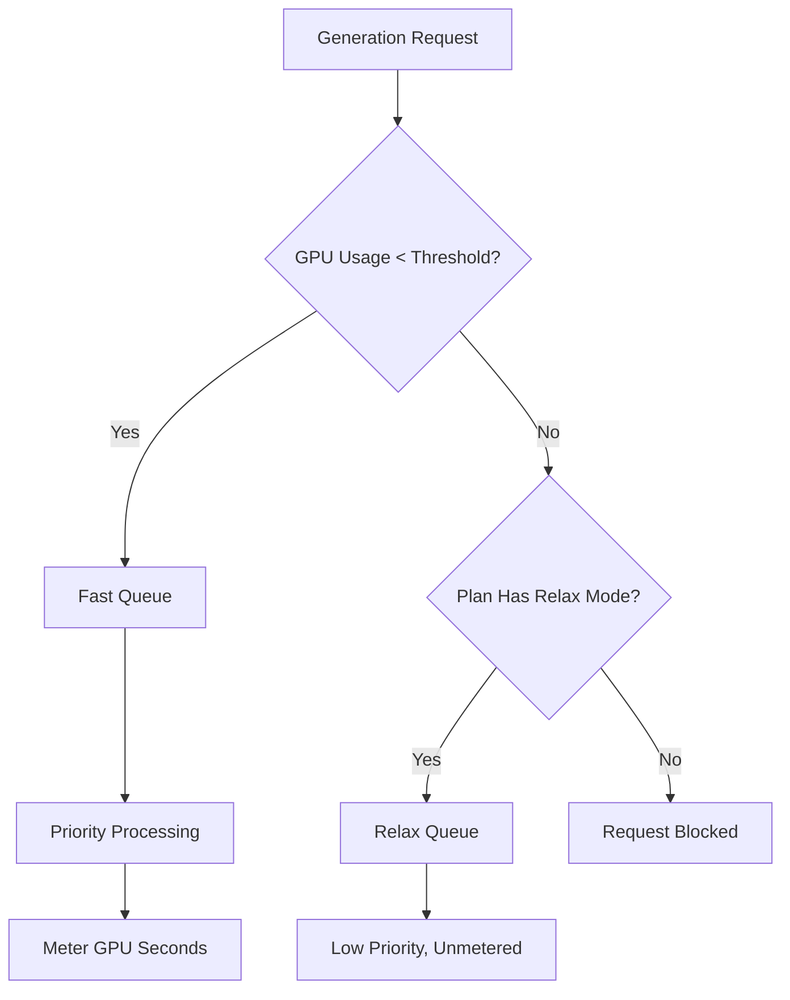

Midjourney är en generativ AI-plattform som använder en unik faktureringsmodell baserad på GPU-tid snarare än ett enkelt bildantal. Denna metod säkerställer att komplexa, högupplösta renderingar kostar mer än snabba, lågupplösta utkast.

## How Midjourney Bills

Midjourneys prenumerationsplaner ger användare ett visst antal "Fast GPU Hours" varje månad. Dessa timmar representerar den faktiska beräkningstiden som används för dina generationer.

| Plan | Pris | Fast GPU Hours | Relax Mode | Stealth Mode |
| :--- | :--- | :--- | :--- | :--- |
| Basic | \$10/month | ~3.3 hrs | No | No |
| Standard | \$30/month | 15 hrs | Unlimited | No |
| Pro | \$60/month | 30 hrs | Unlimited | Yes |
| Mega | \$120/month | 60 hrs | Unlimited | Yes |

1. **Pricing Tiers**: Midjourney erbjuder fyra prenumerationsnivåer från \$10 till \$120 per månad, där varje nivå ger ett fast antal Fast GPU-timmar.
2. **Relax Mode**: Standard- och högre planer inkluderar obegränsade generationer via en lågprioriterad kö när Fast-timmar är slut, vilket säkerställer att användare aldrig stöter på en hård gräns.
3. **Extra GPU Hours**: Användare kan köpa ytterligare Fast GPU-tid för ungefär \$4 per timme om de behöver omedelbara resultat efter att ha uttömt sin månatliga kvot.
4. **Metering in GPU Seconds**: Användningen spåras av den faktiska beräkningstiden som spenderas på generationer, vilket innebär att komplexa renderingar kostar mer än enkla utkast.
5. **Community Loop**: Aktiva användare kan tjäna bonus GPU-timmar genom att betygsätta bilder i galleriet, vilket hjälper till att träna modeller samtidigt som det belönar communityn.
## What Makes It Unique

Midjourney-modellen är effektiv eftersom den kopplar kostnad till värde och resursanvändning.

* **GPU-time billing** kopplar kostnad till resursanvändning och säkerställer att komplexa renderingar prissätts rätt jämfört med enkla utkast.
* **Relax Mode** erbjuder en obegränsad fallback som minskar churn genom att upprätthålla åtkomst till tjänsten även efter att månatliga gränser nåtts.
* **The Fast vs Relax split** uppmuntrar uppgraderingar genom att erbjuda prioriterad bearbetning för användare som värdesätter snabbhet och omedelbara resultat.
* **Extra GPU Hours** ger ett flexibelt påfyllningsalternativ för kraftanvändare som behöver extra högprioriterad kapacitet mitt i månaden.

## Build This with Dodo Payments

Du kan replikera denna modell med Dodo Payments genom att kombinera prenumerationer med nyttomätare och logik på applikationsnivå.

<Steps>

<Step title="Create a Usage Meter">

Först skapar du en mätare för att spåra GPU-sekunderna som varje kund använder.

* **Meter name**: `gpu.fast_seconds`
* **Aggregation**: **Sum** (summerar `gpu_seconds` egenskap från varje händelse)

Du kommer endast att spåra händelser där generationsläget är "fast". Relax mode-generationer mäts inte för faktureringsändamål.

</Step>

<Step title="Create Subscription Products with Usage Pricing">

Skapa dina prenumerationsprodukter och koppla nyttomätaren med ett gratis tröskelvärde.

| Product | Base Price | Free Threshold (seconds) | Overage Rate |
| :--- | :--- | :--- | :--- |
| Basic | \$10/month | 12,000 (3.3 hrs) | N/A (Hard Cap) |
| Standard | \$30/month | 54,000 (15 hrs) | \$0.00 (Relax Mode) |
| Pro | \$60/month | 108,000 (30 hrs) | \$0.00 (Relax Mode) |
| Mega | \$120/month | 216,000 (60 hrs) | \$0.00 (Relax Mode) |

För Basic-planen kommer du att inaktivera överskridande för att upprätthålla en hård gräns. För de andra planerna hanteras "Relax Mode" av din applikationslogik när mätaren visar att tröskeln överskrids.

</Step>

<Step title="Implement Application-Level Relax Mode">

Insikten är att Relax Mode inte är en faktureringsfunktion. Det är din applikation som dirigerar förfrågningar till en långsammare kö när Dodo-nytto mätaren visar att tröskeln nåtts.

```typescript
async function handleGenerationRequest(customerId: string, prompt: string) {
  const usage = await getCustomerUsage(customerId, 'gpu.fast_seconds');
  const subscription = await getSubscription(customerId);
  const threshold = getThresholdForPlan(subscription.product_id);
  
  if (usage.current >= threshold) {
    if (subscription.product_id === 'prod_basic') {
      throw new Error('Fast GPU hours exhausted. Upgrade to Standard for Relax Mode.');
    }
    
    // Relax Mode. Route to low-priority queue
    return await queueGeneration(customerId, prompt, {
      priority: 'low',
      mode: 'relax',
      model: 'standard'
    });
  }
  
  // Fast Mode. Priority processing
  return await queueGeneration(customerId, prompt, {
    priority: 'high',
    mode: 'fast',
    model: 'premium'
  });
}
```

</Step>

<Step title="Send Usage Events (Fast Mode Only)">

Skicka endast nyttjandehändelser till Dodo när en generation utförs i Fast-läge.

```typescript
import DodoPayments from 'dodopayments';

async function trackFastGeneration(customerId: string, gpuSeconds: number, jobId: string) {
  // Only track Fast mode generations. Relax mode is free and unlimited
  const client = new DodoPayments({
    bearerToken: process.env.DODO_PAYMENTS_API_KEY,
  });

  await client.usageEvents.ingest({
    events: [{
      event_id: `gen_${jobId}`,
      customer_id: customerId,
      event_name: 'gpu.fast_seconds',
      timestamp: new Date().toISOString(),
      metadata: {
        gpu_seconds: gpuSeconds,
        resolution: '1024x1024',
        mode: 'fast'
      }
    }]
  });
}
```

</Step>

<Step title="Sell Extra Fast Hours (One-Time Top-Up)">

Skapa en engångsbetalningsprodukt för "Extra Fast GPU Hour" för \$4. När en kund köper detta kan du ge ytterligare tröskel eller krediter i din applikation.

```typescript
// After customer purchases extra hours
const session = await client.checkoutSessions.create({
  product_cart: [
    { product_id: 'prod_extra_gpu_hour', quantity: 5 }
  ],
  customer: { customer_id: customerId },
  return_url: 'https://yourapp.com/dashboard'
});
```

</Step>

<Step title="Create Checkout for Subscription">

Slutligen skapar du en checkout-session för prenumerationsplanen.

```typescript
const session = await client.checkoutSessions.create({
  product_cart: [
    { product_id: 'prod_mj_standard', quantity: 1 }
  ],
  customer: { email: 'artist@example.com' },
  return_url: 'https://yourapp.com/studio'
});
```

</Step>

</Steps>

## Accelerate with the Time Range Ingestion Blueprint

The [Time Range Ingestion Blueprint](/developer-resources/ingestion-blueprints/time-range) förenklar GPU-tidsspårning genom att tillhandahålla dedikerade hjälpfunktioner för varaktighetsbaserad fakturering.

```bash
npm install @dodopayments/ingestion-blueprints
```

```typescript
import { Ingestion, trackTimeRange } from '@dodopayments/ingestion-blueprints';

const ingestion = new Ingestion({
  apiKey: process.env.DODO_PAYMENTS_API_KEY,
  environment: 'live_mode',
  eventName: 'gpu.fast_seconds',
});

// Track generation time after a Fast mode job completes
const startTime = Date.now();
const result = await runGeneration(prompt, settings);
const durationMs = Date.now() - startTime;

await trackTimeRange(ingestion, {
  customerId: customerId,
  durationMs: durationMs,
  metadata: {
    mode: 'fast',
    resolution: '1024x1024',
  },
});
```

Blueprinten hanterar varaktighetskonvertering och händelseformatering. Du behöver bara tillhandahålla kund-ID och förfluten tid.

<Tip>
Time Range Blueprint stöder millisekunder, sekunder och minuter. Se [full blueprint documentation](/developer-resources/ingestion-blueprints/time-range) för alla varaktighetsalternativ och bästa praxis.
</Tip>

## The Fast vs Relax Architecture

Det dubbla kö-systemet fungerar genom att dirigera förfrågningar baserat på det aktuella användningsläget.



1. Alla förfrågningar går genom din applikation.
2. Applikationen jämför Dodo-nytto mätaren med planens fria tröskel.
3. Om användningen är under tröskeln går förfrågan till Fast-kön och mäts.
4. Om användningen är över tröskeln går förfrågan till Relax-kön, som inte mäts och har lägre prioritet.
5. Basic-planen har ingen Relax-fallback, så förfrågningar blockeras när gränsen nås.

<Info>
Relax Mode är ett mönster på applikationsnivå, inte en Dodo-faktureringsfunktion. Dodo spårar din Fast GPU-användning och säger till dig när tröskeln överskrids. Din applikation avgör om du blockerar användaren eller dirigerar dem till en långsammare kö.
</Info>

## Key Dodo Features Used

<CardGroup cols={2}>
  <Card title="Subscriptions" icon="calendar" href="/features/subscription">
    Hantera återkommande fakturering och planlager.
  </Card>
  <Card title="Usage-Based Billing" icon="bolt" href="/features/usage-based-billing/introduction">
    Spåra och fakturera baserat på faktisk resursförbrukning.
  </Card>
  <Card title="Event Ingestion" icon="input-pipe" href="/features/usage-based-billing/event-ingestion">
    Skicka högvolyms nyttjandehändelser till Dodo API.
  </Card>
  <Card title="Meters" icon="gauge" href="/features/usage-based-billing/meters">
    Definiera hur nyttjandehändelser aggregeras och faktureras.
  </Card>
  <Card title="One-Time Payments" icon="credit-card" href="/features/one-time-payment-products">
    Sälj extra timmar eller påfyllningar som engångsköp.
  </Card>
  <Card title="Time Range Blueprint" icon="clock" href="/developer-resources/ingestion-blueprints/time-range">
    Förenklad GPU-tidsspårning med varaktighetsbaserade hjälpfunktioner.
  </Card>
</CardGroup>
