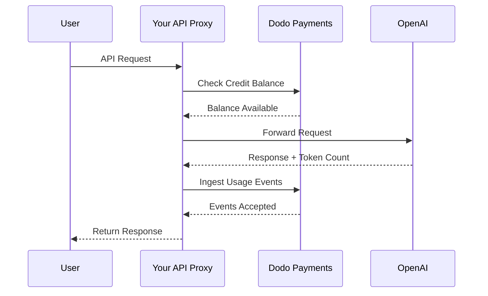
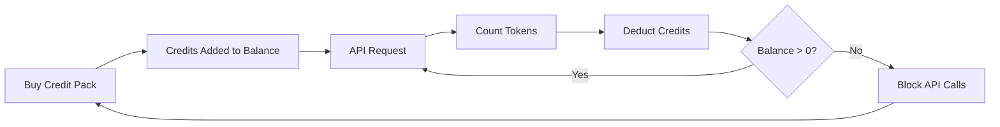

OpenAI:s faktureringsmodell är guldstandarden för AI-företag. Den kombinerar förbetalda fiat-krediter för API-användning med fasta abonnemangsavgifter för konsumentprodukter. Detta hybrida tillvägagångssätt säkerställer förutsägbara intäkter samtidigt som utvecklare kan skala sin användning utan friktion.

## Varför OpenAI:s modell är standarden

AI-branschen står inför unika utmaningar som traditionell SaaS-fakturering inte alltid tar itu med. OpenAI:s modell löser flera av dessa problem samtidigt.

1. **Förutsägbara intäkter och låg risk**: Genom att kräva förbetalda krediter för API-användning eliminerar OpenAI risken att användare drar på sig enorma räkningar som de inte kan betala. Du får pengarna i förväg, och användaren får tjänsten medan de använder den.
2. **Skalbarhet för utvecklare**: En \$5-påfyllning är en låg tröskel för inträde. När deras applikation växer kan utvecklare automatisera påfyllningar eller köpa större paket. Friktionen att komma igång är nästan obefintlig, men tillväxttaket är obegränsat.
3. **Användarpsykologi**: Att denomera krediter i fiatvaluta (USD) istället för abstrakta "tokens" eller "poäng" gör värdet tydligt. Det känns som ett bankkonto för AI-tjänster, vilket bygger förtroende och gör budgetering enklare för företag.

## Hur OpenAI fakturerar

OpenAI driver två skilda faktureringsmodeller som möter olika användarbehov.

1. **API (Pay-as-you-go)**: API:et använder förbetalda krediter denominerade i fiat. Användare fyller på sina konton med \$5, \$10, \$50 eller mer. Dessa krediter visar ett dollartal men har inget monetärt värde utanför OpenAI. OpenAI fakturerar per token med olika priser för in- och utgående tokens. Krediterna går aldrig ut, och när en användares saldo når \$0 misslyckas deras API-anrop omedelbart.
2. **ChatGPT Plus, Team och Enterprise**: Det här är fastprisabonnemang. ChatGPT Plus kostar \$20 per månad, medan Team-planen är \$25 per användare per månad. Dessa planer har mjuka användningsgränser där användare nedgraderas till en mindre modell istället för att blockeras.
3. **Prisnivåer baserade på spendering**: Ju mer du spenderar totalt över tid, desto högre API-gränser låses upp. Detta är ett förtroendebaserat skalningssystem som är direkt kopplat till din faktureringshistorik.

| Modell | Prissättning | Ingående tokens | Utgående tokens |
| :--- | :--- | :--- | :--- |
| GPT-4o | Användningsbaserad | \$2.50 / 1M | \$10.00 / 1M |
| GPT-4o-mini | Användningsbaserad | \$0.15 / 1M | \$0.60 / 1M |
| o1 | Användningsbaserad | \$15.00 / 1M | \$60.00 / 1M |

| Plan | Pris | Typ |
| :--- | :--- | :--- |
| Free | \$0 | Begränsad åtkomst |
| Plus | \$20 / mo | Prenumeration med mjuka gränser |
| Team | \$25 / user / mo | Prenumeration per plats |
| Enterprise | Anpassad | Fakturering |

OpenAI:s faktureringsstrategi har flera nyckelkaraktäristika som gör den effektiv för AI-tjänster.

- **Fiat-denominerade krediter**: Krediter känns som pengar eftersom de denomineras i USD. Detta gör prissättningen transparent och lätt att förstå för utvecklare.
- **Ingen utgångsdag**: Salden som aldrig löper ut minskar trycket att "använd annars förlorar du det". Användare känner sig trygga med att fylla på större belopp eftersom de vet att värdet inte försvinner.
- **Multidimensionell mätning**: Ingående och utgående tokens spåras separat men dras från samma kreditsaldo. Detta gör det möjligt för OpenAI att prissätta dyra utgående tokens annorlunda än billigare ingående tokens.
- **Förtroendenivåer**: Genom att koppla gränser för rate limits till total spendering uppmuntras användare att stanna kvar på plattformen och belönas långsiktiga kunder med bättre prestanda.

## Strategiska fördelar

## Bygg detta med Dodo Payments

Du kan replikera OpenAI:s faktureringsmodell med Dodo Payments. Vi använder Credit-Based Billing för API:et och standardabonnemang för ChatGPT Plus-sidan.

<Steps>
  <Step title="Create a Fiat Credit Entitlement">
    Börja med att skapa en kreditberättigande i din Dodo Payments-instrumentpanel. Detta kommer att fungera som det centrala saldot för dina användare.

    * **Credit Type:** Fiat Credits (USD)
    * **Credit Expiry:** Aldrig
    * **Rollover:** Inte nödvändigt (eftersom de aldrig går ut)
    * **Overage:** Avaktiverat

    Att stänga av overage säkerställer att API-anrop misslyckas när saldot når \$0, precis som OpenAI.
  </Step>

  <Step title="Create Top-Up Products">
    Skapa engångsbetalningsprodukter för olika kreditpaket. Du kan erbjuda \$5, \$10, \$50 och \$100 alternativ. Koppla din fiatkreditberättigande till varje produkt.

    Ställ in antalet utfärdade krediter per produkt i cent. För ett \$50-paket utfärdar du 5000 krediter.

    ```typescript
    import DodoPayments from 'dodopayments';

    const client = new DodoPayments({
      bearerToken: process.env.DODO_PAYMENTS_API_KEY,
    });

    const session = await client.checkoutSessions.create({
      product_cart: [
        { product_id: 'prod_credit_pack_50', quantity: 1 }
      ],
      customer: { email: 'developer@example.com' },
      return_url: 'https://yourapp.com/dashboard'
    });
    ```

  </Step>

  <Step title="Create Usage Meters">
    Skapa två separata mätare för att spåra tokenanvändning.

    * `llm.input_tokens`: Summaaggregation på egenskapen `tokens`.

    * `llm.output_tokens`: Summaaggregation på egenskapen `tokens`.

    Koppla båda mätarna till din fiatkreditberättigande. Du behöver konfigurera "Meter units per credit" för varje.

    ### Beräkna meter-enheter per kredit

    För att matcha OpenAI:s GPT-4o-prissättning (\$2.50 per 1M ingående tokens) måste du räkna ut hur många tokens som motsvarar \$1 (100 cent).

    * **Input Tokens:** 1,000,000 tokens / \$2.50 = 400,000 tokens per \$1.
    * **Output Tokens:** 1,000,000 tokens / \$10.00 = 100,000 tokens per \$1.

    I Dodo-instrumentpanelen skulle du ställa in "Meter units per credit" till 400,000 för ingående och 100,000 för utgående.
  </Step>

    ```typescript
    await client.usageEvents.ingest({
      events: [{
        event_id: `req_${requestId}`,
        customer_id: customerId,
        event_name: 'llm.input_tokens',
        timestamp: new Date().toISOString(),
        metadata: {
          model: 'gpt-4o',
          tokens: 1500
        }
      }, {
        event_id: `req_${requestId}_out`,
        customer_id: customerId,
        event_name: 'llm.output_tokens',
        timestamp: new Date().toISOString(),
        metadata: {
          model: 'gpt-4o',
          tokens: 800
        }
      }]
    });
    ```

  </Step>

  <Step title="Handle Balance Depletion">
    Du bör kontrollera användarens saldo innan du behandlar en API-förfrågan. Om saldot är noll eller negativt, returnera ett 402-fel.

    ```typescript
    async function checkCreditsBeforeRequest(customerId: string) {
      const balance = await client.creditEntitlements.balances.retrieve(customerId, {
        credit_entitlement_id: 'credit_entitlement_id',
      });

      if (balance.available <= 0) {
        throw new Error('Insufficient credits. Please top up your account.');
      }
    }
    ```

    ### Hantera webhooks vid lågt saldo

    Vänta inte tills användaren når \$0 för att meddela dem. Använd webhooks för att trigga ett e-postmeddelande eller en notis i appen när deras saldo sjunker under en viss nivå.

    ```typescript
    import DodoPayments from 'dodopayments';
    import express from 'express';

    const app = express();
    app.use(express.raw({ type: 'application/json' }));

    const client = new DodoPayments({
      bearerToken: process.env.DODO_PAYMENTS_API_KEY,
      webhookKey: process.env.DODO_PAYMENTS_WEBHOOK_KEY,
    });

    app.post('/webhooks/dodo', async (req, res) => {
      try {
        const event = client.webhooks.unwrap(req.body.toString(), {
          headers: {
            'webhook-id': req.headers['webhook-id'] as string,
            'webhook-signature': req.headers['webhook-signature'] as string,
            'webhook-timestamp': req.headers['webhook-timestamp'] as string,
          },
        });

        if (event.type === 'credit.balance_low') {
          const { customer_id, available_balance } = event.data;
          await sendLowBalanceEmail(customer_id, available_balance);
        }

        res.json({ received: true });
      } catch (error) {
        res.status(401).json({ error: 'Invalid signature' });
      }
    });
    ```

    <Tip>
      OpenAI skickar dessa e-postmeddelanden när en användares saldo nästan är slut, vilket ger dem tid att fylla på utan att tjänsten avbryts.
    </Tip>
  </Step>

  <Step title="Build the ChatGPT Subscription Side (Optional)">
    Om du vill erbjuda en prenumerationsplan som ChatGPT Plus, skapa en separat prenumerationsprodukt i Dodo Payments. Dessa behöver inga kreditberättiganden.

    För en Team-plan, använd platsbaserad fakturering genom att lägga till tillägg för varje extra användare.

    ```typescript
    const session = await client.checkoutSessions.create({
      product_cart: [
        { product_id: 'prod_plus_subscription', quantity: 1 }
      ],
      customer: { email: 'user@example.com' },
      return_url: 'https://yourapp.com/billing'
    });
    ```

    ### Implementera mjuka gränser

    För att replikera OpenAI:s mjuka gränser kan du spåra användningen för dina prenumerationsanvändare med samma mätare, men utan att länka dem till ett kreditberättigande. I din applikationslogik kontrollerar du användningen för den aktuella faktureringsperioden.

    ```typescript
    async function checkSubscriptionUsage(customerId: string) {
      const usage = await getUsageForCurrentPeriod(customerId);
      
      if (usage > SOFT_CAP_THRESHOLD) {
        // Route to a smaller model instead of blocking
        return 'gpt-4o-mini';
      }
      
      return 'gpt-4o';
    }
    ```

  </Step>
</Steps>

## Accelerera med LLM Ingestion Blueprint

Stegen ovan visar hur du manuellt bygger och skickar användningshändelser. För produktionsdistribueringar erbjuder [LLM Ingestion Blueprint](/developer-resources/ingestion-blueprints/llm) automatisk tokenspårning som omsluter din OpenAI-klient direkt.

```bash
npm install @dodopayments/ingestion-blueprints
```

```typescript
import { createLLMTracker } from '@dodopayments/ingestion-blueprints';
import OpenAI from 'openai';

const openai = new OpenAI({ apiKey: process.env.OPENAI_API_KEY });

const tracker = createLLMTracker({
  apiKey: process.env.DODO_PAYMENTS_API_KEY,
  environment: 'live_mode',
  eventName: 'llm.chat_completion',
});

const trackedClient = tracker.wrap({
  client: openai,
  customerId: customerId,
});

// Every API call now automatically tracks token usage
const response = await trackedClient.chat.completions.create({
  model: 'gpt-4o',
  messages: [{ role: 'user', content: prompt }],
});

// inputTokens, outputTokens, and totalTokens are sent automatically
console.log('Tokens used:', response.usage);
```

Blueprinten fångar `inputTokens`, `outputTokens` och `totalTokens` från varje API-svar och skickar dem som evenemangsmetadata. Konfigurera din mätare för att aggregera på rätt token-egenskap.

<Tip>
LLM Blueprint stöder OpenAI, Anthropic, Groq, Google Gemini, OpenRouter och Vercel AI SDK. Se den [fullständiga blueprint-dokumentationen](/developer-resources/ingestion-blueprints/llm) för leverantörsspecifika exempel och avancerad konfiguration.
</Tip>

## Implementera spenderingsbaserade prisnivåer

OpenAI:s prisnivåer är ett kraftfullt sätt att hantera kapacitet. Du kan implementera detta genom att spåra en kunds totala livstidsutgifter.

1. **Track Lifetime Spend:** Lyssna på `payment.succeeded` webhooks och uppdatera fältet `total_spend` i din databas för den kunden.
2. **Define Tiers:** Skapa en avbildning mellan spenderingsbelopp och rate limits.
   * Nivå 1: \$0 - \$50 spenderat -> 3 RPM
   * Nivå 2: \$50 - \$250 spenderat -> 10 RPM
   * Nivå 3: \$250+ spenderat -> 50 RPM
3. **Enforce Limits:** I din API-middleware kontrollerar du kundens nivå och tillämpar motsvarande rate limit.

```typescript
async function getRateLimitForCustomer(customerId: string) {
  const customer = await db.customers.findUnique({ where: { id: customerId } });
  const totalSpend = customer.total_spend;

  if (totalSpend >= 25000) return TIER_3_LIMITS; // $250.00
  if (totalSpend >= 5000) return TIER_2_LIMITS;  // $50.00
  return TIER_1_LIMITS;
}
```

## Fullständigt implementeringsexempel: API-proxyn

I ett verkligt scenario kommer du sannolikt att ha en API-proxy som sitter mellan dina användare och LLM-leverantören. Denna proxy hanterar autentisering, kreditkontroller och användningsrapportering.



```typescript
import DodoPayments from 'dodopayments';
import OpenAI from 'openai';

const client = new DodoPayments({
  bearerToken: process.env.DODO_PAYMENTS_API_KEY,
});
const openai = new OpenAI({ apiKey: process.env.OPENAI_API_KEY });

export async function handleApiRequest(req, res) {
  const { customerId, prompt, model } = req.body;

  try {
    // 1. Check credit balance
    const balance = await client.creditEntitlements.balances.retrieve(customerId, {
      credit_entitlement_id: 'credit_entitlement_id',
    });

    if (balance.available <= 0) {
      return res.status(402).json({ error: 'Insufficient credits. Please top up.' });
    }

    // 2. Call OpenAI
    const completion = await openai.chat.completions.create({
      model: model,
      messages: [{ role: 'user', content: prompt }],
    });

    const { prompt_tokens, completion_tokens } = completion.usage;

    // 3. Ingest usage events to Dodo
    await client.usageEvents.ingest({
      events: [
        {
          event_id: `req_${completion.id}_in`,
          customer_id: customerId,
          event_name: 'llm.input_tokens',
          timestamp: new Date().toISOString(),
          metadata: { model, tokens: prompt_tokens }
        },
        {
          event_id: `req_${completion.id}_out`,
          customer_id: customerId,
          event_name: 'llm.output_tokens',
          timestamp: new Date().toISOString(),
          metadata: { model, tokens: completion_tokens }
        }
      ]
    });

    // 4. Return response to user
    res.json(completion);

  } catch (error) {
    console.error('API Error:', error);
    res.status(500).json({ error: 'Internal server error' });
  }
}
```

## Hantera hörnfall

När du bygger ett faktureringssystem lika komplext som OpenAI:s kommer du att stöta på flera hörnfall som kräver omsorg.

### Race Conditions

Om en användare har ett mycket lågt saldo och skickar flera förfrågningar samtidigt kan de överskrida sin kreditgräns innan den första händelsen har bearbetats. För att förhindra detta kan du införa en liten "buffert" eller använda ett distribuerat lås på kundens saldo under förfrågan.

### Event Ingestion Latency

Dodo Payments bearbetar händelser asynkront. Det betyder att det kan bli en liten fördröjning mellan ett API-anrop och kreditavdraget. För de flesta användningsfall är detta acceptabelt. Om du behöver strikt realtidsreglering kan du behålla en lokal cache över användarens saldo och uppdatera den optimistiskt.

### Refund Handling

Om du återbetalar ett kreditpaket kommer Dodo Payments automatiskt hantera kreditberättigandet om det är konfigurerat. Du bör dock säkerställa att din applikationslogik återspeglar denna förändring omedelbart för att förhindra att användare använder krediter som de inte längre har.

### Multi-Model Support

Om du stödjer flera modeller med olika prissättning har du två alternativ:
1. **Separate Meters:** Skapa separata mätare för varje modell (t.ex., `gpt-4o.input_tokens`, `gpt-4o-mini.input_tokens`).
2. **Weighted Events:** Använd en enda mätare men multiplicera `tokens`-värdet med en vikt innan du skickar det till Dodo. Till exempel, om GPT-4o är 10x dyrare än GPT-4o-mini, kan du skicka 10x tokens för GPT-4o-förfrågningar.

OpenAI använder det separata mätarupplägget internt för att hålla tydliga register över användning per modell.

## Arkitekturöversikt



Mätarna spårar tokens och drar av motsvarande värde från användarens kreditsaldo baserat på dina konfigurerade priser.

## Slutsats

Att replikera OpenAI:s faktureringsmodell med Dodo Payments ger dig det bästa av två världar: flexibiliteten i användningsbaserad fakturering och förutsägbarheten i förbetalda krediter. Genom att följa den här guiden kan du bygga ett faktureringssystem som skalar med dina användare samtidigt som dina marginaler skyddas.

Oavsett om du bygger nästa stora LLM eller ett nischat AI-verktyg kommer dessa mönster hjälpa dig skapa en professionell, utvecklarvänlig upplevelse. Detta tillvägagångssätt säkerställer att din faktureringsinfrastruktur är lika skalbar och pålitlig som de AI-modeller du levererar till dina kunder.

## Viktiga Dodo-funktioner som används

Utforska funktionerna som gör denna implementation möjlig.

<CardGroup cols={2}>
  <Card title="Credit-Based Billing" icon="coins" href="/features/credit-based-billing">
    Hantera förbetalda fiatkrediter och berättiganden för dina användare.
  </Card>
  <Card title="Usage-Based Billing" icon="chart-line" href="/features/usage-based-billing/introduction">
    Spåra detaljerad användning som tokens och fakturera det i realtid.
  </Card>
  <Card title="One-Time Payments" icon="credit-card" href="/features/one-time-payment-products">
    Sälj kreditpaket och påfyllningar med ett enkelt checkoutflöde.
  </Card>
  <Card title="Event Ingestion" icon="bolt" href="/features/usage-based-billing/event-ingestion">
    Skicka högvolymsanvändningsdata till Dodo Payments med lätthet.
  </Card>
  <Card title="Webhooks" icon="webhook" href="/developer-resources/webhooks/intents/credit">
    Håll dig uppdaterad om ändringar i kreditbalansen och varningar vid lågt saldo.
  </Card>
  <Card title="LLM Ingestion Blueprint" icon="brain-circuit" href="/developer-resources/ingestion-blueprints/llm">
    Automatisk tokenspårning för OpenAI och andra LLM-leverantörer.
  </Card>
</CardGroup>
