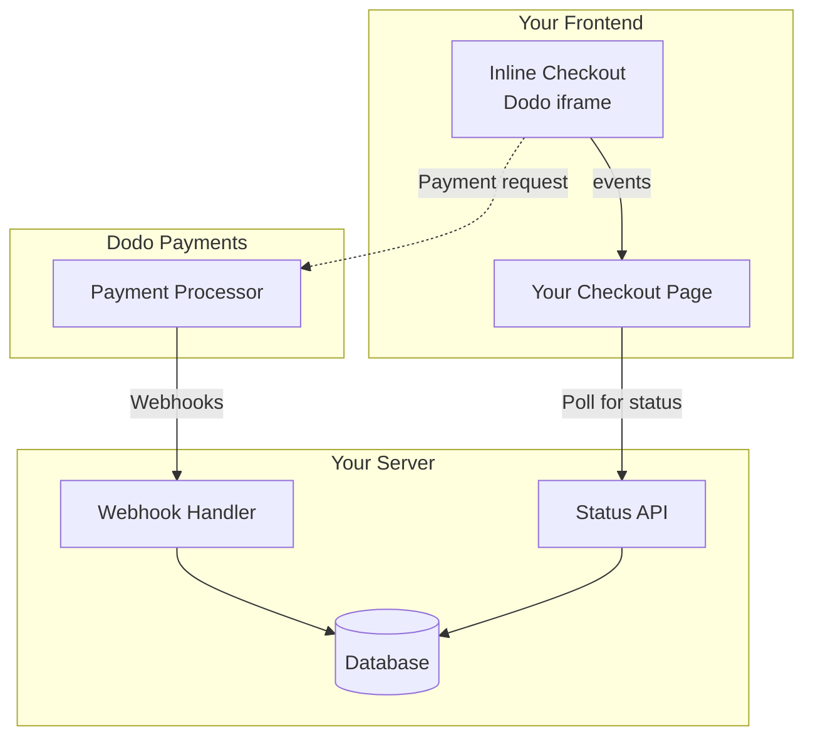

## Översikt

Inline checkout låter dig skapa fullt integrerade checkout-upplevelser som smälter samman med din webbplats eller applikation. Till skillnad från [overlay checkout](/developer-resources/overlay-checkout), som öppnas som en modal ovanpå din sida, integrerar inline checkout betalningsformuläret direkt i din sidlayout.

Med inline checkout kan du:

- Skapa checkout-upplevelser som är helt integrerade med din app eller webbplats
- Låta Dodo Payments säkert fånga kund- och betalningsinformation i en optimerad checkout-ram
- Visa artiklar, totalsummor och annan information från Dodo Payments på din sida
- Använda SDK-metoder och händelser för att bygga avancerade checkout-upplevelser

<Frame>
    
</Frame>

## Hur Det Fungerar

Inline checkout fungerar genom att integrera en säker Dodo Payments-ram i din webbplats eller app.

Checkout-ramen hanterar insamling av kundinformation och fångar betalningsdetaljer. Din sida visar artikellistan, totalsummor och alternativ för att ändra vad som finns i checkout. SDK:n låter din sida och checkout-ramen interagera med varandra.

Dodo Payments skapar automatiskt en prenumeration när en checkout är klar, redo för dig att tillhandahålla.

<Note>
Inline checkout-ramen hanterar säkert all känslig betalningsinformation och säkerställer PCI-efterlevnad utan ytterligare certifiering från din sida.
</Note>

## Vad Gör En Bra Inline Checkout?

Det är viktigt att kunderna vet vem de köper från, vad de köper och hur mycket de betalar.

För att bygga en inline checkout som är efterlevande och optimerad för konvertering måste din implementation inkludera:

<Frame caption="Example inline checkout layout showing required elements">
    
</Frame>

1. **Återkommande information**: Om det är återkommande, hur ofta det återkommer och den totala summan att betala vid förnyelse. Om det är en provperiod, hur länge provperioden varar.
2. **Artikelbeskrivningar**: En beskrivning av vad som köps.
3. **Transaktionstotalsummor**: Transaktionstotalsummor, inklusive delsumma, total skatt och grand total. Se till att inkludera valutan också.
4. **Dodo Payments-fotnot**: Den fullständiga inline checkout-ramen, inklusive checkout-fotnoten som har information om Dodo Payments, våra försäljningsvillkor och vår integritetspolicy.
5. **Återbetalningspolicy**: En länk till din återbetalningspolicy, om den skiljer sig från Dodo Payments standardåterbetalningspolicy.

<Warning>
Visa alltid den kompletta inline checkout-ramen, inklusive sidfoten. Att ta bort eller dölja juridisk information bryter mot efterlevnadskrav.
</Warning>

## Kundresa

Checkout-flödet bestäms av din checkout-sessionkonfiguration. Beroende på hur du konfigurerar checkout-sessionen kommer kunderna att uppleva en checkout som kan presentera all information på en enda sida eller över flera steg.

<Steps>
<Step title="Customer opens checkout">

Du kan öppna inline checkout genom att skicka varor eller en befintlig transaktion. Använd SDK:n för att visa och uppdatera information på sidan, och SDK-metoder för att uppdatera varor baserat på kundinteraktion.
    

</Step>

<Step title="Customer enters their details">

Inline checkout ber först kunderna att ange sin e-postadress, välja sitt land och (där det krävs) ange sitt postnummer. Detta steg samlar all nödvändig information för att bestämma skatter och tillgängliga betalningsalternativ.

Du kan förfylla kunduppgifter och presentera sparade adresser för att effektivisera upplevelsen.

</Step>

<Step title="Customer selects payment method">

Efter att ha angett sina uppgifter presenteras kunderna med tillgängliga betalningsmetoder och betalningsformuläret. Alternativ kan inkludera kredit- eller betalkort, PayPal, Apple Pay, Google Pay och andra lokala betalningsmetoder baserat på deras plats.

Visa sparade betalningsmetoder om de finns tillgängliga för att snabba upp checkout.


</Step>

<Step title="Checkout completed">

Dodo Payments dirigerar varje betalning till den bästa förvärvaren för den försäljningen för att få bästa möjliga chans till framgång. Kunderna går in i ett framgångsflöde som du kan bygga.


</Step>

<Step title="Dodo Payments creates subscription">

Dodo Payments skapar automatiskt en prenumeration för kunden, redo för dig att tillhandahålla. Betalningsmetoden som kunden använde hålls på fil för förnyelser eller ändringar av prenumerationen.


</Step>
</Steps>

## Snabbstart

Kom igång med Dodo Payments Inline Checkout på bara några rader kod:

```typescript
import { DodoPayments } from "dodopayments-checkout";

// Initialize the SDK for inline mode
DodoPayments.Initialize({
  mode: "test",
  displayType: "inline",
  onEvent: (event) => {
    console.log("Checkout event:", event);
  },
});

// Open checkout in a specific container
DodoPayments.Checkout.open({
  checkoutUrl: "https://test.dodopayments.com/session/cks_123",
  elementId: "dodo-inline-checkout" // ID of the container element
});
```

<Tip>
Se till att du har ett container-element med motsvarande `id` på din sida: `<div id="dodo-inline-checkout"></div>`.
</Tip>

## Steg-för-steg Integrationsguide

<Steps>
<Step title="Install the SDK">

Installera Dodo Payments Checkout SDK:

<CodeGroup>

```bash npm
npm install dodopayments-checkout
```

```bash yarn
yarn add dodopayments-checkout
```

```bash pnpm
pnpm add dodopayments-checkout
```

</CodeGroup>

</Step>

<Step title="Initialize the SDK for Inline Display">

Initiera SDK:n och ange `displayType: 'inline'`. Du bör också lyssna på `checkout.breakdown`-händelsen för att uppdatera ditt användargränssnitt med realtidsberäkningar av skatt och totalsumma.

```typescript
import { DodoPayments } from "dodopayments-checkout";

DodoPayments.Initialize({
  mode: "test",
  displayType: "inline",
  onEvent: (event) => {
    if (event.event_type === "checkout.breakdown") {
      const breakdown = event.data?.message;
      // Update your UI with breakdown.subTotal, breakdown.tax, breakdown.total, etc.
    }
  },
});
```

</Step>

<Step title="Create a Container Element">

Lägg till ett element i din HTML där checkout-ramen kommer att injiceras:

```html
<div id="dodo-inline-checkout"></div>
```

</Step>

<Step title="Open the Checkout">

Anropa `DodoPayments.Checkout.open()` med `checkoutUrl` och `elementId` från din container:

```typescript
DodoPayments.Checkout.open({
  checkoutUrl: "https://test.dodopayments.com/session/cks_123",
  elementId: "dodo-inline-checkout"
});
```

</Step>

<Step title="Test Your Integration">

1. Starta din utvecklingsserver:

```bash
npm run dev
```

2. Testa checkout-flödet:
   - Ange din e-post och adressuppgifter i inline-ramen.
   - Verifiera att din anpassade ordersammanfattning uppdateras i realtid.
   - Testa betalningsflödet med testuppgifter.
   - Bekräfta att omdirigeringar fungerar korrekt.

<Check>
Du bör se `checkout.breakdown`-händelser loggas i din webbläsarkonsol om du lade till en console.log i `onEvent`-callbacken.
</Check>

</Step>

<Step title="Go Live">

När du är redo för produktion:

1. Ändra läget till `'live'`:

```typescript
DodoPayments.Initialize({
  mode: "live",
  displayType: "inline",
  onEvent: (event) => {
    // Handle events
  }
});
```

2. Uppdatera dina checkout-URL:er för att använda live checkout-sessioner från din backend.
3. Testa hela flödet i produktion.

</Step>
</Steps>

## Komplett React Exempel

Detta exempel visar hur du implementerar en anpassad orderöversikt bredvid inline checkout och håller dem synkade med hjälp av `checkout.breakdown`-händelsen.

```tsx
"use client";

import { useEffect, useState } from 'react';
import { DodoPayments, CheckoutBreakdownData } from 'dodopayments-checkout';

export default function CheckoutPage() {
  const [breakdown, setBreakdown] = useState<Partial<CheckoutBreakdownData>>({});

  useEffect(() => {
    // 1. Initialize the SDK
    DodoPayments.Initialize({
      mode: 'test',
      displayType: 'inline',
      onEvent: (event) => {
        // 2. Listen for the 'checkout.breakdown' event
        if (event.event_type === "checkout.breakdown") {
          const message = event.data?.message as CheckoutBreakdownData;
          if (message) setBreakdown(message);
        }
      }
    });

    // 3. Open the checkout in the specified container
    DodoPayments.Checkout.open({
      checkoutUrl: 'https://test.dodopayments.com/session/cks_123',
      elementId: 'dodo-inline-checkout'
    });

    return () => DodoPayments.Checkout.close();
  }, []);

  const format = (amt: number | null | undefined, curr: string | null | undefined) => 
    amt != null && curr ? `${curr} ${(amt/100).toFixed(2)}` : '0.00';

  const currency = breakdown.currency ?? breakdown.finalTotalCurrency ?? '';

  return (
    <div className="flex flex-col md:flex-row min-h-screen">
      {/* Left Side - Checkout Form */}
      <div className="w-full md:w-1/2 flex items-center">
        <div id="dodo-inline-checkout" className='w-full' />
      </div>

      {/* Right Side - Custom Order Summary */}
      <div className="w-full md:w-1/2 p-8 bg-gray-50">
        <h2 className="text-2xl font-bold mb-4">Order Summary</h2>
        <div className="space-y-2">
          {breakdown.subTotal && (
            <div className="flex justify-between">
              <span>Subtotal</span>
              <span>{format(breakdown.subTotal, currency)}</span>
            </div>
          )}
          {breakdown.discount && (
            <div className="flex justify-between">
              <span>Discount</span>
              <span>{format(breakdown.discount, currency)}</span>
            </div>
          )}
          {breakdown.tax != null && (
            <div className="flex justify-between">
              <span>Tax</span>
              <span>{format(breakdown.tax, currency)}</span>
            </div>
          )}
          <hr />
          {(breakdown.finalTotal ?? breakdown.total) && (
            <div className="flex justify-between font-bold text-xl">
              <span>Total</span>
              <span>{format(breakdown.finalTotal ?? breakdown.total, breakdown.finalTotalCurrency ?? currency)}</span>
            </div>
          )}
        </div>
      </div>
    </div>
  );
}

```

## API Referens

### Konfiguration

#### Initieringsalternativ

```typescript
interface InitializeOptions {
  mode: "test" | "live";
  displayType: "inline"; // Required for inline checkout
  onEvent: (event: CheckoutEvent) => void;
}
```

| Alternativ | Typ | Obligatoriskt | Beskrivning |
|--------|------|----------|-------------|
| `mode` | `"test" \| "live"` | Ja | Miljöläge. |
| `displayType` | `"inline" \| "overlay"` | Ja | Måste vara inställt på `"inline"` för att bädda in kassan. |
| `onEvent` | `function` | Ja | Callbackfunktion för att hantera kassa-händelser. |

#### Checkoutalternativ

```typescript
export type FontSize = "xs" | "sm" | "md" | "lg" | "xl" | "2xl";
export type FontWeight = "normal" | "medium" | "bold" | "extraBold";

interface CheckoutOptions {
  checkoutUrl: string;
  elementId: string; // Required for inline checkout
  options?: {
    showTimer?: boolean;
    showSecurityBadge?: boolean;
    manualRedirect?: boolean;
    themeConfig?: ThemeConfig;
    payButtonText?: string;
    fontSize?: FontSize;
    fontWeight?: FontWeight;
  };
}
```

| Alternativ | Typ | Obligatoriskt | Beskrivning |
|--------|------|----------|-------------|
| `checkoutUrl` | `string` | Ja | URL för kassasessionen. |
| `elementId` | `string` | Ja | `id` för DOM-elementet där kassan ska renderas. |
| `options.showTimer` | `boolean` | Nej | Visa eller dölja kassatidtagaren. Standard är `true`. När den är inaktiverad får du `checkout.link_expired`-händelsen när sessionen löper ut. |
| `options.showSecurityBadge` | `boolean` | Nej | Visa eller dölja säkerhetsmärket. Standard är `true`. |
| `options.manualRedirect` | `boolean` | Nej | När den är aktiverad omdirigerar inte kassan automatiskt efter slutförande. Istället får du `checkout.status` och `checkout.redirect_requested`-händelser för att hantera omdirigeringen själv. |
| `options.themeConfig` | `ThemeConfig` | Nej | Anpassad temakonfiguration. |
| `options.payButtonText` | `string` | Nej | Anpassad text att visa på betalknappen. |
| `options.fontSize` | `FontSize` | Nej | Global teckenstorlek för kassan. |
| `options.fontWeight` | `FontWeight` | Nej | Global teckenvikt för kassan. |

### Metoder

#### Öppna Checkout

Öppnar checkout-ramen i den angivna behållaren.

```typescript
DodoPayments.Checkout.open({
  checkoutUrl: "https://test.dodopayments.com/session/cks_123",
  elementId: "dodo-inline-checkout"
});
```

Du kan också skicka ytterligare alternativ för att anpassa kassabeteendet:

```typescript
DodoPayments.Checkout.open({
  checkoutUrl: "https://test.dodopayments.com/session/cks_123",
  elementId: "dodo-inline-checkout",
  options: {
    showTimer: false,
    showSecurityBadge: false,
    manualRedirect: true,
    payButtonText: "Pay Now",
  },
});
```

När du använder `manualRedirect`, hantera slutförandet av kassan i din `onEvent`-callback:

```typescript
DodoPayments.Initialize({
  mode: "test",
  displayType: "inline",
  onEvent: (event) => {
    if (event.event_type === "checkout.status") {
      const status = event.data?.message?.status;
      // Handle status: "succeeded", "failed", or "processing"
    }
    if (event.event_type === "checkout.redirect_requested") {
      const redirectUrl = event.data?.message?.redirect_to;
      // Redirect the customer manually
      window.location.href = redirectUrl;
    }
    if (event.event_type === "checkout.link_expired") {
      // Handle expired checkout session
    }
  },
});
```

#### Stäng Kassa

Tar bort kassa-ramen programatiskt och städar upp händelselyssnare.

```typescript
DodoPayments.Checkout.close();
```

#### Kontrollera Status

Returnerar om kassa-ramen för närvarande är injicerad.

```typescript
const isOpen = DodoPayments.Checkout.isOpen();
// Returns: boolean
```

### Händelser

SDK:n ger realtids-händelser via `onEvent`-callbacken. För inline checkout är `checkout.breakdown` särskilt användbar för att synkronisera ditt användargränssnitt.

| Händelsetyp | Beskrivning |
|------------|-------------|
| `checkout.opened` | Kassaramen har laddats. |
| `checkout.form_ready` | Checkout-formuläret är redo att ta emot användarinmatning. Nyttigt för att dölja laddningstillstånd och visa kassans användargränssnitt. |
| `checkout.breakdown` | Utlöses när priser, skatter eller rabatter uppdateras. |
| `checkout.customer_details_submitted` | Kunduppgifter har skickats. |
| `checkout.pay_button_clicked` | Utlöses när kunden klickar på betalknappen. Nyttigt för analys och konverteringsspårning. |
| `checkout.redirect` | Kassa kommer att utföra en omdirigering (t.ex. till en bank). |
| `checkout.error` | Ett fel uppstod under kassan. |
| `checkout.link_expired` | Utlöses när kassasessionen löper ut. Mottas endast när `showTimer` är inställt på `false`. |
| `checkout.status` | Utlöses när `manualRedirect` är aktiverat. Innehåller kassans status (`succeeded`, `failed` eller `processing`). |
| `checkout.redirect_requested` | Utlöses när `manualRedirect` är aktiverat. Innehåller URL:en för att omdirigera kunden. |

#### Kassa Brytdata

`checkout.breakdown`-händelsen tillhandahåller följande data:

```typescript
interface CheckoutBreakdownData {
  subTotal?: number;          // Amount in cents
  discount?: number;         // Amount in cents
  tax?: number;              // Amount in cents
  total?: number;            // Amount in cents
  currency?: string;         // e.g., "USD"
  finalTotal?: number;       // Final amount including adjustments
  finalTotalCurrency?: string; // Currency for the final total
}
```

#### Kassa Status Händelsedata

När `manualRedirect` är aktiverat får du `checkout.status`-händelsen med följande data:

```typescript
interface CheckoutStatusEventData {
  message: {
    status?: "succeeded" | "failed" | "processing";
  };
}
```

#### Kassa Omdirigering Begärd Händelsedata

När `manualRedirect` är aktiverat får du `checkout.redirect_requested`-händelsen med följande data:

```typescript
interface CheckoutRedirectRequestedEventData {
  message: {
    redirect_to?: string;
  };
}
```

#### Förstå Brytdata Händelsen

`checkout.breakdown`-händelsen är det främsta sättet att hålla din applikations användargränssnitt synkroniserat med Dodo Payments kassastatus.

**När den utlöses:**
- **Vid initialisering**: Omedelbart efter att kassa-ramen har laddats och är redo.
- **Vid adressändring**: När kunden väljer ett land eller anger ett postnummer som resulterar i en skatteberäkning.

**Fältdetaljer:**

| Fält | Beskrivning |
|-------|-------------|
| `subTotal` | Summan av alla radposter i sessionen före rabatter eller skatter. |
| `discount` | Det totala värdet av alla tillämpade rabatter. |
| `tax` | Den beräknade skattesumman. I `inline`-läge uppdateras detta dynamiskt när användaren interagerar med adressfälten. |
| `total` | Det matematiska resultatet av `subTotal - discount + tax` i sessionens baskurrency. |
| `currency` | ISO-valutakoden (t.ex. `"USD"`) för standarddelen, rabatten och skattevärdena. |
| `finalTotal` | Det faktiska beloppet som kunden debiteras. Det kan inkludera ytterligare valutajusteringar eller avgifter för lokala betalningsmetoder som inte ingår i grundprisdelen. |
| `finalTotalCurrency` | Den valuta som kunden faktiskt betalar i. Den kan skilja sig från `currency` om köpkraftsparitet eller lokal valutakonvertering är aktivt. |

**Nyckelintegrationstips:**

1.  **Valutaformat**: Priser returneras alltid som heltal i den minsta valutasatsen (t.ex. cent för USD, yen för JPY). För att visa dem, dela med 100 (eller lämplig tiopotens) eller använd ett formatteringsbibliotek som `Intl.NumberFormat`.
2.  **Hantera initiala tillstånd**: När kassan först laddas kan `tax` och `discount` vara `0` eller `null` tills användaren anger sina faktureringsuppgifter eller anger en kod. Ditt användargränssnitt bör hantera dessa tillstånd smidigt (t.ex. visa ett streck `—` eller dölja raden).
3.  **"Slutgiltigt totalt" vs "Totalt"**: Medan `total` ger dig standardprisberäkningen, är `finalTotal` sanningskällan för transaktionen. Om `finalTotal` finns, speglar det exakt vad som kommer att debiteras kundens kort, inklusive eventuella dynamiska justeringar.
4.  **Feedback i realtid**: Använd fältet `tax` för att visa användare att skatterna beräknas i realtid. Det ger känslan av ett "live"-flöde på din kassasida och minskar friktionen under adresssteget.

## Implementeringsalternativ

### Paketmanagerinstallation

Installera via npm, yarn eller pnpm som visas i [Steg-för-steg integrationsguiden](#step-by-step-integration-guide).

### CDN-implementering

För snabb integration utan byggsteg kan du använda vår CDN:

```html
<!DOCTYPE html>
<html lang="en">
<head>
    <meta charset="UTF-8">
    <meta name="viewport" content="width=device-width, initial-scale=1.0">
    <title>Dodo Payments Inline Checkout</title>
    
    <!-- Load DodoPayments -->
    <script src="https://cdn.jsdelivr.net/npm/dodopayments-checkout@latest/dist/index.js"></script>
    <script>
        // Initialize the SDK
        DodoPaymentsCheckout.DodoPayments.Initialize({
            mode: "test",
            displayType: "inline",
            onEvent: (event) => {
                console.log('Checkout event:', event);
            }
        });
    </script>
</head>
<body>
    <div id="dodo-inline-checkout"></div>

    <script>
        // Open the checkout
        DodoPaymentsCheckout.DodoPayments.Checkout.open({
            checkoutUrl: "https://test.dodopayments.com/session/cks_123",
            elementId: "dodo-inline-checkout"
        });
    </script>
</body>
</html>
```

### Temaanpassning

Du kan anpassa kassans utseende genom att skicka ett `themeConfig`-objekt i parametern `options` när du öppnar kassan. Temakonfigurationen stöder både ljust och mörkt läge, vilket låter dig anpassa färger, ramar, text, knappar och hörnradie.

<Info>
Detta avsnitt täcker **klientsidig** temakonfiguration med Checkout SDK. Du kan också konfigurera teman **serversidigt** när du skapar en kassasession via API:et med parametern `theme_config`. Se [Checkout Theme Customization](/features/checkout#checkout-theme-customization) för konfiguration på API-nivå.
</Info>

#### Grundläggande temakonfiguration

```typescript
DodoPayments.Checkout.open({
  checkoutUrl: "https://checkout.dodopayments.com/session/cks_123",
  options: {
    themeConfig: {
      light: {
        bgPrimary: "#FFFFFF",
        textPrimary: "#344054",
        buttonPrimary: "#A6E500",
      },
      dark: {
        bgPrimary: "#0D0D0D",
        textPrimary: "#FFFFFF",
        buttonPrimary: "#A6E500",
      },
      radius: "8px",
    },
  },
});
```

#### Komplett temakonfiguration

Alla tillgängliga temaeigenskaper:

```typescript
DodoPayments.Checkout.open({
  checkoutUrl: "https://checkout.dodopayments.com/session/cks_123",
  options: {
    themeConfig: {
      light: {
        // Background colors
        bgPrimary: "#FFFFFF",        // Primary background color
        bgSecondary: "#F9FAFB",      // Secondary background color (e.g., tabs)
        
        // Border colors
        borderPrimary: "#D0D5DD",     // Primary border color
        borderSecondary: "#6B7280",  // Secondary border color
        inputFocusBorder: "#D0D5DD", // Input focus border color
        
        // Text colors
        textPrimary: "#344054",       // Primary text color
        textSecondary: "#6B7280",    // Secondary text color
        textPlaceholder: "#667085",  // Placeholder text color
        textError: "#D92D20",        // Error text color
        textSuccess: "#10B981",      // Success text color
        
        // Button colors
        buttonPrimary: "#A6E500",           // Primary button background
        buttonPrimaryHover: "#8CC500",      // Primary button hover state
        buttonTextPrimary: "#0D0D0D",       // Primary button text color
        buttonSecondary: "#F3F4F6",         // Secondary button background
        buttonSecondaryHover: "#E5E7EB",     // Secondary button hover state
        buttonTextSecondary: "#344054",     // Secondary button text color
      },
      dark: {
        // Background colors
        bgPrimary: "#0D0D0D",
        bgSecondary: "#1A1A1A",
        
        // Border colors
        borderPrimary: "#323232",
        borderSecondary: "#D1D5DB",
        inputFocusBorder: "#323232",
        
        // Text colors
        textPrimary: "#FFFFFF",
        textSecondary: "#909090",
        textPlaceholder: "#9CA3AF",
        textError: "#F97066",
        textSuccess: "#34D399",
        
        // Button colors
        buttonPrimary: "#A6E500",
        buttonPrimaryHover: "#8CC500",
        buttonTextPrimary: "#0D0D0D",
        buttonSecondary: "#2A2A2A",
        buttonSecondaryHover: "#3A3A3A",
        buttonTextSecondary: "#FFFFFF",
      },
      radius: "8px", // Border radius for inputs, buttons, and tabs
    },
  },
});
```

#### Endast ljus läge

Om du bara vill anpassa det ljusa temat:

```typescript
DodoPayments.Checkout.open({
  checkoutUrl: "https://checkout.dodopayments.com/session/cks_123",
  options: {
    themeConfig: {
      light: {
        bgPrimary: "#FFFFFF",
        textPrimary: "#000000",
        buttonPrimary: "#0070F3",
      },
      radius: "12px",
    },
  },
});
```

#### Endast mörkt läge

Om du bara vill anpassa det mörka temat:

```typescript
DodoPayments.Checkout.open({
  checkoutUrl: "https://checkout.dodopayments.com/session/cks_123",
  options: {
    themeConfig: {
      dark: {
        bgPrimary: "#000000",
        textPrimary: "#FFFFFF",
        buttonPrimary: "#0070F3",
      },
      radius: "12px",
    },
  },
});
```

#### Partiell temaöverskrivning

Du kan bara åsidosätta specifika egenskaper. Kassen använder standardvärden för egenskaper du inte anger:

```typescript
DodoPayments.Checkout.open({
  checkoutUrl: "https://checkout.dodopayments.com/session/cks_123",
  options: {
    themeConfig: {
      light: {
        buttonPrimary: "#FF6B6B", // Only override primary button color
      },
      radius: "16px", // Override border radius
    },
  },
});
```

#### Temakonfiguration med andra alternativ

Du kan kombinera temakonfiguration med andra kassaalternativ:

```typescript
DodoPayments.Checkout.open({
  checkoutUrl: "https://checkout.dodopayments.com/session/cks_123",
  options: {
    showTimer: true,
    showSecurityBadge: true,
    manualRedirect: false,
    themeConfig: {
      light: {
        bgPrimary: "#FFFFFF",
        buttonPrimary: "#A6E500",
      },
      dark: {
        bgPrimary: "#0D0D0D",
        buttonPrimary: "#A6E500",
      },
      radius: "8px",
    },
  },
});
```

#### TypeScript-typer

För TypeScript-användare exporteras alla temakonfigurationstyper:

```typescript
import { ThemeConfig, ThemeModeConfig } from "dodopayments-checkout";

const themeConfig: ThemeConfig = {
  light: {
    bgPrimary: "#FFFFFF",
    // ... other properties
  },
  dark: {
    bgPrimary: "#0D0D0D",
    // ... other properties
  },
  radius: "8px",
};
```

## Uppdatera betalningsmetod

Inline checkout stöder **uppdateringar av betalningsmetoder** för prenumerationer. När en kund behöver uppdatera sin betalningsmetod – oavsett om det gäller en aktiv prenumeration eller för att återaktivera en pausad prenumeration – kan du rendera uppdateringsflödet direkt i din sidlayout.

### Så fungerar det

1. Anropa [Update Payment Method API](/features/subscription#update-payment-method-for-active-subscription) för att få en `payment_link`:

```typescript
const response = await client.subscriptions.updatePaymentMethod('sub_123', {
  type: 'new',
  return_url: 'https://example.com/return'
});
```

2. Skicka vidare den returnerade `payment_link` som `checkoutUrl` för att öppna inline checkout:

```typescript
DodoPayments.Checkout.open({
  checkoutUrl: response.payment_link,
  elementId: "dodo-inline-checkout"
});
```

Inline-ramen renderar endast formuläret för insamling av betalningsmetod. Kunder kan ange nya kortuppgifter eller välja en sparad betalningsmetod utan att lämna din sida.

### För pausade prenumerationer

När du uppdaterar betalningsmetoden för en prenumeration i `on_hold`-status skapar Dodo Payments automatiskt en avgift för eventuella återstående fordringar. Följ `payment.succeeded` och `subscription.active`-webhooks för att bekräfta återaktiveringen.

```typescript
const response = await client.subscriptions.updatePaymentMethod('sub_123', {
  type: 'new',
  return_url: 'https://example.com/return'
});

if (response.payment_id) {
  // Charge created for remaining dues
  // Open inline checkout for payment collection
  DodoPayments.Checkout.open({
    checkoutUrl: response.payment_link,
    elementId: "dodo-inline-checkout"
  });
}
```

Du kan också använda en befintlig sparad betalningsmetod istället för att samla in nya uppgifter genom att skicka `type: 'existing'` med en `payment_method_id` till Update Payment Method API.


## Felhantering

SDK:n ger detaljerad felinformation via händelsesystemet. Implementera alltid korrekt felhantering i din `onEvent`-callback:

```typescript
DodoPayments.Initialize({
  mode: "test",
  displayType: "inline",
  onEvent: (event: CheckoutEvent) => {
    if (event.event_type === "checkout.error") {
      console.error("Checkout error:", event.data?.message);
      // Handle error appropriately
    }
  }
});
```

<Warning>
Hantera alltid `checkout.error`-händelsen för att ge en bra användarupplevelse när problem uppstår.
</Warning>

## Bästa praxis

1. **Responsiv design**: Säkerställ att ditt container-element har tillräcklig bredd och höjd. Iframen expanderar vanligtvis för att fylla sin container.
2. **Synkronisering**: Använd `checkout.breakdown`-händelsen för att hålla din anpassade orderöversikt eller prisuppställningar synkade med vad användaren ser i kassaramen.
3. **Skeletttillstånd**: Visa en laddningsindikator i din container tills `checkout.opened`-händelsen utlöses.
4. **Rensning**: Anropa `DodoPayments.Checkout.close()` när din komponent tas bort för att städa upp iframen och händelselyssnarna.

<Info>
För implementationer i mörkt läge rekommenderas det att använda `#0d0d0d` som bakgrundsfärg för optimal visuell integration med inline checkout-ramen.
</Info>

## Validering av betalningsstatus

<Warning>
Förlita dig inte enbart på inline checkout-händelser för att avgöra om betalningen lyckades eller misslyckades. Implementera alltid validering på serversidan via webhooks och/eller polling.
</Warning>

### Varför validering på serversidan är avgörande

Även om inline checkout-händelser som `checkout.status` ger realtidsfeedback bör de **inte** vara din enda sanningskälla för betalningsstatus. Nätverksproblem, webbläsarkrascher eller att användaren stänger sidan kan göra att händelser missas. För att säkerställa pålitlig betalningsvalidering:

1. **Din server bör lyssna på webhook-händelser** – Dodo Payments skickar webhooks för ändringar i betalningsstatus
2. **Implementera en pollingmekanism** – Ditt frontend bör poll:a din server för statusuppdateringar
3. **Kombinera båda tillvägagångssätten** – Använd webhooks som primär källa och polling som backup

### Rekommenderad arkitektur



### Implementeringssteg

**1. Lyssna på kassa-händelser** – När användaren klickar på betala, börja förbereda för att verifiera statusen:

```typescript
onEvent: (event) => {
  if (event.event_type === 'checkout.status') {
    // Start polling your server for confirmed status
    startPolling();
  }
}
```

**2. Poll:a din server** – Skapa en endpoint som kontrollerar din databas för betalningsstatus (uppdaterad av webhooks):

```typescript
// Poll every 2 seconds until status is confirmed
const interval = setInterval(async () => {
  const { status } = await fetch(`/api/payments/${paymentId}/status`).then(r => r.json());
  if (status === 'succeeded' || status === 'failed') {
    clearInterval(interval);
    handlePaymentResult(status);
  }
}, 2000);
```

**3. Hantera webhooks på serversidan** – Uppdatera din databas när Dodo skickar `payment.succeeded` eller `payment.failed`-webhooks. Se vår [Webhooks documentation](/developer-resources/webhooks) för detaljer.

### Hantera omdirigeringar (3DS, Google Pay, UPI)

När du använder `manualRedirect: true` kräver vissa betalningsmetoder att användaren omdirigeras från din sida för autentisering:

- **3D Secure (3DS)** - Kortautentisering
- **Google Pay** - Plånboksautentisering i vissa flöden
- **UPI** - Omdirigeringar för indisk betalmetod

När en omdirigering krävs får du `checkout.redirect_requested`-händelsen. Omdirigera användaren till den angivna URL:en:

```typescript
if (event.event_type === 'checkout.redirect_requested') {
  const redirectUrl = event.data?.message?.redirect_to;
  // Save payment ID before redirect, then redirect
  sessionStorage.setItem('pendingPaymentId', paymentId);
  window.location.href = redirectUrl;
}
```

Efter att autentiseringen är klar (framgång eller misslyckande) återvänder användaren till din sida. **Förutsätt inte framgång bara för att användaren kom tillbaka.** Istället:

1. Kontrollera om användaren återvänder från en omdirigering (t.ex. via `sessionStorage`)
2. Börja poll:a din server efter den bekräftade betalningsstatusen
3. Visa ett tillstånd som "Verifierar betalning..." medan du poll:ar
4. Visa en framgångs-/fel-UI baserat på den serverbekräftade statusen

<Tip>
Verifiera alltid betalningsstatus på serversidan efter omdirigeringar. Att användaren återvänder till din sida betyder bara att autentiseringen slutfördes—det anger inte om betalningen lyckades eller misslyckades.
</Tip>

## Felsökning

<AccordionGroup>
<Accordion title="Checkout frame is not appearing">
- Verifiera att `elementId` matchar `id` för ett HTML-element som faktiskt finns i DOM:en.
- Säkerställ att `displayType: 'inline'` skickades till `Initialize`.
- Kontrollera att `checkoutUrl` är giltig.
</Accordion>

<Accordion title="Taxes are not updating in my UI">
- Se till att du lyssnar på `checkout.breakdown`-händelsen.
- Skatter beräknas endast efter att användaren anger ett giltigt land och postnummer i kassaramen.
</Accordion>
</AccordionGroup>

## Aktivera digitala plånböcker

För detaljerad information om att konfigurera Apple Pay, Google Pay och andra digitala plånböcker, se sidan <a href="/features/payment-methods/digital-wallets">Digital Wallets</a>.

### Snabb uppsättning för Apple Pay

<Steps>
<Step title="Download domain association file">
Ladda ner [Apple Pay domain association file](http://checkout.dodopayments.com/.well-known/apple-developer-merchantid-domain-association).
</Step>

<Step title="Request activation">
Skicka e-post till **support@dodopayments.com** med din produktionsdomän och begär aktivering av Apple Pay.
</Step>

<Step title="Test after confirmation">
När det bekräftats, kontrollera att Apple Pay visas i kassan och testa hela flödet.
</Step>
</Steps>

<Warning>
Apple Pay kräver domänverifiering innan det visas i produktion. Kontakta support innan du går live om du planerar att erbjuda Apple Pay.
</Warning>

## Webbläsarstöd

Dodo Payments Checkout SDK stöder följande webbläsare:

- Chrome (senaste)
- Firefox (senaste)
- Safari (senaste)
- Edge (senaste)
- IE11+

## Inline kontra overlay-kassan

Välj rätt kassatyp för ditt användningsfall:

| Funktion | Inline Checkout | Overlay Checkout |
|---------|-----------------|------------------|
| Integrationsdjup | Fullständigt inbäddad i sidan | Modal ovanpå sidan |
| Layoutkontroll | Full kontroll | Begränsad |
| Varumärkesprofil | Sömlöst | Separat från sidan |
| Implementeringsinsats | Högre | Lägre |
| Bäst för | Anpassade kassasidor, flöden med hög konvertering | Snabb integration, befintliga sidor |

<Tip>
Använd **inline checkout** när du vill ha maximal kontroll över checkout-upplevelsen och sömlös varumärkesprofil. Använd **overlay checkout** för snabbare integration med minimala ändringar på dina befintliga sidor.
</Tip>

## Relaterade resurser

<CardGroup cols={2}>
<Card title="Overlay Checkout" icon="layer-group" href="/developer-resources/overlay-checkout">
    Använd overlay-kassan för snabb integration via modal.
</Card>

<Card title="Checkout Sessions API" icon="code" href="/api-reference/checkout-sessions/create">
    Skapa kassasessioner för att driva dina kassaupplevelser.
</Card>

<Card title="Webhooks" icon="webhook" href="/developer-resources/webhooks">
    Hantera betalevenemang på serversidan med webhooks.
</Card>

<Card title="Integration Guide" icon="book" href="/developer-resources/integration-guide">
    Fullständig guide för att integrera Dodo Payments.
</Card>
</CardGroup>

För mer hjälp, besök vår [Discord-community](https://discord.gg/bYqAp4ayYh) eller kontakta vårt utvecklarstödteam.
