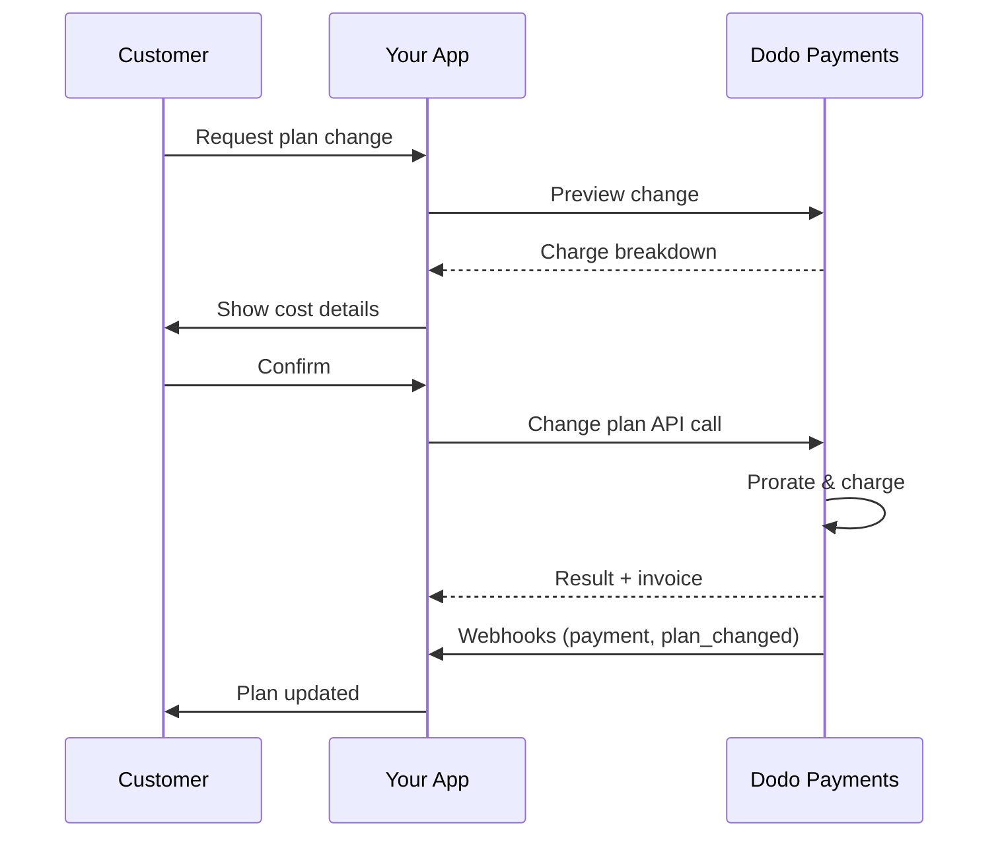
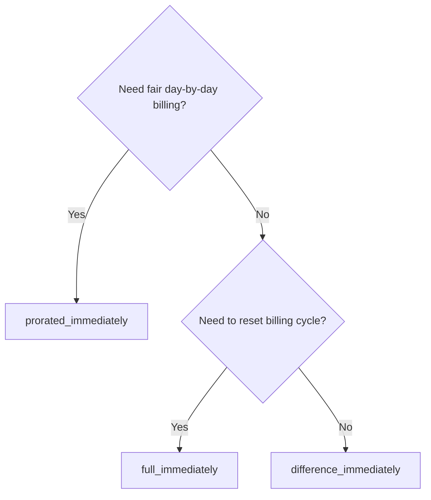
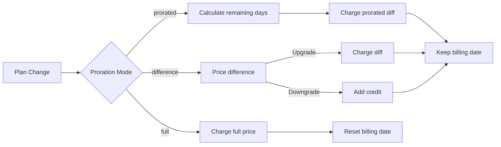

{/* LOCKED_PATTERN_6d744560e4135463c359b094ae69cd5f */}
{/* LOCKED_PATTERN_e019618386b2aca726eb1801e3e74076 */}
  Fullständig API-dokumentation för att uppdatera prenumerationer.
</Card>
{/* LOCKED_PATTERN_1e8b2499d330dcc44e5e284a3600fd11 */}
  Visa avgifter innan du ändrar planer.
</Card>
{/* LOCKED_PATTERN_782a37ccd4cc5a4159c5497e7f1d4c54 */}
  Steg-för-steg-inställning av prenumeration.
</Card>
</CardGroup>

## Vad är en uppgradering eller nedgradering av prenumeration?

Att byta plan gör att du kan flytta en kund mellan prenumerationsnivåer eller antal. Använd det för att:
- Justera prissättningen efter användning eller funktioner
- Byt från månads- till årsplan (eller tvärtom)
- Justera antal för sätesbaserade produkter

<Info>
Planändringar kan utlösa en omedelbar debitering beroende på vilken proration-mod du väljer.
</Info>

## När ska man använda planändringar

- Uppgradera när en kund behöver fler funktioner, mer användning eller fler platser
- Nedgradera när användningen minskar
- Migrera användare till en ny produkt eller pris utan att avbryta deras prenumeration

## Flöde för planändring



## Förutsättningar

Innan du implementerar ändringar av prenumerationsplaner, se till att du har:

- Ett Dodo Payments-handelskonto med aktiva prenumerationsprodukter
- API-referenser (API-nyckel och webhook-hemlig nyckel) från instrumentpanelen
- En befintlig aktiv prenumeration att modifiera
- Webhook-slutpunkt konfigurerad för att hantera prenumerationsevenemang

<Info>
För detaljerade installationsinstruktioner, se vår [Integration Guide](/developer-resources/integration-guide#dashboard-setup).
</Info>

## Steg-för-steg-implementeringsguide

Följ denna omfattande guide för att implementera ändringar av prenumerationsplaner i din applikation:

<Steps>
{/* LOCKED_PATTERN_b0d6d45bb453480975a9fb2d18d04caf */}
Innan du implementerar, bestäm:
- Vilka prenumerationsprodukter som kan ändras till vilka andra
- Vilken proration-mod som passar din affärsmodell
- Hur man hanterar misslyckade planändringar smidigt
- Vilka webhook-händelser som ska följas för tillståndshantering

<Tip>
Testa planändringar noggrant i testläge innan du implementerar i produktion.
</Tip>
</Step>

{/* LOCKED_PATTERN_44f780199a4b76d6c063b33d8f599e9a */}
Välj faktureringsmetod som matchar ditt företags behov:

<Tabs>
<Tab title="prorated_immediately">
Passar bäst för: SaaS-applikationer som vill ta betalt rättvist för oanvänd tid
- Beräknar exakt proportionellt belopp baserat på återstående cykeltid
- Debiterar ett proportionellt belopp baserat på oanvänd tid kvar i cykeln
- Ger kunderna transparent fakturering
</Tab>

<Tab title="difference_immediately">
Passar bäst för: Tydliga uppgradering-/nedgraderingsscenarier
- Uppgradering: Ta ut omedelbar skillnad (t.ex. $30→$80 = debitera $50)
- Nedgradering: Kreditera återstående värde för framtida förnyelser
- Förenklar faktureringslogik och kundkommunikation
</Tab>

<Tab title="full_immediately">
Passar bäst för: När du vill återställa faktureringscykeln
- Debiterar hela beloppet för den nya planen omedelbart
- Ignorerar återstående tid från gamla planen
- Användbart vid övergångar från års- till månadsplan
</Tab>
</Tabs>
</Step>

{/* LOCKED_PATTERN_62685552c5becb87cfeddbb400a3e69b */}
Använd Change Plan API:et för att ändra prenumerationsdetaljer:

<ParamField path="subscription_id" type="string" required>
ID:t för den aktiva prenumerationen som ska ändras.
</ParamField>

<ParamField path="product_id" type="string" required>
ID:t för den nya produkten som prenumerationen ska ändras till.
</ParamField>

<ParamField path="quantity" type="integer" default="1">
Antal enheter för den nya planen (för sätesbaserade produkter).
</ParamField>

<ParamField path="proration_billing_mode" type="string" required>
Hur man hanterar omedelbar fakturering: `prorated_immediately`, `full_immediately` eller `difference_immediately`.
</ParamField>

<ParamField path="addons" type="array">
Valfria tillägg för den nya planen. Om detta lämnas tomt tas befintliga tillägg bort.
</ParamField>

{/* LOCKED_PATTERN_dbe6ce0c854d65ccfe8e10a6cd58e3a8 */}
Styr beteende när betalningen för planändringen misslyckas:
- `prevent_change`: Behåll prenumerationen på nuvarande plan tills betalningen lyckas
- `apply_change` (standard): Tillämpa planändringen omedelbart oavsett betalningsresultat

Om inte angivet används standardinställningen på affärsnivå.
</ParamField>
</Step>

{/* LOCKED_PATTERN_5c8c73c93c2f49c93ec60fbfa164dd3a */}
Ställ in webhook-hantering för att följa planändringsresultat:

- `subscription.active`: Planändring lyckades, prenumerationen uppdaterad
- `subscription.plan_changed`: Prenumerationsplan ändrad (uppgradering/nedgradering/tillägg)
- `subscription.on_hold`: Avgift för planändring misslyckades, prenumerationen pausad
- `payment.succeeded`: Omedelbar avgift för planändring lyckades
- `payment.failed`: Omedelbar avgift misslyckades

<Warning>
Verifiera alltid webhook-signaturer och implementera idempotent händelsehantering.
</Warning>
</Step>

{/* LOCKED_PATTERN_df7c84793753eaba82a0d637e200faa6 */}
Baserat på webhook-händelser, uppdatera din applikation:
- Ge/ta bort funktioner baserat på den nya planen
- Uppdatera kundens instrumentpanel med nya planuppgifter
- Skicka bekräftelsemail om planändringar
- Logga faktureringsändringar för revisionsändamål
</Step>

{/* LOCKED_PATTERN_bee75f9c04c9720f2dc211cbed62a7c6 */}
Testa din implementation noggrant:
- Testa alla proration-mod med olika scenarier
- Verifiera att webhook-hanteringen fungerar korrekt
- Övervaka framgångsfrekvensen för planändringar
- Skapa larm för misslyckade planändringar
<Check>
Din implementation för planändringar av prenumerationer är nu redo för produktion.
</Check>
</Step>
</Steps>

Innan du bekräftar en planändring, använd Förhandsgranska API för att visa kunder exakt vad de kommer att debiteras:

## Förhandsgranska planändringar

Innan du genomför en planändring, använd Preview API för att visa kunder exakt vad de kommer att debiteras:

<Tabs>
<Tab title="Node.js SDK">

```javascript
const preview = await client.subscriptions.previewChangePlan('sub_123', {
  product_id: 'prod_pro',
  quantity: 1,
  proration_billing_mode: 'prorated_immediately'
});

// Show customer the charge before confirming
console.log('Immediate charge:', preview.immediate_charge.summary);
console.log('New plan details:', preview.new_plan);
```

</Tab>

<Tab title="Python SDK">

```python
preview = client.subscriptions.preview_change_plan(
    subscription_id="sub_123",
    product_id="prod_pro",
    quantity=1,
    proration_billing_mode="prorated_immediately"
)

# Show customer the charge before confirming
print("Immediate charge:", preview.immediate_charge.summary)
print("New plan details:", preview.new_plan)
```

</Tab>
</Tabs>

<Tip>
Använd Preview API för att bygga bekräftelsedialoger som visar kunder det exakta belopp de kommer att debiteras innan de bekräftar en planändring.
</Tip>

## Change Plan API

Använd Change Plan API:et för att ändra produkt, kvantitet och proration för en aktiv prenumeration.

### Snabbstartsexempel

<Tabs>
  <Tab title="Node.js SDK">

    ```javascript
    import DodoPayments from 'dodopayments';

    const client = new DodoPayments({
      bearerToken: process.env.DODO_PAYMENTS_API_KEY,
      environment: 'test_mode', // defaults to 'live_mode'
    });

    async function changePlan() {
      const result = await client.subscriptions.changePlan('sub_123', {
        product_id: 'prod_new',
        quantity: 3,
        proration_billing_mode: 'prorated_immediately',
        on_payment_failure: 'prevent_change', // Optional: control behavior on payment failure
      });
      console.log(result.status, result.invoice_id, result.payment_id);
    }

    changePlan();
    ```

  </Tab>
  <Tab title="Python SDK">

    ```python
    import os
    from dodopayments import DodoPayments

    client = DodoPayments(
        bearer_token=os.environ.get("DODO_PAYMENTS_API_KEY"),
        environment="test_mode",  # defaults to "live_mode"
    )

    result = client.subscriptions.change_plan(
        subscription_id="sub_123",
        product_id="prod_new",
        quantity=3,
        proration_billing_mode="prorated_immediately",
        on_payment_failure="prevent_change",  # Optional: control behavior on payment failure
    )
    print(result.status, result.get("invoice_id"), result.get("payment_id"))
    ```

  </Tab>
  <Tab title="Go SDK">

    ```go
    package main

    import (
      "context"
      "fmt"
      "github.com/dodopayments/dodopayments-go"
      "github.com/dodopayments/dodopayments-go/option"
    )

    func main() {
      client := dodopayments.NewClient(option.WithBearerToken("YOUR_TOKEN"))
      res, err := client.Subscriptions.ChangePlan(context.TODO(), dodopayments.SubscriptionChangePlanParams{
        SubscriptionID: dodopayments.F("sub_123"),
        ProductID:             dodopayments.F("prod_new"),
        Quantity:              dodopayments.F(int64(3)),
        ProrationBillingMode:  dodopayments.F(dodopayments.SubscriptionChangePlanParamsProrationBillingModeProratedImmediately),
        OnPaymentFailure:      dodopayments.F(dodopayments.OnPaymentFailurePreventChange), // Optional
      })
      if err != nil { panic(err) }
      fmt.Println(res.Status, res.InvoiceID, res.PaymentID)
    }
    ```

  </Tab>
  <Tab title="HTTP">

    ```bash
    curl -X POST "$DODO_API_BASE/subscriptions/sub_123/change-plan" \
      -H "Authorization: Bearer $DODO_PAYMENTS_API_KEY" \
      -H "Content-Type: application/json" \
      -d '{
        "product_id": "prod_new",
        "quantity": 3,
        "proration_billing_mode": "prorated_immediately",
        "on_payment_failure": "prevent_change"
      }'
    ```

  </Tab>
</Tabs>

```json Success
{
  "status": "processing",
  "subscription_id": "sub_123",
  "invoice_id": "inv_789",
  "payment_id": "pay_456",
  "proration_billing_mode": "prorated_immediately"
}
```

<Note>
Fält som <code>invoice_id</code> och <code>payment_id</code> returneras endast när en omedelbar avgift och/eller faktura skapas under planändringen. Lita alltid på webhook-händelser (t.ex. <code>payment.succeeded</code>, <code>subscription.plan_changed</code>) för att bekräfta utfall.
</Note>

<Warning>
Om den omedelbara avgiften misslyckas kan prenumerationen gå till `subscription.on_hold` tills betalningen lyckas.
</Warning>

## Hantera tillägg

När du ändrar prenumerationsplaner kan du också ändra tillägg:

```javascript
// Add addons to the new plan
await client.subscriptions.changePlan('sub_123', {
  product_id: 'prod_new',
  quantity: 1,
  proration_billing_mode: 'difference_immediately',
  addons: [
    { addon_id: 'addon_123', quantity: 2 }
  ]
});

// Remove all existing addons
await client.subscriptions.changePlan('sub_123', {
  product_id: 'prod_new',
  quantity: 1,
  proration_billing_mode: 'difference_immediately',
  addons: [] // Empty array removes all existing addons
});
```

<Info>
Tillägg ingår i prorationen och debiteras enligt valt prorationläge.
</Info>

## Prorationslägen

Välj hur kunden ska debiteras vid planändringar:

#### `prorated_immediately`
- Debiterar för den partiella skillnaden i den aktuella cykeln
- Om kunden är i provperiod debiteras omedelbart och byter till den nya planen nu
- Nedgradering: kan generera en proportionell kredit som appliceras på framtida förnyelser

#### `full_immediately`
- Debiterar hela beloppet för den nya planen omedelbart
- Ignorerar återstående tid från den gamla planen

<Info>
Krediter som skapas vid nedgraderingar med <code>difference_immediately</code> är prenumerationsspecifika och särskiljda från <a href="/features/customer-credit">Customer Credits</a>. De appliceras automatiskt på framtida förnyelser av samma prenumeration och är inte överförbara mellan prenumerationer.
</Info>

#### `difference_immediately`
- Uppgradering: debitera omedelbart prisdifferensen mellan gamla och nya planen
- Nedgradering: lägg till återstående värde som intern kredit till prenumerationen och applicera automatiskt vid förnyelser

| Funktion | `prorated_immediately` | `difference_immediately` | `full_immediately` |
|---------|----------------------|------------------------|-------------------|
| **Uppgraderingsavgift** | Proportionell skillnad för återstående dagar | Full prisdifferens mellan planerna | Hela priset för nya planen |
| **Nedgraderingskredit** | Proportionell kredit för återstående dagar | Full prisdifferens som kredit | Ingen kredit |
| **Faktureringscykel** | Oförändrad | Oförändrad | Återställs till idag |
| **Provperiodsbeteende** | Avslutar prov, debiterar omedelbart | Avslutar prov, debiterar omedelbart | Avslutar prov, debiterar hela beloppet |
| **Passar bäst för** | Rättvis tidsbaserad fakturering | Enkel upp-/nedgraderingsberäkning | Återställning av faktureringscykler |
| **Komplexitet** | Medel (dagberäkning) | Låg (enkel subtraktion) | Låg (full debitering) |



### Exempelscenarier

Använd dessa kanoniska siffror konsekvent:
- Aktuell plan: **Basic** för **$30/månad**
- Uppgraderingsmål: **Pro** för **$80/månad**
- Nedgraderingsmål (från Pro): **Starter** för **$20/månad**
- Faktureringscykel: **30 dagar**, startade den **1 januari**
- Planändring sker den **16 januari** (15 dagar kvar, 15 dagar använda)

<AccordionGroup>
  {/* LOCKED_PATTERN_1a58b4dbcc060de029ff28c82c80a6fe */}

    ```
    Step 1: Calculate unused credit from current plan
      Unused days = 15 out of 30 days
      Credit = $30 × (15/30) = $15.00

    Step 2: Calculate prorated cost of new plan
      Remaining days = 15 out of 30 days
      New plan cost = $80 × (15/30) = $40.00

    Step 3: Calculate immediate charge
      Charge = New plan cost − Credit
      Charge = $40.00 − $15.00 = $25.00

    → Customer pays $25.00 now
    → Next renewal (Feb 1): $80.00/month
    ```

    ```javascript
    await client.subscriptions.changePlan('sub_123', {
      product_id: 'prod_pro',
      quantity: 1,
      proration_billing_mode: 'prorated_immediately'
    })
    ```

  </Accordion>

  {/* LOCKED_PATTERN_807a82fa1b52ee9a606ce1f9c1d8b613 */}

    ```
    Step 1: Calculate unused credit from current plan
      Unused days = 15 out of 30 days
      Credit = $80 × (15/30) = $40.00

    Step 2: Calculate prorated cost of new plan
      Remaining days = 15 out of 30 days
      New plan cost = $20 × (15/30) = $10.00

    Step 3: Calculate credit balance
      Credit = $40.00 − $10.00 = $30.00

    → No charge — $30.00 credit added to subscription
    → Credit auto-applies to future renewals
    → Next renewal (Feb 1): $20.00 − $30.00 credit = $0.00
    → Following renewal (Mar 1): $20.00 − $10.00 remaining credit = $10.00
    ```

    ```javascript
    await client.subscriptions.changePlan('sub_123', {
      product_id: 'prod_starter',
      quantity: 1,
      proration_billing_mode: 'prorated_immediately'
    })
    ```

  </Accordion>

  {/* LOCKED_PATTERN_67905dd0e892a1412bd0f1a567dd0a62 */}

    ```
    Immediate charge = New plan price − Old plan price
                     = $80 − $30
                     = $50.00

    → Customer pays $50.00 now (regardless of cycle position)
    → Next renewal (Feb 1): $80.00/month
    ```

    ```javascript
    await client.subscriptions.changePlan('sub_123', {
      product_id: 'prod_pro',
      quantity: 1,
      proration_billing_mode: 'difference_immediately'
    })
    ```

  </Accordion>

  {/* LOCKED_PATTERN_b17ed67d3062fadb798904adf781b844 */}

    ```
    Credit = Old plan price − New plan price
           = $80 − $20
           = $60.00

    → No charge — $60.00 credit added to subscription
    → Credit auto-applies to future renewals
    → Next renewal: $20.00 − $20.00 (from credit) = $0.00
    → Following renewal: $20.00 − $20.00 (from credit) = $0.00
    → Third renewal: $20.00 − $20.00 (from remaining credit) = $0.00
    ```

    ```javascript
    await client.subscriptions.changePlan('sub_123', {
      product_id: 'prod_starter',
      quantity: 1,
      proration_billing_mode: 'difference_immediately'
    })
    ```

  </Accordion>

  {/* LOCKED_PATTERN_0cb1a5657302a3970059ca925841dcd5 */}

    ```
    Immediate charge = Full new plan price = $80.00

    → Customer pays $80.00 now
    → No credit for unused time on old plan
    → Billing cycle resets to today (January 16)
    → Next renewal: February 16 at $80.00/month
    ```

    ```javascript
    await client.subscriptions.changePlan('sub_123', {
      product_id: 'prod_pro',
      quantity: 1,
      proration_billing_mode: 'full_immediately'
    })
    ```

  </Accordion>

  {/* LOCKED_PATTERN_6edab7762bdaeaf6cef5f85bafdb8832 */}

    ```
    Current: Basic plan ($30/month), no add-ons
    New: Pro plan ($80/month) + Extra Seats add-on ($10/seat × 3 seats = $30/month)
    Change on day 16 of 30 (15 days remaining)

    Step 1: Credit from current plan
      Credit = $30 × (15/30) = $15.00

    Step 2: Prorated cost of new plan + add-ons
      New plan = $80 × (15/30) = $40.00
      Add-ons = $30 × (15/30) = $15.00
      Total new = $55.00

    Step 3: Immediate charge
      Charge = $55.00 − $15.00 = $40.00

    → Customer pays $40.00 now
    → Next renewal: $80.00 + $30.00 = $110.00/month
    ```

    ```javascript
    await client.subscriptions.changePlan('sub_123', {
      product_id: 'prod_pro',
      quantity: 1,
      proration_billing_mode: 'prorated_immediately',
      addons: [
        { addon_id: 'addon_seats', quantity: 3 }
      ]
    })
    ```

  </Accordion>
</AccordionGroup>

### Hur varje läge hanterar fakturering



<Tip>
Välj `prorated_immediately` för rättvis tidsredovisning; välj `full_immediately` för att starta om faktureringen; använd `difference_immediately` för enkla uppgraderingar och automatisk kredit vid nedgraderingar.
</Tip>

## Hantera betalningsfel

Styr vad som händer när en planändringsbetalning misslyckas med hjälp av parametern `on_payment_failure`.

### Betalningsfelssätt

<Tabs>
{/* LOCKED_PATTERN_9a289e347ae0d2762cd8b5bae425d96d */}
**Beteende**: Behåll prenumerationen på nuvarande plan tills betalningen lyckas.

- Planändringen markeras som "avvaktande"
- Kunden behåller tillgång till sin nuvarande plan
- Prenumerationen går till `active` endast efter lyckad betalning
- Bra när du vill säkerställa betalning innan du ger tillgång till uppgraderade funktioner

```javascript
await client.subscriptions.changePlan('sub_123', {
  product_id: 'prod_pro',
  quantity: 1,
  proration_billing_mode: 'prorated_immediately',
  on_payment_failure: 'prevent_change'
});
```

</Tab>

{/* LOCKED_PATTERN_389bf4efb62466ceba65070629169973 */}
**Beteende**: Tillämpa planändringen omedelbart oavsett betalningsresultat.

- Planändringen tillämpas även om betalningen misslyckas
- Kunden får omedelbar tillgång till den nya planen
- Prenumerationen kan gå till `on_hold` om betalningen misslyckas
- Bra för icke-kritiska uppgraderingar eller när du litar på kunden

```javascript
await client.subscriptions.changePlan('sub_123', {
  product_id: 'prod_pro',
  quantity: 1,
  proration_billing_mode: 'prorated_immediately',
  on_payment_failure: 'apply_change' // This is the default
});
```

</Tab>
</Tabs>

<Info>
Om inte angivet använder parametern `on_payment_failure` din företagsnivå-standardinställning som konfigurerats i instrumentpanelen.
</Info>

### När man ska använda varje läge

| Scenario | Rekommenderat läge | Orsak |
|----------|------------------|--------|
| Uppgradering till premiumfunktioner | `prevent_change` | Säkerställ betalning innan tillgång ges |
| Ökning av kvantitet (fler platser) | `prevent_change` | Förhindra användning utan betalning |
| Nedgradering av planer | `apply_change` | Kunden minskar sin kostnad |
| Betrodda företagskunder | `apply_change` | Lägre risk för utebliven betalning |
| Konvertering från prov till betald | `prevent_change` | Kritiskt betalningstillfälle |

## Hantera webhooks

Håll koll på prenumerationstillstånd via webhooks för att bekräfta planändringar och betalningar.

### Händelsetyper att hantera
- `subscription.active`: prenumerationen aktiverad
- `subscription.plan_changed`: prenumerationsplan ändrad (uppgradering/nedgradering/tillägg)
- `subscription.on_hold`: avgift misslyckades, prenumerationen pausad
- `subscription.renewed`: förnyelse lyckades
- `payment.succeeded`: betalning för planändring eller förnyelse lyckades
- `payment.failed`: betalning misslyckades

<Info>
Vi rekommenderar att driva affärslogik från prenumerationhändelser och använda betalningshändelser för bekräftelse och avstämning.
</Info>

### Verifiera signaturer och hantera intents

<Tabs>
  <Tab title="Next.js Route Handler">

    ```javascript
    import { NextRequest, NextResponse } from 'next/server';
    
    export async function POST(req) {
      const webhookId = req.headers.get('webhook-id');
      const webhookSignature = req.headers.get('webhook-signature');
      const webhookTimestamp = req.headers.get('webhook-timestamp');
      const secret = process.env.DODO_WEBHOOK_SECRET;
    
      const payload = await req.text();
      // verifySignature is a placeholder – in production, use a Standard Webhooks library
      const { valid, event } = await verifySignature(
        payload,
        { id: webhookId, signature: webhookSignature, timestamp: webhookTimestamp },
        secret
      );
      if (!valid) return NextResponse.json({ error: 'Invalid signature' }, { status: 400 });
    
      switch (event.type) {
        case 'subscription.active':
          // mark subscription active in your DB
          break;
        case 'subscription.plan_changed':
          // refresh entitlements and reflect the new plan in your UI
          break;
        case 'subscription.on_hold':
          // notify user to update payment method
          break;
        case 'subscription.renewed':
          // extend access window
          break;
        case 'payment.succeeded':
          // reconcile payment for plan change
          break;
        case 'payment.failed':
          // log and alert
          break;
        default:
          // ignore unknown events
          break;
      }
    
      return NextResponse.json({ received: true });
    }
    ```

  </Tab>
  <Tab title="Express.js">

    ```javascript
    import express from 'express';
    
    const app = express();
    app.post('/webhooks/dodo', express.raw({ type: 'application/json' }), async (req, res) => {
      const webhookId = req.header('webhook-id');
      const webhookSignature = req.header('webhook-signature');
      const webhookTimestamp = req.header('webhook-timestamp');
      const secret = process.env.DODO_WEBHOOK_SECRET;
      const payload = req.body.toString('utf8');
    
      const { valid, event } = await verifySignature(
        payload,
        { id: webhookId, signature: webhookSignature, timestamp: webhookTimestamp },
        secret
      );
      if (!valid) return res.status(400).send('Invalid signature');
    
      // handle events like above
      res.json({ received: true });
    });
    
    app.listen(3000);
    ```

  </Tab>
</Tabs>

<Note>
För detaljerade payload-scheman, se <a href="/developer-resources/webhooks/intents/subscription">Subscription webhook payloads</a> och <a href="/developer-resources/webhooks/intents/payment">Payment webhook payloads</a>.
</Note>

## Bästa praxis

Följ dessa rekommendationer för pålitliga planändringar av prenumerationer:

### Strategi för planändringar
- **Testa noggrant**: Testa alltid planändringar i testläge innan produktion
- **Välj proration med omsorg**: Välj proration-läge som stämmer överens med din affärsmodell
- **Hantera fel smidigt**: Implementera korrekt felhantering och retry-logik
- **Övervaka framgångsfrekvenser**: Följ planändringars framgång/misslyckandefrekvens och undersök problem

### Webhook-implementering
- **Verifiera signaturer**: Validera alltid webhook-signaturer för att säkerställa äkthet
- **Implementera idempotens**: Hantera duplicerade webhook-händelser smidigt
- **Bearbeta asynkront**: Blockera inte webhook-svar med tunga operationer
- **Logga allt**: Behåll detaljerade loggar för felsökning och revision

### Användarupplevelse
- **Kommunicera tydligt**: Informera kunder om faktureringsändringar och tidpunkt
- **Ge bekräftelser**: Skicka e-postbekräftelser för lyckade planändringar
- **Hantera kantfall**: Ta hänsyn till provperioder, prorationer och misslyckade betalningar
- **Uppdatera gränssnittet omedelbart**: Spegla planändringar i din applikationsgränssnitt

## Vanliga problem och lösningar

Lös typiska problem som uppstår vid planändringar av prenumerationer:

<AccordionGroup>
{/* LOCKED_PATTERN_112861435a085998aa537e347e24f368 */}
**Symptom**: API-anropet lyckas men prenumerationen förblir på den gamla planen

**Vanliga orsaker**:
- Webhook-hanteringen misslyckades eller fördröjdes
- Applikationstillstånd uppdaterades inte efter att webhooks mottagits
- Databastransaktioner vid tillståndsuppdatering gav fel

**Lösningar**:
- Implementera robust webhook-hantering med retry-logik
- Använd idempotenta operationer för tillståndsuppdateringar
- Lägg till övervakning för att upptäcka och larma vid missade webhook-händelser
- Verifiera att webhook-slutpunkten är åtkomlig och svarar korrekt
</Accordion>

{/* LOCKED_PATTERN_653656c823b0f191581a523ab18f0f3f */}
**Symptom**: Kunden nedgraderar men ser ingen kreditsaldo

**Vanliga orsaker**:
- Förväntningar på prorationläget: nedgraderingar krediterar hela prisdifferensen med `difference_immediately`, medan `prorated_immediately` skapar en proportionell kredit baserat på återstående tid i cykeln
- Krediter är prenumerationsspecifika och går inte att överföra mellan prenumerationer
- Kreditsaldo syns inte i kundens instrumentpanel

**Lösningar**:
- Använd `difference_immediately` för nedgraderingar när du vill ha automatiska krediter
- Förklara för kunder att krediter gäller framtida förnyelser av samma prenumeration
- Implementera ett kundportal för att visa kreditsaldo
- Kontrollera nästa fakturapreview för att se tillämpade krediter
</Accordion>

{/* LOCKED_PATTERN_1b0516ec68b4083dc4d6ae9b330f3f1a */}
**Symptom**: Webhook-händelser avvisas på grund av ogiltig signatur

**Vanliga orsaker**:
- Felaktig webhook-hemlig nyckel
- Rå begäran modifierad innan signaturverifiering
- Felaktigt signaturverifieringsalgoritm

**Lösningar**:
- Kontrollera att du använder korrekt `DODO_WEBHOOK_SECRET` från instrumentpanelen
- Läs rå begäran innan någon JSON-parsning sker
- Använd standardbiblioteket för webhook-verifiering för din plattform
- Testa webhook-signaturverifiering i utvecklingsmiljön
</Accordion>

{/* LOCKED_PATTERN_638d7c911003cceda8c7d34ff8a2c381 */}
**Symptom**: API svarar med 422 Unprocessable Entity-fel

**Vanliga orsaker**:
- Ogiltigt prenumerations-ID eller produkt-ID
- Prenumerationen är inte i aktivt tillstånd
- Saknade obligatoriska parametrar
- Produkten är inte tillgänglig för planändringar

**Lösningar**:
- Verifiera att prenumerationen finns och är aktiv
- Kontrollera att produkt-ID:t är giltigt och tillgängligt
- Säkerställ att alla obligatoriska parametrar skickas
- Granska API-dokumentationen för parameterkrav
</Accordion>

{/* LOCKED_PATTERN_7917a64bf4b26c933f2e4649e9278a56 */}
**Symptom**: Planändring initierad men omedelbar avgift misslyckas

**Vanliga orsaker**:
- Otillräckliga medel på kundens betalningsmetod
- Betalningsmetod har gått ut eller är ogiltig
- Bank nekade transaktionen
- Bedrägeriövervakning blockerade avgiften

**Lösningar**:
- Hantera `payment.failed` webhook-händelser korrekt
- Meddela kunden att uppdatera betalningsmetoden
- Implementera retry-logik för tillfälliga fel
- Överväg att tillåta planändringar trots misslyckade omedelbara avgifter
</Accordion>

{/* LOCKED_PATTERN_20276630e99e95ac9f5cdd0b347713bb */}
**Symptom**: Planändringsavgift misslyckas och prenumerationen går till `on_hold`-tillstånd

**Vad händer**:
När en planändringsavgift misslyckas placeras prenumerationen automatiskt i `on_hold`-tillstånd. Prenumerationen förnyas inte automatiskt förrän betalningsmetoden uppdateras.

**Lösning**: Uppdatera betalningsmetoden för att återaktivera prenumerationen

För att återaktivera en prenumeration från `on_hold`-tillstånd efter en misslyckad planändring:

1. **Uppdatera betalningsmetoden** med hjälp av Update Payment Method API
2. **Automatisk avgiftsgenerering**: API:et skapar automatiskt en avgift för återstående skulder
3. **Fakturagenerering**: En faktura skapas för avgiften
4. **Betalningsbearbetning**: Betalningen behandlas med den nya betalningsmetoden
5. **Återaktivering**: Vid lyckad betalning återaktiveras prenumerationen till `active`-tillstånd

<CodeGroup>

```javascript Node.js
// Reactivate subscription from on_hold after failed plan change
async function reactivateAfterFailedPlanChange(subscriptionId) {
  // Update payment method - automatically creates charge for remaining dues
  const response = await client.subscriptions.updatePaymentMethod(subscriptionId, {
    type: 'new',
    return_url: 'https://example.com/return'
  });
  
  if (response.payment_id) {
    console.log('Charge created for remaining dues:', response.payment_id);
    console.log('Payment link:', response.payment_link);
    
    // Redirect customer to payment_link to complete payment
    // Monitor webhooks for:
    // 1. payment.succeeded - charge succeeded
    // 2. subscription.active - subscription reactivated
  }
  
  return response;
}

// Or use existing payment method if available
async function reactivateWithExistingPaymentMethod(subscriptionId, paymentMethodId) {
  const response = await client.subscriptions.updatePaymentMethod(subscriptionId, {
    type: 'existing',
    payment_method_id: paymentMethodId
  });
  
  // Monitor webhooks for payment.succeeded and subscription.active
  return response;
}
```

```python Python
# Reactivate subscription from on_hold after failed plan change
def reactivate_after_failed_plan_change(subscription_id):
    # Update payment method - automatically creates charge for remaining dues
    response = client.subscriptions.update_payment_method(
        subscription_id=subscription_id,
        type="new",
        return_url="https://example.com/return"
    )
    
    if response.payment_id:
        print("Charge created for remaining dues:", response.payment_id)
        print("Payment link:", response.payment_link)
        
        # Redirect customer to payment_link to complete payment
        # Monitor webhooks for:
        # 1. payment.succeeded - charge succeeded
        # 2. subscription.active - subscription reactivated
    
    return response

# Or use existing payment method if available
def reactivate_with_existing_payment_method(subscription_id, payment_method_id):
    response = client.subscriptions.update_payment_method(
        subscription_id=subscription_id,
        type="existing",
        payment_method_id=payment_method_id
    )
    
    # Monitor webhooks for payment.succeeded and subscription.active
    return response
```

</CodeGroup>

**Webhook-händelser att övervaka**:
- `subscription.on_hold`: Prenumerationen pausad (mottas när planändringsavgiften misslyckas)
- `payment.succeeded`: Betalning för återstående skulder lyckades (efter uppdatering av betalningsmetod)
- `subscription.active`: Prenumerationen återaktiverades efter lyckad betalning

**Bästa praxis**:
- Meddela kunder omedelbart när en planändringsavgift misslyckas
- Ge tydliga instruktioner om hur betalningsmetoden uppdateras
- Övervaka webhook-händelser för att följa upp återaktivering
- Överväg att implementera automatisk retry-logik för tillfälliga betalningsfel

{/* LOCKED_PATTERN_d215ea1d00e95d5e9d5b4b6085f2443f */}
Se den kompletta API-dokumentationen för att uppdatera betalningsmetoder och återaktivera prenumerationer.
</Card>
</Accordion>
</AccordionGroup>

## Testa din implementation

Följ dessa steg för att testa din implementation av planändringar noggrant:

<Steps>
{/* LOCKED_PATTERN_f5ce79c6f425de558f6fdd6cea5793f5 */}
- Använd test-API-nycklar och testprodukter
- Skapa testprenumerationer med olika plantyper
- Konfigurera test-webhook-slutpunkt
- Sätt upp övervakning och loggning
</Step>

{/* LOCKED_PATTERN_3705b8701c8873992c57281c42adf8d6 */}
- Testa `prorated_immediately` med olika positioner i faktureringscykeln
- Testa `difference_immediately` för uppgraderingar och nedgraderingar
- Testa `full_immediately` för att återställa faktureringscykler
- Verifiera att kreditberäkningarna är korrekta
</Step>

{/* LOCKED_PATTERN_9fb1eaf73e8951f61d7daf19366cdfdf */}
- Verifiera att alla relevanta webhook-händelser mottas
- Testa webhook-signaturverifiering
- Hantera duplicerade webhook-händelser smidigt
- Testa scenarier där webhook-bearbetningen misslyckas
</Step>

{/* LOCKED_PATTERN_7d448c9309210902a86e740b08deae34 */}
- Testa med ogiltiga prenumerations-ID:n
- Testa med utgångna betalningsmetoder
- Testa nätverksfel och timeout
- Testa med otillräckliga medel
</Step>

{/* LOCKED_PATTERN_099bec4eb7633497929a085e7b0160cd */}
- Ställ in larm för misslyckade planändringar
- Övervaka webhook-bearbetningstider
- Följ framgångsfrekvensen för planändringar
- Granska kundsupportärenden för planändringsproblem
</Step>
</Steps>

## Felhantering

Hantera vanliga API-fel smidigt i din implementation:

### HTTP-statuskoder

<AccordionGroup>
<Accordion title="200 OK">
Planändringsförfrågan behandlades framgångsrikt. Prenumerationen uppdateras och betalningsbearbetning har påbörjats.
</Accordion>

<Accordion title="400 Bad Request">
Ogiltiga förfrågningsparametrar. Kontrollera att alla obligatoriska fält skickas och är korrekt formaterade.
</Accordion>

{/* LOCKED_PATTERN_618fe88bddcc0059b0b92c4342a4dcfc */}
Ogiltig eller saknad API-nyckel. Verifiera att din `DODO_PAYMENTS_API_KEY` är korrekt och har rätt behörighet.
</Accordion>

<Accordion title="404 Not Found">
Prenumerations-ID:t hittades inte eller tillhör inte ditt konto.
</Accordion>

<Accordion title="422 Unprocessable Entity">
Prenumerationen kan inte ändras (t.ex. redan uppsagd, produkt inte tillgänglig osv.).
</Accordion>

<Accordion title="500 Internal Server Error">
Serverfel inträffade. Försök igen efter en kort stund.
</Accordion>
</AccordionGroup>

### Felresponsformat

```json
{
  "error": {
    "code": "subscription_not_found",
    "message": "The subscription with ID 'sub_123' was not found",
    "details": {
      "subscription_id": "sub_123"
    }
  }
}
```

## Nästa steg

- Granska <a href="/api-reference/subscriptions/change-plan">Change Plan API</a>
- Utforska <a href="/features/customer-credit">Customer Credits</a>
- Implementera larm för `subscription.on_hold`
- Kolla in vår <a href="/developer-resources/webhooks">Webhook Integration Guide</a>
