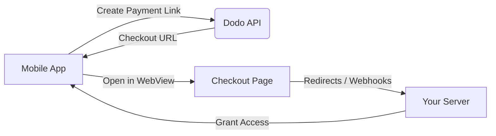

## Introduktion

Dodo Payments ger utvecklare möjlighet att sälja digitala varor och tjänster i iOS-appar, och hanterar komplexa aspekter som skatteöverensstämmelse, valutakonvertering och utbetalningar. Denna omfattande guide beskriver hur du integrerar Dodo Payments i din iOS-app, specifikt för SaaS-verktyg, innehållsprenumerationer och digitala verktyg.

## Översikt

Dodo Payments fungerar som din **Merchant of Record (MoR)** och hanterar viktiga aspekter av din digitala verksamhet:

<Tabs>
<Tab title="Vad vi hanterar">
- Skatteinsamling och -överföring (moms, GST och andra regionala skatter)
- Globala betalningar enligt policyer och lokala betalningsmetoder
- Valutakonvertering och valutaväxling
- Återkrav och bedrägeriförebyggande
- Fakturering och kvitton till slutkund
- Överensstämmelse med regionala regler
</Tab>

<Tab title="Vad du får">
- En enhetlig API för webb- och mobilplattformar
- Stöd för in-app-kassor (UPI, kort, plånböcker, BNPL)
- Global utbetalningssupport (Payoneer, Wise, lokala banköverföringar)
- Analys- och rapporteringsdashboard
- Säker betalningsbehandling
</Tab>
</Tabs>

## Användningsfall

<CardGroup cols={2}>
<Card title="Prenumerationer" icon="repeat">
- Premiuminnehåll eller funktionstillgång
- Återkommande fakturering med flexibla alternativ, gratis provperioder, proration eller uppgraderingar och nedgraderingar
</Card>

<Card title="Kurser och lärande" icon="graduation-cap">
- Betalning per kursåtkomst
- Paket med samlat innehåll
- Livstids- eller förnyelselicenser
- Integrering av framstegsspårning
</Card>

<Card title="Digitala nedladdningar" icon="download">
- Engångsköp (PDF-filer, musik, verktyg)
- Leverans av digitala tillgångar
- Hantering av licensnycklar
</Card>

<Card title="SaaS-verktyg" icon="screwdriver-wrench">
- Prenumerationer på mjukvara som tjänst
- Användningsbaserad fakturering
- Team- och företagsplaner
</Card>
</CardGroup>

## Integrationsflöde

Du kan integrera Dodo Payments i din app med vår hostade kassa eller in-app webblösning.

### Integrationssteg

<Steps>
<Step title="Mobilapp till Dodo API">
Processen börjar med att mobilappen skapar en betalningslänk genom att interagera med Dodo API.
</Step>

<Step title="Dodo API till Mobilapp">
Dodo API svarar med att tillhandahålla en kassa-URL tillbaka till mobilappen.
</Step>

<Step title="Mobilapp till Kassasida">
Mobilappen öppnar sedan denna kassa-URL inom en WebView, vilket leder användaren till kassasidan.
</Step>

<Step title="Kassasida till Din server">
Vid slutförandet av kassaprocessen kommunicerar kassasidan med din server genom omdirigeringar eller webhooks.
</Step>

<Step title="Din server till Mobilapp">
Slutligen ger din server tillgång till det köpta innehållet eller tjänsten, vilket slutför transaktionscykeln tillbaka i mobilappen.
</Step>
</Steps>

<Card title="Mobilintegrationsguide" icon="mobile" href="/developer-resources/mobile-integration">
För en komplett utvecklargenomgång, utforska vår Mobilintegrationsguide.
</Card>

## Regional tillgänglighet

Dodo Payments möjliggör alternativa in-app-köpsflöden endast i App Store-regioner där Apple uttryckligen tillåter externa betalningar, eller där en regulator eller domstolsbeslut kräver det.

### Stödda regioner

<AccordionGroup>
<Accordion title="Förenta staterna">
Stöds i den utsträckning som nuvarande domstolsbeslut och Apples uppdaterade riktlinjer tillåter.

- Tillgänglig under specifika domstolsmandaterade bestämmelser
- Föremål för Apples efterlevnad av lagkrav
- Måste följa Apples implementeringsriktlinjer
</Accordion>

<Accordion title="Europeiska unionen (EU) App Store">
Stöds via Apples EU-alternativa villkor och externa köpberättigande.

- Aktiverad genom Apples EU-alternativa villkor
- Kräver godkännande av externa köpberättigande
- Måste följa kraven i EU:s lag om digitala marknader
</Accordion>

<Accordion title="Sydkorea">
Stöds genom StoreKit externa köpberättigande för Korea-specifika binärer.

- Tillgänglig via StoreKit externa köpberättigande
- Kräver Korea-specifik app-binary
- Måste följa koreansk telekommunikationslag
</Accordion>
</AccordionGroup>

<Warning>
Granska alltid och efterlev Apples regionspecifika rättigheter och krav för App Store Connect innan du aktiverar Dodo Payments för någon butik. Att använda alternativa betalningsflöden i icke-stödda regioner kan leda till avslag eller borttagning av appen.
</Warning>

<Note>
För vissa affärsmodeller - såsom tjänster eller vissa kategorier av innehåll - kan Apple överhuvudtaget inte kräva användning av in-app-köp (IAP). Dodo Payments stöder även dessa modeller. Verifiera alltid din apps klassificering och Apples senaste riktlinjer för att avgöra om IAP är obligatoriskt för ditt användningsfall.
</Note>

### Lär dig mer

För en detaljerad genomgång av globala policyer, rättsliga prejudikat och strategiska tillvägagångssätt för att kringgå avgifter i App Store, se vår omfattande guide:

<Card title="Kringgå avgifter i App Store & Play Store: En strategisk och juridisk handbok" icon="shield-check" href="/features/bypassing-app-store-fees">
Lär dig var och hur du lagligt kan implementera alternativa betalningsflöden, med uppdaterad regional vägledning och efterlevnadstips.
</Card>