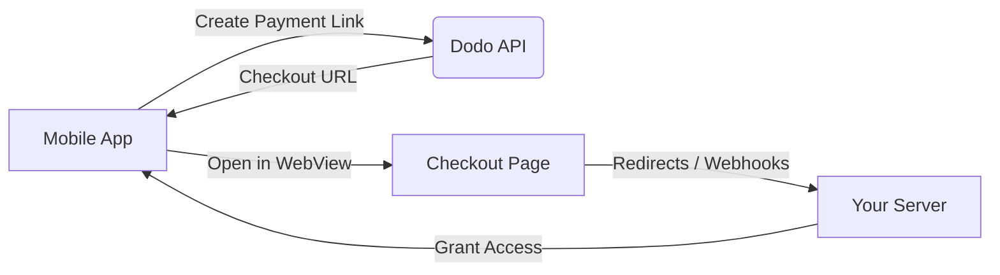

## Introduktion

Dodo Payments ger utvecklare möjlighet att sälja digitala varor och tjänster i iOS-appar, och hanterar komplexa aspekter som skatteöverensstämmelse, valutakonvertering och utbetalningar. Denna omfattande guide beskriver hur du integrerar Dodo Payments i din iOS-app, specifikt för SaaS-verktyg, innehållsprenumerationer och digitala verktyg.

## Översikt

Dodo Payments fungerar som din **Merchant of Record (MoR)** och hanterar viktiga aspekter av din digitala verksamhet:

<Tabs>
<Tab title="What We Handle">
- Skatteuppbörd och inbetalning (moms, GST och andra regionala skatter)
- Globala betalningar enligt riktlinjer och lokala betalningsmetoder
- Valutaväxling och utländsk valuta
- Återbetalningar och bedrägeriförebyggande
- Fakturering och kvitton till slutanvändare
- Efterlevnad av regionala regler
</Tab>

<Tab title="What You Get">
- Ett enhetligt API för webb och mobila plattformar
- Stöd för köp i appen (UPI, kort, plånböcker, BNPL)
- Globalt stöd för utbetalningar (Payoneer, Wise, lokala banköverföringar)
- Analys- och rapporteringspanel
- Säker betalningsbearbetning
</Tab>
</Tabs>

## Användningsfall

<CardGroup cols={2}>
<Card title="Subscriptions" icon="repeat">
- Premiuminnehåll eller funktionsåtkomst
- Återkommande fakturering med flexibla alternativ, gratis provperioder, proportionell debitering eller uppgraderingar och nedgraderingar
</Card>

<Card title="Courses and Learning" icon="graduation-cap">
- Betala per kursåtkomst
- Paketlösningar med sammansatta innehåll
- Livstidslicenser eller förnybara licenser
- Integrering av framstegsspårning
</Card>

<Card title="Digital Downloads" icon="download">
- Engångsköp (PDF:er, musik, verktyg)
- Leverans av digitala tillgångar
- Hantering av licensnycklar
</Card>

<Card title="SaaS Tools" icon="screwdriver-wrench">
- Programvara som en tjänst-prenumerationer
- Användningsbaserad fakturering
- Team- och företagsplaner
</Card>
</CardGroup>

## Integrationsflöde

Du kan integrera Dodo Payments i din app med vår hostade kassa eller in-app webblösning.

### Integrationssteg

<Steps>
<Step title="Mobile App to Dodo API">
Processen börjar med att mobilappen skapar en betalningslänk genom att interagera med Dodo API.
</Step>

<Step title="Dodo API to Mobile App">
Dodo API svarar genom att ge en kassa-URL tillbaka till mobilappen.
</Step>

<Step title="Mobile App to Checkout Page">
Mobilappen öppnar sedan denna kassa-URL i en WebView, vilket leder användaren till kassasidan.
</Step>

<Step title="Checkout Page to Your Server">
När kassaprocessen är slutförd kommunicerar kassasidan med din server via omdirigeringar eller webhooks.
</Step>

<Step title="Your Server to Mobile App">
Slutligen ger din server tillgång till det köpta innehållet eller tjänsten, vilket slutför transaktionscykeln tillbaka i mobilappen.
</Step>
</Steps>

<Card title="Mobile Integration Guide" icon="mobile" href="/developer-resources/mobile-integration">
För en komplett guide för utvecklare, utforska vår Mobile Integration Guide.
</Card>

## Regional tillgänglighet

Dodo Payments möjliggör alternativa in-app-köpsflöden endast i App Store-regioner där Apple uttryckligen tillåter externa betalningar, eller där en regulator eller domstolsbeslut kräver det.

### Stödda regioner

<AccordionGroup>
<Accordion title="United States">
Stöds i den utsträckning som aktuella domstolsbeslut och Apples uppdaterade riktlinjer tillåter.

- Tillgängligt under särskilda bestämmelser som föreskrivs av domstol
- Beroende av att Apple uppfyller juridiska krav
- Måste följa Apples implementeringsriktlinjer
</Accordion>

<Accordion title="European Union (EU) App Store">
Stöds via Apples EU Alternative Terms och External Purchase Entitlement.

- Aktiverat genom Apples EU Alternative Terms
- Kräver godkännande av External Purchase Entitlement
- Måste uppfylla kraven i EU:s Digital Markets Act
</Accordion>

<Accordion title="South Korea">
Stöds genom StoreKit External Purchase Entitlement för Koreaspecifika binärer.

- Tillgängligt via StoreKit External Purchase Entitlement
- Kräver Koreaspecifik appbinär
- Måste följa koreansk telekommunikationslag
</Accordion>
</AccordionGroup>

<Warning>
Granska och följ alltid Apples regionspecifika rättigheter och krav i App Store Connect innan du aktiverar Dodo Payments för någon butik. Att använda alternativa betalningsflöden i regioner som inte stöds kan resultera i att appen avslås eller tas bort.
</Warning>

<Note>
För vissa affärsmodeller — såsom tjänster eller vissa typer av innehåll — kan Apple helt enkelt inte kräva användning av köp i appen (IAP). Dodo Payments stöder även dessa modeller. Verifiera alltid din apps klassificering och Apples senaste riktlinjer för att avgöra om IAP är obligatoriskt för ditt användningsfall.
</Note>

### Lär dig mer

För en detaljerad genomgång av globala policyer, rättsliga prejudikat och strategiska tillvägagångssätt för att kringgå avgifter i App Store, se vår omfattande guide:

<Card title="Bypassing App Store & Play Store Fees: A Strategic and Legal Playbook" icon="shield-check" href="/features/bypassing-app-store-fees">
Lär dig var och hur du lagligt kan implementera alternativa betalningsflöden, med uppdaterad regional vägledning och efterlevnadstips.
</Card>